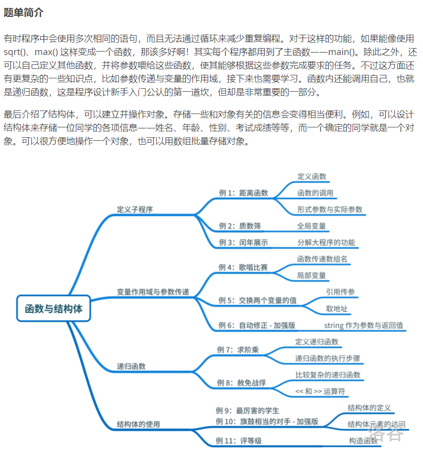

---
title: 函数与结构体题单
date: 2021-04-03 22:50:42
summary: 本文通过洛谷函数与结构体题单，分享函数与结构体相关程序设计的一些技巧和心得。
mathjax: true
tags:
- 程序设计
categories:
- 程序设计
---

# 题单简介



# P5735 距离函数

## 题目描述

给出平面坐标上不在一条直线上三个点坐标 $(x_1,y_1),(x_2,y_2),(x_3,y_3)$，坐标值是实数，且绝对值不超过 100.00，求围成的三角形周长。保留两位小数。

对于平面上的两个点 $(x_1,y_1),(x_2,y_2)$，则这两个点之间的距离 $dis=\sqrt{(x_2-x_1)^2+(y_2-y_1)^2}$

## 输入格式

输入三行，第 $i$ 行表示坐标 $(x_i,y_i)$，以一个空格隔开。

## 输出格式

输出一个两位小数，表示由这三个坐标围成的三角形的周长。

## 样例 #1

### 样例输入 #1

```
0 0
0 3
4 0
```

### 样例输出 #1

```
12.00
```

## 提示

数据保证，坐标均为实数且绝对值不超过 $100$，小数点后最多仅有 $3$ 位。

## 程序设计

略

## 实现代码

```java
import java.util.Scanner;

public class Main {
    public static void main(String[] args) {
        Scanner scanner = new Scanner(System.in);
        double x1 = scanner.nextDouble(), y1 = scanner.nextDouble(), x2 = scanner.nextDouble(),
                y2 = scanner.nextDouble(), x3 = scanner.nextDouble(), y3 = scanner.nextDouble();
        double l1 = Math.sqrt(Math.pow(x2-x1, 2) + Math.pow(y2-y1, 2));
        double l2 = Math.sqrt(Math.pow(x3-x2, 2) + Math.pow(y3-y2, 2));
        double l3 = Math.sqrt(Math.pow(x3-x1, 2) + Math.pow(y3-y1, 2));
        System.out.printf("%.2f", l1+l2+l3);
        scanner.close();
    }
}
```

## 代码提交

[洛谷 P5735 距离函数](https://www.luogu.com.cn/problem/P5733)

# P5736 质数筛

## 题目描述

输入 $n$ 个不大于 $10^5$ 的正整数。要求全部储存在数组中，去除掉不是质数的数字，依次输出剩余的质数。

## 输入格式

第一行输入一个正整数 $n$，表示整数个数。

第二行输入 $n$ 个正整数 $a_i$，以空格隔开。

## 输出格式

输出一行，依次输出 $a_i$ 中剩余的质数，以空格隔开。

## 样例 #1

### 样例输入 #1

```
5
3 4 5 6 7
```

### 样例输出 #1

```
3 5 7
```

## 提示

数据保证，$1\le n\le100$，$1 \leq a_i \leq 10^5$。

## 程序设计

略

## 实现代码

```java
import java.util.Scanner;

public class Main {

    private static boolean[] prime;

    private static void eratosthenes(int num) {
        prime = new boolean[100001];
        for (int i = 2; i <= num; ++i) {
            prime[i] = true;
        }
        for(int i = 2; i <= num; ++i) {
            if (prime[i]) {
                for (int j = i * 2; j <= num; j+=i) {
                    prime[j] = false;
                }
            }
        }
    }

    public static void main(String[] args) {
        eratosthenes(100000);
        StringBuilder result = new StringBuilder();
        Scanner scanner = new Scanner(System.in);
        int num = scanner.nextInt();
        for (int i = 0; i < num; i++) {
            int temp_num = scanner.nextInt();
            if (prime[temp_num]) {
                result.append(temp_num).append(' ');
            }
        }
        scanner.close();
        System.out.println(result.toString().trim());
    }

}
```

## 代码提交

[洛谷 P5736 质数筛](https://www.luogu.com.cn/problem/P5736)

# P5737 闰年展示

## 题目描述

输入 $x,y$，输出 $[x,y]$ 区间中闰年个数，并在下一行输出所有闰年年份数字，使用空格隔开。

## 输入格式

输入两个正整数 $x,y$，以空格隔开。

## 输出格式

第一行输出一个正整数，表示 $[x,y]$ 区间中闰年个数。

第二行输出若干个正整数，按照年份单调递增的顺序输出所有闰年年份数字。

## 样例 #1

### 样例输入 #1

```
1989 2001
```

### 样例输出 #1

```
3
1992 1996 2000
```

## 提示

数据保证，$1582\le x < y \le 3000$。

## 程序设计

略

## 实现代码

```java
import java.util.Scanner;

public class Main {
    public static void main(String[] args) {
        Scanner scanner = new Scanner(System.in);
        int min = scanner.nextInt(), max = scanner.nextInt();
        scanner.close();
        int counter = 0;
        StringBuilder result = new StringBuilder();
        for (int i = min; i <= max; i++) {
            if (i % 400 == 0 || (i % 4 == 0 && i % 100 != 0)) {
                result.append(i).append(" ");
                counter++;
            }
        }
        System.out.println(counter + "\n" + result.toString().trim());
    }
}
```

## 代码提交

[洛谷 P5737 闰年展示](https://www.luogu.com.cn/problem/P5737)

# P5738 歌唱比赛

## 题目描述

$n(n\le 100)$ 名同学参加歌唱比赛，并接受 $m(m\le 20)$ 名评委的评分，评分范围是 $0$ 到 $10$ 分。这名同学的得分就是这些评委给分中去掉一个最高分，去掉一个最低分，剩下 $m-2$ 个评分的平均数。请问得分最高的同学分数是多少？评分保留 $2$ 位小数。

## 输入格式

第一行两个整数 $n,m$。   
接下来 $n$ 行，每行各 $m$ 个整数，表示得分。

## 输出格式

输出分数最高的同学的分数，保留两位小数。

## 样例 #1

### 样例输入 #1

```
7 6
4 7 2 6 10 7
0 5 0 10 3 10
2 6 8 4 3 6
6 3 6 7 5 8
5 9 3 3 8 1
5 9 9 3 2 0
5 8 0 4 1 10
```

### 样例输出 #1

```
6.00
```

## 程序设计

略

## 实现代码

```java
import java.util.Scanner;

public class Main {
    public static void main(String[] args) {
        Scanner scanner = new Scanner(System.in);
        int n = scanner.nextInt(), m = scanner.nextInt();
        double max_sum = 0.0;
        for (int i = 0; i < n; i++) {
            int sum_temp = scanner.nextInt(), max_temp = sum_temp, min_temp = sum_temp;
            for (int j = 1; j < m; j++) {
                int temp = scanner.nextInt();
                if (temp > max_temp) {
                    max_temp = temp;
                } else if (temp < min_temp) {
                    min_temp = temp;
                }
                sum_temp += temp;
            }
            sum_temp -= max_temp;
            sum_temp -= min_temp;
            max_sum = Math.max(max_sum, (double)sum_temp/(m-2));
        }
        scanner.close();
        System.out.printf("%.2f", max_sum);
    }
}
```

## 代码提交

[洛谷 P5738 歌唱比赛](https://www.luogu.com.cn/problem/P5738)

# P5739 计算阶乘

## 题目描述

求 $n!$，也就是 $1\times2\times3\dots\times n$。

挑战：尝试不使用循环语句（for、while）完成这个任务。

## 输入格式

第一行输入一个正整数 $n$。

## 输出格式

输出一个正整数，表示 $n!$。

## 样例 #1

### 样例输入 #1

```
3
```

### 样例输出 #1

```
6
```

## 提示

数据保证，$1 \leq n\le12$。

## 程序设计

略

## 实现代码

```java
import java.math.BigInteger;
import java.util.Scanner;

public class Main {

    private static BigInteger calculate_factorial(BigInteger num, BigInteger result) {
        if (num.equals(new BigInteger("0"))) {
            return new BigInteger("1");
        } else if (num.equals(new BigInteger("1"))) {
            return result;
        } else {
            result = result.multiply(num);
            return calculate_factorial(num.subtract(new BigInteger("1")), result);
        }
    }

    public static void main(String[] args) {
        Scanner scanner = new Scanner(System.in);
        BigInteger limit = new BigInteger(scanner.next());
        scanner.close();
        System.out.println(calculate_factorial(limit, new BigInteger("1")));
    }

}
```

## 代码提交

[洛谷 P5739 计算阶乘](https://www.luogu.com.cn/problem/P5739)

# P5461 赦免战俘

## 题目背景

借助反作弊系统，一些在月赛有抄袭作弊行为的选手被抓出来了！

## 题目描述

现有 $2^n\times 2^n (n\le10)$ 名作弊者站成一个正方形方阵等候 kkksc03 的发落。kkksc03 决定赦免一些作弊者。他将正方形矩阵均分为 4 个更小的正方形矩阵，每个更小的矩阵的边长是原矩阵的一半。其中左上角那一个矩阵的所有作弊者都将得到赦免，剩下 3 个小矩阵中，每一个矩阵继续分为 4 个更小的矩阵，然后通过同样的方式赦免作弊者……直到矩阵无法再分下去为止。所有没有被赦免的作弊者都将被处以棕名处罚。

给出 $n$，请输出每名作弊者的命运，其中 0 代表被赦免，1 代表不被赦免。

## 输入格式

一个整数 $n$。

## 输出格式

$2^n \times 2^n$ 的 01 矩阵，代表每个人是否被赦免。数字之间有一个空格。

## 样例 #1

### 样例输入 #1

```
3
```

### 样例输出 #1

```
0 0 0 0 0 0 0 1
0 0 0 0 0 0 1 1
0 0 0 0 0 1 0 1
0 0 0 0 1 1 1 1
0 0 0 1 0 0 0 1
0 0 1 1 0 0 1 1
0 1 0 1 0 1 0 1
1 1 1 1 1 1 1 1
```

## 程序设计

略

## 实现代码

```java
import java.io.BufferedReader;
import java.io.IOException;
import java.io.InputStreamReader;

public class Main {
    public static void main(String[] args) throws IOException {
        BufferedReader reader = new BufferedReader(new InputStreamReader(System.in));
        int n = Integer.parseInt(reader.readLine());
        reader.close();
        n = (1<<n);
        int[][] arr = new int[n+2][n+2];
        StringBuilder builder;
        arr[0][n+1] = 1;
        for (int i = 1; i <= n; i++) {
            builder = new StringBuilder();
            for (int j = 1; j <= n; j++) {
                arr[i][j] = arr[i-1][j] ^ arr[i-1][j+1];
                builder.append(arr[i][j]).append(' ');
            }
            System.out.println(builder.toString().trim());
        }
    }
}
```

## 代码提交

[洛谷 P5461 赦免战俘](https://www.luogu.com.cn/problem/P5461)

# P5740 最厉害的学生

## 题目描述

现有 $N$ 名同学参加了期末考试，并且获得了每名同学的信息：姓名（不超过 $8$ 个字符的仅有英文小写字母的字符串）、语文、数学、英语成绩（均为不超过 $150$ 的自然数）。总分最高的学生就是最厉害的，请输出最厉害的学生各项信息（姓名、各科成绩）。如果有多个总分相同的学生，输出靠前的那位。

## 输入格式

第一行输入一个正整数 $N$，表示学生个数。

第二行开始，往下 $N$ 行，对于每一行首先先输入一个字符串表示学生姓名，再输入三个自然数表示语文、数学、英语的成绩。均用空格相隔。

## 输出格式

输出最厉害的学生。

## 样例 #1

### 样例输入 #1

```
3
senpai 114 51 4
lxl 114 10 23
fafa 51 42 60
```

### 样例输出 #1

```
senpai 114 51 4
```

## 提示

数据保证，$1 \leq N \leq 1000$，姓名为长度不超过 $8$ 的字符串，语文、数学、英语成绩均为不超过 $150$ 的自然数。

## 程序设计

略

## 实现代码

```java
import java.util.Scanner;

public class Main {
    public static void main(String[] args) {
        Scanner scanner = new Scanner(System.in);
        int num = Integer.parseInt(scanner.nextLine());
        String result = "";
        int max = -1;
        for (int i = 0; i < num; i++) {
            String info = scanner.nextLine();
            String[] arr = info.split(" ");
            int grade = Integer.parseInt(arr[1]) + Integer.parseInt(arr[2]) + Integer.parseInt(arr[3]);
            if (grade > max) {
                max = grade;
                result = info;
            }
        }
        scanner.close();
        System.out.println(result);
    }
}
```

## 代码提交

[洛谷 P5740 最厉害的学生](https://www.luogu.com.cn/problem/P5740)

# P5741 旗鼓相当的对手

## 题目描述

现有 $N(N\le 1000)$ 名同学参加了期末考试，并且获得了每名同学的信息：姓名（不超过 $8$ 个字符的字符串，没有空格）、语文、数学、英语成绩（均为不超过 $150$ 的自然数）。如果某对学生 $\text{<}i,j\text{>}$ 的每一科成绩的分差都不大于 $5$，且总分分差不大于 $10$，那么这对学生就是“旗鼓相当的对手”。现在我们想知道这些同学中，哪些是“旗鼓相当的对手”？请输出他们的姓名。

所有人的姓名是按照字典序给出的，输出时也应该按照字典序输出所有对手组合。也就是说，这对组合的第一个名字的字典序应该小于第二个；如果两个组合中第一个名字不一样，则第一个名字字典序小的先输出；如果两个组合的第一个名字一样但第二个名字不同，则第二个名字字典序小的先输出。

## 输入格式

第一行输入一个正整数 $N$，表示学生个数。

第二行开始，往下 $N$ 行，对于每一行首先先输入一个字符串表示学生姓名，再输入三个自然数表示语文、数学、英语的成绩。均用空格相隔。

## 输出格式

输出若干行，每行两个以空格隔开的字符串，表示一组旗鼓相当的对手。注意题目描述中的输出格式。

## 样例 #1

### 样例输入 #1

```
3
fafa 90 90 90
lxl 95 85 90
senpai 100 80 91
```

### 样例输出 #1

```
fafa lxl
lxl senpai
```

## 提示

数据保证，$1 \leq N \leq 1000$，姓名为长度不超过 $8$ 的字符串，语文、数学、英语成绩均为不超过 $150$ 的自然数。

## 程序设计

略

## 实现代码

```java
import java.util.Scanner;

public class Main {
    public static void main(String[] args) {
        Scanner scanner = new Scanner(System.in);
        int num = Integer.parseInt(scanner.nextLine());
        String[] name_array = new String[num];
        int[] chinese_array = new int[num];
        int[] math_array = new int[num];
        int[] english_array = new int[num];
        int[] grade_array = new int[num];
        for (int i = 0; i < num; i++) {
            String[] info = scanner.nextLine().split(" ");
            name_array[i] = info[0];
            chinese_array[i] = Integer.parseInt(info[1]);
            math_array[i] = Integer.parseInt(info[2]);
            english_array[i] = Integer.parseInt(info[3]);
            grade_array[i] = chinese_array[i] + math_array[i] + english_array[i];
        }
        for (int i = 0; i < num; i++) {
            for (int j = i+1; j < num; j++) {
                if (Math.abs(chinese_array[i]-chinese_array[j]) <= 5 &&
                        Math.abs(math_array[i]-math_array[j]) <= 5 &&
                        Math.abs(english_array[i]-english_array[j]) <= 5 &&
                        Math.abs(grade_array[i]-grade_array[j]) <= 10) {
                    System.out.println(name_array[i] + " " + name_array[j]);
                }
            }
        }
        scanner.close();
    }
}
```

## 代码提交

[洛谷 P5741 旗鼓相当的对手](https://www.luogu.com.cn/problem/P5741)

# P5742 评等级

## 题目描述

现有 $N$ 名同学，每名同学需要设计一个结构体记录以下信息：学号、学业成绩和素质拓展成绩、综合分数（实数）。每行读入同学的姓名、学业成绩和素质拓展成绩，并且计算综合分数（分别按照 $70\%$ 和 $30\%$ 权重累加），存入结构体中。还需要在结构体中定义一个成员函数，返回该结构体对象的学业成绩和素质拓展成绩的总分。

然后需要设计一个函数，其参数是一个学生结构体对象，判断该学生是否“优秀”。优秀的定义是学业和素质拓展成绩总分**大于** $140$ 分，且综合分数**不小于** $80$ 分。

> 当然通过本题很容易啦，本题只是为了帮助你训练结构体的使用方法。

本题存在精度误差问题，请将 `a * 0.3 + b * 0.7` 与 80 比较 转化为 `a * 3 + b * 7` 与 800 比较。

## 输入格式

第一行一个整数 $N$。

接下来 $N$ 行，每行 $3$ 个整数，依次代表学号、学业成绩和素质拓展成绩。

## 输出格式

$N$ 行，如果第 $i$ 名学生是优秀的，输出 `Excellent`，否则输出 `Not excellent`。

## 样例 #1

### 样例输入 #1

```
4
1223 95 59
1224 50 7
1473 32 45
1556 86 99
```

### 样例输出 #1

```
Excellent
Not excellent
Not excellent
Excellent
```

## 提示

数据保证，$1 \le N\le 1000$，学号为不超过 $100000$ 的正整数，学业成绩和素质拓展成绩为 $0 \sim 100$ 之间的正整数。

## 程序设计

略

## 实现代码

```java
import java.util.Scanner;

public class Main {

    private static class Student {
        private int id;
        private int grade1;
        private int grade2;
        private double grade;
        Student(int id, int grade1, int grade2) {
            this.id = id;
            this.grade1 = grade1;
            this.grade2 = grade2;
            this.grade = grade1 * 0.7 + grade2 * 0.3;
        }
        public String isExcellent() {
            return (grade1+grade2>140 && grade>=80) ? "Excellent" : "Not excellent";
        }
    }

    public static void main(String[] args) {
        Scanner scanner = new Scanner(System.in);
        int num = scanner.nextInt();
        for (int i = 0; i < num; i++) {
            System.out.println((new Student(scanner.nextInt(), scanner.nextInt(), scanner.nextInt())).isExcellent());
        }
        scanner.close();
    }
    
}
```

## 代码提交

[洛谷 P5742 评等级](https://www.luogu.com.cn/problem/P5742)

# P1075 质因数分解

## 题目描述

已知正整数 $n$ 是两个不同的质数的乘积，试求出两者中较大的那个质数。

## 输入格式

输入一个正整数 $n$。

## 输出格式

输出一个正整数 $p$，即较大的那个质数。

## 样例 #1

### 样例输入 #1

```
21
```

### 样例输出 #1

```
7
```

## 提示

$1 \le n\le 2\times 10^9$

NOIP 2012 普及组 第一题

## 程序设计

略

## 实现代码

```java
import java.util.Scanner;

public class Main {
    public static void main(String[] args) {
        Scanner scanner = new Scanner(System.in);
        int num = scanner.nextInt();
        for (int i = 2; i <= num; i++) {
            if (num % i == 0) {
                System.out.println(num/i);
                break;
            }
        }
        scanner.close();
    }
}
```

## 代码提交

[洛谷 P1075 质因数分解](https://www.luogu.com.cn/problem/P1075)

# P1304 哥德巴赫猜想

## 题目描述

输入一个偶数 $N$，验证 $4\sim N$ 所有偶数是否符合哥德巴赫猜想：任一大于 $2$ 的偶数都可写成两个质数之和。如果一个数不止一种分法，则输出第一个加数相比其他分法最小的方案。例如 $10$，$10=3+7=5+5$，则 $10=5+5$ 是错误答案。

## 输入格式

第一行输入一个正偶数 $N$

## 输出格式

输出 $\dfrac{N-2}{2}$ 行。对于第 $i$ 行：

首先先输出正偶数 $2i+2$，然后输出等号，再输出加和为 $2i+2$ 且第一个加数最小的两个质数，以加号隔开。

## 样例 #1

### 样例输入 #1

```
10
```

### 样例输出 #1

```
4=2+2
6=3+3
8=3+5
10=3+7
```

## 提示

数据保证，$4 \leq N\leq10000$。

## 程序设计

略

## 实现代码

```java
import java.util.Scanner;

public class Main {

    public static void main(String[] args) {
        Scanner scanner = new Scanner(System.in);
        int num = scanner.nextInt();
        scanner.close();
        for (int i = 4; i <= num; i+=2) {
            for (int j = 2; j < num; j++) {
                if (judgePrime(j) && judgePrime(i-j)) {
                    System.out.println(i + "=" + j + "+" + (i-j));
                    break;
                }
            }
        }
    }

    private static boolean judgePrime(int number) {
        for (int i = 2; i < number; i++) {
            if (number % i == 0) {
                return false;
            }
        }
        return true;
    }

}
```

## 代码提交

[洛谷 P1304 哥德巴赫猜想](https://www.luogu.com.cn/problem/P1304)

# P1217 回文质数

## 题目描述

因为 $151$ 既是一个质数又是一个回文数（从左到右和从右到左是看一样的），所以 $151$ 是回文质数。

写一个程序来找出范围 $[a,b] (5 \le a < b \le 100,000,000)$（一亿）间的所有回文质数。

## 输入格式

第一行输入两个正整数 $a$ 和 $b$。

## 输出格式

输出一个回文质数的列表，一行一个。

## 样例 #1

### 样例输入 #1

```
5 500
```

### 样例输出 #1

```
5
7
11
101
131
151
181
191
313
353
373
383
```

## 提示

Hint 1: Generate the palindromes and see if they are prime.

提示 1: 找出所有的回文数再判断它们是不是质数（素数）.


Hint 2: Generate palindromes by combining digits properly. You might need more than one of the loops like below.

提示 2: 要产生正确的回文数，你可能需要几个像下面这样的循环。


题目翻译来自NOCOW。

USACO Training Section 1.5


产生长度为 $5$ 的回文数：

```cpp
for (d1 = 1; d1 <= 9; d1+=2) {    // 只有奇数才会是素数
     for (d2 = 0; d2 <= 9; d2++) {
         for (d3 = 0; d3 <= 9; d3++) {
           palindrome = 10000*d1 + 1000*d2 +100*d3 + 10*d2 + d1; // (处理回文数...)
         }
     }
 }
```

## 程序设计

略

## 实现代码

```java
import java.util.Scanner;

public class Main {
    public static void main(String[] args) {
        int [] array = new int[] {5,7,11,101,131,151,181,191,313,353,373,383,727,757,787,797,919,929,10301,
                10501,10601,11311,11411,12421,12721,12821,13331,13831,13931,14341,14741,15451,15551,16061,
                16361,16561,16661,17471,17971,18181,18481,19391,19891,19991,30103,30203,30403,30703,30803,
                31013,31513,32323,32423,33533,34543,34843,35053,35153,35353,35753,36263,36563,37273,37573,
                38083,38183,38783,39293,70207,70507,70607,71317,71917,72227,72727,73037,73237,73637,74047,
                74747,75557,76367,76667,77377,77477,77977,78487,78787,78887,79397,79697,79997,90709,91019,
                93139,93239,93739,94049,94349,94649,94849,94949,95959,96269,96469,96769,97379,97579,97879,
                98389,98689,1003001,1008001,1022201,1028201,1035301,1043401,1055501,1062601,1065601,1074701,
                1082801,1085801,1092901,1093901,1114111,1117111,1120211,1123211,1126211,1129211,1134311,
                1145411,1150511,1153511,1160611,1163611,1175711,1177711,1178711,1180811,1183811,1186811,
                1190911,1193911,1196911,1201021,1208021,1212121,1215121,1218121,1221221,1235321,1242421,
                1243421,1245421,1250521,1253521,1257521,1262621,1268621,1273721,1276721,1278721,1280821,
                1281821,1286821,1287821,1300031,1303031,1311131,1317131,1327231,1328231,1333331,1335331,
                1338331,1343431,1360631,1362631,1363631,1371731,1374731,1390931,1407041,1409041,1411141,
                1412141,1422241,1437341,1444441,1447441,1452541,1456541,1461641,1463641,1464641,1469641,
                1486841,1489841,1490941,1496941,1508051,1513151,1520251,1532351,1535351,1542451,1548451,
                1550551,1551551,1556551,1557551,1565651,1572751,1579751,1580851,1583851,1589851,1594951,
                1597951,1598951,1600061,1609061,1611161,1616161,1628261,1630361,1633361,1640461,1643461,
                1646461,1654561,1657561,1658561,1660661,1670761,1684861,1685861,1688861,1695961,1703071,
                1707071,1712171,1714171,1730371,1734371,1737371,1748471,1755571,1761671,1764671,1777771,
                1793971,1802081,1805081,1820281,1823281,1824281,1826281,1829281,1831381,1832381,1842481,
                1851581,1853581,1856581,1865681,1876781,1878781,1879781,1880881,1881881,1883881,1884881,
                1895981,1903091,1908091,1909091,1917191,1924291,1930391,1936391,1941491,1951591,1952591,
                1957591,1958591,1963691,1968691,1969691,1970791,1976791,1981891,1982891,1984891,1987891,
                1988891,1993991,1995991,1998991,3001003,3002003,3007003,3016103,3026203,3064603,3065603,
                3072703,3073703,3075703,3083803,3089803,3091903,3095903,3103013,3106013,3127213,3135313,
                3140413,3155513,3158513,3160613,3166613,3181813,3187813,3193913,3196913,3198913,3211123,
                3212123,3218123,3222223,3223223,3228223,3233323,3236323,3241423,3245423,3252523,3256523,
                3258523,3260623,3267623,3272723,3283823,3285823,3286823,3288823,3291923,3293923,3304033,
                3305033,3307033,3310133,3315133,3319133,3321233,3329233,3331333,3337333,3343433,3353533,
                3362633,3364633,3365633,3368633,3380833,3391933,3392933,3400043,3411143,3417143,3424243,
                3425243,3427243,3439343,3441443,3443443,3444443,3447443,3449443,3452543,3460643,3466643,
                3470743,3479743,3485843,3487843,3503053,3515153,3517153,3528253,3541453,3553553,3558553,
                3563653,3569653,3586853,3589853,3590953,3591953,3594953,3601063,3607063,3618163,3621263,
                3627263,3635363,3643463,3646463,3670763,3673763,3680863,3689863,3698963,3708073,3709073,
                3716173,3717173,3721273,3722273,3728273,3732373,3743473,3746473,3762673,3763673,3765673,
                3768673,3769673,3773773,3774773,3781873,3784873,3792973,3793973,3799973,3804083,3806083,
                3812183,3814183,3826283,3829283,3836383,3842483,3853583,3858583,3863683,3864683,3867683,
                3869683,3871783,3878783,3893983,3899983,3913193,3916193,3918193,3924293,3927293,3931393,
                3938393,3942493,3946493,3948493,3964693,3970793,3983893,3991993,3994993,3997993,3998993,
                7014107,7035307,7036307,7041407,7046407,7057507,7065607,7069607,7073707,7079707,7082807,
                7084807,7087807,7093907,7096907,7100017,7114117,7115117,7118117,7129217,7134317,7136317,
                7141417,7145417,7155517,7156517,7158517,7159517,7177717,7190917,7194917,7215127,7226227,
                7246427,7249427,7250527,7256527,7257527,7261627,7267627,7276727,7278727,7291927,7300037,
                7302037,7310137,7314137,7324237,7327237,7347437,7352537,7354537,7362637,7365637,7381837,
                7388837,7392937,7401047,7403047,7409047,7415147,7434347,7436347,7439347,7452547,7461647,
                7466647,7472747,7475747,7485847,7486847,7489847,7493947,7507057,7508057,7518157,7519157,
                7521257,7527257,7540457,7562657,7564657,7576757,7586857,7592957,7594957,7600067,7611167,
                7619167,7622267,7630367,7632367,7644467,7654567,7662667,7665667,7666667,7668667,7669667,
                7674767,7681867,7690967,7693967,7696967,7715177,7718177,7722277,7729277,7733377,7742477,
                7747477,7750577,7758577,7764677,7772777,7774777,7778777,7782877,7783877,7791977,7794977,
                7807087,7819187,7820287,7821287,7831387,7832387,7838387,7843487,7850587,7856587,7865687,
                7867687,7868687,7873787,7884887,7891987,7897987,7913197,7916197,7930397,7933397,7935397,
                7938397,7941497,7943497,7949497,7957597,7958597,7960697,7977797,7984897,7985897,7987897,
                7996997,9002009,9015109,9024209,9037309,9042409,9043409,9045409,9046409,9049409,9067609,
                9073709,9076709,9078709,9091909,9095909,9103019,9109019,9110119,9127219,9128219,9136319,
                9149419,9169619,9173719,9174719,9179719,9185819,9196919,9199919,9200029,9209029,9212129,
                9217129,9222229,9223229,9230329,9231329,9255529,9269629,9271729,9277729,9280829,9286829,
                9289829,9318139,9320239,9324239,9329239,9332339,9338339,9351539,9357539,9375739,9384839,
                9397939,9400049,9414149,9419149,9433349,9439349,9440449,9446449,9451549,9470749,9477749,
                9492949,9493949,9495949,9504059,9514159,9526259,9529259,9547459,9556559,9558559,9561659,
                9577759,9583859,9585859,9586859,9601069,9602069,9604069,9610169,9620269,9624269,9626269,
                9632369,9634369,9645469,9650569,9657569,9670769,9686869,9700079,9709079,9711179,9714179,
                9724279,9727279,9732379,9733379,9743479,9749479,9752579,9754579,9758579,9762679,9770779,
                9776779,9779779,9781879,9782879,9787879,9788879,9795979,9801089,9807089,9809089,9817189,
                9818189,9820289,9822289,9836389,9837389,9845489,9852589,9871789,9888889,9889889,9896989,
                9902099,9907099,9908099,9916199,9918199,9919199,9921299,9923299,9926299,9927299,9931399,
                9932399,9935399,9938399,9957599,9965699,9978799,9980899,9981899,9989899};
        Scanner scanner = new Scanner(System.in);
        int from = scanner.nextInt(), to = scanner.nextInt();
        scanner.close();
        for (int i : array) {
            if (i >= from) {
                if (i > to) {
                    break;
                } else {
                    System.out.println(i);
                }
            }
        }
    }
}
```

## 代码提交

[洛谷 P1217 回文质数](https://www.luogu.com.cn/problem/P1217)

# P2415 集合求和

## 题目描述

给定一个集合 $s$（集合元素数量 $\le 30$），求出此集合所有子集元素之和。

## 输入格式

集合中的元素（元素 $\le 1000$）

## 输出格式

$s$ 所有子集元素之和。

## 样例 #1

### 样例输入 #1

```
2 3
```

### 样例输出 #1

```
10
```

## 提示

**【样例解释】**

子集为：$\varnothing, \{ 2 \}, \{ 3 \}, \{ 2, 3 \}$，和为 $2 + 3 + 2 + 3 = 10$。

----

**【数据范围】**

对于 $100 \%$ 的数据，$1 \le \lvert s \rvert \le 30$，$1 \le s_i \le 1000$，$s$ 所有子集元素之和 $\le {10}^{18}$。

## 程序设计

简单分析一下：
- 有一个数N的情况：result = 1 * N
- 有两个数N~1~、N~2~的情况：result = 2 * (N~1~+N~2~)
- 有三个数N~1~、N~2~、N~3~的情况：result = 4 * (N~1~+N~2~+N~3~)
- ……


其实不难推的，比如说三个数的情况：
N1, N2, N3, N1N2, N1N3, N2N3, N1N2N3

……

找规律嘛……

定义一下sum = sum(N~1~, N~2~, ..., N~n~)
其实结果就是<code>result = sum * 2^n-1^</code>

## 实现代码

```java
import java.math.BigInteger;
import java.util.Scanner;

public class Main {
    public static void main(String[] args) {
        Scanner scanner = new Scanner(System.in);
        String[] array = scanner.nextLine().trim().split("\\s+");
        long sum = 0;
        for (String s : array) {
            sum += Long.parseLong(s);
        }
        System.out.println(new BigInteger("2").pow(array.length-1).multiply(new BigInteger(Long.toString(sum))));
        scanner.close();
    }
}
```

## 代码提交

[洛谷 P2415 集合求和](https://www.luogu.com.cn/problem/P2415)

# P5743 猴子吃桃

## 题目描述

一只小猴买了若干个桃子。第一天他刚好吃了这些桃子的一半，又贪嘴多吃了一个；接下来的每一天它都会吃剩余的桃子的一半外加一个。第 $n$ 天早上起来一看，只剩下 $1$ 个桃子了。请问小猴买了几个桃子？

## 输入格式

输入一个正整数 $n$，表示天数。

## 输出格式

输出小猴买了多少个桃子。

## 样例 #1

### 样例输入 #1

```
4
```

### 样例输出 #1

```
22
```

## 提示

数据保证，$1\le n\le20$。

## 程序设计

略

## 实现代码

```java
import java.util.Scanner;

public class Main {
    public static void main(String[] args) {
        Scanner scanner = new Scanner(System.in);
        int num = scanner.nextInt();
        int j = 1;
        for (int i = 1; i < num; i++) {
            j++;
            j*=2;
        }
        System.out.println(j);
        scanner.close();
    }
}
```

## 代码提交

[洛谷 P5743 猴子吃桃](https://www.luogu.com.cn/problem/P5743)

# P5744 培训

## 题目描述

某培训机构的学员有如下信息：

- 姓名（字符串）
- 年龄（周岁，整数）
- 去年 NOIP 成绩（整数，且保证是 $5$ 的倍数）

经过为期一年的培训，所有同学的成绩都有所提高，提升了 $20\%$（当然 NOIP 满分是 $600$ 分，不能超过这个得分）。

输入学员信息，请设计一个结构体储存这些学生信息，并设计一个函数模拟培训过程，其参数是这样的结构体类型，返回同样的结构体类型，并输出学员信息。

## 输入格式

第一行输入一个正整数 $n$，表示学员个数。

第二行开始往下 $n$ 行。每行首先是一个字符串表示学员姓名，再是一个整数表示学员年龄，再是一个整数为去年 NOIP 成绩。

## 输出格式

输出 $n$ 行，每行首先输出一个字符串表示学生姓名，再往后两个整数，表示经过一年的培训后学员的年龄和他们今年的 NOIP 成绩。以空格隔开。

## 样例 #1

### 样例输入 #1

```
3
kkksc03 24 0
chen_zhe 14 400
nzhtl1477 18 590
```

### 样例输出 #1

```
kkksc03 25 0
chen_zhe 15 480
nzhtl1477 19 600
```

## 提示

数据保证，$1 \leq n \leq 5$。年龄为 $0 \sim 100$（含 $0$ 与 $100$）的整数。成绩为 $0 \sim 600$（含 $0$ 与 $600$）的 $5$ 的整倍数。

## 程序设计

略

## 实现代码

```java
import java.util.Scanner;

public class Main {

    private static class Student {
        private String name;
        private int age;
        private int grade;
        Student(String name, int age, int grade) {
            this.name = name;
            this.age = age;
            this.grade = grade;
        }
        @Override
        public String toString() {
            return name + ' ' + (age+1) + ' ' + ((grade>=500)?600:(int)(grade*1.2));
        }
    }

    public static void main(String[] args) {
        Scanner scanner = new Scanner(System.in);
        int num = scanner.nextInt();
        for (int i = 0; i < num; i++) {
            System.out.println(new Student(scanner.next(), scanner.nextInt(), scanner.nextInt()).toString());
        }
        scanner.close();
    }

}
```

## 代码提交

[洛谷 P5744 培训](https://www.luogu.com.cn/problem/P5744)
