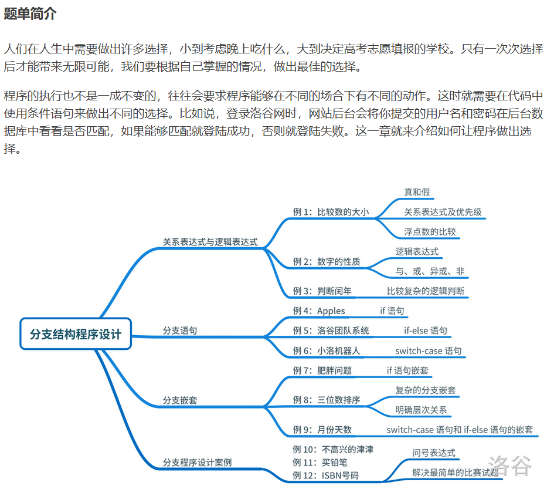

---
title: 分支结构
date: 2020-05-01 23:39:32
summary: 本文通过洛谷分支结构题单，分享分支结构程序设计的一些技巧和心得。
mathjax: true
tags:
- 程序设计
categories:
- 程序设计
---

# 题单简介



# P5710 数的性质

## 题目描述

一些整数可能拥有以下的性质：

- 性质 1：是偶数；
- 性质 2：大于 $4$ 且不大于 $12$。

小 A 喜欢这两个性质同时成立的整数；Uim 喜欢这至少符合其中一种性质的整数；八尾勇喜欢刚好有符合其中一个性质的整数；正妹喜欢不符合这两个性质的整数。现在给出一个整数 $x$，请问他们是否喜欢这个整数？

## 输入格式

输入一个整数 $x(0\le x \le 1000)$

## 输出格式

输出这 $4$ 个人是否喜欢这个数字，如果喜欢则输出 `1`，否则输出 `0`，用空格分隔。输出顺序为：小 A、Uim、八尾勇、正妹。

## 样例 #1

### 样例输入 #1

```
12
```

### 样例输出 #1

```
1 1 0 0
```

## 程序设计

略

## 实现代码

```java
import java.util.Scanner;

public class Main {
    public static void main(String[] args) {
        Scanner scanner = new Scanner(System.in);
        int num = scanner.nextInt();
        scanner.close();
        boolean flag1 = num % 2 == 0, flag2 = num > 4 && num <= 12;
        // 小A
        if (flag1 && flag2) {
            System.out.print("1 ");
        } else {
            System.out.print("0 ");
        }
        // Uim
        if (flag1 || flag2) {
            System.out.print("1 ");
        } else {
            System.out.print("0 ");
        }
        // 八尾勇 (flag1 && !flag2) || (!flag1 && flag2)
        if (flag1^flag2) {
            System.out.print("1 ");
        } else {
            System.out.print("0 ");
        }
        // 正妹
        if (!flag1 && !flag2) {
            System.out.print(1);
        } else {
            System.out.print(0);
        }
    }
}
```

## 代码提交

[洛谷 P5710 数的性质](https://www.luogu.com.cn/problem/P5710)

# P5711 闰年判断

## 题目描述

输入一个年份，判断这一年是否是闰年，如果是输出 $1$，否则输出 $0$。

## 输入格式

输入一个正整数 $n$，表示年份。

## 输出格式

输出一行。如果输入的年份是闰年则输出 $1$，否则输出 $0$。

## 样例 #1

### 样例输入 #1

```
1926
```

### 样例输出 #1

```
0
```

## 样例 #2

### 样例输入 #2

```
1900
```

### 样例输出 #2

```
0
```

## 样例 #3

### 样例输入 #3

```
2000
```

### 样例输出 #3

```
1
```

## 样例 #4

### 样例输入 #4

```
1996
```

### 样例输出 #4

```
1
```

## 提示

数据保证，$1582 \leq n \leq 2020$ 且年份为自然数。

## 程序设计

略

## 实现代码

```java
import java.util.Scanner;

public class Main {
    public static void main(String[] args) {
        Scanner scanner = new Scanner(System.in);
        int year = scanner.nextInt();
        scanner.close();
        if (year % 400 == 0) {
            System.out.println(1);
        } else if (year % 100 == 0) {
            System.out.println(0);
        } else if (year % 4 == 0) {
            System.out.println(1);
        } else {
            System.out.println(0);
        }
    }
}
```

## 代码提交

[洛谷 P5711 闰年判断](https://www.luogu.com.cn/problem/P5711)

# P5712 Apples

## 题目描述

八尾勇喜欢吃苹果。她今天吃掉了 $x$ 个苹果。英语课上学到了 apple 这个词语，想用它来造句。如果她吃了 1 个苹果，就输出 `Today, I ate 1 apple.`；如果她没有吃，那么就把 1 换成 0；如果她吃了不止一个苹果，别忘了 `apple` 这个单词后面要加上代表复数的 `s`。你能帮她完成这个句子吗？

## 输入格式

输入一行一个自然数 $x$，表示吃掉的苹果数。

## 输出格式

根据题目要求输出。

## 样例 #1

### 样例输入 #1

```
1
```

### 样例输出 #1

```
Today, I ate 1 apple.
```

## 样例 #2

### 样例输入 #2

```
3
```

### 样例输出 #2

```
Today, I ate 3 apples.
```

## 提示

对于所有数据，$0\le x \le 100$。

## 程序设计

略

## 实现代码

```java
import java.util.Scanner;

public class Main {
    public static void main(String[] args) {
        String prev = "Today, I ate ";
        String rear = " apple";
        Scanner scanner = new Scanner(System.in);
        int num = scanner.nextInt();
        scanner.close();
        if (num < 2) {
            prev = prev + num + rear;
        } else {
            prev = prev + num + rear + "s";
        }
        System.out.println(prev + ".");
    }
}
```

## 代码提交

[洛谷 P5712 Apples](https://www.luogu.com.cn/problem/P5712)

# P5713 洛谷团队系统

## 题目描述

在洛谷上使用团队系统非常方便的添加自己的题目。如果在自己的电脑上配置题目和测试数据，每题需要花费时间 $5$ 分钟；而在洛谷团队中上传私有题目，每题只需要花费 $3$ 分钟，但是上传题目之前还需要一次性花费 11 分钟创建与配置团队。现在要配置 $n$ 道题目，如果本地配置花费的总时间短，请输出 `Local`，否则输出 `Luogu`。

## 输入格式

输入一个正整数 $n$，表示需要配置的题目量。

## 输出格式

输出一行，一个字符串。如果本地配置花费的总时间短，请输出 `Local`，否则输出 `Luogu`。

## 样例 #1

### 样例输入 #1

```
2
```

### 样例输出 #1

```
Local
```

## 样例 #2

### 样例输入 #2

```
50
```

### 样例输出 #2

```
Luogu
```

## 提示

数据保证 $1 \leq n\leq 100$。

## 程序设计

略

## 实现代码

```java
import java.util.Scanner;

public class Main {
    public static void main(String[] args) {
        Scanner scanner = new Scanner(System.in);
        int num  =scanner.nextInt();
        System.out.println((5*num < 3*num+11) ? "Local" : "Luogu");
        scanner.close();
    }
}
```

## 代码提交

[洛谷 P5713 洛谷团队系统](https://www.luogu.com.cn/problem/P5713)

# P5714 肥胖问题

## 题目描述

BMI 指数是国际上常用的衡量人体胖瘦程度的一个标准，其算法是 $\dfrac{m}{h^2}$，其中 $m$ 是指体重（千克），$h$ 是指身高（米）。不同体型范围与判定结果如下：

- 小于 $18.5$：体重过轻，输出 `Underweight`；
- 大于等于 $18.5$ 且小于 $24$：正常体重，输出 `Normal`；
- 大于等于 $24$：肥胖，不仅要输出 BMI 值（使用 `cout` 的默认精度），然后换行，还要输出 `Overweight`；

现在给出体重和身高数据，需要根据 BMI 指数判断体型状态并输出对应的判断。

对于非 C++ 语言，在输出时，请四舍五入保留六位**有效数字**输出，如果小数部分存在后缀 $0$，不要输出后缀 $0$。

请注意，保留六位**有效数字**不是保留六位小数。例如 $123.4567$ 应该输出为 $123.457$，$5432.10$ 应该输出为 $5432.1$。

## 输入格式

共一行。

第一行，共 $2$ 个浮点数，$m, h$，分别表示体重（单位为 kg），身高（单位为 m）。

## 输出格式

输出一行一个字符串，表示根据 BMI 的对应判断。特别地，对于 `Overweight` 情况的特别处理请参照题目所述。

## 样例 #1

### 样例输入 #1

```
70 1.72
```

### 样例输出 #1

```
Normal
```

## 提示

对于所有数据，$40\le m \le 120$，$1.4 \le h \le 2.0$。$m$ 和 $h$ 的小数点后不超过三位。

## 程序设计

略

## 实现代码

```java
import java.util.Scanner;

public class Main {

    /**
     * 有效数字
     */
    private static double roundToSignificantFigures(double num, int n) {
        if(num == 0) {
            return 0;
        }
        double d = Math.ceil(Math.log10(Math.abs(num)));
        int power = n - (int) d;
        double magnitude = Math.pow(10, power);
        long shifted = Math.round(num*magnitude);
        return shifted/magnitude;
    }

    public static void main(String[] args) {
        Scanner scanner = new Scanner(System.in);
        double result = roundToSignificantFigures(scanner.nextDouble()/Math.pow(scanner.nextDouble(), 2), 6);
        scanner.close();
        if (result < 18.5) {
            System.out.println("Underweight");
        } else if (result < 24) {
            System.out.println("Normal");
        } else {
            System.out.println(result + "\nOverweight");
        }
    }

}
```

## 代码提交

[洛谷 P5714 肥胖问题](https://www.luogu.com.cn/problem/P5714)

# P5715 三位数排序

## 题目描述

给出三个整数 $a,b,c(0\le a,b,c \le 100)$，要求把这三位整数从小到大排序。

## 输入格式

输入三个整数 $a,b,c$，以空格隔开。

## 输出格式

输出一行，三个整数，表示从小到大排序后的结果。

## 样例 #1

### 样例输入 #1

```
1 14 5
```

### 样例输出 #1

```
1 5 14
```

## 样例 #2

### 样例输入 #2

```
2 2 2
```

### 样例输出 #2

```
2 2 2
```

## 程序设计

略

## 实现代码

```java
import java.util.Arrays;
import java.util.Scanner;

public class Main {
    public static void main(String[] args) {
        Scanner scanner = new Scanner(System.in);
        int[] array = new int[] {scanner.nextInt(), scanner.nextInt(), scanner.nextInt()};
        scanner.close();
        Arrays.sort(array);
        System.out.println(array[0] + " " + array[1] + " " + array[2]);
    }
}
```

## 代码提交

[洛谷 P5715 三位数排序](https://www.luogu.com.cn/problem/P5715)

# P5716 月份天数

## 题目描述

输入年份和月份，输出这一年的这一月有多少天。需要考虑闰年。

## 输入格式

输入两个正整数，分别表示年份 $y$ 和月数 $m$，以空格隔开。

## 输出格式

输出一行一个正整数，表示这个月有多少天。

## 样例 #1

### 样例输入 #1

```
1926 8
```

### 样例输出 #1

```
31
```

## 样例 #2

### 样例输入 #2

```
2000 2
```

### 样例输出 #2

```
29
```

## 提示

数据保证 $1583 \leq y \leq 2020$，$1 \leq m \leq 12$。

## 程序设计

略

## 实现代码

```java
import java.util.Scanner;

public class Main {

    private static int getDayNumber(boolean isLeapYear, int month) {
        switch (month) {
            case 1:
            case 3:
            case 5:
            case 7:
            case 8:
            case 10:
            case 12:
                return 31;
            case 4:
            case 6:
            case 9:
            case 11:
                return 30;
            case 2:
                if (isLeapYear) {
                    return 29;
                } else {
                    return 28;
                }
            default:
                return -1;
        }
    }

    private static boolean judgeLeapYear(int year) {
        if (year % 400 == 0) {
            return true;
        } else if (year % 100 == 0) {
            return false;
        } else if (year % 4 == 0) {
            return true;
        } else {
            return false;
        }
    }

    public static void main(String[] args) {
        Scanner scanner = new Scanner(System.in);
        int year = scanner.nextInt(), month = scanner.nextInt();
        scanner.close();
        System.out.println(getDayNumber(judgeLeapYear(year), month));
    }

}
```

## 代码提交

[洛谷 P5716 月份天数](https://www.luogu.com.cn/problem/P5716)

# P1085 不高兴的津津

## 题目描述

津津上初中了。妈妈认为津津应该更加用功学习，所以津津除了上学之外，还要参加妈妈为她报名的各科复习班。另外每周妈妈还会送她去学习朗诵、舞蹈和钢琴。但是津津如果一天上课超过八个小时就会不高兴，而且上得越久就会越不高兴。假设津津不会因为其它事不高兴，并且她的不高兴不会持续到第二天。请你帮忙检查一下津津下周的日程安排，看看下周她会不会不高兴；如果会的话，哪天最不高兴。

## 输入格式

输入包括 $7$ 行数据，分别表示周一到周日的日程安排。每行包括两个小于 $10$ 的非负整数，用空格隔开，分别表示津津在学校上课的时间和妈妈安排她上课的时间。

## 输出格式

一个数字。如果不会不高兴则输出 $0$，如果会则输出最不高兴的是周几（用 $1, 2, 3, 4, 5, 6, 7$ 分别表示周一，周二，周三，周四，周五，周六，周日）。如果有两天或两天以上不高兴的程度相当，则输出时间最靠前的一天。

## 样例 #1

### 样例输入 #1

```
5 3
6 2
7 2
5 3
5 4
0 4
0 6
```

### 样例输出 #1

```
3
```

## 程序设计

略

## 实现代码

```java
import java.util.Scanner;

public class Main {
    public static void main(String[] args) {
        Scanner scanner = new Scanner(System.in);
        int max = 0;
        int result = 0;
        for (int i = 1; i <= 7; i++) {
            int x = scanner.nextInt(), y = scanner.nextInt();
            int temp = x + y;
            if (temp > 8 && temp > max) {
                max = temp;
                result = i;
            }
        }
        System.out.println(result);
        scanner.close();
    }
}
```

## 代码提交

[洛谷 P1085 不高兴的津津](https://www.luogu.com.cn/problem/P1085)

# P1909 买铅笔

## 题目描述

P 老师需要去商店买 $n$ 支铅笔作为小朋友们参加 NOIP 的礼物。她发现商店一共有 $3$ 种包装的铅笔，不同包装内的铅笔数量有可能不同，价格也有可能不同。为了公平起 见，P 老师决定只买同一种包装的铅笔。

商店不允许将铅笔的包装拆开，因此 P 老师可能需要购买超过 $n$ 支铅笔才够给小朋友们发礼物。

现在 P 老师想知道，在商店每种包装的数量都足够的情况下，要买够至少 $n$ 支铅笔最少需要花费多少钱。

## 输入格式

第一行包含一个正整数 $n$，表示需要的铅笔数量。

接下来三行，每行用 $2$ 个正整数描述一种包装的铅笔：其中第 $1$ 个整数表示这种包装内铅笔的数量，第 $2$ 个整数表示这种包装的价格。

保证所有的 $7$ 个数都是不超过 $10000$ 的正整数。

## 输出格式

$1$ 个整数，表示 P 老师最少需要花费的钱。

## 样例 #1

### 样例输入 #1

```
57
2 2
50 30
30 27
```

### 样例输出 #1

```
54
```

## 样例 #2

### 样例输入 #2

```
9998
128 233
128 2333
128 666
```

### 样例输出 #2

```
18407
```

## 样例 #3

### 样例输入 #3

```
9999
101 1111
1 9999
1111 9999
```

### 样例输出 #3

```
89991
```

## 提示

铅笔的三种包装分别是：

- $2$ 支装，价格为 $2$;
- $50$ 支装，价格为 $30$;
- $30$ 支装，价格为 $27$。

P老师需要购买至少 $57$ 支铅笔。

如果她选择购买第一种包装，那么她需要购买 $29$ 份，共计 $2 \times 29 = 58$ 支，需要花费的钱为 $2 \times 29 = 58$。

实际上，P 老师会选择购买第三种包装，这样需要买 $2$ 份。虽然最后买到的铅笔数量更多了，为 $30 \times 2 = 60$ 支，但花费却减少为 $27 \times 2 = 54$，比第一种少。

对于第二种包装，虽然每支铅笔的价格是最低的，但要够发必须买 $2$ 份，实际的花费达到了 $30  \times 2 = 60$，因此 P 老师也不会选择。

所以最后输出的答案是 $54$。

【数据范围】

保证所有的 $7$ 个数都是不超过 $10000$ 的正整数。

【子任务】

子任务会给出部分测试数据的特点。如果你在解决题目中遇到了困难，可以尝试只解决一部分测试数据。

每个测试点的数据规模及特点如下表：


  

上表中“整倍数”的意义为：若为 $K$，表示对应数据所需要的铅笔数量 $n$ —定是每种包装铅笔数量的整倍数（这意味着一定可以不用多买铅笔）。

于 2022 年 12 月 23 日新加 Hack 数据三组。

## 程序设计

略

## 实现代码

```java
import java.util.Scanner;

public class Main {
    public static void main(String[] args) {
        Scanner scanner = new Scanner(System.in);
        int studentNum = scanner.nextInt();
        int result = 0;
        for (int i = 0; i < 3; i++) {
            int unitNum = scanner.nextInt(), unitPrice = scanner.nextInt();
            int num;
            if (studentNum % unitNum == 0) {
                num = studentNum / unitNum;
            } else {
                num = studentNum / unitNum + 1;
            }
            int temp = num * unitPrice;
            if (i == 0) {
                result = temp;
            } else if (temp < result) {
                result = temp;
            }
        }
        System.out.println(result);
        scanner.close();
    }
}
```

## 代码提交

[洛谷 P1909 买铅笔](https://www.luogu.com.cn/problem/P1909)

# P1055 ISBN号码

## 题目描述

每一本正式出版的图书都有一个 ISBN 号码与之对应，ISBN 码包括 $9$ 位数字、$1$ 位识别码和 $3$ 位分隔符，其规定格式如 `x-xxx-xxxxx-x`，其中符号 `-` 就是分隔符（键盘上的减号），最后一位是识别码，例如 `0-670-82162-4`就是一个标准的 ISBN 码。ISBN 码的首位数字表示书籍的出版语言，例如 $0$ 代表英语；第一个分隔符 `-` 之后的三位数字代表出版社，例如 $670$ 代表维京出版社；第二个分隔符后的五位数字代表该书在该出版社的编号；最后一位为识别码。

识别码的计算方法如下：

首位数字乘以 $1$ 加上次位数字乘以 $2$ ……以此类推，用所得的结果 $ \bmod 11$，所得的余数即为识别码，如果余数为 $10$，则识别码为大写字母 $X$。例如 ISBN 号码 `0-670-82162-4` 中的识别码 $4$ 是这样得到的：对 `067082162` 这 $9$ 个数字，从左至右，分别乘以 $1,2,\dots,9$ 再求和，即 $0\times 1+6\times 2+……+2\times 9=158$，然后取 $158 \bmod 11$ 的结果 $4$ 作为识别码。

你的任务是编写程序判断输入的 ISBN 号码中识别码是否正确，如果正确，则仅输出 `Right`；如果错误，则输出你认为是正确的 ISBN 号码。

## 输入格式

一个字符序列，表示一本书的 ISBN 号码（保证输入符合 ISBN 号码的格式要求）。

## 输出格式

一行，假如输入的 ISBN 号码的识别码正确，那么输出 `Right`，否则，按照规定的格式，输出正确的 ISBN 号码（包括分隔符 `-`）。

## 样例 #1

### 样例输入 #1

```
0-670-82162-4
```

### 样例输出 #1

```
Right
```

## 样例 #2

### 样例输入 #2

```
0-670-82162-0
```

### 样例输出 #2

```
0-670-82162-4
```

## 提示

2008 普及组第一题

## 程序设计

略

## 实现代码

```java
import java.util.Scanner;

public class Main {
    public static void main(String[] args) {
        Scanner scanner = new Scanner(System.in);
        String code = scanner.nextLine();
        String[] code_array = code.split("-");
        int count = 1, sum = 0;
        for (int i = 0; i < 3; i++) {
            for (char c : code_array[i].toCharArray()) {
                sum += (count * (c - '0'));
                count++;
            }
        }
        int mod = sum % 11;
        if (Integer.toString(mod).equals(code_array[3])) {
            System.out.println("Right");
        } else if (mod == 10) {
            if (code_array[3].equals("X")) {
                System.out.println("Right");
            } else {
                System.out.println(code.substring(0, 12) + "X");
            }
        } else {
            System.out.println(code.substring(0, 12) + mod);
        }
        scanner.close();
    }
}
```

## 代码提交

[洛谷 P1055 ISBN号码](https://www.luogu.com.cn/problem/P1055)

# P1422 小玉家的电费

## 题目描述

夏天到了，各家各户的用电量都增加了许多，相应的电费也交的更多了。小玉家今天收到了一份电费通知单。小玉看到上面写：据闽价电 [2006]27 号规定，月用电量在 $150$ 千瓦时及以下部分按每千瓦时 $0.4463$ 元执行，月用电量在 $151\sim 400$ 千瓦时的部分按每千瓦时 $0.4663$ 元执行，月用电量在 $401$ 千瓦时及以上部分按每千瓦时 $0.5663$ 元执行;小玉想自己验证一下，电费通知单上应交电费的数目到底是否正确呢。请编写一个程序，已知用电总计，根据电价规定，计算出应交的电费应该是多少。

## 输入格式

输入一个正整数，表示用电总计（单位以千瓦时计），不超过 $10000$。

## 输出格式

输出一个数，保留到小数点后 $1$ 位（单位以元计，保留到小数点后 $1$ 位）。

## 样例 #1

### 样例输入 #1

```
267
```

### 样例输出 #1

```
121.5
```

## 程序设计

略

## 实现代码

```java
import java.util.Scanner;

public class Main {
    public static void main(String[] args) {
        Scanner scanner = new Scanner(System.in);
        int num = scanner.nextInt();
        final int LOW_NUM = 150;
        final int HIGH_NUM = 400;
        final double LOW_RATE = 0.4463;
        final double MIDDLE_RATE = 0.4663;
        final double HIGH_RATE = 0.5663;
        double result;
        if (num <= LOW_NUM) {
            result = LOW_RATE * num;
        } else if (num <= HIGH_NUM) {
            result = MIDDLE_RATE * (num-LOW_NUM) + LOW_RATE * LOW_NUM;
        } else {
            result = HIGH_RATE * (num-HIGH_NUM) + MIDDLE_RATE * (HIGH_NUM-LOW_NUM) + LOW_RATE * LOW_NUM;
        }
        System.out.printf("%.1f", result);
        scanner.close();
    }
}
```

## 代码提交

[洛谷 P1422 小玉家的电费](https://www.luogu.com.cn/problem/P1422)

# P1424 小鱼的航程

## 题目背景

## 题目描述

有一只小鱼，它平日每天游泳 $250$ 公里，周末休息（实行双休日)，假设从周 $x$ 开始算起，过了 $n$ 天以后，小鱼一共累计游泳了多少公里呢？

## 输入格式

输入两个正整数 $x,n$，表示从周 $x$ 算起，经过 $n$ 天。

## 输出格式

输出一个整数，表示小鱼累计游泳了多少公里。

## 样例 #1

### 样例输入 #1

```
3 10
```

### 样例输出 #1

```
2000
```

## 提示

数据保证，$1\le x \le 7$，$1 \le n\le 10^6$。

## 程序设计

略

## 实现代码

```java
import java.util.Scanner;

public class Main {
    public static void main(String[] args) {
        Scanner scanner = new Scanner(System.in);
        int fromDay = scanner.nextInt(), dayNum = scanner.nextInt();
        int weekdayNum = dayNum / 7 * 5;
        int leftNum = dayNum % 7;
        if (leftNum > 0) {
            if (leftNum + fromDay == 7 || fromDay == 7) {
                leftNum -= 1;
            } else if (leftNum + fromDay >= 8) {
                leftNum -= 2;
            }
        }
        System.out.println((weekdayNum + leftNum) * 250);
        scanner.close();
    }
}
```

## 代码提交

[洛谷 P1424 小鱼的航程](https://www.luogu.com.cn/problem/P1424)

# P1888 三角函数

## 题目描述

输入一组勾股数 $a,b,c（a\neq b\neq c）$，用分数格式输出其较小锐角的正弦值。（要求约分。）

## 输入格式

一行，包含三个正整数，即勾股数 $a,b,c$（无大小顺序）。

## 输出格式

一行，包含一个分数，即较小锐角的正弦值

## 样例 #1

### 样例输入 #1

```
3 5 4
```

### 样例输出 #1

```
3/5
```

## 提示

数据保证：$a,b,c$ 为正整数且 $\in [1,10^9]$。

## 程序设计

略

## 实现代码

```java
import java.util.Scanner;

public class Main {
    public static void main(String[] args) {
        int maxNumber, minNumber, a;
        Scanner scan = new Scanner(System.in);
        int x = scan.nextInt(), y = scan.nextInt(), z = scan.nextInt();
        if(x >= y && x >= z) {
            maxNumber = x;
            if (y >= z)
                minNumber = z;
            else
                minNumber = y;
        } else if(y >= x && y >= z) {
            maxNumber = y;
            if (x >= z)
                minNumber = z;
            else
                minNumber = x;
        } else {
            maxNumber = z;
            if (x >= y)
                minNumber = y;
            else
                minNumber = x;
        }
        int number1 = maxNumber;
        int number2 = minNumber;
        while(number2!=0) {
            int r = number1 % number2;
            number1 = number2;
            number2 = r;
        }
        // 在while过程中，a与b的值会发生改变，所以需要将a，b的值赋给oa,ob
        // oa与ob的最大公约数是a
        a = number1;
        minNumber /= a;
        maxNumber /= a;
        System.out.println(minNumber + "/" + maxNumber);
        scan.close();
    }
}
```

## 代码提交

[洛谷 P1888 三角函数](https://www.luogu.com.cn/problem/P1888)

# P1046 陶陶摘苹果

## 题目描述

陶陶家的院子里有一棵苹果树，每到秋天树上就会结出 $10$ 个苹果。苹果成熟的时候，陶陶就会跑去摘苹果。陶陶有个 $30$ 厘米高的板凳，当她不能直接用手摘到苹果的时候，就会踩到板凳上再试试。


现在已知 $10$ 个苹果到地面的高度，以及陶陶把手伸直的时候能够达到的最大高度，请帮陶陶算一下她能够摘到的苹果的数目。假设她碰到苹果，苹果就会掉下来。

## 输入格式

输入包括两行数据。第一行包含 $10$ 个 $100$ 到 $200$ 之间（包括 $100$ 和 $200$ ）的整数（以厘米为单位）分别表示 $10$ 个苹果到地面的高度，两个相邻的整数之间用一个空格隔开。第二行只包括一个 $100$ 到 $120$ 之间（包含 $100$ 和 $120$ ）的整数（以厘米为单位），表示陶陶把手伸直的时候能够达到的最大高度。

## 输出格式

输出包括一行，这一行只包含一个整数，表示陶陶能够摘到的苹果的数目。

## 样例 #1

### 样例输入 #1

```
100 200 150 140 129 134 167 198 200 111
110
```

### 样例输出 #1

```
5
```

## 提示

**【题目来源】**

NOIP 2005 普及组第一题

## 程序设计

略

## 实现代码

```java
import java.util.Scanner;

public class Main {
    public static void main(String[] args) {
        Scanner scanner = new Scanner(System.in);
        int counter = 0;
        int[] array = new int[10];
        for (int i = 0; i < 10; i++) {
            array[i] = scanner.nextInt();
        }
        int height = scanner.nextInt() + 30;
        for (int i = 0; i < 10; i++) {
            if (array[i] <= height) {
                counter++;
            }
        }
        System.out.println(counter);
        scanner.close();
    }
}
```

## 代码提交

[洛谷 P1046 陶陶摘苹果](https://www.luogu.com.cn/problem/P1046)

# P5717 三角形分类

## 题目描述

给出三条线段 $a,b,c$ 的长度，均是不大于 $10000$ 的正整数。打算把这三条线段拼成一个三角形，它可以是什么三角形呢？

- 如果三条线段不能组成一个三角形，输出`Not triangle`；
- 如果是直角三角形，输出`Right triangle`；
- 如果是锐角三角形，输出`Acute triangle`；
- 如果是钝角三角形，输出`Obtuse triangle`；
- 如果是等腰三角形，输出`Isosceles triangle`；
- 如果是等边三角形，输出`Equilateral triangle`。

如果这个三角形符合以上多个条件，请按以上顺序分别输出，并用换行符隔开。

## 输入格式

输入 3 个整数 $a$、$b$ 和 $c$。

## 输出格式

输出若干行判定字符串。

## 样例 #1

### 样例输入 #1

```
3 3 3
```

### 样例输出 #1

```
Acute triangle
Isosceles triangle
Equilateral triangle
```

## 样例 #2

### 样例输入 #2

```
3 4 5
```

### 样例输出 #2

```
Right triangle
```

## 样例 #3

### 样例输入 #3

```
6 10 6
```

### 样例输出 #3

```
Obtuse triangle
Isosceles triangle
```

## 样例 #4

### 样例输入 #4

```
1 14 5
```

### 样例输出 #4

```
Not triangle
```

## 提示

当两短边的平方和大于一长边的平方，说明是锐角三角形。

当两短边的平方和等于一长边的平方，说明是直角三角形。

当两短边的平方和小于一长边的平方，说明是钝角三角形。

## 程序设计

要明确各个条件之间的关系！

首先是要看是不是三角形，如果不是就不用也不能进行下面的判断，这是必须注意的。
判据是：三角形两边之和大于第三边。

接下来要通过三角形的三个角度判类型，包含锐角三角形、直角三角形、钝角三角形三种。
判据是：余弦定理。$a^2=b^2+c^2-2bc\cos{A}$

三角形的角度在$(0, π)$之间，
所以角是钝角的时候余弦值小于$0$，$-2bc\cos{A}$则大于$0$，所以：$b^2+c^2<a^2$

直角的情况就是勾股定理。

锐角的情况是：$b^2+c^2>a^2$

我们接着想啊，只要有了钝角或者直角，这个三角形的形状就可以判了，这种子判断条件之间关系是“**或**”。
用短路的或会更合适一些。

但是锐角$△$则是必须三个角全是锐角才能判定。
当然，我想的是，我们既然排除了钝角$△$(if)、直角$△$(else if)，就肯定是锐角$△$啦，这样也可以判。

其实等腰$△$不一定是锐角$△$、直角$△$、或者钝角$△$，但等边既是等腰$△$也是锐角$△$，但为了判断方便，建议在判完钝角$△$/直角$△$/锐角$△$之后，独立地判等腰$△$，等腰$△$确认后判一下等边$△$，这样会好一些。

## 实现代码

```java
import java.util.Scanner;

public class Main {
    public static void main(String[] args) {
        Scanner scanner = new Scanner(System.in);
        int a = scanner.nextInt(), b = scanner.nextInt(), c = scanner.nextInt();
        scanner.close();
        boolean isTriangle = a < b + c && b < a + c && c < a + b;
        boolean isObtuse = a*a >  b*b + c*c || b*b >  a*a + c*c || c*c >  a*a + b*b;
        boolean isRight  = a*a == b*b + c*c || b*b == a*a + c*c || c*c == a*a + b*b;
        if (!isTriangle) {
            System.out.println("Not triangle");
            return;
        } else if (isObtuse) {
            System.out.println("Obtuse triangle");
        } else if (isRight) {
            System.out.println("Right triangle");
        } else {
            System.out.println("Acute triangle");
        }
        boolean isIsosceles = a == b || a == c || b == c;
        boolean isEquilateral = a == b && a == c && b == c;
        if (isIsosceles) {
            System.out.println("Isosceles triangle");
            if (isEquilateral) {
                System.out.println("Equilateral triangle");
            }
        }
    }
}
```

## 代码提交

[洛谷 P5717 三角形分类](https://www.luogu.com.cn/problem/P5717)

# P4414 ABC

## 题面翻译

**【题目描述】**

三个整数分别为 $A,B,C$。这三个数字不会按照这样的顺序给你，但它们始终满足条件：$A < B < C$。为了看起来更加简洁明了，我们希望你可以按照给定的顺序重新排列它们。

**【输入格式】**

第一行包含三个正整数 $A,B,C$，不一定是按这个顺序。这三个数字都小于或等于 $100$。第二行包含三个大写字母 $A$、$B$ 和 $C$（它们之间**没有**空格）表示所需的顺序。

**【输出格式】**

在一行中输出 $A$，$B$ 和 $C$，用一个 ` `（空格）隔开。

感谢 @smartzzh 提供的翻译

## 题目描述

You will be given three integers A, B and C. The numbers will not be given in that exact order, but we do know that A is less than B and B less than C.
In order to make for a more pleasant viewing, we want to rearrange them in the given order.

## 输入格式

The first line contains three positive integers A, B and C, not necessarily in that order. All three numbers will be less than or equal to 100.
The second line contains three uppercase letters 'A', 'B' and 'C' (with no spaces between them) representing the desired order.

## 输出格式

Output the A, B and C in the desired order on a single line, separated by single spaces.

## 样例 #1

### 样例输入 #1

```
1 5 3
ABC
```

### 样例输出 #1

```
1 3 5
```

## 样例 #2

### 样例输入 #2

```
6 4 2
CAB
```

### 样例输出 #2

```
6 2 4
```

## 程序设计

略

## 实现代码

```java
import java.util.Arrays;
import java.util.Scanner;

public class Main {
    public static void main(String[] args) {
        Scanner scanner = new Scanner(System.in);
        int[] array = new int[] {scanner.nextInt(), scanner.nextInt(), scanner.nextInt()};
        Arrays.sort(array);
        char[] chars = scanner.next().toCharArray();
        StringBuilder builder = new StringBuilder();
        for (char c : chars) {
            switch (c) {
                case 'A':
                    builder.append(array[0]).append(" ");
                    break;
                case 'B':
                    builder.append(array[1]).append(" ");
                    break;
                default:
                    builder.append(array[2]).append(" ");
                    break;
            }
        }
        scanner.close();
        System.out.println(builder.toString().trim());
    }
}
```

## 代码提交

[洛谷 P4414 ABC](https://www.luogu.com.cn/problem/P4414)
