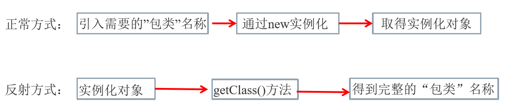
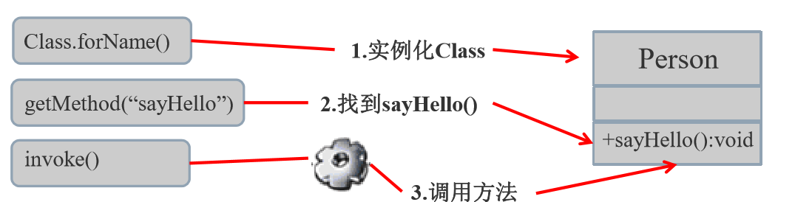

---
title: 反射
date: 2020-03-07 20:00:09
summary: 本文总结Java反射机制的重点知识。
tags:
- 程序设计
categories:
- 程序设计
---

# Java反射

反射(Reflection)是被视为动态语言的关键，反射机制允许程序在执行期借助于Reflection API取得任何类的内部信息，并能直接操作任意对象的内部属性及方法。

## Java反射机制提供的功能

- 在运行时判断任意一个对象所属的类。
- 在运行时构造任意一个类的对象。
- 在运行时判断任意一个类所具有的成员变量和方法。
- 在运行时调用任意一个对象的成员变量和方法。
- 生成动态代理。
- ……

## Java反射相关的主要API

- java.lang.Class：代表一个类
- java.lang.reflect.Method：代表类的方法
- java.lang.reflect.Field：代表类的成员变量
- java.lang.reflect.Constructor：代表类的构造方法
- … 

# java.lang.Class类

在Object类中定义了<code>public final Class getClass()</code>，此方法将被所有子类继承（要注意Object是所有类的父类）。
该方法返回值的类型是一个Class类，此类是Java反射的源头。
实际上所谓反射从程序的运行结果来看也很好理解：通过对象反射求出类的名称。 



## Class类的核心要点

反射后可以得到某个类的以下信息：属性、方法、构造器、实现的接口。

对于每个类而言，JRE都为其保留一个不变的Class类型的对象。下面的内容要记住：
- 一个Class对象包含了特定某个类的有关信息。
- Class本身也是一个类。
- Class 对象只能由系统建立对象。
- 一个类在JVM中只会有一个Class实例。
- 一个Class对象对应的是一个加载到JVM中的一个.class文件。
- 每个类的实例都会记得自己是由哪个Class实例所生成。
- 通过Class可以完整地得到一个类中的完整结构。
- ……

## Class类的重要API

|方法名 |功能说明|
|--|--| 
|static Class  forName(String name)  |返回指定类名 name 的 Class 对象 |
|Object newInstance()  |调用缺省构造函数，返回该Class对象的一个实例 |
|String getName()  |返回此Class对象所表示的实体（类、接口、数组类、基 本类型或void）名称 |
|Class getSuperClass() |返回当前Class对象的父类的Class对象 |
|Class[] getInterfaces()  |获取当前Class对象的接口 |
|ClassLoader getClassLoader()  |返回该类的类加载器 |
|Class getSuperclass()  |返回表示此Class所表示的实体的超类的Class |
|Constructor[] getConstructors() |返回一个包含某些Constructor对象的数组 |
|Field[] getDeclaredFields() |返回Field对象的一个数组 |
|Method getMethod(String name,Class  …  paramTypes) |返回一个Method对象，此对象的形参类型为paramType| 

## 实例

```java
String str = "Person";
Class clazz = Class.forName(str);
Object obj = clazz.newInstance();
Field field = clazz.getField("name");
field.set(obj, "Peter");
Object obj2 = field.get(obj);
System. out.println (obj2);
```

## 实例化Class类对象(四种方法)

**方法一：**
前提：若已知具体的类，通过类的class属性获取，该方法最为安全可靠，程序性能最高。
实例：
```java
Class clazz = String.class; 
```

**方法二：**
前提：已知某个类的实例，调用该实例的getClass()方法获取Class对象。
实例：
```java
Class clazz = "hhh".getClass();
```

**方法三：**
前提：已知一个类的全类名，且该类在类路径下，可通过Class类的静态方法forName()获取，可能抛出 ClassNotFoundException。
实例：
```java
Class clazz = Class.forName("java.lang.String");
```

**方法四：**
实例：
```java
ClassLoader cl = this.getClass().getClassLoader();
Class clazz = cl.loadClass("java.lang.String"); 
```

# 创建类对象并获取类的完整结构

## 获取Class对象后创建类的对象

可以调用Class对象的newInstance()方法就可以啦，但也有以下要求：
- 类必须有一个无参数的构造器。
- 类的构造器的访问权限需要足够。

而有的类不具有无参数构造器，但只要在操作的时候明确的调用类中的构造方法，并将参数传递进去之后，也可以实例化操作。
步骤如下： 
1. 通过Class类的`getDeclaredConstructor(Class … parameterTypes)`取得本类的指定形参类型的构造器。
2. 向构造器的形参中传递一个对象数组进去，里面包含了构造器中所需的各个参数。
3. Constructor类存在一个方法：`public T newInstance(Object .. initargs)`，向Constructor对象准确传参后调用它，创建对应类的对象，并初始化类属性。

实例：
```java
//1.根据全类名获取对应的Class对象 
String name = "Person"; 
Class clazz = Class.forName(name); 
//2.调用指定参数结构的构造器，生成Constructor的实例 
Constructor constructor = clazz.getConstructor(String.class,Integer.class); 
//3.通过Constructor的实例创建对应类的对象，并初始化类属性 
Person person = (Person)constructor.newInstance("Peter", 100);
System.out.println(person);
```

## 通过反射调用类的完整结构 

获取Interface、Superclass、Constructor、Method、Field、Annotation、ParameterizedType、Package相关。

### 获取实现的全部接口

- **public Class<?>[] getInterfaces()**：确定此对象所表示的类或接口实现的接口
 
### 获取所继承的父类

- **public Class<? Super T> getSuperclass()**：返回表示此Class所表示的实体（类、接口、基本类 型）的父类的Class。
 
### 获取全部的构造器

- **public Constructor<T>[] getConstructors()**：返回此 Class 对象所表示的类的所有public构造方法。
- **public Constructor<T>[] getDeclaredConstructors()**：返回此 Class 对象表示的类声明的所有构造方法。
 
**Constructor类中：**
- **取得修饰符**：public int getModifiers();
- **取得方法名称**：public String getName();
- **取得参数的类型**：public Class<?>[] getParameterTypes(); 

### 获取全部的方法 

- **public Method[] getDeclaredMethods()**：返回此Class对象所表示的类或接口的全部方法。
- **public Method[] getMethods()**：返回此Class对象所表示的类或接口的public的方法。
 
**Method类中：**
- **public Class<?> getReturnType()**：取得全部的返回值。
- **public Class<?>[] getParameterTypes()**：取得全部的参数。
- **public int getModifiers()**：取得修饰符。
- **public Class<?>[] getExceptionTypes()**：取得异常信息。

### 获取全部的属性

- **public Field[] getFields()**：返回此Class对象所表示的类或接口的public的Field。
- **public Field[] getDeclaredFields()**：返回此Class对象所表示的类或接口的全部Field。
 
**Field方法中：**
- **public int getModifiers()**：以整数形式返回此Field的修饰符。
- **public Class<?> getType()**：得到Field的属性类型。
- **public String getName()**：返回Field的名称。
 
### 获取Annotation相关

- **get Annotation(Class<T> annotationClass)**  
- **getDeclaredAnnotations()**  

### 获取泛型相关

- **获取父类泛型类型**：Type getGenericSuperclass() 
- **泛型类型**：ParameterizedType 
- **获取实际的泛型类型参数数组**：getActualTypeArguments() 
 
### 获取类所在的包

- **Package getPackage()**  
 
## 调用指定方法

通过反射，调用类中的方法，通过Method类完成。步骤： 
1. 通过Class类的getMethod(String name,Class…parameterTypes)方法取 得一个Method对象，并设置此方法操作时所需要的参数类型。 
2. 之后使用Object invoke(Object obj, Object[] args)进行调用，并向方法 中传递要设置的obj对象的参数信息。



**对Object invoke(Object obj, Object …  args)的说明：**
- Object 对应原方法的返回值，若原方法无返回值，此时返回null。
- 若原方法若为静态方法，此时形参Object obj可为null。
- 若原方法形参列表为空，则Object[] args为null。
- 若原方法声明为private,则需要在调用此invoke()方法前， 显式调用方法对象的setAccessible(true)方法，将可访问private的方法。

## 调用指定属性

在反射机制中，可以直接通过Field类操作类中的属性，通过Field类提供的set() 和get()方法就可以完成设置和取得属性内容的操作。
- **public Field getField(String name)**：返回此Class对象表示的类或接口的指定的 public的Field。 
- **public Field getDeclaredField(String name)**：返回此Class对象表示的类或接口的 指定的Field。 
 
在Field中：
- **public Object get(Object obj)**：取得指定对象obj上此Field的属性内容。
- **public void set(Object obj,Object value)**：设置指定对象obj上此Field的属性内容。
注：在类中属性都设置为private的前提下，在使用set()和get()方法时，首先要 使用Field类中的setAccessible(true)方法将需要操作的属性设置为可以被外部访问。 
- public void setAccessible(true)访问私有属性时，让这个属性可见。
