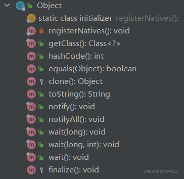
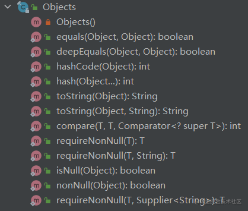
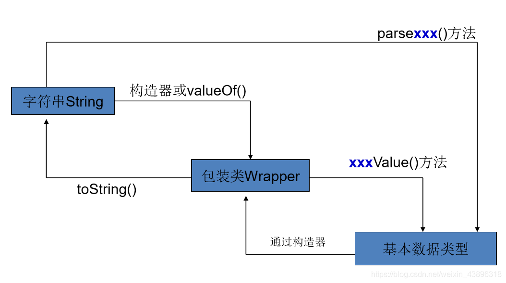
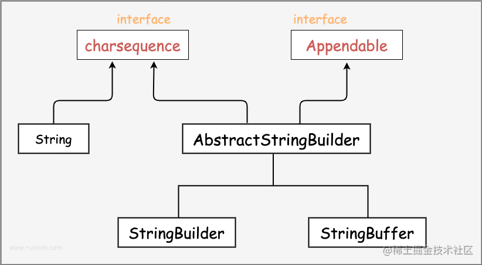

---
title: 变量与类型
date: 2023-02-03 11:44:23
summary: 本文分享Java变量与类型的相关内容。
tags:
- 程序设计
categories:
- 程序设计
---

# 变量与常量

## 变量

变量在所有计算机程序中都用得到，是程序设计中非常重要的概念。

当我们写一个程序的时候，大多数情况下，我们不知道程序执行时用户将会输入的实际数字或其他数据，因此我们把输入数据赋值给程序中的变量。

在程序运行的过程中，变量是一个数值可变的量。<br>
随后的程序语句中，我们需要使用到那个数据时，只需要使用它的变量名。这时，变量的取值会应用到用到它的那条语句中。

程序变量是计算机内存中存储地址的名称，而变量的取值是那个地址中的内容。

变量在不同类型编程语言中的使用是不同的。<br>
在静态类型语言中，变量类型不可变(Java等语言支持数值类型的自动类型转换)；在动态类型语言中，变量类型可变。<br>
在强类型语言中，变量需要先定义再使用；在弱类型语言中，变量不需要先定义再使用。[1]

## 常量

在程序运行的过程中，常量是一个数值不可变的量。

常量和变量一样，都需要一个命名。

常量的存在，可以尽可能地避免“魔法数”问题，避免一处修改处处修改且容易漏改错改的问题。

以Java为例，常量被定义为final的。对于基本类型，常量的内存地址直接存的就是值，值不能赋值修改；对于引用类型，常量的内存地址存的是引用(指针)，不能直接赋值修改，但可以赋值修改属性值。[1]

## 变量的命名

变量命名的原则：
1.  所有的变量名必须是一个词。
2. 可以使用下划线，通常也可以使用连字符，但不能使用空格。
3. 变量名可以很长，事实上许多语言允许名字长度超过200个字符。只是，名字太会增加程序出错的机会。
4. 大多数语言允许数字作为变量名的一部分，但变量名不能以数字开头。
5. 命名分为驼峰式命名和下划线式命名。
6. 变量名应该要有实际意义且易于理解。

变量的命名具体是驼峰式命名还是下划线式命名，往往取决于具体语言的约定俗成。

常量的命名通常是全大写字母，用下划线连接。[2]

## 变量的作用域

在程序模块中，当一个变量的值由用户输入、被程序处理或者被输出处理时，我们称为该变量在这个模块中被引用了。在特定情况下，在一个模块中声明的变量不能在另一个模块中被引用。试图在一个模块中使用其他模块中声明的变量将得到编译器给出的“未知变量”的错误信息。一个给变量能够在程序中被引用的代码范围称为**变量的作用域**。

对大多数编程语言来说，在特定模块中声明的变量，其作用域包含该模块本身以及所有它的子模块。

全局变量的作用域为整个程序范围；另外在一些编程语言中，如果一个变量在所有程序模块之外（包括主程序）或者前面进行了声明，那么该变量就是全局变量。

在某一子程序中声明的变量被称为局部变量，具有如下特点：
- 当子程序中，局部变量的值更改时，在子程序外部同这些局部变量名相同的变量的值不会跟着改变。
- 当程序中一个变量的值更改时，在子程序中同该变量名称相同的局部变量的值不会跟着改变。

有时，局部变量和全局变量会发生冲突的情况，为了解决冲突应采用局部声明优先原则，即子程序变量的值更改时主程序变量的值不会跟着改变。

除了计数器以外，在一个程序中将两个变量名同名不是好的编程习惯，例如PyCharm就会给这种情况标警告。

局部变量是必然会支持的，有些编程语言完全不支持全局变量。[3]

# 数据类型

Java 语言是强类型语言：
- 所有的变量必须先声明后使用。
- 指定类型的变量只能接受类型与之匹配的值。

强类型意味着每个变量和每个表达式都有一个在编译时就确定的类型。类型限制了一个变量能被赋的值，限制了一个表达式可以产生的值，限制了在这些值上可以进行的操作，并确定了这些操作的含义。

强类型语言可以在编译时进行更严格的语法检查，从而减少编程错误。

声明变量的语法非常简单，只要指定变量的类型和变量名即可：`type varName;`，也可以直接赋初值：`type varName = 初始值;`。

Java 语言支持的类型包括：
- 基本类型
    - 数值类型
        - 整数类型
            - **byte**
            - **short**
            - **int**
            - **long**
            - **char**
        - 浮点数类型
            - **float**
            - **double**
    - 布尔类型
- 引用类型

## 基本数据类型

Java语言提供了 8 种基本类型，包括 6 种数值类型（4 种整型，2 种浮点型），1 种字符类型，还有 1 种布尔型。[4]<br>
某种意义上，char 类型也可以视作数值类型。

 - 数值类型
   - 整数类型
     - **byte**
     - **short**
     - **int**
     - **long**
   - 浮点类型
     - **float**
     - **double**
 - 字符类型
   - **char**
 - 布尔类型
   - **boolean**

### byte类型

byte 数据类型是 8 位、有符号的、以二进制补码表示的整数，用在大型数组中可节约空间，主要代替整数，因为 byte 变量占用的空间只有 int 类型的四分之一，占 1 个字节。
- 最小值：$-128$（$-2^7$）
- 最大值：$127$（$2^7-1$）
- 默认值：$0$

Example：

```java
byte a = 100;
byte b = -30;
```

### short类型

short 数据类型是 16 位、有符号的以二进制补码表示的整数，也可以像 byte 那样节省空间，一个short变量是int型变量所占空间的二分之一，占 2 个字节。

- 最小值：$-32768$（$-2^{15}$）
- 最大值：$32767$（$2^{15}-1$）
- 默认值：$0$

Example：

```java
short a = 30000;
short b = -200;
```

### int类型

int 数据类型是32位、有符号的以二进制补码表示的整数，整型变量默认为 int 类型，占 4 个字节。
- 最小值：$-2147483648$（$-2^{31}$）
- 最大值：$2147483647$（$2^{31}-1$）
- 默认值：$0$ 

Example：

```java
int a = 1000000;
int b = -2000000;
```

如果直接将一个较小（范围内）的整数值赋给 byte 或者 short 变量，Java会自动把该数值当做 byte 或 short 类型处理。

如果直接使用一个较大（超出 int 范围，但不超过 long 范围）的数值时，Java 不会把该数值当做 long 来处理，必须加上 l 或者 L，推荐使用 L。

Java 整数存在 4 种表示形式：十进制、二进制、八进制、十六进制。二进制以 0b 或 0B 开头，八进制以 0 开头，十六进制以 0x 或 0X 开头。

### long类型

long 数据类型是 64 位、有符号的以二进制补码表示的整数，这种类型主要使用在需要比较大整数的系统上（真正巨大的数据要用 `java.math.BigInteger`），占 8 个字节。

需要强调的是：`long a = 9_223_372_036_854_775_807;` 是不对的，必须写成`long a = 9_223_372_036_854_775_807L;`，因为默认的整数数值就是int类型的。<br>
"L"不分大小写，但是若写成"l"容易与数字"1"混淆，不容易分辨，所以应该大写。

- 最小值：$-9223372036854775808$（$-2^{63}$）
- 最大值：$9223372036854775807$（$2^{63}-1$）
- 默认值：$0$

说明：Java支持数值类型直接量以下划线划分，增加可读性，防止出错。

Example： 

```java
long a = 9_223_372_036_854_775_807L;
long b = -2000000L;
```

### float类型

float 数据类型是单精度、32 位、符合 IEEE 754 标准的浮点数，1 位符号位，8 位指数位，23 位尾数位。

float 在储存大型浮点数组的时候可节省内存空间，占 4 个字节。

浮点数必须带小数点，否则会被当做 int 处理。

浮点数不能用来表示精确的值，Java 高精运算要用 `java.math.BigDecimal`。

- 最小值：$1.4×10^{-45}$
- 最大值：$3.4028235×10^{38}$
- 默认值：$0.0$（0.0f）

Example：

```java
float a = 123.4f;
```

### double类型

double 数据类型是双精度、64 位、符合 IEEE 754 标准的浮点数，1 位符号位，11 位指数位，52 位尾数位。

浮点数的默认类型为 double 类型，占 8 个字节。

double 类型同样不能表示精确的值，Java 高精运算要用 `java.math.BigDecimal`。

- 最小值：$4.9×10^{-324}$
- 最大值：$1.7976931348623157×10^{308}$
- 默认值：$0.0$（0.0d）

Example：

```java
double a = 123.4;
```

### char类型

char 类型是一个单一的 16 位 Unicode 字符，char 数据类型理论上可以储存任何 Unicode 字符，占 2 个字节。

char相当于 16 位无符号整数，用单引号 `''`括起来。

- 最小值：`\u000`（即为数值 0，相当于''）
- 最大值：`\uffff`（即为数值 65535）
- 默认值：`\u000`（即为数值 0，相当于''）

Example：

```java
char a = 'A';
char b = 100;
```

### boolean类型

boolean 数据类型表示一位的信息，只有两个取值：true 和 false。这种类型只作为一种标志来记录 true / false 情况。但 boolean 的开销比 byte 大，byte 显然是更节省一些的。

boolean 类型的值或变量主要用做旗标来进行流程控制

- 默认值：false

Example：

```java
boolean a = true;
boolean b = false;
```

## 引用类型

引用类型包括类、接口和数组类型，还有null。

引用类型变量包括实例和数组，本质是一个指针。<br>
变量的指针就是变量的存储地址，指针变量就是存储指针的变量。

### Object

java.lang.Object类是所有类的超类，是Java语言中唯一一个没有父类的类。 [5]

一个类可以不是Object类的直接子类，但一定是Object类的子类，Java中的每一个类都是从Object扩展来的。  
在Object类中定义的方法，在所有类中都可以使用：<br>


Java实现对象克隆的方法：
- 实现 Cloneable 接口并重写 Object 类中的 clone() 方法，这是一种浅拷贝，对每一层的每个对象都进行浅拷贝就实现了深拷贝。
- 实现 Serializable 接口，通过对象的序列化和反序列化实现克隆，可以实现真正的深拷贝。

在哈希结构里，hashCode() 相等意味着哈希码相同，意味着冲突，但不意味着键值对相等，因为衡量键值对是否相同的其实是 equals()。
1. 如果两个对象相等，则 hashCode 一定也是相同的。
2. 两个对象相等，对两个对象分别调用 equals 方法都返回 true。
3. 两个对象有相同的 hashCode 值，它们也不一定是相等的。
4. 如果 equals 方法被覆盖过，则 hashCode 方法也必须被覆盖。
5. hashCode() 的默认行为是对堆上的对象产生独特值。如果没有重写 hashCode()，则该 class 的两个对象无论如何都不会相等（即使这两个对象指向相同的数据）。

java.util.Objects是JDK1.7新增的工具类：<br>


### 包装类

Java是一门面向对象的编程语言，为简便设计了八种基本数据类型。但Java不把基本数据类型看作对象，而是提供包装类来将基本数据类型看作对象。 

基本数据类型不是对象层次结构的组成部分。有时需要像处理对象一样处理这些基本数据类型，可通过相应的“包装类”来将其“包装”后使用。 

包装类中包含了对应基本数据类型的值，封装了String和基本数据类型之间相互转换的方法，还有一些处理这些基本数据类型时 非常有用的属性和方法。 [6]

|基本数据类型 |对应的包装类| 
|:----:|:----:|
|byte| java.lang.Byte |
|short| java.lang.Short |
|int| java.lang.Integer |
|long| java.lang.Long |
|char| java.lang.Character|
|float| java.lang.Float |
|double| java.lang.Double|
|boolean| java.lang.Boolean|

包装类的常量池存储：
- Boolean：true 和 false 全部存储
- Byte：$-128\sim{}127$ 全部存储
- Character：$0\sim{}127$ 存储
- Short：$-128\sim{}127$ 存储
- Long：$-128\sim{}127$ 存储
- Integer：$-128\sim{}127$ 存储
- Float：没有存储
- Double：没有存储

字符串与基本数据类型、包装类型转换图如下：<br>


JDK自从5.0版本后引入自动装箱和自动拆箱机制，在进行基本数据类型和对应的包装类转换时，系统将自动进行，可方便程序的编写。
- 所谓自动装箱，就是直接把一个基本类型的变量赋值给其对应的包装类型。
- 所谓自动拆箱，就是直接把一个包装类型的变量赋值给其对应的基本类型。

基本操作：
- 预定义：`int pInt = 500;`
- 自动装箱：`Integer  wInt = pInt;`
- 自动拆箱：`int n = wInt;`

### 数组

数组是[变量](https://blankspace.blog.csdn.net/article/details/123163101)的集合，这些变量有相同的类型，使用相同的名字，连续顺序存储，支持按索引访问。

使用数组，不仅使大量数据的加载变得更简单，而且也使数据的处理变得更简洁和更高效。

一维数组是一系列相互有关联的数据，它们类型相同，由单个变量名来引用，用索引值来区分每个元素。程序设计语言把下标用括号括起来跟在数组名后面，用来指明某个特定的元素。

数组下标索引通常从$0$开始，长度为$n$的数组的下标取值范围是$[0,n-1]$，是离散的整数值。

数组名和变量名非常类似，数组名后跟括号和索引可以表示数组元素普通变量。

数组存放在计算机内存的一串连续的存储区域中。当声明变量时，要明确数组元素类型和数组长度，然后计算机会为数组分配相应的连续内存空间。

数组一旦创建，内存区域就已经确定，不能更改长度。值得一提的是，`java.util.ArrayList`这样的数据结构只是基于数组实现的顺序表，所谓“动态数组”，并不是严格意义上的数组结构。

不同的编程语言对于数组有不同的使用方法，C/C++存在指针的概念所以更接近数组的本质，Java等语言并没有自己实现数组，Python等语言的数组更是直接呈现出“动态数组”的特性。

C/C++更能揭示数组的本质，变量的指针其实就是变量的地址，数组变量是指针变量，指向数组首地址，通过指针加减法也可以实现下标访问同样的效果(随机访问)。

一个数组可以取代一系列简单变量，可以帮助设计出更加简单高效的程序。一旦数据进入一个数组，它可以被处理许多次而不需要重新输入。
创建数组还可以让我们创建的程序更通用，因为我们不必用完数组声明时分配给数组的所有元素，数组能给我们更大的灵活性。

有一位数组，就有二维数组、三维数组、……一维数组好比列表，二维数组就好比表格。

一维数组基于单下标访问，二维数组基于双下标访问，以此类推。<br>
遍历一维数组需要一层循环结构，遍历二维数组需要二层循环结构嵌套，以此类推。

尽管存在高维数组，但一般至多使用二维数组，只有少数算法题会使用到高维数组。[7]

Java基本类型对象构成的数组类型是：
- long[]的类型是：`class [J`
- int[]的类型是：`class [I`
- short[]的类型是：`class [S`
- byte[]的类型是：`class [B`
- char[]的类型是：`class [C`
- double[]的类型是：`class [D`
- float[]的类型是：`class [F`
- boolean[]的类型是：`class [Z`

Java引用类型对象构成的数组类型是：
- String[]的类型是：`class [Ljava.lang.String`
- Arrays[]的类型是：`class [Ljava.util.Arrays`
- BigInteger[]的类型是：`class [Ljava.math.BigInteger`[8]

Java数组初始化：
- 静态初始化：初始化时显式指定每个数组元素的初始值，由系统决定数组长度。<br>`Type[] arrayName = new Type[] {element1, element2, element3, element4, ...};`
- 动态初始化：初始化只至指定数组长度，由系统为数组元素分配初始值。对于动态初始化，初始化的值都是默认值，C语言新建数组若不指定初值则可能出现脏数据。<br>`Type[] arrayName = new Type[length];`

Java数组的输出：
- 数组引用的输出：`arrayVar`
- Java一维数组内容的输出：`Arrays.toString(arrayVar)`
- Java二维以上数组内容的输出：`Arrays.deepToString(arrayVar)`

Java数组的拷贝：
- `System.arraycopy()`
- `Arrays.copyOf()`
- `arrayObj.clone()`
    - 一维数组的clone()是深拷贝
    - 二维数组乃至多维数组的clone()是浅拷贝
- for循环为数组逐一赋值

`java.util.Arrays`包含一些static方法可操作数组。

### 字符串

字符串是一连串的字符序列，C语言字符串以字符数组的形式表示，C++、Java等语言对字符串进行了封装。

Java提供了String、StringBuffer、StringBuilder三个类来封装字符串，并提供了一系列方法来操作字符串。<br>
String是不可变的，StringBuilder和StringBuffer都支持直接对对象本身操作，而不是生成新的对象。

String的直接定义和new创建存在区别。String直接定义后会被放进字符串常量池，String被new出来会创建两个对象放在堆里。

Java字符串[不可变](https://blankspace.blog.csdn.net/article/details/122808973)的原因：
1. 字符串常量池的需要：字符串常量池是 Java 堆内存中一个特殊的存储区域，当创建一个 String 对象时，假如此字符串值已经存在于常量池中，则不会创建一个新的对象，而是引用已经存在的对象。 
2. 允许 String 对象缓存 HashCode：Java 中 String 对象的哈希码被频繁地使用，比如在 HashMap 等容器中。字符串不变性保证了 hash 码的唯一性，因此可以放心地进行缓存。这也是一种性能优化手段，意味着不必每次都去计算新的哈希码。
3. String 被许多的 Java 类(库)用来当做参数，例如网络连接地址 URL、文件路径 path、还有反射机制所需要的 String 参数等，假若 String 不是固定不变的，将会引起各种安全隐患。

StringBuilder和StringBuffer也存在区别，主要区别在：StringBuilder是线程不安全的，StringBuffer是线程安全的。
- 单线程的情况下使用StringBuilder效率更高。
- StringBuffer的关键的方法，诸如length()、append()，都是加了synchronized的，同时刻只能有一个线程去执行一个方法，所以StringBuffer是线程安全的。



### null

null是一个特殊的值，表示值未知或不存在。

任何引用类型变量都可以被赋值null，其初始化值也是null。

由于null本身的含义，所以`varName.function()`调用时，若变量值为null，则会报空指针异常`java.lang.NullPointerException`，要注意。

# Reference

本文参考文章均为本人原创发表于CSDN的文章，内容如下：
[1][变量和常量](https://blankspace.blog.csdn.net/article/details/123163101)
[2][变量名的命名原则](https://blankspace.blog.csdn.net/article/details/123131585)
[3][变量的作用域](https://blankspace.blog.csdn.net/article/details/123168942)
[4][浅析八种基本类型](https://blankspace.blog.csdn.net/article/details/104545979)
[5][Object基类](https://blankspace.blog.csdn.net/article/details/104711521)
[6][浅析八种基本类型和包装类型](https://blankspace.blog.csdn.net/article/details/104715326)
[7][数组](https://blog.csdn.net/weixin_43896318/article/details/123165634)
[8][探究Java数组的本质](https://blankspace.blog.csdn.net/article/details/104083129)
