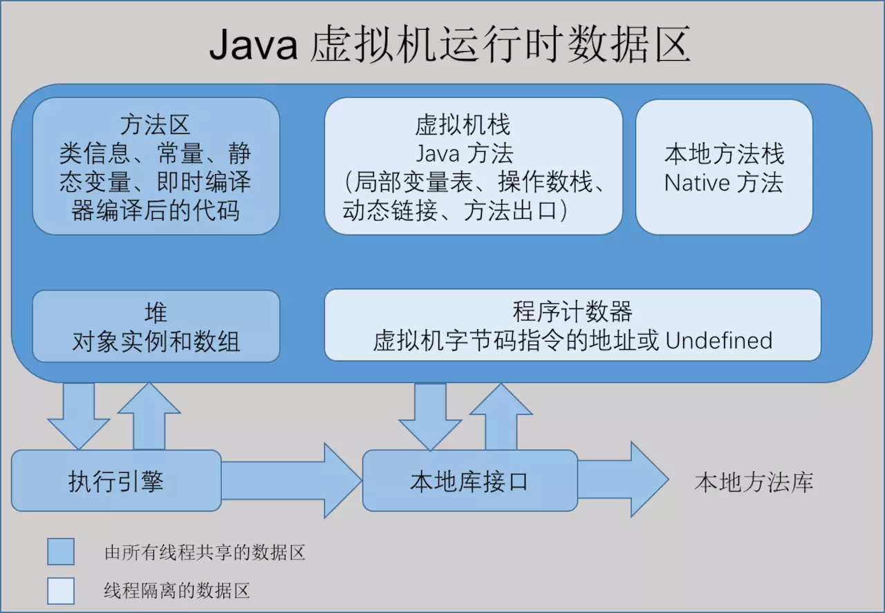
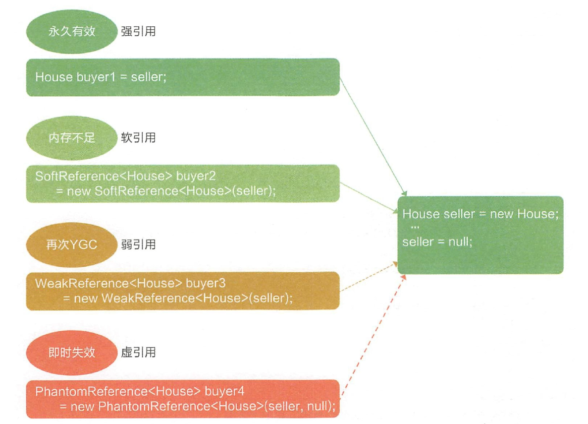

---
title: 堆与堆栈
date: 2023-03-07 15:48:23
summary: 本文分享堆和堆栈的基础知识，这些都是程序设计的基础知识。
tags:
- 程序设计
categories:
- 程序设计
---

# 内存存储数据

程序运行的时候，操作系统会给它分配一段内存，用来储存程序和运行产生的数据。这段内存有起始地址和结束地址。本文关于堆和堆栈的讨论基于小端编址展开。

## 内存编址

为了存取存储体中的信息，必须对存储单元编址。编址单位是指具有相同地址的那些存储元件构成的一个单位。

内存既可以按字节编址，也可以按字编址。现代计算机通常采用字节编址方式，即存储体内的一个地址中有$1$个字节的数据，不同类型的数据占据的字节数不同。

多字节数据都存放在连续的字节序列中，根据数据中各字节在连续字节序列中的排列顺序不同，可以采用两种排列方式：大端方式和小端方式。

在存储数据时，数据从低位到高位可以从左到右排列，也可以从右到左排列。因此，无法用最左或最右来表征数据的最高位或最低位，通常用最低有效字节LSB和最高有效字节MSB来分别表示数的低位和高位。

大端方式按从MSB到LSB的顺序存储数据，即MSB放在前面；小端方式按从LSB到MSB的顺序存储数据，即LSB放在前面。

# 堆区

堆(Heap)：
- 堆区数据从低位到高位占据内存空间。
- 用户通过动态的内存分配方式处理堆区数，例如`malloc`。
- 堆区数据不会自动消失，堆区程序数据必须手动释放(`free`)或通过垃圾回收机制(JVM)来回收。
- 堆区使用CPU和内存之间的二级缓存，堆区数据的生命周期由虚拟机的垃圾回收算法来决定（并不是一旦成为孤儿对象就能被回收），所以调用这些对象的速度要相对来得低一些。
- 堆区不等同于数据结构的堆，类似于数据结构的队列，都是先进先出(FIFO)的。

# 栈区

栈(Stack)：
- 栈是由于函数运行而临时占用的内存区域。
- 栈区数据由操作系统自动分配释放，存放函数的参数值，局部变量的值等。
- 栈区使用CPU内部的一级缓存，栈区数据通常都是被调用时处于存储空间中，调用完毕立即释放。
- 栈区数据从高位到低位占据内存空间。
- 栈区不等同于数据结构的栈，但都是后进先出(LIFO)的。

栈最基础的三个操作分别是：
- `push`：当前元素入栈。
- `pop`：栈顶元素出栈。
- `peek`：获取栈顶元素。

## 栈帧

所有的帧都存放在栈。栈帧也叫过程活动记录，是编译器用来实现函数(过程)调用的一种数据结构，用作程序的函数调用记录。

栈上保持了多个栈帧的实体。换而言之，栈帧将栈分割成了多个记录块，这些记录块大小不是固定的，因为栈帧可能存储多种数据，这些数据的数量和大小不见得相同。
栈帧存储的数据可能包括：函数入参、函数出参、函数返回值地址、上一个栈帧的栈底指针、函数内部的变量等。

栈是一种后进先出(LIFO)的数据结构。对于栈区数据，外层函数调用先入栈，内层函数调用后入栈，每一次函数执行结束，就自动释放一个帧，直至所有函数运行结束，最外层函数调用从栈底到达栈顶并出栈。函数调用过程中，每一层栈帧都能存储自身的变量和数据。

## 堆栈与递归函数

如果一个函数中所有递归形式的调用都出现在函数的末尾，我们称这个递归函数是尾递归的。当递归调用是整个函数体中最后执行的语句且它的返回值不属于表达式的一部分时，这个递归调用就是尾递归。尾递归函数的特点是在回归过程中不用做任何操作，这个特性很重要，因为大多数现代的编译器会利用这种特点自动生成优化的代码。

当编译器检测到一个函数调用是尾递归的时候，它就覆盖当前的活动记录而不是在栈中去创建一个新的。编译器可以做到这点，因为递归调用是当前活跃期内最后一条待执行的语句，于是当这个调用返回时栈帧中并没有其他事情可做，因此也就没有保存栈帧的必要了。通过覆盖当前的栈帧而不是在其之上重新添加一个，这样所使用的栈空间就大大缩减了，这使得实际的运行效率会变得更高。

# JVM内存管理

## JVM内存结构

1. 程序计数器：内存空间小，线程私有。字节码解释器工作是就是通过改变这个计数器的值来选取下一条需要执行指令的字节码指令，分支、循环、跳转、异常处理、线程恢复等基础功能都需要依赖计数器完成。如果线程正在执行一个Java方法，这个计数器记录的是正在执行的虚拟机字节码指令的地址；如果正在执行的是Native方法，这个计数器的值则为(Undefined)。此内存区域是唯一一个在Java虚拟机规范中没有规定任何OutOfMemoryError情况的区域。
2. Java虚拟机栈：线程私有，生命周期和线程一致。描述的是Java方法执行的内存模型：每个方法在执行时都会床创建一个栈帧(StackFrame)用于存储局部变量表、操作数栈、动态链接、方法出口等信息。每一个方法从调用直至执行结束，就对应着一个栈帧从虚拟机栈中入栈到出栈的过程。 局部变量表：存放了编译期可知的各种基本类型(boolean、byte、char、short、int、float、long、double)、对象引用(reference类型)和returnAddress类型(指向了一条字节码指令的地址)
3. 本地方法栈：区别于Java虚拟机栈的是，Java虚拟机栈为虚拟机执行Java方法(也就是字节码)服务，而本地方法栈则为虚拟机使用到的Native方法服务。也会有StackOverflowError和OutOfMemoryError异常。
4. Java堆：对于绝大多数应用来说，这块区域是JVM所管理的内存中最大的一块。线程共享，主要是存放对象实例和数组。内部会划分出多个线程私有的分配缓冲区TLAB。可以位于物理上不连续的空间，但是逻辑上要连续。
5. 方法区：属于共享内存区域，存储已被虚拟机加载的类信息、常量、静态变量、即时编译器编译后的代码等数据。
6. 运行时常量池：属于方法区一部分，用于存放编译期生成的各种字面量和符号引用。编译器和运行期(String的intern())都可以将常量放入池中。内存有限，无法申请时抛出OutOfMemoryError。
7. 直接内存：非虚拟机运行时数据区的部分。

注意两种错误：
- StackOverflowError：线程请求的栈深度大于虚拟机所允许的深度。
- OutOfMemoryError：如果虚拟机栈可以动态扩展，而扩展时无法申请到足够的内存。

## JVM回收对象判定

- 引用计数法
    - 给对象添加一引用计数器，被引用一次计数器值就加1；当引用失效时，计数器值就减1；计数器为0时，对象就是不可能再被使用的。
    - 优点是简单高效。
    - 缺点是无法解决对象之间相互循环引用的问题。
- 可达性分析
    - 通过一系列的称为"GC Roots"的对象作为起始点，从这些节点开始向下搜索，搜索所走过的路径称为引用链，当一个对象到GC Roots没有任何引用链相连时，则证明此对象是不可用的。
    - 可作为GC Roots的对象类型：
        - 虚拟机栈（栈帧中的本地变量表）中引用的对象。
        - 方法区中类静态属性引用的对象。
        - 方法区中常量引用的对象。
        - 本地方法栈中JNI（Native方法）引用的对象。
    - 选择这些作为GC Roots的原因是，GC只管理堆……

## JVM垃圾回收算法

- 标记-清除算法
    - 流程
        - 标记出所有需要回收的对象。
        - 在标记完成后统一回收所有被标记的对象。
    - 主要不足
       - 效率问题，标记和清除两个过程的效率都不高。
       - 空间问题，标记清除之后会产生大量不连续的内存碎片，空间碎片太多可能会导致以后在程序运行过程中需要分配较大对象时，无法找到足够的连续内存而不得不提前触发另一次垃圾收集动作。
- 复制算法
    - 流程
        - 将可用内存按容量划分为大小相等的两块，每次只使用其中的一块。
        - 当这一块的内存用完了，就将还存活着的对象复制到另外一块上面，然后再把已使用过的内存空间一次清理掉。
    - 主要优点
        - 内存分配时不用考虑内存碎片等复杂情况，只要移动堆顶指针，按顺序分配内存即可，实现简单，运行高效。
    - 主要不足
        - 将可用内存缩小为了原来的一半。
- 标记-整理算法
    - 根据老年代的特点提出此算法。
    - 标记过程仍然与“标记-清除”算法一样，但后续步骤不是直接对可回收对象进行清理，而是让所有存活的对象都向一端移动，然后直接清理掉端边界以外的内存。
- 分代收集算法
    - 根据对象存活周期的不同将内存划分为几块并采用不同的垃圾收集算法。
    - 流程
        - 把Java堆分为新生代和老年代，这样就可以根据各个年代的特点采用最适当的收集算法。
        - 新生代中，每次垃圾收集时都发现有大批对象死去，只有少量存活，那就选用复制算法，只需要付出少量存活对象的复制成本就可以完成收集。
        - 老年代中因为对象存活率高、没有额外空间对它进行分配担保，就必须使用“标记—清除”或者“标记—整理”算法来进行回收。
