---
title: 多线程
date: 2020-03-08 00:32:23
summary: 本文分享Java多线程开发的基本理论。
tags:
- 程序设计
categories:
- 程序设计
---

# 线程基本理论

推荐阅读：[操作系统进程管理](https://blankspace.blog.csdn.net/article/details/128746107)

## 进程与线程

**操作系统可以同时执行多个任务，每个任务就是进程；一个进程可以同时执行多个任务，每个任务就是一个线程。**

每个正在系统上运行的程序都是一个进程。每个进程包含一到多个线程。进程也可能是整个程序或者是部分程序的动态执行。线程是一组指令的集合，或者是程序的特殊段，它可以在程序里独立执行。也可以把它理解为代码运行的上下文。所以线程基本上是轻量级的进程，它负责在单个程序里执行多任务。通常由操作系统负责多个线程的调度和执行。

线程是操作系统能够进行运算调度的最小单位。它被包含在进程之中，是进程中的实际运作单位。一条线程指的是进程中一个单一顺序的控制流，一个进程中可以并发多个线程，每条线程并行执行不同的任务。在Unix System V及SunOS中也被称为轻量进程，但轻量进程更多指内核线程，而把用户线程称为线程。

线程是独立调度和分派的基本单位。线程可以为操作系统内核调度的内核线程，如Win32线程；由用户进程自行调度的用户线程，如Linux平台的POSIX Thread；或者由内核与用户进程，如Windows 7的线程，进行混合调度。

同一进程中的多条线程将共享该进程中的全部系统资源，如虚拟地址空间、文件描述符和信号处理等等。但同一进程中的多个线程有各自的调用栈，自己的寄存器环境，自己的线程本地存储。

线程和进程的区别在于，子进程和父进程有不同的代码和数据空间，而多个线程则共享数据空间，每个线程有自己的执行堆栈和程序计数器为其执行上下文。多线程主要是为了节约CPU时间，发挥利用，根据具体情况而定。线程的运行中需要使用计算机的内存资源和CPU。

## 并发与并行

并发（concurrency）和并行（parallellism）是：
- 解释一：并行是指两个或者多个事件在同一时刻发生；而并发是指两个或多个事件在同一时间间隔发生。
- 解释二：并行是在不同实体上的多个事件，并发是在同一实体上的多个事件。
- 解释三：并发是在一台处理器上“同时”处理多个任务，并行是在多台处理器上同时处理多个任务。如 hadoop 分布式集群。

所以并发编程的目标是充分的利用处理器的每一个核，以达到最高的处理性能。

并行(parallel)：指在同一时刻，有多条指令在多个处理器上同时执行。所以无论从微观还是从宏观来看，二者都是一起执行的。


并发(concurrency)：指在同一时刻只能有一条指令执行，但多个进程指令被快速的轮换执行，使得在宏观上具有多个进程同时执行的效果，但在微观上并不是同时执行的，只是把时间分成若干段，使多个进程快速交替的执行。

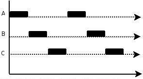

并行在多处理器系统中存在，而并发可以在单处理器和多处理器系统中都存在，并发能够在单处理器系统中存在是因为并发是并行的假象，并行要求程序能够同时执行多个操作，而并发只是要求程序假装同时执行多个操作（每个小时间片执行一个操作，多个操作快速切换执行）。

当有多个线程在操作时，如果系统只有一个 CPU，则它根本不可能真正同时进行一个以上的线程，它只能把 CPU 运行时间划分成若干个时间段，再将时间段分配给各个线程执行，在一个时间段的线程代码运行时,其它线程处于挂起状态.这种方式我们称之为并发（Concurrent）。

当系统有一个以上 CPU 时，则线程的操作有可能非并发。当一个 CPU 执行一个线程时，另一个 CPU 可以执行另一个线程，两个线程互不抢占 CPU 资源，可以同时进行，这种方式我们称之为并行（Parallel）。

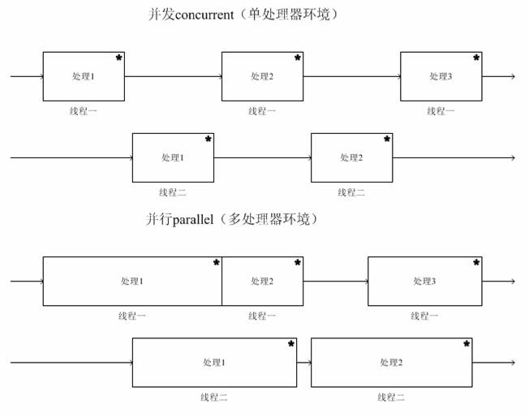

本节转载自[简书](https://www.jianshu.com/p/cbf9588b2afb)，修正了其中明显错误的表述。
原文写的不错，值得分享。

## 进程的生命周期

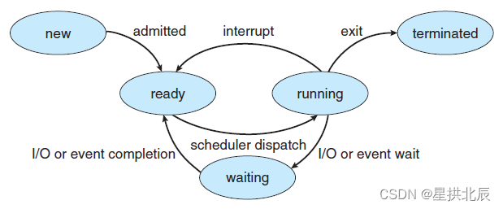

## 多线程

多线程，是指从软件或者硬件上实现多个线程并发执行的技术。具有多线程能力的计算机因有硬件支持而能够在同一时间执行多于一个线程，进而提升整体处理性能。具有这种能力的系统包括对称多处理机、多核心处理器以及芯片级多处理或同时多线程处理器。在一个程序中，这些独立运行的程序片段叫作“线程”，利用它编程的概念就叫作“多线程处理”。

简而言之，线程是程序中一个单一的顺序控制流程。**在单个程序中同时运行多个线程完成不同的工作,称为多线程。**

多线程编程的优点：

 - 进程之间不易共享内存，但线程之间共享内存非常容易。
 - 系统创建进程时需要为该进程重新分配系统资源，但创建线程的代价则小得多，因此使用多线程来实现多任务并发比多进程效率高。
 - Java语言内置了多线程功能的支持，而不是单纯地作为底层操作系统的调度方式，从而简化了Java的多线程编程。

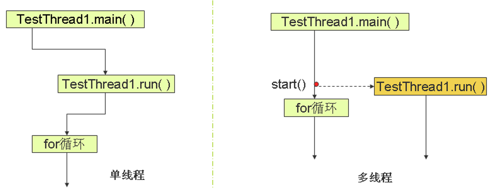

# Java线程

Java程序是通过线程执行的，线程在程序中具有独立的执行路径。当多条线程执行时，它们的路径可以不同。

每一个Java应用程序都需要有一个执行main()函数的默认主线程。应用程序也可以创建线程在后台操作时间密集型任务，以确保对用户的响应。这些封装了代码执行序列的线程对象就被称为Runnable。

JVM给了每个线程分配了独立的JVM栈空间以免互相干扰。独立的栈使得线程可以追踪他们自己下一条将要执行的指令，这些指令会依线程的不同而有所区别。栈空间也为每条线程单独准备了一份方法参数、局部变量以及返回值的拷贝。

Object类提供了三个线程相关的高级方法 ：
- **void wait()**：导致当前的线程等待，直到其他线程调用此对象的 notify()方法或 notifyAll() 方法。
- **void notify()**：唤醒在此对象监视器上等待的单个线程。
- **void notifyAll()**：唤醒在此对象监视器上等待的所有线程。

Java主要是基于java.lang.Thread类以及java.lang.Runnable接口来实现基本的线程机制的。

Thread类为底层操作系统的线程体系架构提供一套统一的接口（通常OS负责创建和管理线程）。操作系统线程和Thread对象关联（具体怎么关联关系还要看OS的设计）。

Runnable接口则为关联Thread对象的线程提供执行代码。这些代码放在Runnable的void run()方法中，这个方法虽然不接收任何参数且没有返回值，但有可能抛出异常。

## Java线程类的实现

要将一段代码（线程体）在一个新的线程上运行，该代码应该在一个线程类的run()函数中。
- 写一个类implements Runnable接口，就必须重写Runnable接口中的run()方法。
- 写一个类extends Thread类，就应该重写Thread类的run()方法。

|方法| 功能 |
|:----:|:----:|
| isAlive() | 判断线程是否还未被终止 |
| getPriority() | 获取线程优先级 |
| setPriority() | 设置线程优先级 |
| Thread.sleep() | 线程休眠 |
| join() | 等待调用线程运行的结束，再执行当前线程 |
| yield() | 让出资源，进入就绪队列等候 |

### java.lang.Thread

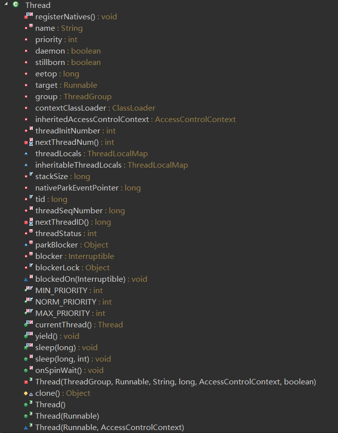
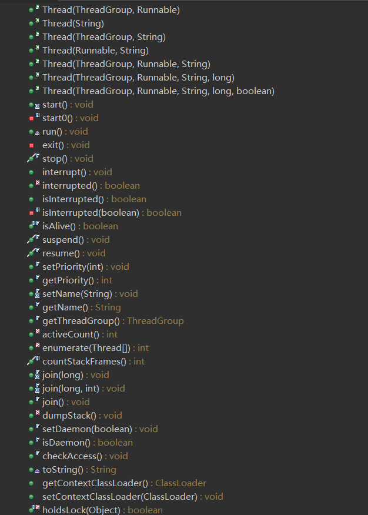
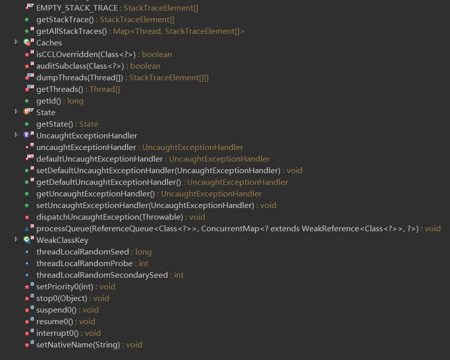

这个类里面有大量不常见的关键词：
 - volatile
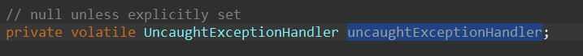
 - native
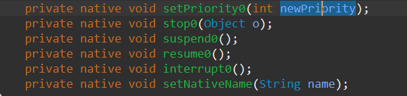
 - synchronized
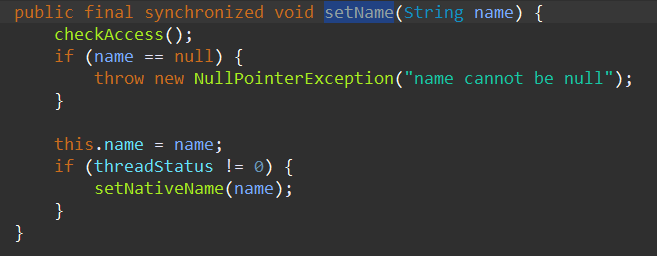

### java.lang.Runnable

```java
package java.lang;

@FunctionalInterface
public interface Runnable {
    public abstract void run();
}
```
我们去掉注释，不算空行，其实Runnable接口只有5行：

 1. 定义包名。
 2. 注解表明函数式接口。
 3. 定义接口名为Runnable。
 4. 定义抽象方法run()，返回值无。
 5. 类代码段结束。

## Java线程的生命周期

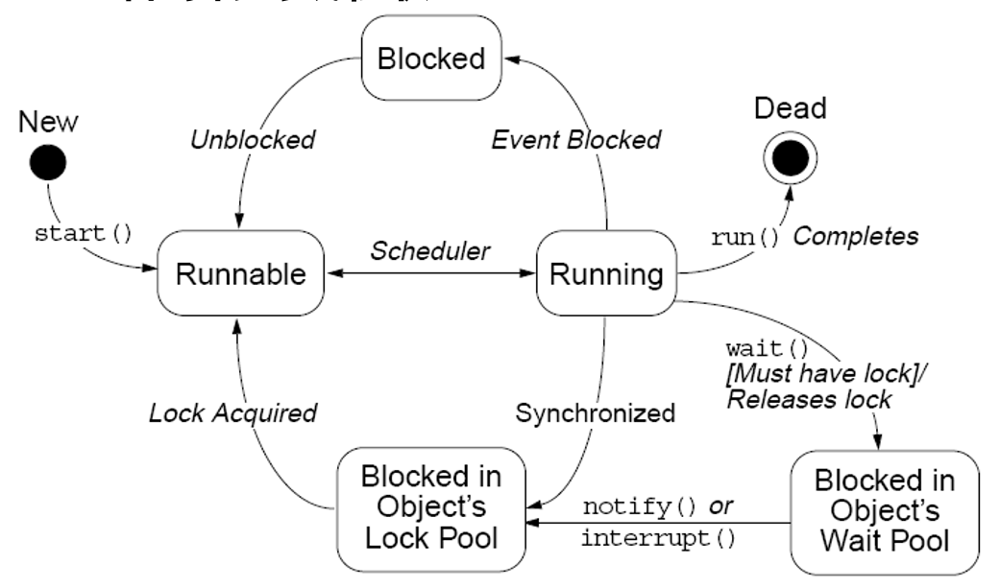
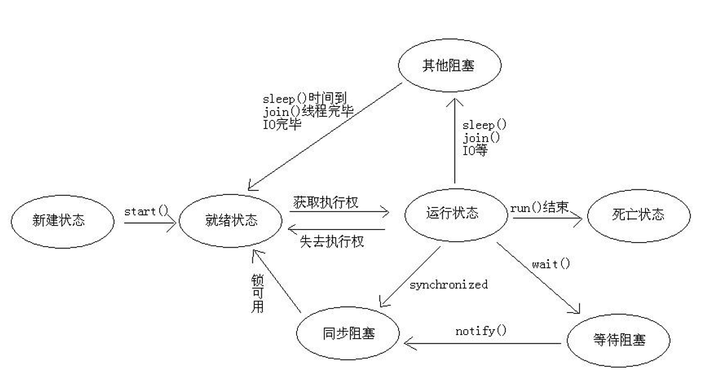

## Java线程的优先级

Java提供一个线程调度器来监控程序中启动后进入就绪状态的所有线程，线程调度器按照线程的优先级来决定应调度哪个线程来执行。

Java线程的优先级用1～10的整数来表示，越小则优先级越低。

Java的优先级是高度依赖于操作系统的实现的。

java.lang.Thread类有三个常量，表示常用的线程优先级： 
- Thread.MIN_PRIORITY       //1 
- Thread.NORM_PRIORITY   // 5 
- Thread.MAX_PRIORITY     // 10 

线程默认是NORM_PRIORITY，优先级为5，包括main()线程。
 
Java线程优先级方法：
- getPriority()：确定线程的优先级 
- setPriority()：设置线程的优先级 

## Java线程的启动

run()方法内是线程执行的代码段，但一定要记住：<font color="red">不是用run()启动线程，而是用start()启动。</font>

## Java线程的休眠

Java与线程休眠有关的方法有三个：
- **sleep()**
    - 让线程中止一段时间的静态方法。
    - Thread.sleep(long millis)：暂时停止执行millis毫秒。
    - 在睡眠期满的瞬间，再次调用该线程不一定会恢复它的执行，因为它很可能在等待队列中。
- **join()**
    - 导致当前线程等待，直到调用这个 join 方法的线程终止。
    - join( )
    - join(long millis)
    - join(long millis,int nanos) 
- **yield()** 
    - 为其他可运行的线程提供执行机会。
    - Thread.yield() 静态方法

## Java线程的终止

- 自动终止：一个线程完成执行后，不能再次运行。
- 手动终止：
  - stop()：已过时，基本不用。
  - interrupt()：粗暴的终止方式。
  - 可通过使用一个标志指示 run() 退出，从而终止线程。

## Java线程的同步

线程同步最简单的方法是使用**synchronized**关键词。

该关键词可以用于修饰变量或者方法。

- synchronized修饰变量：
  ```java
  synchronized (obj）{
      // 需要被同步的代码  
  } 
  ```
- synchronized修饰方法：
  ```java
  public synchronized void function(){
      //同步方法的内容
  } 
  ```

### synchronized与互斥锁

在Java语言中，引入了对象互斥锁的概念，来保证**共享数据操作的完整性**。
- 每个对象都对应于一个可称为“互斥锁”的标记，这个标记用来保证<font color="red">在任一时刻，只能有一个线程访问该对象</font>。
- 关键字synchronized来与对象的互斥锁联系。当某个对象用synchronized修饰时，表明该对象在任一时刻只能由一个线程访问。
- 同步的局限性：导致程序的执行效率要降低。
- 同步方法（非静态的）的锁为this。
- 同步方法（静态的）的锁为当前类本身。

### private与synchronized修饰的变量

受到synchronized保护的程序代码块和方法中，要访问的对象属性必须设定为private，因为如果不设定为private，那么就可以用不同的方式来访问它，这样就达不到保护的效果了。

### synchronized两种同步方式的优缺点

synchronized两种同步方式包括synchronized方法、synchronized代码块。
- **synchronized方法**
    - **优点：**
      - 可以显示的知道哪些方法是被synchronized关键字保护的。
    - **缺点：**
        - 方法中有些内容是不需要同步的，如果该方法执行会花很长时间，那么其他人就要花较多时间等待锁被归还。
        - 只能取得自己对象的锁，有时候程序设计的需求，可能会需要取得其他对象的锁。
- **synchronized代码块**
    - **优点：**
        - 可以针对某段程序代码同步，不需要浪费时间在别的程序代码上。
        - 可以取得不同对象的锁。
    -  **缺点：**
        - 无法显示的得知哪些方法是被synchronized关键字保护的。

## Java线程的死锁

死锁：两个线程，彼此在等待对方释放其持有的锁，而陷入无线等待。

推荐阅读：[死锁](https://blankspace.blog.csdn.net/article/details/115462223)

**锁的归还几种方式：** 
- 基本上执行完同步的程序代码后，锁就会自动归还。
- 用break语句跳出同步的语句块，不过这对于写在方法声明的synchronized没有作用。
- 遇到return语句。
- 遇到异常。
