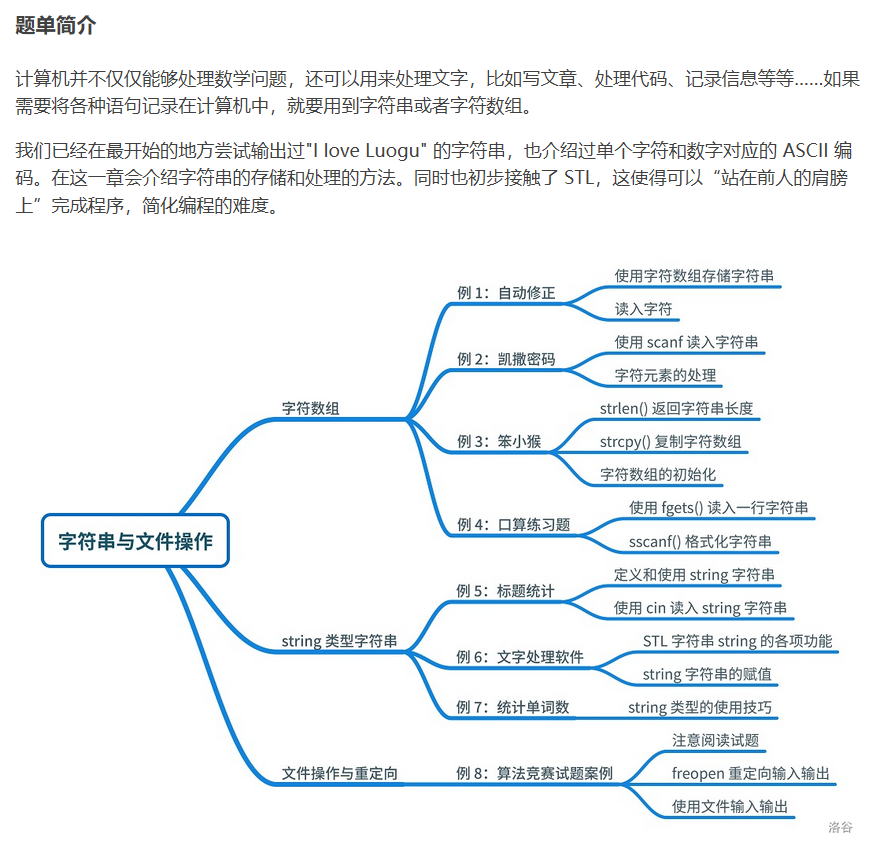

---
title: 字符串题单
date: 2020-05-02 01:10:49
summary: 本文通过洛谷字符串题单，分享字符串相关程序设计的一些技巧和心得。
mathjax: true
tags:
- 程序设计
categories:
- 程序设计
---

# 题单简介



# P5733 自动修正

## 题目描述

大家都知道一些办公软件有自动将字母转换为大写的功能。输入一个长度不超过 $100$ 且不包括空格的字符串。要求将该字符串中的所有小写字母变成大写字母并输出。

## 输入格式

输入一行，一个字符串。

## 输出格式

输出一个字符串，即将原字符串中的所有小写字母转化为大写字母。

## 样例 #1

### 样例输入 #1

```
Luogu4!
```

### 样例输出 #1

```
LUOGU4!
```

## 程序设计

略

## 实现代码

```java
import java.util.Scanner;

public class Main {
    public static void main(String[] args) {
        Scanner scanner = new Scanner(System.in);
        String str = scanner.nextLine();
        String str2 = str.toUpperCase();
        System.out.println(str2);
        scanner.close();
    }
}
```

## 代码提交

[洛谷 P5733 自动修正](https://www.luogu.com.cn/problem/P5733)

# P1914 小书童——凯撒密码

## 题目背景

某蒟蒻迷上了 “小书童”，有一天登陆时忘记密码了（他没绑定邮箱 or 手机），于是便把问题抛给了神犇你。

## 题目描述

蒟蒻虽然忘记密码，但他还记得密码是由一个字符串组成。密码是由原文字符串（由不超过 50 个小写字母组成）中每个字母向后移动 $n$ 位形成的。`z` 的下一个字母是 `a`，如此循环。他现在找到了移动前的原文字符串及 $n$，请你求出密码。

## 输入格式

第一行：$n$。第二行：未移动前的一串字母。

## 输出格式

一行，是此蒟蒻的密码。

## 样例 #1

### 样例输入 #1

```
1
qwe
```

### 样例输出 #1

```
rxf
```

## 提示

字符串长度 $\le 50$。

## 程序设计

略

## 实现代码

```java
import java.util.Scanner;

public class Main {
    public static void main(String[] args) {
        Scanner scanner = new Scanner(System.in);
        int num = Integer.parseInt(scanner.nextLine());
        char[] password_array = scanner.nextLine().toCharArray();
        for (int i = 0; i < password_array.length; i++) {
            password_array[i] = (char)((password_array[i] - 'a' + num) % 26 + 'a');
        }
        System.out.println(new String(password_array));
        scanner.close();
    }
}
```

## 代码提交

[洛谷 P1914 小书童——凯撒密码](https://www.luogu.com.cn/problem/P1914)

# P1125 笨小猴

## 题目描述

笨小猴的词汇量很小，所以每次做英语选择题的时候都很头疼。但是他找到了一种方法，经试验证明，用这种方法去选择选项的时候选对的几率非常大！

这种方法的具体描述如下：假设 $\text{maxn}$ 是单词中出现次数最多的字母的出现次数，$\text{minn}$ 是单词中出现次数最少的字母的出现次数，如果 $\text{maxn}-\text{minn}$ 是一个质数，那么笨小猴就认为这是个 Lucky Word，这样的单词很可能就是正确的答案。

## 输入格式

一个单词，其中只可能出现小写字母，并且长度小于 $100$。

## 输出格式

共两行，第一行是一个字符串，假设输入的的单词是 Lucky Word，那么输出 `Lucky Word`，否则输出 `No Answer`；

第二行是一个整数，如果输入单词是 `Lucky Word`，输出 $\text{maxn}-\text{minn}$ 的值，否则输出 $0$。

## 样例 #1

### 样例输入 #1

```
error
```

### 样例输出 #1

```
Lucky Word
2
```

## 样例 #2

### 样例输入 #2

```
olympic
```

### 样例输出 #2

```
No Answer
0
```

## 提示

【输入输出样例 1 解释】

单词 `error` 中出现最多的字母 $\texttt r$ 出现了 $3$ 次，出现次数最少的字母出现了 $1$ 次，$3-1=2$，$2$ 是质数。

【输入输出样例 2 解释】

单词 `olympic` 中出现最多的字母 $\texttt i$ 出现了 $1$ 次，出现次数最少的字母出现了 $1$ 次，$1-1=0$，$0$ 不是质数。

（本处原题面错误已经修正）

noip2008 提高第一题

## 程序设计

略

## 实现代码

```java
import java.util.Arrays;
import java.util.Scanner;

public class Main {
    public static void main(String[] args) {
        int[] count = new int[26];
        Scanner scanner = new Scanner(System.in);
        String word = scanner.nextLine();
        scanner.close();
        for (char c : word.toCharArray()) {
            count[c-'a']++;
        }
        Arrays.sort(count);
        int num = 0;
        for (int i = 0; i < 26; i++) {
            if (count[i] != 0) {
                num = count[25]-count[i];
                break;
            }
        }
        if (num == 0 || num == 1) {
            System.out.println("No Answer\n0");
            return;
        }
        for (int i = 2; i < num; i++) {
            if (num % i == 0) {
                System.out.println("No Answer\n0");
                return;
            }
        }
        System.out.println("Lucky Word");
        System.out.println(num);
    }
}
```

## 代码提交

[洛谷 P1125 笨小猴](https://www.luogu.com.cn/problem/P1125)

# P1957 口算练习题

## 题目描述

王老师正在教简单算术运算。细心的王老师收集了i道学生经常做错的口算题，并且想整理编写成一份练习。 编排这些题目是一件繁琐的事情，为此他想用计算机程序来提高工作效率。王老师希望尽量减少输入的工作量，比如 $\texttt{5+8}$ 的算式最好只要输入 $\texttt 5$ 和 $\texttt 8$，输出的结果要尽量详细以方便后期排版的使用，比如对于上述输入进行处理后输出 $\texttt{5+8=13}$ 以及该算式的总长度 $6$。王老师把这个光荣的任务交给你，请你帮他编程实现以上功能。

## 输入格式

第一行为数值 $i$

接着的 $i$ 行为需要输入的算式，每行可能有三个数据或两个数据。

若该行为三个数据则第一个数据表示运算类型，$\texttt a$ 表示加法运算，$\texttt b$ 表示减法运算，$\texttt c$ 表示乘法运算，接着的两个数据表示参加运算的运算数。

若该行为两个数据，则表示本题的运算类型与上一题的运算类型相同，而这两个数据为运算数。

## 输出格式

输出 $2\times i$ 行。对于每个输入的算式，输出完整的运算式及结果，第二行输出该运算式的总长度

## 样例 #1

### 样例输入 #1

```
4
a 64 46
275 125
c 11 99
b 46 64
```

### 样例输出 #1

```
64+46=110
9
275+125=400
11
11*99=1089
10
46-64=-18
9
```

## 提示

数据规模与约定

对于 $50\%$ 的数据，输入的算式都有三个数据，第一个算式一定有三个数据。

对于所有数据，$0<i\leq 50$，运算数为非负整数且小于 $10000$。

## 程序设计

略

## 实现代码

```java
import java.util.Scanner;

public class Main {
    public static void main(String[] args) {
        Scanner scanner = new Scanner(System.in);
        int num = Integer.parseInt(scanner.nextLine());
        String character = "";
        for (int i = 0; i < num; i++) {
            String line = scanner.nextLine(), result = "";
            String[] array = line.split("\\s+");
            int a, b;
            if (line.startsWith("a")) {
                character = "a";
                a = Integer.parseInt(array[1]);
                b = Integer.parseInt(array[2]);
            } else if (line.startsWith("b")) {
                character = "b";
                a = Integer.parseInt(array[1]);
                b = Integer.parseInt(array[2]);
            } else if (line.startsWith("c")) {
                character = "c";
                a = Integer.parseInt(array[1]);
                b = Integer.parseInt(array[2]);
            } else {
                a = Integer.parseInt(array[0]);
                b = Integer.parseInt(array[1]);
            }
            switch (character) {
                case "a":
                    result = a + "+" + b + "=" + (a+b);
                    break;
                case "b":
                    result = a + "-" + b + "=" + (a-b);
                    break;
                case "c" :
                    result = a + "*" + b + "=" + (a*b);
                    break;
            }
            System.out.println(result + "\n" + result.length());
        }
        scanner.close();
    }
}
```

## 代码提交

[洛谷 P1957 口算练习题](https://www.luogu.com.cn/problem/P1957)

# P5015 标题统计

## 题目描述

凯凯刚写了一篇美妙的作文，请问这篇作文的标题中有多少个字符？   注意：标题中可能包含大、小写英文字母、数字字符、空格和换行符。统计标题字 符数时，空格和换行符不计算在内。

## 输入格式

输入文件只有一行，一个字符串 $s$。

## 输出格式

输出文件只有一行，包含一个整数，即作文标题的字符数（不含空格和换行符）。

## 样例 #1

### 样例输入 #1

```
234
```

### 样例输出 #1

```
3
```

## 样例 #2

### 样例输入 #2

```
Ca 45
```

### 样例输出 #2

```
4
```

## 提示

【输入输出样例 1 说明】   
标题中共有 3 个字符，这 3 个字符都是数字字符。   

【输入输出样例 2 说明】 标题中共有$ 5$ 个字符，包括 $1$ 个大写英文字母， $1$ 个小写英文字母和 $2$ 个数字字符， 还有 $1$ 个空格。由于空格不计入结果中，故标题的有效字符数为 $4$ 个。   

【数据规模与约定】  
规定 $|s|$ 表示字符串 $s$ 的长度（即字符串中的字符和空格数）。    
对于 $40\%$ 的数据，$1 ≤ |s| ≤ 5$，保证输入为数字字符及行末换行符。   
对于 $80\%$ 的数据，$1 ≤ |s| ≤ 5$，输入只可能包含大、小写英文字母、数字字符及行末换行符。   
对于 $100\%$ 的数据，$1 ≤ |s| ≤ 5$，输入可能包含大、小写英文字母、数字字符、空格和行末换行符。

## 程序设计

略

## 实现代码

```java
import java.util.Scanner;

public class Main {
    public static void main(String[] args) {
        Scanner scanner = new Scanner(System.in);
        System.out.println(scanner.nextLine().replaceAll("\\s+", "").length());
        scanner.close();
    }
}
```

## 代码提交

[洛谷 P5015 标题统计](https://www.luogu.com.cn/problem/P5015)

# P5734 文字处理软件

## 题目描述

你需要开发一款文字处理软件。最开始时输入一个字符串作为初始文档。可以认为文档开头是第 $0$ 个字符。需要支持以下操作：

- `1 str`：后接插入，在文档后面插入字符串 $\texttt{str}$，并输出文档的字符串。

- `2 a b`：截取文档部分，只保留文档中从第 $a$ 个字符起 $b$ 个字符，并输出文档的字符串。

- `3 a str`：插入片段，在文档中第 $a$ 个字符前面插入字符串 $\texttt{str}$，并输出文档的字符串。

- `4 str`：查找子串，查找字符串 $\texttt{str}$ 在文档中最先的位置并输出；如果找不到输出 $-1$。

为了简化问题，规定初始的文档和每次操作中的 $\texttt{str}$ 都不含有空格或换行。最多会有 $q$ 次操作。

## 输入格式

第一行输入一个正整数 $q$，表示操作次数。

第二行输入一个字符串 $\texttt{str}$，表示最开始的字符串。

第三行开始，往下 $q$ 行，每行表示一个操作，操作如题目描述所示。

## 输出格式

一共输出 $n$ 行。

对于每个操作 $1,2,3$，根据操作的要求输出一个字符串。

对于操作 $4$，根据操作的要求输出一个整数。

## 样例 #1

### 样例输入 #1

```
4
ILove
1 Luogu
2 5 5
3 3 guGugu
4 gu
```

### 样例输出 #1

```
ILoveLuogu
Luogu
LuoguGugugu
3
```

## 提示

数据保证，$1 \leq q\le 100$，开始的字符串长度 $\leq 100$。

## 程序设计

略

## 实现代码

```java
import java.util.Scanner;

public class Main {

    private static String doc = "";

    private static void append(String append_doc) {
        doc = doc + append_doc;
    }

    private static void cut(int from, int range) {
        doc = doc.substring(from, from+range);
    }

    private static void insert(int from, String insert_doc) {
        String head = doc.substring(0, from);
        String rear = doc.substring(from);
        doc = head + insert_doc + rear;
    }

    private static int search(String search_key) {
        return doc.indexOf(search_key);
    }

    private static String getResult(String command) {
        String[] arr = command.split(" ");
        if (command.startsWith("1")) {
            append(arr[1]);
            return doc;
        } else if (command.startsWith("2")) {
            cut(Integer.parseInt(arr[1]), Integer.parseInt(arr[2]));
            return doc;
        } else if (command.startsWith("3")) {
            insert(Integer.parseInt(arr[1]), arr[2]);
            return doc;
        } else {
            return Integer.toString(search(arr[1]));
        }
    }

    public static void main(String[] args) {
        Scanner scanner = new Scanner(System.in);
        int num = Integer.parseInt(scanner.nextLine());
        doc = scanner.nextLine();
        String[] result = new String[num];
        for (int i = 0; i < num; i++) {
            result[i] = getResult(scanner.nextLine());
        }
        scanner.close();
        for (String s : result) {
            System.out.println(s);
        }
    }

}
```

## 代码提交

[洛谷 P5734 文字处理软件](https://www.luogu.com.cn/problem/P5734)

# P1308 统计单词数

## 题目描述

一般的文本编辑器都有查找单词的功能，该功能可以快速定位特定单词在文章中的位置，有的还能统计出特定单词在文章中出现的次数。

现在，请你编程实现这一功能，具体要求是：给定一个单词，请你输出它在给定的文章中出现的次数和第一次出现的位置。注意：匹配单词时，不区分大小写，但要求完全匹配，即给定单词必须与文章中的某一独立单词在不区分大小写的情况下完全相同（参见样例 1），如果给定单词仅是文章中某一单词的一部分则不算匹配（参见样例 2）。

## 输入格式

共 $2$ 行。

第 $1$ 行为一个字符串，其中只含字母，表示给定单词；

第 $2$ 行为一个字符串，其中只可能包含字母和空格，表示给定的文章。

## 输出格式

一行，如果在文章中找到给定单词则输出两个整数，两个整数之间用一个空格隔开，分别是单词在文章中出现的次数和第一次出现的位置（即在文章中第一次出现时，单词首字母在文章中的位置，位置从 $0$ 开始）；如果单词在文章中没有出现，则直接输出一个整数 $-1$。

## 样例 #1

### 样例输入 #1

```
To
to be or not to be is a question
```

### 样例输出 #1

```
2 0
```

## 样例 #2

### 样例输入 #2

```
to
Did the Ottoman Empire lose its power at that time
```

### 样例输出 #2

```
-1
```

## 提示

数据范围

$1\leq$ 第一行单词长度 $\leq10$。

$1\leq$ 文章长度 $\leq10^6$。

noip2011 普及组第 2 题

## 程序设计

略

## 实现代码

```java
import java.util.Scanner;

public class Main {
    public static void main(String[] args) {
        Scanner scanner = new Scanner(System.in);
        String pattern = scanner.nextLine().toUpperCase(), text = scanner.nextLine().toUpperCase();
        int length = pattern.length(), counter = 0, firstIndex = -1, tempIndex = -1;
        boolean endFlag = false;
        if (text.startsWith(pattern + " ")) {
            counter++;
            firstIndex = 0;
            pattern = " " + pattern + " ";
            tempIndex = text.indexOf(pattern);
        }
        if (text.endsWith(" " + pattern)) {
            counter++;
            endFlag = true;
        }
        pattern = " " + pattern + " ";
        if (counter == 0) {
            firstIndex = tempIndex = text.indexOf(pattern);
        }
        while (tempIndex != -1) {
            tempIndex = text.indexOf(pattern, tempIndex+length);
            counter++;
        }
        if (firstIndex == -1) {
            if (endFlag) {
                System.out.println(1 + " " + (text.length()-1));
            } else {
                System.out.println(-1);
            }
        } else {
            System.out.println(counter + " " + (firstIndex+1));
        }
        scanner.close();
    }
}
```

## 代码提交

[洛谷 P1308 统计单词数](https://www.luogu.com.cn/problem/P1308)

# P1765 手机

## 题目描述

一般的手机的键盘是这样的：


要按出英文字母就必须要按数字键多下。例如要按出 `x` 就得按 9 两下，第一下会出 `w`，而第二下会把 `w` 变成 `x`。0 键按一下会出一个空格。

你的任务是读取若干句只包含英文小写字母和空格的句子，求出要在手机上打出这个句子至少需要按多少下键盘。

## 输入格式

一行句子，只包含英文小写字母和空格，且不超过 200 个字符。

## 输出格式

一行一个整数，表示按键盘的总次数。

## 样例 #1

### 样例输入 #1

```
i have a dream
```

### 样例输出 #1

```
23
```

## 提示

NOI 导刊 2010 普及（10）

## 程序设计

略

## 实现代码

```java
import java.util.HashMap;
import java.util.Map;
import java.util.Scanner;

public class Main {
    public static void main(String[] args) {
        Map<Character, Integer> map = new HashMap<>(32);
        map.put('a', 1);
        map.put('b', 2);
        map.put('c', 3);
        map.put('d', 1);
        map.put('e', 2);
        map.put('f', 3);
        map.put('g', 1);
        map.put('h', 2);
        map.put('i', 3);
        map.put('j', 1);
        map.put('k', 2);
        map.put('l', 3);
        map.put('m', 1);
        map.put('n', 2);
        map.put('o', 3);
        map.put('p', 1);
        map.put('q', 2);
        map.put('r', 3);
        map.put('s', 4);
        map.put('t', 1);
        map.put('u', 2);
        map.put('v', 3);
        map.put('w', 1);
        map.put('x', 2);
        map.put('y', 3);
        map.put('z', 4);
        map.put(' ', 1);
        Scanner scanner = new Scanner(System.in);
        String line = scanner.nextLine();
        scanner.close();
        char[] chars = line.toCharArray();
        int counter = 0;
        for (char c : chars) {
            counter += map.get(c);
        }
        System.out.println(counter);
    }
}
```

## 代码提交

[洛谷 P1765 手机](https://www.luogu.com.cn/problem/P1765)

# P3741 honoka的键盘

## 题目背景

honoka 有一个只有两个键的键盘。

## 题目描述

一天，她打出了一个只有这两个字符的字符串。当这个字符串里含有 `VK` 这个字符串的时候，honoka 就特别喜欢这个字符串。所以，她想改变至多一个字符（或者不做任何改变）来最大化这个字符串内 `VK` 出现的次数。给出原来的字符串，请计算她最多能使这个字符串内出现多少次 `VK`（只有当 `V` 和 `K` 正好相邻时，我们认为出现了 `VK`。）

## 输入格式

第一行给出一个数字 $n$，代表字符串的长度。

第二行给出一个字符串 $s$。

## 输出格式

第一行输出一个整数代表所求答案。

## 样例 #1

### 样例输入 #1

```
2
VK
```

### 样例输出 #1

```
1
```

## 样例 #2

### 样例输入 #2

```
2
VV
```

### 样例输出 #2

```
1
```

## 样例 #3

### 样例输入 #3

```
1
V
```

### 样例输出 #3

```
0
```

## 样例 #4

### 样例输入 #4

```
20
VKKKKKKKKKVVVVVVVVVK
```

### 样例输出 #4

```
3
```

## 样例 #5

### 样例输入 #5

```
4
KVKV
```

### 样例输出 #5

```
1
```

## 提示

对于 $100\%$ 的数据，$1\le n\le 100$。

## 程序设计

略

## 实现代码

```java
import java.util.Scanner;

public class Main {
    public static void main(String[] args) {
        Scanner scanner = new Scanner(System.in);
        int num = Integer.parseInt(scanner.nextLine()), counter = 0;
        String string = scanner.nextLine();
        scanner.close();
        while (string.contains("VK")) {
            string = string.replaceFirst("VK", "XX");
            counter++;
        }
        if (string.contains("VV") || string.contains("KK")) {
            counter++;
        }
        System.out.println(counter);
    }
}
```

## 代码提交

[洛谷 P3741 honoka的键盘](https://www.luogu.com.cn/problem/P3741)

# P1321 单词覆盖还原

## 题目描述

一个长度为 $l$ 的字符串中被反复贴有 `boy` 和 `girl` 两单词，后贴上的可能覆盖已贴上的单词（没有被覆盖的用句点表示），最终每个单词至少有一个字符没有被覆盖。问贴有几个 `boy` 几个 `girl`？

## 输入格式

一行被被反复贴有 `boy` 和 `girl` 两单词的字符串。

## 输出格式

两行，两个整数。第一行为 `boy` 的个数，第二行为 `girl` 的个数。

## 样例 #1

### 样例输入 #1

```
......boyogirlyy......girl.......
```

### 样例输出 #1

```
4
2
```

## 提示

数据保证，$3\le l\le255$，字符串仅仅包含如下字符：$\texttt{.bgilory}$。

## 程序设计

拿boy举例

因为是覆盖的，所以如果是b就一定有一个boy

如果是o，就要分两种情况：
1. 前面是b，那就是同一个单词
2. 前面不是b，那就是被覆盖的单词， 是另一个单词，即另一个boy

y同理，如果前面是o ，那就是同一个单词，若果不是o ，就是另一个单词。

girl也是一样~

## 实现代码

```java
import java.util.Scanner;

public class Main {
    public static void main(String[] args) {
        Scanner scanner = new Scanner(System.in);
        String str = scanner.nextLine();
        char[] chars = str.toCharArray();
        int boyCount = 0, girlCount = 0;
        for(int i = 0; i < str.length(); i++){
            if(chars[i] == 'b') {
                boyCount++;
            } else if(chars[i] == 'o' && chars[i-1] != 'b') {
                boyCount++;
            } else if(chars[i] == 'y' && chars[i-1] != 'o') {
                boyCount++;
            } else if(chars[i] == 'g'){
                girlCount++;
            } else if(chars[i] == 'i' && chars[i-1] != 'g'){
                girlCount++;
            } else if(chars[i] == 'r' && chars[i-1] != 'i') {
                girlCount++;
            } else if(chars[i] == 'l' && chars[i-1] != 'r') {
                girlCount++;
            }
        }
        System.out.println(boyCount);
        System.out.println(girlCount);
        scanner.close();
    }
}
```

## 代码提交

[洛谷 P1321 单词覆盖还原](https://www.luogu.com.cn/problem/P1321)

# P1553 数字反转

## 题目背景

**以下为原题面，仅供参考:**

给定一个数，请将该数各个位上数字反转得到一个新数。

这次与 NOIp2011 普及组第一题不同的是：这个数可以是小数，分数，百分数，整数。整数反转是将所有数位对调；小数反转是把整数部分的数反转，再将小数部分的数反转，不交换整数部分与小数部分；分数反转是把分母的数反转，再把分子的数反转，不交换分子与分母；百分数的分子一定是整数，百分数只改变数字部分。整数新数也应满足整数的常见形式，即除非给定的原数为零，否则反转后得到的新数的最高位数字不应为零；小数新数的末尾不为 $0$（除非小数部分除了 $0$ 没有别的数，那么只保留1个 $0$）；分数不约分，分子和分母都不是小数（约分滴童鞋抱歉了，不能过哦。输入数据保证分母不为 $0$），本次没有负数。

## 题目描述

给定一个数，请将该数各个位上数字反转得到一个新数。

这次与 NOIp2011 普及组第一题不同的是：这个数可以是小数，分数，百分数，整数。

- 整数反转是将所有数位对调。

- 小数反转是把整数部分的数反转，再将小数部分的数反转，不交换整数部分与小数部分。

- 分数反转是把分母的数反转，再把分子的数反转，不交换分子与分母。

- 百分数的分子一定是整数，百分数只改变数字部分。

## 输入格式

一个实数 $s$

## 输出格式

一个实数，即 $s$ 的反转数

## 样例 #1

### 样例输入 #1

```
5087462
```

### 样例输出 #1

```
2647805
```

## 样例 #2

### 样例输入 #2

```
600.084
```

### 样例输出 #2

```
6.48
```

## 样例 #3

### 样例输入 #3

```
700/27
```

### 样例输出 #3

```
7/72
```

## 样例 #4

### 样例输入 #4

```
8670%
```

### 样例输出 #4

```
768%
```

## 提示

**【数据范围】**

- 对于 $25\%$ 的数据，$s$ 是整数，不大于 $20$ 位；
- 对于 $25\%$ 的数据，$s$ 是小数，整数部分和小数部分均不大于 $10$ 位；
- 对于 $25\%$ 的数据，$s$ 是分数，分子和分母均不大于 $10$ 位；
- 对于 $25\%$ 的数据，$s$ 是百分数，分子不大于 $19$ 位。

**【数据保证】**

- 对于整数翻转而言，整数原数和整数新数满足整数的常见形式，即除非给定的原数为零，否则反转后得到的新数和原来的数字的最高位数字不应为零。
- 对于小数翻转而言，其小数点前面部分同上，小数点后面部分的形式，保证满足小数的常见形式，也就是末尾没有多余的 $0$（小数部分除了 $0$ 没有别的数，那么只保留 $1$ 个 $0$。若反转之后末尾数字出现 $0$，请省略多余的 $0$）
- 对于分数翻转而言，分数不约分，分子和分母都不是小数。输入的分母不为 $0$。与整数翻转相关规定见上。
- 对于百分数翻转而言，见与整数翻转相关内容。

数据不存在负数。

## 程序设计

略

## 实现代码

```java
import java.util.Scanner;

public class Main {

    private static String reverse1(String num) {
        char[] chars = new StringBuilder(num).reverse().toString().toCharArray();
        int count = 0;
        while (count < chars.length && chars[count] == '0') {
            count++;
        }
        if (count >= chars.length) {
            return "0";
        }
        return new String(chars).substring(count);
    }

    private static String reverse2(String num) {
        char[] chars = new StringBuilder(num).reverse().toString().toCharArray();
        int count = chars.length-1;
        while (count >= 0 && chars[count] == '0') {
            count--;
        }
        if (count < 0) {
            return "0";
        }
        return new String(chars).substring(0, count+1);
    }

    public static void main(String[] args) {
        Scanner scanner = new Scanner(System.in);
        String num = scanner.nextLine();
        scanner.close();
        if (num.contains(".")) {
            // 小数
            String[] nums = num.split("\\.");
            System.out.println(reverse1(nums[0]) + "." + reverse2(nums[1]));
        } else if (num.contains("/")) {
            // 分数
            String[] nums = num.split("/");
            System.out.println(reverse1(nums[0]) + "/" + reverse1(nums[1]));
        } else if (num.endsWith("%")) {
            // 百分数
            System.out.println(reverse1(num.substring(0, num.length()-1)) + "%");
        } else {
            // 整数
            System.out.println(reverse1(num));
        }
    }

}
```

## 代码提交

[洛谷 P1553 数字反转](https://www.luogu.com.cn/problem/P1553)

# P1603 斯诺登的密码

## 题目背景

根据斯诺登事件出的一道水题

## 题目描述

2013 年 X 月 X 日，俄罗斯办理了斯诺登的护照，于是他混迹于一架开往委内瑞拉的飞机。但是，这件事情太不周密了，因为 FBI 的间谍早已获悉他的具体位置——但这不是最重要的——最重要的是如果要去委内瑞拉，那么就要经过古巴，而经过古巴的路在美国的掌控之中。

丧心病狂的奥巴马迫降斯诺登的飞机，搜查时却发现，斯诺登杳无踪迹。但是，在据说是斯诺登的座位上，发现了一张纸条。纸条由纯英文构成：`Obama is a two five zero.`（以 `.` 结束输出，只有 $6$ 个单词+一个句号，句子开头如没有大写亦为合法）这句话虽然有点无厘头，但是警官陈珺骛发现这是一条极其重要的线索。他在斯诺登截获的一台笔记本中找到了一个 C++ 程序，输入这条句子后立马给出了相对应的密码。陈珺鹜高兴得晕了过去，身为警官的你把字条和程序带上了飞机，准备飞往曼哈顿国际机场，但是在飞机上检查的时候发现——程序被粉碎了！飞机抵达华盛顿只剩 $5$ 分钟，你必须在这 $5$ 分钟内编写（杜撰）一个程序，免受上司的 $10000000000 \bmod 10$ 大板。破译密码的步骤如下：

（1）找出句子中所有用英文表示的数字 $(\leq 20)$，列举在下：

正规：`one two three four five six seven eight nine ten eleven twelve`
           `thirteen fourteen fifteen sixteen seventeen eighteen nineteen             twenty`

非正规：`a both another first second third`。为避免造成歧义，`another` 算作 $1$ 处理。

（2）将这些数字平方后对 $100$ 取模，如 $00,05,11,19,86,99$。

（3）把这些两位数按数位排成一行，组成一个新数，如果开头为 $0$，就去 $0$。

（4）找出所有排列方法中最小的一个数，即为密码。

// 数据已经修正 By absi2011 如果还有问题请联系我

## 输入格式

一个含有 $6$ 个单词的句子。

## 输出格式

一个整型变量（密码）。如果没有符合要求的数字出现，则输出 $0$。

## 样例 #1

### 样例输入 #1

```
Black Obama is two five zero .
```

### 样例输出 #1

```
425
```

## 程序设计

略

## 实现代码

```java
import java.util.*;

public class Main {
    public static void main(String[] args) {
        Map<String, String> map = new HashMap<>(20);
        map.put("one",       "01");
        map.put("a",         "01");
        map.put("two",       "04");
        map.put("three",     "09");
        map.put("four",      "16");
        map.put("five",      "25");
        map.put("six",       "36");
        map.put("seven",     "49");
        map.put("eight",     "64");
        map.put("nine",      "81");
        map.put("eleven",    "21");
        map.put("twelve",    "44");
        map.put("thirteen",  "69");
        map.put("fourteen",  "96");
        map.put("fifteen",   "25");
        map.put("sixteen",   "56");
        map.put("seventeen", "89");
        map.put("eighteen",  "24");
        map.put("nineteen",  "61");
        List<String> list = new ArrayList<>();
        Scanner scanner = new Scanner(System.in);
        String[] words = scanner.nextLine().trim().split("\\s+");
        scanner.close();
        for (String s : words) {
            if (map.containsKey(s)) {
                list.add(map.get(s));
            }
        }
        if (list.isEmpty()) {
            System.out.println(0);
        }
        StringBuilder str = new StringBuilder();
        list.sort(Comparator.naturalOrder());
        for (String s : list) {
            str.append(s);
        }
        String result = str.toString();
        if (result.startsWith("0")) {
            result = result.substring(1);
        }
        System.out.println(result);
    }
}
```

## 代码提交

[洛谷 P1603 斯诺登的密码](https://www.luogu.com.cn/problem/P1603)

# P1200 你的飞碟在这儿

## 题目描述

众所周知，在每一个彗星后都有一只 UFO。这些 UFO 时常来收集地球上的忠诚支持者。不幸的是，他们的飞碟每次出行都只能带上一组支持者。因此，他们要用一种聪明的方案让这些小组提前知道谁会被彗星带走。他们为每个彗星起了一个名字，通过这些名字来决定这个小组是不是被带走的那个特定的小组（你认为是谁给这些彗星取的名字呢？）。关于如何搭配的细节会在下面告诉你；你的任务是写一个程序，通过小组名和彗星名来决定这个小组是否能被那颗彗星后面的 UFO 带走。


小组名和彗星名都以下列方式转换成一个数字：最终的数字就是名字中所有字母的积，其中 $\texttt A$ 是 $1$，$\texttt Z$ 是 $26$。例如，$\texttt{USACO}$ 小组就是 $21 \times 19 \times 1 \times 3 \times 15=17955$。如果小组的数字 $\bmod 47$ 等于彗星的数字 $\bmod 47$,你就得告诉这个小组需要准备好被带走！（记住“$a \bmod b$”是 $a$ 除以 $b$ 的余数，例如 $34 \bmod 10$ 等于 $4$）


写出一个程序，读入彗星名和小组名并算出用上面的方案能否将两个名字搭配起来，如果能搭配，就输出 `GO`，否则输出 `STAY`。小组名和彗星名均是没有空格或标点的一串大写字母（不超过 $6$ 个字母）。

## 输入格式

第1行：一个长度为 $1$ 到 $6$ 的大写字母串，表示彗星的名字。

第2行：一个长度为 $1$ 到 $6$ 的大写字母串，表示队伍的名字。

## 输出格式

## 样例 #1

### 样例输入 #1

```
COMETQ
HVNGAT
```

### 样例输出 #1

```
GO
```

## 样例 #2

### 样例输入 #2

```
ABSTAR
USACO
```

### 样例输出 #2

```
STAY
```

## 提示

题目翻译来自 NOCOW。

USACO Training Section 1.1

## 程序设计

略

## 实现代码

```java
import java.util.Scanner;

public class Main {
    public static void main(String[] args) {
        Scanner scanner = new Scanner(System.in);
        String star = scanner.nextLine();
        String ufo = scanner.nextLine();
        char[] starArr = star.toCharArray();
        char[] ufoArr = ufo.toCharArray();
        int starInt = 1;
        for (char c : starArr) {
            starInt *= (c-64);
        }
        int ufoInt = 1;
        for (char c : ufoArr) {
            ufoInt *= (c-64);
        }
        if (starInt % 47 == ufoInt % 47) {
            System.out.println("GO");
        } else {
            System.out.println("STAY");
        }
        scanner.close();
    }
}
```

## 代码提交

[洛谷 P1200 你的飞碟在这儿](https://www.luogu.com.cn/problem/P1200)

# P1597 语句解析

## 题目背景

木有背景……

## 题目描述

一串长度不超过 $255$ 的 PASCAL 语言代码，只有 $a,b,c$ 三个变量，而且只有赋值语句，赋值只能是一个一位的数字或一个变量，每条赋值语句的格式是 `[变量]:=[变量或一位整数];`。未赋值的变量值为 $0$ 输出 $a,b,c$ 的值。

## 输入格式

一串符合语法的 PASCAL 语言，只有 $a,b,c$ 三个变量，而且只有赋值语句，赋值只能是一个一位的数字或一个变量，未赋值的变量值为 $0$。

## 输出格式

输出 $a,b,c$ 最终的值。

## 样例 #1

### 样例输入 #1

```
a:=3;b:=4;c:=5;
```

### 样例输出 #1

```
3 4 5
```

## 提示

输入的 PASCAL 语言长度不超过 $255$。

## 程序设计

略

## 实现代码

```java
import java.util.Scanner;

public class Main {

    private static String a = "0", b = "0", c = "0";

    private static void judgeHead(String head, String rear) {
        switch (head) {
            case "a":
                a = judgeRear(rear);
                break;
            case "b":
                b = judgeRear(rear);
                break;
            case "c":
                c = judgeRear(rear);
                break;
        }
    }

    private static String judgeRear(String rear) {
        switch (rear) {
            case "a":
                return a;
            case "b":
                return b;
            case "c":
                return c;
            default:
                return rear;
        }
    }

    public static void main(String[] args) {
        Scanner scanner = new Scanner(System.in);
        String[] array = scanner.nextLine().split(";");
        scanner.close();
        for (int i = 0; i < array.length; i++) {
            String[] temp = array[i].split(":=");
            judgeHead(temp[0], temp[1]);
        }
        System.out.println(a + " " + b + " " + c);
    }

}
```

## 代码提交

[洛谷 P1597 语句解析](https://www.luogu.com.cn/problem/P1597)

# P1598 垂直柱状图

## 题目描述

写一个程序从输入文件中去读取四行大写字母（全都是大写的，每行不超过 $100$ 个字符），然后用柱状图输出每个字符在输入文件中出现的次数。严格地按照输出样例来安排你的输出格式。

## 输入格式

四行字符，由大写字母组成，每行不超过 $100$ 个字符

## 输出格式

由若干行组成，前几行由空格和星号组成，最后一行则是由空格和字母组成的。在任何一行末尾不要打印不需要的多余空格。不要打印任何空行。

## 样例 #1

### 样例输入 #1

```
THE QUICK BROWN FOX JUMPED OVER THE LAZY DOG.
THIS IS AN EXAMPLE TO TEST FOR YOUR
HISTOGRAM PROGRAM.
HELLO!
```

### 样例输出 #1

```
*
                            *
        *                   *
        *                   *     *   *
        *                   *     *   *
*       *     *             *     *   *
*       *     * *     * *   *     * * *
*       *   * * *     * *   * *   * * * *
*     * * * * * *     * * * * *   * * * *     * *
* * * * * * * * * * * * * * * * * * * * * * * * * *
A B C D E F G H I J K L M N O P Q R S T U V W X Y Z
```

## 提示

每行输出后面不允许出现多余的空格。

## 程序设计

略

## 实现代码

```java
import java.util.Scanner;

public class Main {
    public static void main(String[] args) {
        Scanner scanner = new Scanner(System.in);
        int[] char_counter = new int[26];
        int max = 0;
        //统计数据
        for (int i = 0; i < 4; i++) {
            for (char c : scanner.nextLine().toCharArray()) {
                if (c >= 'A' && c <= 'Z') {
                    char_counter[c-'A']++;
                    int temp_counter = char_counter[c-'A'];
                    if (temp_counter > max) {
                        //置新最大数值
                        max = temp_counter;
                    }
                }
            }
        }
        scanner.close();
        //处理打印
        for (int i = max-1; i >= 0; i--) {
            StringBuilder builder = new StringBuilder();
            for (int j : char_counter) {
                if (j - i > 0) {
                    builder.append("* ");
                } else {
                    builder.append("  ");
                }
            }
            //去除尾部空格
            System.out.println(builder.substring(0, builder.length()-1));
        }
        System.out.println("A B C D E F G H I J K L M N O P Q R S T U V W X Y Z");
    }
}
```

## 代码提交

[洛谷 P1598 垂直柱状图](https://www.luogu.com.cn/problem/P1598)
