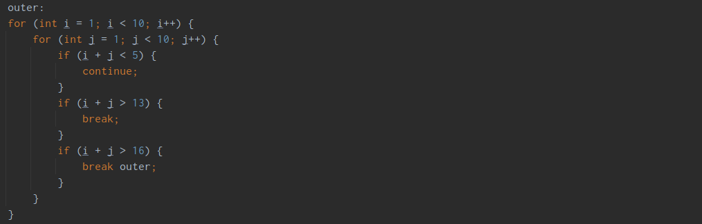
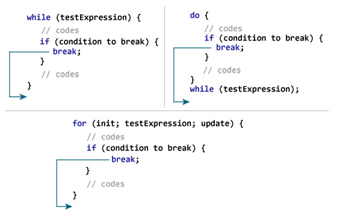
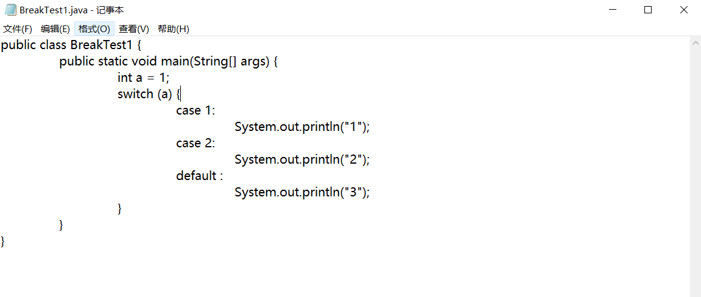
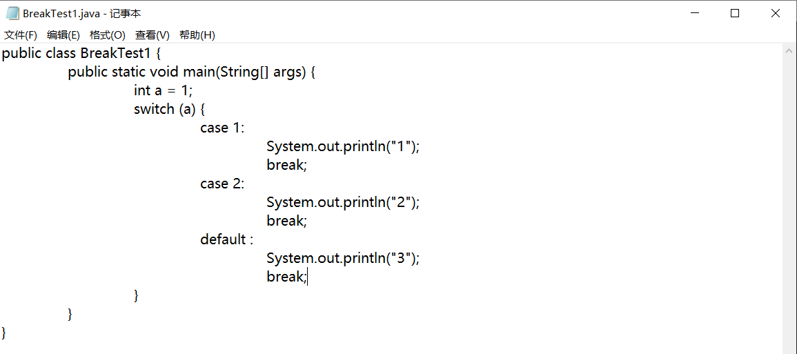
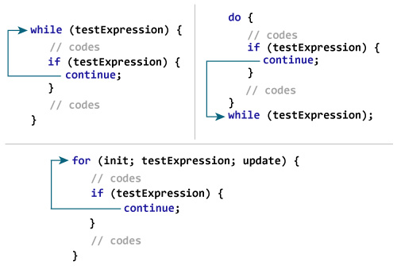
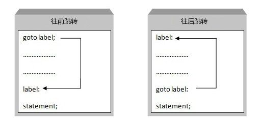

---
title: 循环控制语句
date: 2023-03-13 14:32:16
summary: 本文分享程序设计中循环结构的循环控制语句。
tags:
- 程序设计
categories:
- 程序设计
---

# 循环控制语句

程序的三种基本结构是顺序结构、选择结构、循环结构。

常见编程语言的循环结构：
- 单层循环
    - for循环
    - for...each循环
    - while循环
    - do...while循环
- 嵌套循环

循环控制语句包括break语句、continue语句、goto语句。
- `break`语句：终止循环或switch语句，程序流将继续执行紧接着循环或switch的下一条语句。
- `continue`语句：告诉一个循环体立刻停止本次循环迭代，重新开始下次循环迭代。
- `goto`语句：将控制转移到被标记的语句。但是不建议在程序中使用goto语句。



## break语句

break有两种用法：
- 当break语句出现在一个循环内时，循环会立即终止，且程序流将继续执行紧接着循环的下一条语句。
- break语句可用于终止switch语句中的一个case，否则会继续执行下去。



对于嵌套循环，内层循环的break语句会停止执行最内层的循环，然后开始执行该块之后的下一行代码。如果想直接跳出外层循环，可以参考goto的用法或采用与其等效的方法。

break语句用法示例：
```java
for (int i = 1; i < 10; i++) {
    if (i > 5) {
        break;
    }
}
```

不使用break会导致switch语句的继续执行，这往往不是我们所期待的。
对于下图中的代码：


输出结果是：
1
2
3

上图的代码段相当于：

```java
switch (a) {
    case 1:
    case 2:
    defalut:
        System.out.println("1");
        System.out.println("2");
        System.out.println("3");
}
```

正确的写法是：



`for(;;)`和`while(true)`结构都是没预置循环退出条件的循环语句，如果没有内置任何`return`语句或`break`语句容易造成无限循环。
对于下面的代码：
```java
Scanner scanner = new Scanner(System.in);
String a = scanner.nextLine();
int a = Integer.parseInt(a);
for (;;) {
	if (a == 1) {
		// do something
	} else if (a == 2) {
		// do something
	} else {
		// do something (但是此时应该退出，没有使用break)
	}
}
```
由于没有break语句，因此成为无限循环无法退出。

多层循环中，break只会跳出所属最内层循环：
```java
public class BreakTest2 {
	public static void main(String[] args) {
		List<String> strList = new ArrayList<>();
		strList.add("a");
		strList.add("b");
		strList.add("c");
		for (String s : strList) {
			for (int i = 0; i < 2; i++) {
				System.out.println(i);
				if ("b".equals(s)) {
					break;
				}
			}
		}
	}
}
```

想要解决此问题，要么采用布尔值作为旗标变量，要么采用Java支持的循环标签。
```java
public class BreakTest2 {
	public static void main(String[] args) {
		List<String> strList = new ArrayList<>();
		strList.add("a");
		strList.add("b");
		strList.add("c");
		outer:
		for (String s : strList) {
			for (int i = 0; i < 2; i++) {
				System.out.println(i);
				if ("b".equals(s)) {
					break outer;
				}
			}
		}
	}
}
```

## continue语句

continue语句会跳过当前循环中的代码，强迫开始下一次循环。



## goto语句

C语言中的goto语句允许把控制无条件转移到同一函数内的被标记的语句。



事实上，在任何编程语言中，都不建议使用goto语句。因为它使得程序的控制流难以跟踪，使程序难以理解和难以修改。任何使用goto语句的程序可以改写成不需要使用goto语句的写法。

Java等语言选择不支持goto语句，不过Java还是将goto设置为了一个没有实际意义的关键词保留下来。

此外，Java还有一个goto的变体语法糖，即 break label。

通常，实现跳出外层循环需要这样写：
```java
boolean flag = false;
for (int i = 1; i < 10 && !flag; i++) {
    for (int j = 1; j < 10; j++) {
        if (i + j > 15) {
            flag = true;
            break;
        }
    }
}
```

不过，也可以简化为：
```java
outer:
for (int i = 1; i < 10; i++) {
    for (int j = 1; j < 10; j++) {
        if (i + j > 15) {
            break outer;
        }
    }
}
```

如此，可以直接跳出内层循环和外层循环。
