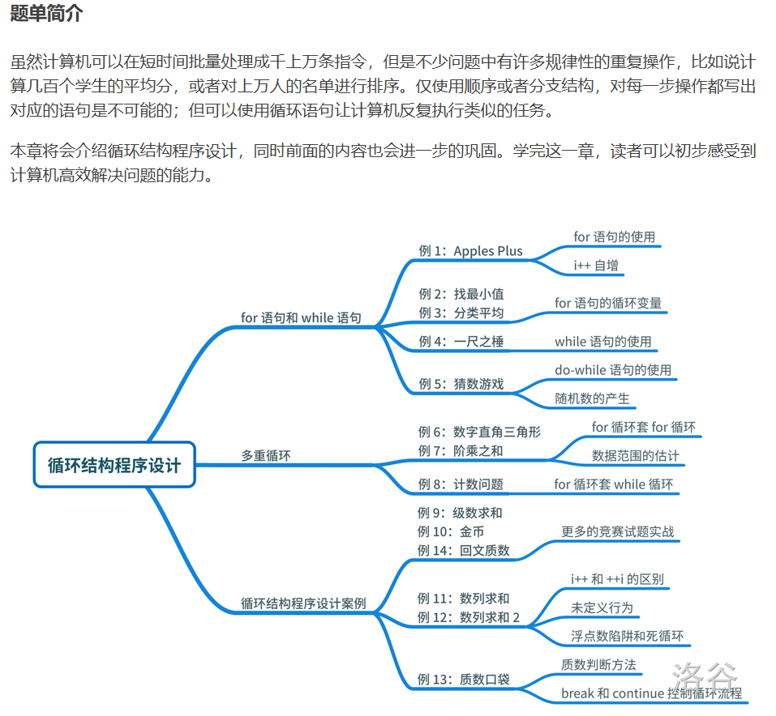

---
title: 循环结构
date: 2020-05-02 01:11:18
summary: 本文通过洛谷循环结构题单，分享循环结构程序设计的一些技巧和心得。
mathjax: true
tags:
- 程序设计
categories:
- 程序设计
---

# 题单简介



# P5718 找最小值

## 题目描述

给出 $n$ 和 $n$ 个整数 $a_i$，求这 $n$ 个整数中最小值是什么。

## 输入格式

第一行输入一个正整数 $n$，表示数字个数。

第二行输入 $n$ 个非负整数，表示 $a_1,a_2 \dots a_n$，以空格隔开。

## 输出格式

输出一个非负整数，表示这 $n$ 个非负整数中的最小值。

## 样例 #1

### 样例输入 #1

```
8
1 9 2 6 0 8 1 7
```

### 样例输出 #1

```
0
```

## 提示

数据保证，$n\le100$ 且 $0\le a_i \le 1000$。

## 程序设计

略

## 实现代码

```java
import java.util.Scanner;

public class Main {
    public static void main(String[] args) {
        Scanner scanner = new Scanner(System.in);
        int num = scanner.nextInt(), min = scanner.nextInt();
        for (int i = 1; i < num; i++) {
            int temp = scanner.nextInt();
            if (temp < min) {
                min = temp;
            }
        }
        scanner.close();
        System.out.println(min);
    }
}
```

## 代码提交

[洛谷 P5718 找最小值](https://www.luogu.com.cn/problem/P5718)

# P5719 分类平均

## 题目描述

给定 $n$ 和 $k$，将从 1 到 $n$ 之间的所有正整数可以分为两类：A 类数可以被 $k$ 整除（也就是说是 $k$ 的倍数），而 B 类数不能。请输出这两类数的平均数，精确到小数点后 $1$ 位，用空格隔开。

数据保证两类数的个数都不会是 $0$。

## 输入格式

输入两个正整数 $n$ 与 $k$。

## 输出格式

输出一行，两个实数，分别表示 A 类数与 B 类数的平均数。精确到小数点后一位。

## 样例 #1

### 样例输入 #1

```
100 16
```

### 样例输出 #1

```
56.0 50.1
```

## 提示

数据保证，$1 \leq n\leq 10000$，$1 \leq k \leq 100$。

## 程序设计

略

## 实现代码

```java
import java.util.Scanner;

public class Main {
    public static void main(String[] args) {
        Scanner scanner = new Scanner(System.in);
        int n = scanner.nextInt(), k = scanner.nextInt(), counter1 = 0, counter2 = 0, sum1 = 0, sum2 = 0;
        for (int i = 1; i <= n; i++) {
            if (i % k == 0) {
                counter1++;
                sum1 += i;
            } else {
                counter2++;
                sum2 += i;
            }
        }
        scanner.close();
        System.out.printf("%.1f %.1f", ((double)sum1/counter1), ((double)sum2/counter2));
    }
}
```

## 代码提交

[洛谷 P5719 分类平均](https://www.luogu.com.cn/problem/P5719)

# P5720 一尺之棰

## 题目描述

《庄子》中说到，“一尺之棰，日取其半，万世不竭”。第一天有一根长度为 $a$ 的木棍，从第二天开始，每天都要将这根木棍锯掉一半（每次除 $2$，向下取整）。第几天的时候木棍的长度会变为 $1$？

## 输入格式

输入一个正整数 $a$，表示木棍长度。

## 输出格式

输出一个正整数，表示要第几天的时候木棍长度会变为 $1$。

## 样例 #1

### 样例输入 #1

```
100
```

### 样例输出 #1

```
7
```

## 提示

数据保证，$1 \le a\le 10^9$。

## 程序设计

略

## 实现代码

```java
import java.util.Scanner;

public class Main {
    public static void main(String[] args) {
        Scanner scanner = new Scanner(System.in);
        int length = scanner.nextInt();
        scanner.close();
        int counter = 1;
        while (length > 1) {
            length/=2;
            counter++;
        }
        System.out.println(counter);
    }
}
```

## 代码提交

[洛谷 P5720 一尺之棰](https://www.luogu.com.cn/problem/P5720)

# P5721 数字直角三角形

## 题目描述

给出 $n$，请输出一个直角边长度是 $n$ 的数字直角三角形。所有数字都是 $2$ 位组成的，如果没有 $2$ 位则加上前导 $0$。

## 输入格式

输入一个正整数 $n$。

## 输出格式

输出如题目要求的数字直角三角形。

## 样例 #1

### 样例输入 #1

```
5
```

### 样例输出 #1

```
0102030405
06070809
101112
1314
15
```

## 提示

数据保证，$1\le n\le13$。

## 程序设计

略

## 实现代码

```java
import java.util.Scanner;

public class Main {
    public static void main(String[] args) {
        Scanner scanner = new Scanner(System.in);
        int num = scanner.nextInt();
        scanner.close();
        int temp = 0;
        for (int i = 1; i <= num; i++) {
            for (int j = 1; j <= num-i+1; j++) {
                temp++;
                if (temp < 10) {
                    System.out.print("0" + temp);
                } else {
                    System.out.print(temp);
                }
            }
            System.out.println();
        }
    }
}
```

## 代码提交

[洛谷 P5721 数字直角三角形](https://www.luogu.com.cn/problem/P5721)

# P1009 阶乘之和

## 题目描述

用高精度计算出 $S = 1! + 2! + 3! + \cdots + n!$（$n \le 50$）。

其中 `!` 表示阶乘，定义为 $n!=n\times (n-1)\times (n-2)\times \cdots \times 1$。例如，$5! = 5 \times 4 \times 3 \times 2 \times 1=120$。

## 输入格式

一个正整数 $n$。

## 输出格式

一个正整数 $S$，表示计算结果。

## 样例 #1

### 样例输入 #1

```
3
```

### 样例输出 #1

```
9
```

## 提示

**【数据范围】**

对于 $100 \%$ 的数据，$1 \le n \le 50$。

## 程序设计

略

## 实现代码

```java
import java.math.BigInteger;
import java.util.Scanner;

public class Main {
    public static void main(String[] args) {
        Scanner scanner = new Scanner(System.in);
        int limit = scanner.nextInt();
        BigInteger sum = new BigInteger("0");
        for (int i = 1; i <= limit; i++) {
            BigInteger temp = new BigInteger("1");
            for (Integer j = 1; j <= i; j++) {
                temp = temp.multiply(new BigInteger(j.toString()));
            }
            sum = sum.add(temp);
        }
        System.out.println(sum.toString());
        scanner.close();
    }
}
```

## 代码提交

[洛谷 P1009 阶乘之和](https://www.luogu.com.cn/problem/P1009)

# P1980 计数问题

## 题目描述

试计算在区间 $1$ 到 $n$ 的所有整数中，数字 $x$（$0\le x\le9$）共出现了多少次？例如，在 $1$ 到 $11$ 中，即在 $1,2,3,4,5,6,7,8,9,10,11$ 中，数字 $1$ 出现了 $4$ 次。

## 输入格式

$2$ 个整数 $n,x$，之间用一个空格隔开。

## 输出格式

$1$ 个整数，表示 $x$ 出现的次数。

## 样例 #1

### 样例输入 #1

```
11 1
```

### 样例输出 #1

```
4
```

## 提示

对于 $100\%$ 的数据，$1\le n\le 10^6$，$0\le x \le 9$。

## 程序设计

略

## 实现代码

```java
import java.util.Scanner;

public class Main {
    public static void main(String[] args) {
        Scanner scanner = new Scanner(System.in);
        int toNum = scanner.nextInt(), searchNum = scanner.nextInt();
        int[] array = new int[10];
        for (Integer i = 1; i <= toNum; i++) {
            for (char c : i.toString().toCharArray()) {
                array[c-48]++;
            }
        }
        System.out.println(array[searchNum]);
        scanner.close();
    }
}
```

## 代码提交

[洛谷 P1980 计数问题](https://www.luogu.com.cn/problem/P1980)

# P1035 级数求和

## 题目描述

已知：$S_n= 1+\frac{1}{2}+\frac{1}{3}+…+\frac{1}{n}$。显然对于任意一个整数 $k$，当 $n$ 足够大的时候，$S_n>k$。

现给出一个整数 $k$，要求计算出一个最小的 $n$，使得 $S_n>k$。

## 输入格式

一个正整数 $k$。

## 输出格式

一个正整数 $n$。

## 样例 #1

### 样例输入 #1

```
1
```

### 样例输出 #1

```
2
```

## 提示

**【数据范围】**

对于 $100\%$ 的数据，$1\le k \le 15$。

**【题目来源】**

NOIP 2002 普及组第一题

## 程序设计

略

## 实现代码

```java
import java.util.Scanner;

public class Main {
    public static void main(String[] args) {
        Scanner scanner = new Scanner(System.in);
        int k = scanner.nextInt();
        int n = 1;
        double sum = 0.0;
        while (sum <= k) {
            sum += (double)1/n;
            if (sum <= k) {
                n++;
            }
        }
        System.out.println(n);
        scanner.close();
    }
}
```

## 代码提交

[洛谷 P1035 级数求和](https://www.luogu.com.cn/problem/P1035)

# P2669 金币

## 题目背景

NOIP2015 普及组 T1

## 题目描述

国王将金币作为工资，发放给忠诚的骑士。第一天，骑士收到一枚金币；之后两天（第二天和第三天），每天收到两枚金币；之后三天（第四、五、六天），每天收到三枚金币；之后四天（第七、八、九、十天），每天收到四枚金币……；这种工资发放模式会一直这样延续下去：当连续 $n$ 天每天收到 $n$ 枚金币后，骑士会在之后的连续 $n+1$ 天里，每天收到 $n+1$ 枚金币。

请计算在前 $k$ 天里，骑士一共获得了多少金币。

## 输入格式

一个正整数 $k$，表示发放金币的天数。

## 输出格式

一个正整数，即骑士收到的金币数。

## 样例 #1

### 样例输入 #1

```
6
```

### 样例输出 #1

```
14
```

## 样例 #2

### 样例输入 #2

```
1000
```

### 样例输出 #2

```
29820
```

## 提示

**【样例 1 说明】**

骑士第一天收到一枚金币；第二天和第三天，每天收到两枚金币；第四、五、六天，每天收到三枚金币。因此一共收到 $1+2+2+3+3+3=14$ 枚金币。


对于 $100\%$ 的数据，$1\le k\le 10^4$。

## 程序设计

略

## 实现代码

```java
import java.util.Scanner;

public class Main {
    public static void main(String[] args) {
        Scanner scanner = new Scanner(System.in);
        int num = scanner.nextInt();
        scanner.close();
        int sum = 0, tempCount = 0, tempMoney = 1;
        for (int i = 0; i < num; i++) {
            if (tempCount == tempMoney) {
                tempCount = 0;
                tempMoney++;
            }
            tempCount++;
            sum += tempMoney;
        }
        System.out.println(sum);
    }
}
```

## 代码提交

[洛谷 P2669 金币](https://www.luogu.com.cn/problem/P2669)

# P5722 数列求和

## 题目描述

计算 $1+2+3+\cdots+(n-1)+n$ 的值，其中正整数 $n$ 不大于 100。由于你没有高斯聪明，所以你不被允许使用等差数列求和公式直接求出答案。

## 输入格式

输入一个正整数 $n$。

## 输出格式

输出一个正整数，表示最后求和的答案。

## 样例 #1

### 样例输入 #1

```
100
```

### 样例输出 #1

```
5050
```

## 提示

数据保证，$1 \leq n \leq 100$。

## 程序设计

略

## 实现代码

```java
import java.util.Scanner;

public class Main {
    public static void main(String[] args) {
        Scanner scanner = new Scanner(System.in);
        int num = scanner.nextInt();
        System.out.println(num*(num+1)/2);
        scanner.close();
    }
}
```

## 代码提交

[洛谷 P5722 数列求和](https://www.luogu.com.cn/problem/P5722)

# P5723 质数口袋

## 题目描述

小 A 有一个质数口袋，里面可以装各个质数。他从 $2$ 开始，依次判断各个自然数是不是质数，如果是质数就会把这个数字装入口袋。

口袋的负载量就是口袋里的所有数字之和。

但是口袋的承重量有限，装的质数的和不能超过 $L$。给出 $L$，请问口袋里能装下几个质数？将这些质数从小往大输出，然后输出最多能装下的质数的个数，数字之间用换行隔开。

## 输入格式

一行一个正整数 $L$。

## 输出格式

将这些质数从小往大输出，然后输出最多能装下的质数个数，所有数字之间有一空行。

## 样例 #1

### 样例输入 #1

```
100
```

### 样例输出 #1

```
2
3
5
7
11
13
17
19
23
9
```

## 样例 #2

### 样例输入 #2

```
5
```

### 样例输出 #2

```
2
3
2
```

## 样例 #3

### 样例输入 #3

```
11
```

### 样例输出 #3

```
2
3
5
3
```

## 提示

数据保证，$1 \le L \le {10}^5$。

## 程序设计

推荐阅读：[埃氏筛素数算法](https://blog.csdn.net/weixin_43896318/article/details/104045480)

## 实现代码

```java
import java.util.Scanner;

public class Main {

    private static boolean prime[];

    private static int num;

    private static void eratosthenes() {
        for(int i = 2; i <= num; ++i) {
            prime[i] = true;
        }
        for(int i = 2; i <= num; ++i) {
            if(prime[i]) {
                for(int j = i * 2; j <= num; j += i) {
                    prime[j] = false;
                }
            }
        }
    }

    public static void main(String[] args) {
        Scanner scanner = new Scanner(System.in);
        num = scanner.nextInt();
        prime = new boolean[num+1];
        int sum = 0;
        eratosthenes();
        for(int i = 1; i <= num; ++i) {
            if(prime[i]) {
                System.out.println(i);
                num -= i;
                sum++;
            }
            if(num <= 0) {
                break;
            }
        }
        System.out.println(sum);
        scanner.close();
    }
    
}
```

## 代码提交

[洛谷 P5723 质数口袋](https://www.luogu.com.cn/problem/P5723)

# P1217 回文质数

## 题目描述

因为 $151$ 既是一个质数又是一个回文数（从左到右和从右到左是看一样的），所以 $151$ 是回文质数。

写一个程序来找出范围 $[a,b] (5 \le a < b \le 100,000,000)$（一亿）间的所有回文质数。

## 输入格式

第一行输入两个正整数 $a$ 和 $b$。

## 输出格式

输出一个回文质数的列表，一行一个。

## 样例 #1

### 样例输入 #1

```
5 500
```

### 样例输出 #1

```
5
7
11
101
131
151
181
191
313
353
373
383
```

## 提示

Hint 1: Generate the palindromes and see if they are prime.

提示 1: 找出所有的回文数再判断它们是不是质数（素数）.


Hint 2: Generate palindromes by combining digits properly. You might need more than one of the loops like below.

提示 2: 要产生正确的回文数，你可能需要几个像下面这样的循环。


题目翻译来自NOCOW。

USACO Training Section 1.5


产生长度为 $5$ 的回文数：

```cpp
for (d1 = 1; d1 <= 9; d1+=2) {    // 只有奇数才会是素数
    for (d2 = 0; d2 <= 9; d2++) {
        for (d3 = 0; d3 <= 9; d3++) {
            palindrome = 10000*d1 + 1000*d2 +100*d3 + 10*d2 + d1;//(处理回文数...)
        }
    }
}
```

## 程序设计

略

## 实现代码

```java
import java.util.Scanner;

public class Main {
    public static void main(String[] args) {
        int [] array = new int[] {5,7,11,101,131,151,181,191,313,353,373,383,727,757,787,797,919,929,10301,
                10501,10601,11311,11411,12421,12721,12821,13331,13831,13931,14341,14741,15451,15551,16061,
                16361,16561,16661,17471,17971,18181,18481,19391,19891,19991,30103,30203,30403,30703,30803,
                31013,31513,32323,32423,33533,34543,34843,35053,35153,35353,35753,36263,36563,37273,37573,
                38083,38183,38783,39293,70207,70507,70607,71317,71917,72227,72727,73037,73237,73637,74047,
                74747,75557,76367,76667,77377,77477,77977,78487,78787,78887,79397,79697,79997,90709,91019,
                93139,93239,93739,94049,94349,94649,94849,94949,95959,96269,96469,96769,97379,97579,97879,
                98389,98689,1003001,1008001,1022201,1028201,1035301,1043401,1055501,1062601,1065601,1074701,
                1082801,1085801,1092901,1093901,1114111,1117111,1120211,1123211,1126211,1129211,1134311,
                1145411,1150511,1153511,1160611,1163611,1175711,1177711,1178711,1180811,1183811,1186811,
                1190911,1193911,1196911,1201021,1208021,1212121,1215121,1218121,1221221,1235321,1242421,
                1243421,1245421,1250521,1253521,1257521,1262621,1268621,1273721,1276721,1278721,1280821,
                1281821,1286821,1287821,1300031,1303031,1311131,1317131,1327231,1328231,1333331,1335331,
                1338331,1343431,1360631,1362631,1363631,1371731,1374731,1390931,1407041,1409041,1411141,
                1412141,1422241,1437341,1444441,1447441,1452541,1456541,1461641,1463641,1464641,1469641,
                1486841,1489841,1490941,1496941,1508051,1513151,1520251,1532351,1535351,1542451,1548451,
                1550551,1551551,1556551,1557551,1565651,1572751,1579751,1580851,1583851,1589851,1594951,
                1597951,1598951,1600061,1609061,1611161,1616161,1628261,1630361,1633361,1640461,1643461,
                1646461,1654561,1657561,1658561,1660661,1670761,1684861,1685861,1688861,1695961,1703071,
                1707071,1712171,1714171,1730371,1734371,1737371,1748471,1755571,1761671,1764671,1777771,
                1793971,1802081,1805081,1820281,1823281,1824281,1826281,1829281,1831381,1832381,1842481,
                1851581,1853581,1856581,1865681,1876781,1878781,1879781,1880881,1881881,1883881,1884881,
                1895981,1903091,1908091,1909091,1917191,1924291,1930391,1936391,1941491,1951591,1952591,
                1957591,1958591,1963691,1968691,1969691,1970791,1976791,1981891,1982891,1984891,1987891,
                1988891,1993991,1995991,1998991,3001003,3002003,3007003,3016103,3026203,3064603,3065603,
                3072703,3073703,3075703,3083803,3089803,3091903,3095903,3103013,3106013,3127213,3135313,
                3140413,3155513,3158513,3160613,3166613,3181813,3187813,3193913,3196913,3198913,3211123,
                3212123,3218123,3222223,3223223,3228223,3233323,3236323,3241423,3245423,3252523,3256523,
                3258523,3260623,3267623,3272723,3283823,3285823,3286823,3288823,3291923,3293923,3304033,
                3305033,3307033,3310133,3315133,3319133,3321233,3329233,3331333,3337333,3343433,3353533,
                3362633,3364633,3365633,3368633,3380833,3391933,3392933,3400043,3411143,3417143,3424243,
                3425243,3427243,3439343,3441443,3443443,3444443,3447443,3449443,3452543,3460643,3466643,
                3470743,3479743,3485843,3487843,3503053,3515153,3517153,3528253,3541453,3553553,3558553,
                3563653,3569653,3586853,3589853,3590953,3591953,3594953,3601063,3607063,3618163,3621263,
                3627263,3635363,3643463,3646463,3670763,3673763,3680863,3689863,3698963,3708073,3709073,
                3716173,3717173,3721273,3722273,3728273,3732373,3743473,3746473,3762673,3763673,3765673,
                3768673,3769673,3773773,3774773,3781873,3784873,3792973,3793973,3799973,3804083,3806083,
                3812183,3814183,3826283,3829283,3836383,3842483,3853583,3858583,3863683,3864683,3867683,
                3869683,3871783,3878783,3893983,3899983,3913193,3916193,3918193,3924293,3927293,3931393,
                3938393,3942493,3946493,3948493,3964693,3970793,3983893,3991993,3994993,3997993,3998993,
                7014107,7035307,7036307,7041407,7046407,7057507,7065607,7069607,7073707,7079707,7082807,
                7084807,7087807,7093907,7096907,7100017,7114117,7115117,7118117,7129217,7134317,7136317,
                7141417,7145417,7155517,7156517,7158517,7159517,7177717,7190917,7194917,7215127,7226227,
                7246427,7249427,7250527,7256527,7257527,7261627,7267627,7276727,7278727,7291927,7300037,
                7302037,7310137,7314137,7324237,7327237,7347437,7352537,7354537,7362637,7365637,7381837,
                7388837,7392937,7401047,7403047,7409047,7415147,7434347,7436347,7439347,7452547,7461647,
                7466647,7472747,7475747,7485847,7486847,7489847,7493947,7507057,7508057,7518157,7519157,
                7521257,7527257,7540457,7562657,7564657,7576757,7586857,7592957,7594957,7600067,7611167,
                7619167,7622267,7630367,7632367,7644467,7654567,7662667,7665667,7666667,7668667,7669667,
                7674767,7681867,7690967,7693967,7696967,7715177,7718177,7722277,7729277,7733377,7742477,
                7747477,7750577,7758577,7764677,7772777,7774777,7778777,7782877,7783877,7791977,7794977,
                7807087,7819187,7820287,7821287,7831387,7832387,7838387,7843487,7850587,7856587,7865687,
                7867687,7868687,7873787,7884887,7891987,7897987,7913197,7916197,7930397,7933397,7935397,
                7938397,7941497,7943497,7949497,7957597,7958597,7960697,7977797,7984897,7985897,7987897,
                7996997,9002009,9015109,9024209,9037309,9042409,9043409,9045409,9046409,9049409,9067609,
                9073709,9076709,9078709,9091909,9095909,9103019,9109019,9110119,9127219,9128219,9136319,
                9149419,9169619,9173719,9174719,9179719,9185819,9196919,9199919,9200029,9209029,9212129,
                9217129,9222229,9223229,9230329,9231329,9255529,9269629,9271729,9277729,9280829,9286829,
                9289829,9318139,9320239,9324239,9329239,9332339,9338339,9351539,9357539,9375739,9384839,
                9397939,9400049,9414149,9419149,9433349,9439349,9440449,9446449,9451549,9470749,9477749,
                9492949,9493949,9495949,9504059,9514159,9526259,9529259,9547459,9556559,9558559,9561659,
                9577759,9583859,9585859,9586859,9601069,9602069,9604069,9610169,9620269,9624269,9626269,
                9632369,9634369,9645469,9650569,9657569,9670769,9686869,9700079,9709079,9711179,9714179,
                9724279,9727279,9732379,9733379,9743479,9749479,9752579,9754579,9758579,9762679,9770779,
                9776779,9779779,9781879,9782879,9787879,9788879,9795979,9801089,9807089,9809089,9817189,
                9818189,9820289,9822289,9836389,9837389,9845489,9852589,9871789,9888889,9889889,9896989,
                9902099,9907099,9908099,9916199,9918199,9919199,9921299,9923299,9926299,9927299,9931399,
                9932399,9935399,9938399,9957599,9965699,9978799,9980899,9981899,9989899};
        Scanner scanner = new Scanner(System.in);
        int from = scanner.nextInt(), to = scanner.nextInt();
        scanner.close();
        for (int i : array) {
            if (i >= from) {
                if (i > to) {
                    break;
                } else {
                    System.out.println(i);
                }
            }
        }
    }
}
```

## 代码提交

[洛谷 P1217 回文质数](https://www.luogu.com.cn/problem/P1217)

# P1423 小玉在游泳

## 题目描述

小玉开心的在游泳，可是她很快难过的发现，自己的力气不够，游泳好累哦。已知小玉第一步能游 $2$ 米，可是随着越来越累，力气越来越小，她接下来的每一步都只能游出上一步距离的 $98\%$。现在小玉想知道，如果要游到距离 $x$ 米的地方，她需要游多少步呢。请你编程解决这个问题。

## 输入格式

输入一个实数 $s$（单位：米），表示要游的目标距离。

## 输出格式

输出一个整数，表示小玉一共需要游多少步。

## 样例 #1

### 样例输入 #1

```
4.3
```

### 样例输出 #1

```
3
```

## 提示

数据保证，$0 \leq s \leq 100$，且 $s$ 小数点后最多只有一位。

## 程序设计

略

## 实现代码

```java
import java.util.Scanner;

public class Main {
    public static void main(String[] args) {
        Scanner scanner = new Scanner(System.in);
        double range = scanner.nextDouble();
        double sum = 0.0;
        int step = 0;
        double nextStep = 2.0;
        while (sum < range) {
            sum += nextStep;
            nextStep *= 0.98;
            step++;
        }
        System.out.println(step);
        scanner.close();
    }
}
```

## 代码提交

[洛谷 P1423 小玉在游泳](https://www.luogu.com.cn/problem/P1423)

# P1307 数字反转

## 题目描述

给定一个整数 $N$，请将该数各个位上数字反转得到一个新数。新数也应满足整数的常见形式，即除非给定的原数为零，否则反转后得到的新数的最高位数字不应为零（参见样例 2）。

## 输入格式

一个整数 $N$。

## 输出格式

一个整数，表示反转后的新数。

## 样例 #1

### 样例输入 #1

```
123
```

### 样例输出 #1

```
321
```

## 样例 #2

### 样例输入 #2

```
-380
```

### 样例输出 #2

```
-83
```

## 提示

**【数据范围】**

$-1,000,000,000\leq N\leq 1,000,000,000 $。

noip2011 普及组第一题

## 程序设计

略

## 实现代码

```java
import java.util.Scanner;

public class Main {
    public static void main(String[] args) {
        Scanner scanner = new Scanner(System.in);
        Long num = scanner.nextLong();
        scanner.close();
        boolean neg = false;
        if (num < 0) {
            System.out.print("-");
            neg = true;
        }
        char[] chars = num.toString().toCharArray();
        int counter = 0;
        for (int i = chars.length-1; i >= 0; i--) {
            if (chars[i] != 48) {
                break;
            }
            counter++;
        }
        if (neg) {
            for (int i = chars.length-counter-1; i >= 1; i--) {
                System.out.print(chars[i]);
            }
        } else {
            for (int i = chars.length-counter-1; i >= 0; i--) {
                System.out.print(chars[i]);
            }
        }
    }
}
```

## 代码提交

[洛谷 P1307 数字反转](https://www.luogu.com.cn/problem/P1307)

# P1720 月落乌啼算钱

## 题目背景

（本道题目木有隐藏歌曲……不用猜了……）

《爱与愁的故事第一弹·heartache》最终章。

吃完 pizza，月落乌啼知道超出自己的预算了。为了不在爱与愁大神面前献丑，只好还是硬着头皮去算钱……

## 题目描述

算完钱后，月落乌啼想着：“你 TMD 坑我，（以下用闽南语读）归粒靠杯靠亩诶，（以下用英读）是伊特游！”于是当爱与愁大神问多少钱时，月落乌啼说了一堆乱码。爱与愁大神说：“算了算了，我只问第 $n$ 样菜价格多少？”月落乌啼写出了：

$$F_n=\dfrac{(\frac{1+\sqrt{5}}{2})^n-(\frac{1-\sqrt{5}}{2})^n}{\sqrt{5}}$$

由于爱与愁大神学过编程，于是就用 $1$ 分钟的时间求出了 $F_n$ 的结果。月落乌啼为此大吃一惊。你能学学爱与愁大神求出 $F_n$ 的值吗？

## 输入格式

一行一个自然数 $n$。

## 输出格式

只有 $1$ 行一个实数 $F_n$，保留两位小数。

## 样例 #1

### 样例输入 #1

```
6
```

### 样例输出 #1

```
8.00
```

## 提示

对于所有数据：$0 \leq n\leq 48$。

## 程序设计

斐波那契数列

## 实现代码

```java
import java.util.Scanner;

public class Main {
    public static void main(String[] args) {
        Scanner scanner = new Scanner(System.in);
        int num = scanner.nextInt();
        scanner.close();
        long num1 = 1, num2 = 1, result = 0;
        for (int i = 3; i <= num; i++) {
            result = num1 + num2;
            num1 = num2;
            num2 = result;
        }
        System.out.println(result + ".00");
    }
}
```

## 代码提交

[洛谷 P1720 月落乌啼算钱](https://www.luogu.com.cn/problem/P1720)

# P5724 求极差

## 题目描述

给出 $n$ 和 $n$ 个整数 $a_i$，求这 $n$ 个整数中的极差是什么。极差的意思是一组数中的最大值减去最小值的差。

## 输入格式

第一行输入一个正整数 $n$，表示整数个数。

第二行输入 $n$ 个整数 $a_1,a_2 \dots a_n$，以空格隔开。

## 输出格式

输出一个整数，表示这 $n$ 个整数的极差。

## 样例 #1

### 样例输入 #1

```
6
1 1 4 5 1 4
```

### 样例输出 #1

```
4
```

## 提示

数据保证，$1 \leq n\leq 100$，$0\le a_i \le 1000$。

## 程序设计

略

## 实现代码

```java
import java.util.Scanner;

public class Main {
    public static void main(String[] args) {
        Scanner scanner = new Scanner(System.in);
        int num = scanner.nextInt();
        int max = scanner.nextInt(), min = max;
        for (int i = 1; i < num; i++) {
            int temp = scanner.nextInt();
            if (temp > max) {
                max = temp;
            }
            if (temp < min) {
                min = temp;
            }
        }
        scanner.close();
        System.out.println(max - min);
    }
}
```

## 代码提交

[洛谷 P5724 求极差](https://www.luogu.com.cn/problem/P5724)

# P1420 最长连号

## 题目描述

输入长度为 $n$ 的一个正整数序列，要求输出序列中最长连号的长度。

连号指在序列中，从小到大的连续自然数。

## 输入格式

第一行，一个整数 $n$。

第二行，$n$ 个整数 $a_i$，之间用空格隔开。

## 输出格式

一个数，最长连号的个数。

## 样例 #1

### 样例输入 #1

```
10
1 5 6 2 3 4 5 6 8 9
```

### 样例输出 #1

```
5
```

## 提示

### 数据规模与约定

对于 $100\%$ 的数据，保证 $1 \leq n \leq 10^4$，$1 \leq a_i \leq 10^9$。

## 程序设计

略

## 实现代码

```java
import java.util.Scanner;

public class Main {
    public static void main(String[] args) {
        int max = 1;
        int tmp = 1;
        Scanner scan = new Scanner(System.in);
        int n = scan.nextInt();
        if (n >= 1 && n <= 10000) {
            int[] number = new int[n+1];
            for (int i = 0; i < n; i++) {
                number[i] = scan.nextInt();
            }
            for (int i = 0; i < n; i++) {
                if (number[i+1] - number[i] == 1)
                    tmp++;
                else
                    tmp = 1;
                if (tmp > max)
                    max = tmp;
            }
        }
        System.out.println(max);
        scan.close();
    }
}
```

## 代码提交

[洛谷 P1420 最长连号](https://www.luogu.com.cn/problem/P1420)

# P1075 质因数分解

## 题目描述

已知正整数 $n$ 是两个不同的质数的乘积，试求出两者中较大的那个质数。

## 输入格式

输入一个正整数 $n$。

## 输出格式

输出一个正整数 $p$，即较大的那个质数。

## 样例 #1

### 样例输入 #1

```
21
```

### 样例输出 #1

```
7
```

## 提示

$1 \le n\le 2\times 10^9$

NOIP 2012 普及组 第一题

## 程序设计

略

## 实现代码

```java
import java.util.Scanner;

public class Main {
    public static void main(String[] args) {
        Scanner scanner = new Scanner(System.in);
        int num = scanner.nextInt();
        for (int i = 2; i <= num; i++) {
            if (num % i == 0) {
                System.out.println(num/i);
                break;
            }
        }
        scanner.close();
    }
}
```

## 代码提交

[洛谷 P1075 质因数分解](https://www.luogu.com.cn/problem/P1075)

# P5725 求三角形

## 题目描述

模仿例题，打印出不同方向的正方形，然后打印三角形矩阵。中间有个空行。

## 输入格式

输入矩阵的规模，不超过 $9$。

## 输出格式

输出矩形和正方形

## 样例 #1

### 样例输入 #1

```
4
```

### 样例输出 #1

```
01020304
05060708
09101112
13141516

      01
    0203
  040506
07080910
```

## 程序设计

略

## 实现代码

```java
import java.util.Scanner;

public class Main {
    public static void main(String[] args) {
        String var1 = "01\n\n01";
        String var2 = "0102\n0304\n\n  01\n0203";
        String var3 = "010203\n040506\n070809\n\n    01\n  0203\n040506";
        String var4 = "01020304\n05060708\n09101112\n13141516\n\n      01\n    0203\n  040506\n07080910";
        String var5 = "0102030405\n0607080910\n1112131415\n1617181920\n2122232425\n\n";
        String var6 = "        01\n      0203\n    040506\n  07080910\n1112131415";
        String var7 = "010203040506\n070809101112\n131415161718\n192021222324\n252627282930\n313233343536\n\n";
        String var8 = "          01\n        0203\n      040506\n    07080910\n  1112131415\n161718192021";
        String var9 = "01020304050607\n08091011121314\n15161718192021\n22232425262728\n29303132333435\n";
        String var10 = "36373839404142\n43444546474849\n\n";
        String var11 = "            01\n          0203\n        040506\n      07080910\n    1112131415\n";
        String var12 = "  161718192021\n22232425262728";
        String var13 = "0102030405060708\n0910111213141516\n1718192021222324\n2526272829303132\n";
        String var14 = "3334353637383940\n4142434445464748\n4950515253545556\n5758596061626364\n\n";
        String var15 = "              01\n            0203\n          040506\n        07080910\n      1112131415\n";
        String var16 = "    161718192021\n  22232425262728\n2930313233343536";
        String var17 = "010203040506070809\n101112131415161718\n192021222324252627\n282930313233343536\n";
        String var18 = "373839404142434445\n464748495051525354\n555657585960616263\n646566676869707172\n";
        String var19 = "737475767778798081\n\n";
        String var20 = "                01\n              0203\n            040506\n          07080910\n        1112";
        String var21 = "131415\n      161718192021\n    22232425262728\n  2930313233343536\n373839404142434445";
        Scanner scanner = new Scanner(System.in);
        int num = scanner.nextInt();
        scanner.close();
        switch (num) {
            case 1:
                System.out.println(var1);
                break;
            case 2:
                System.out.println(var2);
                break;
            case 3:
                System.out.println(var3);
                break;
            case 4:
                System.out.println(var4);
                break;
            case 5:
                System.out.println(var5+var6);
                break;
            case 6:
                System.out.println(var7+var8);
                break;
            case 7:
                System.out.println(var9+var10+var11+var12);
                break;
            case 8:
                System.out.println(var13+var14+var15+var16);
                break;
            default:
                System.out.println(var17+var18+var19+var20+var21);
                break;
        }
    }
}
```

## 代码提交

[洛谷 P5725 求三角形](https://www.luogu.com.cn/problem/P5725)

# P5726 打分

## 题目描述

现在有 $n(n \le 1000)$ 位评委给选手打分，分值从 $0$ 到 $10$。需要去掉一个最高分，去掉一个最低分（如果有多个最高或者最低分，也只需要去掉一个），剩下的评分的平均数就是这位选手的得分。现在输入评委人数和他们的打分，请输出选手的最后得分，精确到 $2$ 位小数。

## 输入格式

第一行输入一个正整数 $n$，表示有 $n$ 个评委。

第二行输入 $n$ 个正整数，第 $i$ 个正整数表示第 $i$ 个评委打出的分值。

## 输出格式

输出一行一个两位小数，表示选手的最后得分。

## 样例 #1

### 样例输入 #1

```
5
9 5 6 8 9
```

### 样例输出 #1

```
7.67
```

## 提示

数据保证，$3 \leq n \leq 1000$，每个评委打出的分值为为 $0$ 到 $10$（含 $0$ 与 $10$）之间的整数。

## 程序设计

略

## 实现代码

```java
import java.util.Arrays;
import java.util.Scanner;

public class Main {
    public static void main(String[] args) {
        Scanner scanner = new Scanner(System.in);
        int num = scanner.nextInt();
        int[] grades = new int[num];
        for (int i = 0; i < num; i++) {
            grades[i] = scanner.nextInt();
        }
        scanner.close();
        Arrays.sort(grades);
        int sum = 0;
        for (int i = 1; i < num-1; i++) {
            sum += grades[i];
        }
        System.out.printf("%.2f", ((double)sum/(num-2)));
    }
}
```

## 代码提交

[洛谷 P5726 打分](https://www.luogu.com.cn/problem/P5726)

# P4956 Davor

## 题面翻译

在征服南极之后，Davor 开始了一项新的挑战。下一步是在西伯利亚、格林兰、挪威的北极圈远征。他将在 $2018$ 年 $12$ 月 $31$ 日开始出发，在这之前需要一共筹集 $n$ 元钱。他打算在每个星期一筹集 $x$ 元，星期二筹集 $x+k$ 元，……，星期日筹集 $x+6k$ 元，并连续筹集 $52$ 个星期。其中 $x,k$ 为正整数，并且满足 $1 \le x \le 100$。

现在请你帮忙计算 $x,k$ 为多少时，能刚好筹集 $n$ 元。

如果有多个答案，输出 $x$ 尽可能大，$k$ 尽可能小的。注意 $k$ 必须大于 $0$。

## 题目描述

After successfully conquering the South Pole, Davor is preparing for new challenges. Next up is the Arctic expedition to Siberia, Greenland and Norway. He begins his travels on 31 December 2018, and needs to collect ​N kunas (Croatian currency) by then. In order to do this, he has decided to put away ​X (​X ≤ 100) kunas every Monday to his travel fund, ​X + K kunas every Tuesday, ​X + 2* ​K every Wednesday, and so on until Sunday, when he will put away ​X + 6* ​K kunas. This way, he will collect money for 52 weeks, starting with 1 January 2018 (Monday) until 30 December 2018 (Sunday).

If we know the amount of money ​N​, output the values ​X and ​K so that it is possible to collect the ​**exact** money amount in the given timespan. The solution will always exist, and if there are multiple, output the one with the greatest ​X ​ and smallest ​K ​.

## 输入格式

The first line of input contains the integer ​N​ (1456 ≤ ​N​ ≤ 145600), the number from the task.

## 输出格式

The first line of output must contain the value of ​X (​0 < ​X ​≤ 100 ​)​, and the second the value of
K (K ​> 0 ​)​.

## 样例 #1

### 样例输入 #1

```
1456
```

### 样例输出 #1

```
1
1
```

## 样例 #2

### 样例输入 #2

```
6188
```

### 样例输出 #2

```
14
1
```

## 样例 #3

### 样例输入 #3

```
40404
```

### 样例输出 #3

```
99
4
```

## 程序设计

略

## 实现代码

```java
import java.util.Scanner;

public class Main {
    public static void main(String[] args) {
        Scanner scanner = new Scanner(System.in);
        int n = scanner.nextInt();
        for (int i = 1;; i++) {
            for (int j = 100 ; j > 0; j--) {
                if ((7*j + 21*i) * 52 == n) {
                    System.out.println(j);
                    System.out.println(i);
                    return;
                }
            }
        }
    }
}
```

## 代码提交

[洛谷 P4956 Davor](https://www.luogu.com.cn/problem/P4956)

# P1089 津津的储蓄计划

## 题目描述

津津的零花钱一直都是自己管理。每个月的月初妈妈给津津 $300$ 元钱，津津会预算这个月的花销，并且总能做到实际花销和预算的相同。

为了让津津学习如何储蓄，妈妈提出，津津可以随时把整百的钱存在她那里，到了年末她会加上 $20\%$ 还给津津。因此津津制定了一个储蓄计划：每个月的月初，在得到妈妈给的零花钱后，如果她预计到这个月的月末手中还会有多于 $100$ 元或恰好 $100$ 元，她就会把整百的钱存在妈妈那里，剩余的钱留在自己手中。


例如 $11$月初津津手中还有 $83$ 元，妈妈给了津津 $300$ 元。津津预计$11$月的花销是 $180$ 元，那么她就会在妈妈那里存 $200$ 元，自己留下 $183$ 元。到了 $11$ 月月末，津津手中会剩下 $3$ 元钱。


津津发现这个储蓄计划的主要风险是，存在妈妈那里的钱在年末之前不能取出。有可能在某个月的月初，津津手中的钱加上这个月妈妈给的钱，不够这个月的原定预算。如果出现这种情况，津津将不得不在这个月省吃俭用，压缩预算。


现在请你根据 $2004$ 年 $1$ 月到 $12$ 月每个月津津的预算，判断会不会出现这种情况。如果不会，计算到 $2004$ 年年末，妈妈将津津平常存的钱加上 $20\%$ 还给津津之后，津津手中会有多少钱。

## 输入格式

$12$ 行数据，每行包含一个小于 $350$ 的非负整数，分别表示 $1$ 月到 $12$ 月津津的预算。

## 输出格式

一个整数。如果储蓄计划实施过程中出现某个月钱不够用的情况，输出 $-X$，$X$ 表示出现这种情况的第一个月；否则输出到 $2004$ 年年末津津手中会有多少钱。

注意，洛谷不需要进行文件输入输出，而是标准输入输出。

## 样例 #1

### 样例输入 #1

```
290
230
280
200
300
170
340
50 
90 
80 
200
60
```

### 样例输出 #1

```
-7
```

## 样例 #2

### 样例输入 #2

```
290 
230 
280 
200 
300 
170 
330 
50 
90 
80 
200 
60
```

### 样例输出 #2

```
1580
```

## 程序设计

略

## 实现代码

```java
import java.util.Scanner;

public class Main {
    public static void main(String[] args) {
        Scanner scanner = new Scanner(System.in);
        int mom = 0;
        int jinjin = 0;
        int month = 0;
        for (int i = 1; i <= 12; i++) {
            int temp = scanner.nextInt();
            jinjin += 300;
            jinjin -= temp;
            if (jinjin < 0) {
                month = i;
                break;
            } else if (jinjin > 100) {
                mom += jinjin / 100;
                jinjin %= 100;
            }
        }
        if (month > 0) {
            System.out.println(-month);
        } else {
            jinjin += (int)(mom * 120);
            System.out.println(jinjin);
        }
        scanner.close();
    }
}
```

## 代码提交

[洛谷 P1089 津津的储蓄计划](https://www.luogu.com.cn/problem/P1089)
