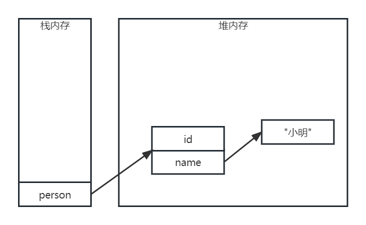

---
title: 指针与引用
date: 2023-02-07 02:14:42
summary: 本文分享指针和引用的相关内容。
tags:
- 程序设计
categories:
- 程序设计
---

# C和指针

计算机内存中的每个位置都由一个内存地址标识。指针变量存储了一个内存地址，指向它的值(内存地址)中存储的变量。

指针变量的值并非它所指向的内存位置所存储的值。我们必须使用间接访问来获得它所指向位置存储的值，通过一个指针访问它所指向的地址的过程称为间接访问或解引用指针，操作符是`*`。对一个“指向整型的指针”施加间接访问操作的结果将是一个整型值。

声明一个指针变量并不会自动分配任何内存。在对指针执行间接访问前，指针必须进行初始化，可以让指针指向现有的内存，也可以给指针分配动态内存(malloc)。对未初始化的指针变量执行间接访问操作是非法的，而且这种错误常常难以检测和调试(Java的java.lang.NullPointerException就是为了避免此问题)，导致一个不相关的值被修改，引发未知错误。

NULL指针是不指向任何内存区域的指针。NULL可以赋值给一个指针，用于表示那个指针并不指向任何值。对NULL指针执行间接访问操作的后果因编译器而异，两个常见的后果分别是返回内存位置零的值以及终止程序。指针常量只有NULL一种，因为无法预测编译器会把变量放在内存中的什么位置。

和任何其他变量一样，指针变量也可以放在等号(赋值符号)左边。对指针执行间接访问操作所产生的变量也可以放在等号(赋值符号)左边。

在指针值上可以执行一些算术运算。例如，可以把一个整型值加到一个指针上，也可以从一个指针减去一个整型值。在这两种情况下，这个整型值会进行调整，原值将乘以指针目标类型的长度(sizeof)。这样，对一个指针加1将使它指向下一个变量，至于该变量在内存中占几个字节的大小则与此无关。数组变量也等价于指针，而且指针运算作用于数组时其结果才是可以预测的。对任何并非指向数组元素的指针执行算术运算是非法的。指针减去一个整数后，运算结果产生的指针所指向的位置在数组第一个元素之前，那么它也是非法的。加法运算稍有不同，指针指向数组最后一个元素后面的那个内存位置仍是合法(但不能对这个指针执行间接访问操作)，不过再往后就不合法了。如果两个指针都指向同一个数组中的元素，那么它们之间可以相减。指针减法的结果经过调整(除以数组元素类型的长度)，表示两个指针在数组中相隔多少个元素。如果两个指针并不是指向同一个数组的元素，那么它们之间进行相减就是错误的。

任何指针之间都可以进行比较，测试它们相等或不相等。如果两个指针都指向同一个数组中的元素，那么它们之间还可以执行`<`、`<=`、`>`、`>=`等比较运算，用于判断它们在数组中的相对位置。对两个不相关的指针执行关系运算，其结果是未定义的。

对指针的错误用法：
1. 错误地对一个未初始化的指针变量进行间接访问。
2. 错误地对一个NULL指针进行间接访问。
3. 向函数错误地传递NULL指针。
4. 未检测到指针表达式的错误，从而导致不可预料的结果。
5. 对一个指针进行减法运算，使它非法地指向了数组首元素的前面的内存位置。

# Java和引用

```java
class Person {
    private int id;
    private String name;
    // 省略
}
```

`Person p = new Person();`创建一个Person类的实例，该变量存储在JVM栈内存中，实际的对象存储在JVM堆内存中。p变量存储的是对象的引用，也就是一个虚拟的内存地址。由于String也是引用类型，所以同理。虽然Java不涉及指针，但引用的本质就是指针，即(虚拟)内存的一个地址(整数)。



不论是数组、字符串还是普通类，都是引用类型，当访问引用变量的成员变量或方法时，实际访问的是该引用指向的真实成员变量或方法。

如果堆内存里的对象没有任何变量指向该对象，那么程序无法再访问该对象。此时，该对象称为JVM中的“垃圾”，等待被JVM的垃圾回收机制识别并回收。被垃圾回收的对象所占的JVM内存区域将被释放。

如果想要JVM的垃圾回收机制关注到不再需要的对象，可以将对应的引用变量赋值为null，切断栈内存中的变量和堆内存中的实际对象之间的联系。

Java的垃圾回收机制具有如下特点：
- 垃圾回收机制只负责回收堆内存中的对象，不回收任何资源(例如数据库连接、I/O连接等)。
- Java程序无法精准控制JVM垃圾回收机制的运行，垃圾回收会在JVM认为合适的时机进行。当堆内对象永久地失去对它的引用时，它就会纳入JVM垃圾回收的考虑范畴。
- 垃圾回收机制回收任何对象前，都会调用其finalize()方法，该方法可能使得对象重新获得引用，导致取消回收。

对象在堆内存中被引用变量引用的状态可能有：
- 可达状态：当一个对象被创建后，若有一个以上的引用变量引用它，则该对象处于可达状态，可通过引用变量来调用该对象的实例变量和方法。
- 可恢复状态：若一个对象没有被任何引用变量引用，则该对象处于可恢复状态，JVM垃圾回收机制准备调用finalize()进行资源清理。
- 不可达状态：若一个对象的所有关联都被切断，且JVM调用finalize()后仍然没有使该对象变为可达状态，该对象将永久失去引用，变为不可达状态，等待被JVM回收。

强制垃圾回收：
- `System.gc()`
- `Runtime.getRuntime().gc()`

强制垃圾回收只能建议JVM进行垃圾回收，不见得会立刻进行垃圾回收。finalize()也不应被主动调用，应该交给垃圾回收机制调用。

Java引用对象的引用方式：
- 强引用：Java最基本的引用方式。
- 软引用：java.ref.SoftReference，可用于内存敏感程序中。当内存空间足够时，它不会被JVM回收；当内存空间不足时，可能被JVM回收。
- 弱引用：java.ref.WeakReference，比软引用的引用级别更低。不论内存空间是否足够，等待JVM垃圾回收时，总会被回收。
- 虚引用：java.ref.PhantomReference，相当于没有引用。虚引用主要用于追踪对象被垃圾回收的状态，必须与java.ref.ReferenceQueue一起使用，不能单独使用。
