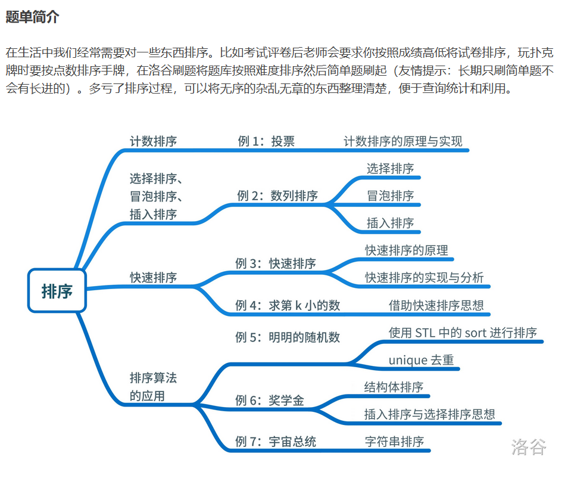

---
title: 排序题单
date: 2020-05-01 21:47:26
summary: 本文通过洛谷排序题单，分享排序相关程序设计的一些技巧和心得。
mathjax: true
tags:
- 程序设计
categories:
- 程序设计
---

# 题单简介



# P1271 选举学生会

## 题目描述

学校正在选举学生会成员，有 $n(n\le 999)$ 名候选人，每名候选人编号分别从 1 到 $n$，现在收集到了 $m(m<=2000000)$ 张选票，每张选票都写了一个候选人编号。现在想把这些堆积如山的选票按照投票数字从小到大排序。

## 输入格式

输入 $n$ 和 $m$ 以及 $m$ 个选票上的数字。

## 输出格式

求出排序后的选票编号。

## 样例 #1

### 样例输入 #1

```
5 10
2 5 2 2 5 2 2 2 1 2
```

### 样例输出 #1

```
1 2 2 2 2 2 2 2 5 5
```

## 程序设计

Java实现会超时，因此用C++实现。

## 实现代码

```cpp
#include <iostream>

using namespace std;

int a, num, array[2000001];

/**
 * 应用二分思想
 * @param left 左索引
 * @param right 右索引
 */
void quickSort(int left, int right) {
    int mid = array[(left+right)/2];//中间数
    int i = left, j = right;
    do {
        while (array[i] < mid) {
            i++;//查找左半部分比中间数大的数
        }
        while (array[j] > mid) {
            j--;//查找右半部分比中间数小的数
        }
        if (i <= j) {
            swap(array[i], array[j]);//交换
            i++;
            j--;
        }
    } while (i <= j);
    if (left < j) {
        quickSort(left, j);//递归搜索左半部分
    }
    if (i < right) {
        quickSort(i, right);//递归搜索右半部分
    }
}

int main() {
    cin >> a >> num;
    for (int i = 1; i <= num; i++) {
        cin >> array[i];
    }
    quickSort(1, num);
    for (int i = 1; i <= num; i++) {
        cout << array[i] << " ";
    }
}
```

## 代码提交

[洛谷 P1271 选举学生会](https://www.luogu.com.cn/problem/P1271)

# P1177 快速排序

## 题目描述

利用快速排序算法将读入的 $N$ 个数从小到大排序后输出。

快速排序是信息学竞赛的必备算法之一。对于快速排序不是很了解的同学可以自行上网查询相关资料，掌握后独立完成。（C++ 选手请不要试图使用 `STL`，虽然你可以使用 `sort` 一遍过，但是你并没有掌握快速排序算法的精髓。）

## 输入格式

第 $1$ 行为一个正整数 $N$，第 $2$ 行包含 $N$ 个空格隔开的正整数 $a_i$，为你需要进行排序的数，数据保证了 $a_i$ 不超过 $10^9$。

## 输出格式

将给定的 $N$ 个数从小到大输出，数之间空格隔开，行末换行且无空格。

## 样例 #1

### 样例输入 #1

```
5
4 2 4 5 1
```

### 样例输出 #1

```
1 2 4 4 5
```

## 提示

对于 $20\%$ 的数据，有 $N\leq 10^3$；

对于 $100\%$ 的数据，有 $N\leq 10^5$。

## 程序设计

推荐阅读：[分治算法解决快速排序问题](https://blankspace.blog.csdn.net/article/details/104256706)

## 实现代码

```cpp
#include <iostream>

using namespace std;

int num, array[100001];

/**
 * 应用二分思想
 * @param left 左索引
 * @param right 右索引
 */
void quickSort(int left, int right) {
    int mid = array[(left+right)/2];//中间数
    int i = left, j = right;
    do {
        while (array[i] < mid) {
            i++;//查找左半部分比中间数大的数
        }
        while (array[j] > mid) {
            j--;//查找右半部分比中间数小的数
        }
        if (i <= j) {
            swap(array[i], array[j]);//交换
            i++;
            j--;
        }
    } while (i <= j);
    if (left < j) {
        quickSort(left, j);//递归搜索左半部分
    }
    if (i < right) {
        quickSort(i, right);//递归搜索右半部分
    }
}

int main() {
    cin >> num;
    for (int i = 1; i <= num; i++) {
        cin >> array[i];
    }
    quickSort(1, num);
    for (int i = 1; i <= num; i++) {
        cout << array[i] << " ";
    }
}
```

## 代码提交

[洛谷 P1177 快速排序](https://www.luogu.com.cn/problem/P1177)

# P1923 求第k小的数

## 题目描述

输入 $n$（$1 \le n < 5000000$ 且 $n$ 为奇数）个数字 $a_i$（$1 \le a_i < {10}^9$），输出这些数字的第 $k$ 小的数。最小的数是第 $0$ 小。

请尽量不要使用 `nth_element` 来写本题，因为本题的重点在于练习分治算法。

## 输入格式

无

## 输出格式

无

## 样例 #1

### 样例输入 #1

```
5 1
4 3 2 1 5
```

### 样例输出 #1

```
2
```

## 程序设计

下面的代码违反了规定，使用了`nth_element`。

正确的实现思路：[分治算法解决查找第K大/小元素问题](https://blankspace.blog.csdn.net/article/details/104369975)

## 实现代码

```cpp
#include <bits/stdc++.h>

using namespace std;

long long num, k, nums[5000010];

int main() {
    scanf("%d%d", &num, &k);
    for(int i=0; i < num; i++) {
        scanf("%d", &nums[i]);
    }
    nth_element(nums, nums + k, nums + num);
    printf("%d", nums[k]);
}
```

## 代码提交

[洛谷 P1923 求第k小的数](https://www.luogu.com.cn/problem/P1923)

# P1059 明明的随机数

## 题目描述

明明想在学校中请一些同学一起做一项问卷调查，为了实验的客观性，他先用计算机生成了 $N$ 个 $1$ 到 $1000$ 之间的随机整数 $(N\leq100)$，对于其中重复的数字，只保留一个，把其余相同的数去掉，不同的数对应着不同的学生的学号。然后再把这些数从小到大排序，按照排好的顺序去找同学做调查。请你协助明明完成“去重”与“排序”的工作。

## 输入格式

输入有两行，第 $1$ 行为 $1$ 个正整数，表示所生成的随机数的个数 $N$。

第 $2$ 行有 $N$ 个用空格隔开的正整数，为所产生的随机数。

## 输出格式

输出也是两行，第 $1$ 行为 $1$ 个正整数 $M$，表示不相同的随机数的个数。

第 $2$ 行为 $M$ 个用空格隔开的正整数，为从小到大排好序的不相同的随机数。

## 样例 #1

### 样例输入 #1

```
10
20 40 32 67 40 20 89 300 400 15
```

### 样例输出 #1

```
8
15 20 32 40 67 89 300 400
```

## 提示

NOIP 2006 普及组 第一题

## 程序设计

java.util.TreeSet辅助求解。

## 实现代码

```java
import java.util.Scanner;
import java.util.TreeSet;

public class Main {
    public static void main(String[] args) {
        Scanner scanner = new Scanner(System.in);
        int num = scanner.nextInt();
        TreeSet<Integer> set = new TreeSet<>();
        for (int i = 0; i < num; i++) {
            set.add(scanner.nextInt());
        }
        System.out.println(set.size());
        StringBuilder builder = new StringBuilder();
        for (int i : set) {
            builder.append(i + " ");
        }
        System.out.println(builder.toString().trim());
        scanner.close();
    }
}
```

## 代码提交

[洛谷 P1059 明明的随机数](https://www.luogu.com.cn/problem/P1059)

# P1093 奖学金

## 题目描述

某小学最近得到了一笔赞助，打算拿出其中一部分为学习成绩优秀的前 $5$ 名学生发奖学金。期末，每个学生都有 $3$ 门课的成绩:语文、数学、英语。先按总分从高到低排序，如果两个同学总分相同，再按语文成绩从高到低排序，如果两个同学总分和语文成绩都相同，那么规定学号小的同学 排在前面，这样，每个学生的排序是唯一确定的。

任务：先根据输入的 $3$ 门课的成绩计算总分，然后按上述规则排序，最后按排名顺序输出前五名名学生的学号和总分。注意，在前 $5$ 名同学中，每个人的奖学金都不相同，因此，你必须严格按上述规则排序。例如，在某个正确答案中，如果前两行的输出数据(每行输出两个数:学号、总分) 是:

$7$  $279$  
$5$  $279$  

这两行数据的含义是:总分最高的两个同学的学号依次是 $7$ 号、$5$ 号。这两名同学的总分都是 $279$ (总分等于输入的语文、数学、英语三科成绩之和) ，但学号为 $7$ 的学生语文成绩更高一些。如果你的前两名的输出数据是:

$5$  $279$  
$7$  $279$  

则按输出错误处理，不能得分。

## 输入格式

共 $n+1$行。

第 $1$ 行为一个正整数$n ( \le 300)$，表示该校参加评选的学生人数。

第 $2$ 到 $n+1$ 行，每行有 $3$ 个用空格隔开的数字，每个数字都在 $0$ 到 $100$ 之间。第 $j$ 行的 $3$ 个数字依次表示学号为 $j-1$ 的学生的语文、数学、英语的成绩。每个学生的学号按照输入顺序编号为 $1\sim n$（恰好是输入数据的行号减 $1$）。

所给的数据都是正确的，不必检验。

## 输出格式

共 $5$ 行，每行是两个用空格隔开的正整数，依次表示前 $5$ 名学生的学号和总分。

## 样例 #1

### 样例输入 #1

```
6
90 67 80
87 66 91
78 89 91
88 99 77
67 89 64
78 89 98
```

### 样例输出 #1

```
6 265
4 264
3 258
2 244
1 237
```

## 样例 #2

### 样例输入 #2

```
8
80 89 89
88 98 78
90 67 80
87 66 91
78 89 91
88 99 77
67 89 64
78 89 98
```

### 样例输出 #2

```
8 265
2 264
6 264
1 258
5 258
```

## 程序设计

自定义类，按约定规则给java.util.TreeSet排序。

## 实现代码

```java
import java.util.*;

public class Main {

    private static class Grade {
        Integer num;
        Integer chinese;
        Integer grade;
        public Grade(int num, int chinese, int grade) {
            this.num = num;
            this.chinese = chinese;
            this.grade = grade;
        }
    }

    public static void main(String[] args) {
        Scanner scanner = new Scanner(System.in);
        int num = Integer.parseInt(scanner.nextLine());
        Set<Grade> set = new TreeSet<>(new Comparator<Grade>() {
            @Override
            public int compare(Grade grade1, Grade grade2) {
                int result1 = -grade1.grade.compareTo(grade2.grade);
                if (result1 != 0) {
                    return result1;
                }
                int result2 = -grade1.chinese.compareTo(grade2.chinese);
                if (result2 != 0) {
                    return result2;
                }
                return grade1.num.compareTo(grade2.num);
            }
        });
        for (int i = 1; i <= num; i++) {
            String[] array = scanner.nextLine().split(" ");
            int chinese = Integer.parseInt(array[0]);
            int grade = chinese + Integer.parseInt(array[1]) + Integer.parseInt(array[2]);
            set.add(new Grade(i, chinese, grade));
        }
        int counter = 0;
        for (Grade grade : set) {
            counter++;
            System.out.println(grade.num + " " + grade.grade);
            if (counter == 5) {
                break;
            }
        }
        scanner.close();
    }

}
```

## 代码提交

[洛谷 P1093 奖学金](https://www.luogu.com.cn/problem/P1093)

# P1781 宇宙总统

## 题目描述

地球历公元 6036 年，全宇宙准备竞选一个最贤能的人当总统，共有 $n$ 个非凡拔尖的人竞选总统，现在票数已经统计完毕，请你算出谁能够当上总统。

## 输入格式

第一行为一个整数 $n$，代表竞选总统的人数。

接下来有 $n$ 行，分别为第一个候选人到第 $n$ 个候选人的票数。

## 输出格式

共两行，第一行是一个整数 $m$，为当上总统的人的号数。

第二行是当上总统的人的选票。

## 样例 #1

### 样例输入 #1

```
5
98765
12365
87954
1022356
985678
```

### 样例输出 #1

```
4
1022356
```

## 提示

票数可能会很大，可能会到 $100$ 位数字。

$1 \leq n \leq 20$

## 程序设计

采用java.math.BigInteger辅助求解。

## 实现代码

```java
import java.math.BigInteger;
import java.util.Comparator;
import java.util.Map;
import java.util.Scanner;
import java.util.TreeMap;

public class Main {
    public static void main(String[] args) {
        Scanner scanner = new Scanner(System.in);
        int num = scanner.nextInt();
        Map<BigInteger, Integer> record = new TreeMap<>(Comparator.reverseOrder());
        for (int i = 1; i <= num; i++) {
            record.put(new BigInteger(scanner.next()), i);
        }
        scanner.close();
        int counter = 0;
        for (Map.Entry entry : record.entrySet()) {
            if (counter == 1) {
                break;
            }
            System.out.println(entry.getValue());
            System.out.println(entry.getKey());
            counter++;
        }
    }
}
```

## 代码提交

[洛谷 P1781 宇宙总统](https://www.luogu.com.cn/problem/P1781)

# P2676 Bookshelf B

## 题目描述

Farmer John最近为奶牛们的图书馆添置了一个巨大的书架，尽管它是如此的大，但它还是几乎瞬间就被各种各样的书塞满了。现在，只有书架的顶上还留有一点空间。 

所有 $N(1 \le N \le 20,000)$ 头奶牛都有一个确定的身高 $H_i(1 \le H_i \le 10,000)$。设所有奶牛身高的和为S。书架的高度为B，并且保证 $1 \le B \le S < 2,000,000,007$。 

为了够到比最高的那头奶牛还要高的书架顶，奶牛们不得不像演杂技一般，一头站在另一头的背上，叠成一座“奶牛塔”。当然，这个塔的高度，就是塔中所有奶牛的身高之和。为了往书架顶上放东西，所有奶牛的身高和必须不小于书架的高度。

显然，塔中的奶牛数目越多，整座塔就越不稳定，于是奶牛们希望在能够到书架顶的前提下，让塔中奶牛的数目尽量少。 现在，奶牛们找到了你，希望你帮她们计算这个最小的数目。

## 输入格式

* 第 $1$ 行: 2 个用空格隔开的整数：$N$ 和 $B$；
* 第 $2\dots N+1$ 行: 第 $i+1$ 行是 $1$ 个整数：$H_i$。

## 输出格式

* 第 $1$ 行: 输出 $1$ 个整数，即最少要多少头奶牛叠成塔，才能够到书架顶部

## 样例 #1

### 样例输入 #1

```
6 40
6
18
11
13
19
11
```

### 样例输出 #1

```
3
```

## 提示

输入说明:

一共有 $6$ 头奶牛，书架的高度为 $40$，奶牛们的身高在 $6\dots19$之间。


输出说明:

一种只用 $3$ 头奶牛就达到高度 $40$ 的方法：$18+11+13$。当然还有其他方法，在此不一一列出了。

## 程序设计

推荐阅读：[贪心算法解决奶牛书架问题](https://blankspace.blog.csdn.net/article/details/104130795)

## 实现代码

```java
import java.util.Arrays;
import java.util.Scanner;

public class Main {
    public static void main(String[] args) {
        Scanner scanner = new Scanner(System.in);
        int num = scanner.nextInt(), height = scanner.nextInt(), sum = 0, j;
        int[] array = new int[num];
        for (int i = 0; i < num; i++) {
            array[i] = scanner.nextInt();
        }
        scanner.close();
        Arrays.sort(array);
        for (j = num-1; j >= 0 && sum < height; j--) {
            sum += array[j];
        }
        System.out.println(num-j-1);
    }
}
```

## 代码提交

[洛谷 P2676 Bookshelf B](https://www.luogu.com.cn/problem/P2676)

# P1116 车厢重组

## 题目描述

在一个旧式的火车站旁边有一座桥，其桥面可以绕河中心的桥墩水平旋转。一个车站的职工发现桥的长度最多能容纳两节车厢，如果将桥旋转 $180$ 度，则可以把相邻两节车厢的位置交换，用这种方法可以重新排列车厢的顺序。于是他就负责用这座桥将进站的车厢按车厢号从小到大排列。他退休后，火车站决定将这一工作自动化，其中一项重要的工作是编一个程序，输入初始的车厢顺序，计算最少用多少步就能将车厢排序。

## 输入格式

共两行。  

第一行是车厢总数 $N( \le 10000)$。
  
第二行是 $N$ 个不同的数表示初始的车厢顺序。

## 输出格式

一个整数，最少的旋转次数。

## 样例 #1

### 样例输入 #1

```
4
4 3 2 1
```

### 样例输出 #1

```
6
```

## 程序设计

略

## 实现代码

```java
import java.util.Scanner;

public class Main {

    public static void main(String[] args) {
        Scanner scanner = new Scanner(System.in);
        int num = Integer.parseInt(scanner.nextLine());
        int[] arrInt = new int[num];
        for (int i = 0; i < num; i++) {
            arrInt[i] = scanner.nextInt();
        }
        System.out.println(bubbleSort(num, arrInt));
        scanner.close();
    }

    public static int bubbleSort(int length, int[] record) {
        int count = 0;
        int exchange = length - 1;
        int position, bound, temp;
        while (exchange != 0) {
            bound = exchange;
            exchange = 0;
            for (position = 0; position < bound; position++) {
                if (record[position] > record[position+1]) {
                    temp = record[position];
                    record[position] = record[position+1];
                    record[position+1] = temp;
                    exchange = position;
                    count++;
                }
            }
        }
        return count;
    }

}
```

## 代码提交

[洛谷 P1116 车厢重组](https://www.luogu.com.cn/problem/P1116)

# P1152 欢乐的跳

## 题目描述

一个 $n$ 个元素的整数数组，如果数组两个连续元素之间差的绝对值包括了 $[1,n-1]$ 之间的所有整数，则称之符合“欢乐的跳”，如数组 $\{1,4,2,3\}$ 符合“欢乐的跳”，因为差的绝对值分别为：$3,2,1$。

给定一个数组，你的任务是判断该数组是否符合“欢乐的跳”。

## 输入格式

每组测试数据第一行以一个整数 $n(1 \le n \le 1000)$ 开始，接下来 $n$ 个空格隔开的在 $[-10^8,10^8]$ 之间的整数。

## 输出格式

对于每组测试数据，输出一行若该数组符合“欢乐的跳”则输出 `Jolly`，否则输出 `Not jolly`。

## 样例 #1

### 样例输入 #1

```
4 1 4 2 3
```

### 样例输出 #1

```
Jolly
```

## 样例 #2

### 样例输入 #2

```
5 1 4 2 -1 6
```

### 样例输出 #2

```
Not jolly
```

## 提示

$1 \le n \le 1000$

## 程序设计

略

## 实现代码

```java
import java.util.HashSet;
import java.util.Scanner;
import java.util.Set;

public class Main {
    public static void main(String[] args) {
        Scanner scanner = new Scanner(System.in);
        int num = scanner.nextInt();
        Set<Integer> set = new HashSet<>(1000);
        int prev = scanner.nextInt();
        for (int i = 1; i < num; i++) {
            int temp = scanner.nextInt(), abs = Math.abs(prev-temp);
            if (abs >= num || set.contains(abs)) {
                System.out.println("Not jolly");
                return;
            } else {
                prev = temp;
                set.add(abs);
            }
        }
        scanner.close();
        System.out.println("Jolly");
    }
}
```

## 代码提交

[洛谷 P1152 欢乐的跳](https://www.luogu.com.cn/problem/P1152)

# P1068 分数线划定

## 题目描述

世博会志愿者的选拔工作正在 A 市如火如荼的进行。为了选拔最合适的人才，A 市对所有报名的选手进行了笔试，笔试分数达到面试分数线的选手方可进入面试。面试分数线根据计划录取人数的 $150\%$ 划定，即如果计划录取 $m$ 名志愿者，则面试分数线为排名第 $m \times 150\%$（向下取整）名的选手的分数，而最终进入面试的选手为笔试成绩不低于面试分数线的所有选手。

现在就请你编写程序划定面试分数线，并输出所有进入面试的选手的报名号和笔试成绩。

## 输入格式

第一行，两个整数 $n,m(5 \leq n \leq 5000,3 \leq m \leq n)$，中间用一个空格隔开，其中 $n$ 表示报名参加笔试的选手总数，$m$ 表示计划录取的志愿者人数。输入数据保证 $m \times 150\%$ 向下取整后小于等于 $n$。

第二行到第 $n+1$ 行，每行包括两个整数，中间用一个空格隔开，分别是选手的报名号 $k(1000 \leq k \leq 9999)$和该选手的笔试成绩 $s(1 \leq s \leq 100)$。数据保证选手的报名号各不相同。

## 输出格式

第一行，有 $2$ 个整数，用一个空格隔开，第一个整数表示面试分数线；第二个整数为进入面试的选手的实际人数。

从第二行开始，每行包含 $2$ 个整数，中间用一个空格隔开，分别表示进入面试的选手的报名号和笔试成绩，按照笔试成绩从高到低输出，如果成绩相同，则按报名号由小到大的顺序输出。

## 样例 #1

### 样例输入 #1

```
6 3 
1000 90 
3239 88 
2390 95 
7231 84 
1005 95 
1001 88
```

### 样例输出 #1

```
88 5 
1005 95 
2390 95 
1000 90 
1001 88 
3239 88
```

## 提示

【样例说明】

$m \times 150\% = 3 \times150\% = 4.5$，向下取整后为 $4$。保证 $4$ 个人进入面试的分数线为 $88$，但因为 $88$ 有重分，所以所有成绩大于等于 $88$ 的选手都可以进入面试，故最终有 $5$ 个人进入面试。

NOIP 2009 普及组 第二题

## 程序设计

在实现的时候注意两个细节：
- $×1.5$以后要向下取整，这个是必须做的。
- 要保证压线的时候同分的人全部上岸。

## 实现代码

```java
import java.util.*;

public class Main {

    private static class Person {
        Integer id;
        Integer grade;
        public Person(int id, int grade) {
            this.id = id;
            this.grade = grade;
        }
    }

    public static void main(String[] args) {
        Set<Person> set = new TreeSet<>(new Comparator<Person>() {
            @Override
            public int compare(Person person1, Person person2) {
                int grade_compare = -person1.grade.compareTo(person2.grade);
                if (grade_compare != 0) {
                    return grade_compare;
                }
                return person1.id.compareTo(person2.id);
            }
        });
        Scanner scanner = new Scanner(System.in);
        int all_num = scanner.nextInt(), aim_num = scanner.nextInt();
        scanner.nextLine();
        aim_num = (int)Math.floor(aim_num*1.5);
        for (int i = 0; i < all_num; i++) {
            String[] array = scanner.nextLine().split(" ");
            set.add(new Person(Integer.parseInt(array[0]), Integer.parseInt(array[1])));
        }
        List<String> list = new ArrayList<>(aim_num);
        int counter = 0, low = 0;
        for (Person person : set) {
            if (counter >= aim_num && low != person.grade) {
                break;
            }
            counter++;
            list.add(person.id + " " + person.grade);
            if (counter == aim_num) {
                low = person.grade;
            }
        }
        System.out.println(low + " " + counter);
        for (String s : list) {
            System.out.println(s);
        }
        scanner.close();
    }

}
```

## 代码提交

[洛谷 P1068 分数线划定](https://www.luogu.com.cn/problem/P1068)

# P5143 攀爬者

## 题目背景

HKE 考完 GDOI 之后跟他的神犇小伙伴们一起去爬山。

## 题目描述

他在地形图上标记了 $N$ 个点，每个点 $P_i$ 都有一个坐标 $(x_i,y_i,z_i)$。所有点对中，高度值 $z$ 不会相等。HKE 准备从最低的点爬到最高的点，他的攀爬满足以下条件：

 (1) 经过他标记的每一个点；

 (2) 从第二个点开始，他经过的每一个点高度 $z$ 都比上一个点高；

 (3) HKE 会飞，他从一个点 $P_i$ 爬到 $P_j$ 的距离为两个点的欧几里得距离。即，$\sqrt{(X_i-X_j)^2+(Y_i-Y_j)^2+(Z_i-Z_j)^2}$

现在，HKE 希望你能求出他攀爬的总距离。

## 输入格式

第一行，一个整数 $N$ 表示地图上的点数。

接下来 $N$ 行，三个整数 $x_i,y_i,z_i$ 表示第 $i$ 个点的坐标。

## 输出格式

一个实数，表示 HKE 需要攀爬的总距离（保留三位小数）

## 样例 #1

### 样例输入 #1

```
5
2 2 2
1 1 1
4 4 4
3 3 3
5 5 5
```

### 样例输出 #1

```
6.928
```

## 提示

对于100%的数据，$1\leq N\leq 50000$，答案的范围在 double 范围内。

## 程序设计

略

## 实现代码

```java
import java.util.Arrays;
import java.util.Comparator;
import java.util.Scanner;

public class Main {

    private static class Hill {
        int x;
        int y;
        int z;
        public Hill(int x, int y, int z) {
            this.x = x;
            this.y = y;
            this.z = z;
        }
    }

    public static void main(String[] args) {
        Scanner scanner = new Scanner(System.in);
        int num = scanner.nextInt();
        Hill[] hills = new Hill[num];
        for (int i = 0; i < num; i++) {
            hills[i] = new Hill(scanner.nextInt(), scanner.nextInt(), scanner.nextInt());
        }
        Arrays.sort(hills, Comparator.comparing(e -> e.z));
        scanner.close();
        int x = hills[0].x, y = hills[0].y, z = hills[0].z;
        double sum = 0;
        for (int i = 1; i < num; i++) {
            sum += Math.sqrt(Math.pow(hills[i].x-x, 2) + Math.pow(hills[i].y-y, 2) + Math.pow(hills[i].z-z, 2));
            x = hills[i].x;
            y = hills[i].y;
            z = hills[i].z;
        }
        System.out.printf("%.3f", sum);
    }

}
```

## 代码提交

[洛谷 P5143 攀爬者](https://www.luogu.com.cn/problem/P5143)

# P1104 生日

## 题目描述

cjf 君想调查学校 OI 组每个同学的生日，并按照年龄从大到小的顺序排序。但 cjf 君最近作业很多，没有时间，所以请你帮她排序。

## 输入格式

输入共有 $n + 1$ 行，

第 $1$ 行为 OI 组总人数 $n$；

第 $2$ 行至第 $n+1$ 行分别是每人的姓名 $s$、出生年 $y$、月 $m$、日 $d$。

## 输出格式

输出共有 $n$ 行，

即 $n$ 个生日从大到小同学的姓名。（如果有两个同学生日相同，输入靠后的同学先输出）

## 样例 #1

### 样例输入 #1

```
3
Yangchu 1992 4 23
Qiujingya 1993 10 13
Luowen 1991 8 1
```

### 样例输出 #1

```
Luowen
Yangchu
Qiujingya
```

## 提示

数据保证，$1<n<100$，$1\leq |s|<20$。保证年月日实际存在，且年份 $\in [1960,2020]$。

## 程序设计

略

## 实现代码

```java
import java.util.Arrays;
import java.util.Scanner;

public class Main {

    private static class OIer {
        String name;
        Integer year;
        Integer month;
        Integer day;
        Integer id;
        OIer(String name, int year, int month, int day, int id) {
            this.name = name;
            this.year = year;
            this.month = month;
            this.day = day;
            this.id = id;
        }
    }

    public static void main(String[] args) {
        Scanner scanner = new Scanner(System.in);
        int num = Integer.parseInt(scanner.nextLine());
        OIer[] oIers = new OIer[num];
        for (int i = 0; i < num; i++) {
            String[] info = scanner.nextLine().split("\\s+");
            oIers[i] = new OIer(info[0], Integer.parseInt(info[1]), Integer.parseInt(info[2]),
                    Integer.parseInt(info[3]), i);
        }
        scanner.close();
        Arrays.sort(oIers, (dalao1, dalao2) -> {
            int year = dalao1.year.compareTo(dalao2.year);
            if (year != 0) {
                return year;
            }
            int month = dalao1.month.compareTo(dalao2.month);
            if (month != 0) {
                return month;
            }
            int day = dalao1.day.compareTo(dalao2.day);
            if (day != 0) {
                return day;
            }
            return dalao2.id.compareTo(dalao1.id);
        });
        for (OIer dalao : oIers) {
            System.out.println(dalao.name);
        }
    }

}
```

## 代码提交

[洛谷 P1104 生日](https://www.luogu.com.cn/problem/P1104)

# P1012 拼数

## 题目描述

设有 $n$ 个正整数 $a_1 \dots a_n$，将它们联接成一排，相邻数字首尾相接，组成一个最大的整数。

## 输入格式

第一行有一个整数，表示数字个数 $n$。

第二行有 $n$ 个整数，表示给出的 $n$ 个整数 $a_i$。

## 输出格式

一个正整数，表示最大的整数

## 样例 #1

### 样例输入 #1

```
3
13 312 343
```

### 样例输出 #1

```
34331213
```

## 样例 #2

### 样例输入 #2

```
4
7 13 4 246
```

### 样例输出 #2

```
7424613
```

## 提示

对于全部的测试点，保证 $1 \leq n \leq 20$，$1 \leq a_i \leq 10^9$。

## 程序设计

直接按照字符串处理，可以按照字典序排序。

但这样存在问题：
比如32和321，我们按照字典序进行排序“321”>“32”，但实际上32132<32321，所以compareTo的计算方式需要改变。
我们在Arrays.sort()里加入新的java.util.Comparator对象，这是一个接口，所以可以用匿名内部类的语法来创建对象。

核心代码片段是：
```java
Arrays.sort(array, new Comparator<String>() {
    @Override
    public int compare(String str1, String str2) {
        return (str1+str2).compareTo(str2+str1);
    }
});
```

## 实现代码

```java
import java.util.Arrays;
import java.util.Comparator;
import java.util.Scanner;

public class Main {
    public static void main(String[] args) {
        Scanner scanner = new Scanner(System.in);
        int num = scanner.nextInt();
        String[] array = new String[num];
        for (int i = 0; i < num; i++) {
            array[i] = scanner.next();
        }
        scanner.close();
        Arrays.sort(array, new Comparator<String>() {
            @Override
            public int compare(String str1, String str2) {
                return (str1+str2).compareTo(str2+str1);
            }
        });
        StringBuilder builder = new StringBuilder();
        for (int i = num-1; i >= 0; i--) {
            builder.append(array[i]);
        }
        System.out.println(builder);
    }
}
```

## 代码提交

[洛谷 P1012 拼数](https://www.luogu.com.cn/problem/P1012)
