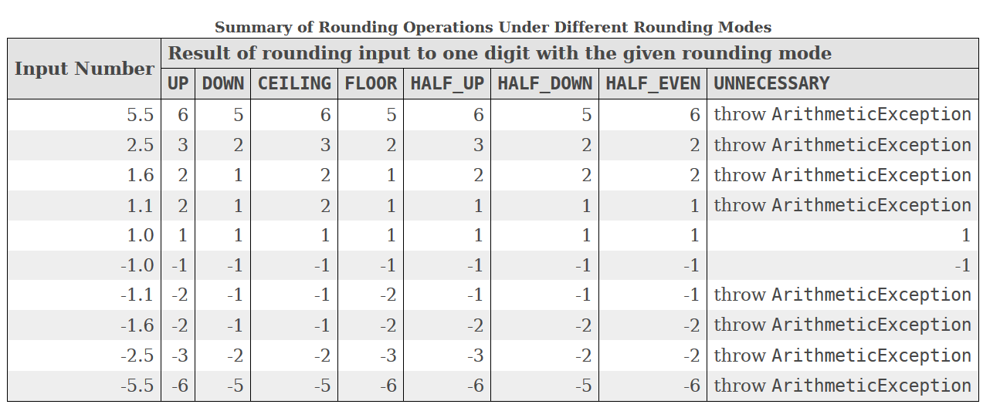

---
title: 数值舍入
date: 2020-02-12 12:08:57
summary: 本文分享Java的数值舍入问题。
tags:
- 程序设计
categories:
- 程序设计
---

# 常见的舍入方式

## 四舍五入

我们在学习计算机科学之前，以及日常生活中，用的是四舍五入。
所谓四舍五入，就是取4即归0，取5即归1，<font color="red">这个问题与我们需要的精度有关</font>。
在计算机科学中一般用**round()** 表示四舍五入。

比如0.499999，这是一个六位小数，我们想要四舍五入，就要看精度。
精确到1，结果是0
精确到0.1.结果是0.5
精确到0.01，结果是0.50
……

## 向上取整

向上取整是一种无视四舍五入的行为，在计算机科学中应用广泛，意为<font color="red">取大于等于该数值的最小整数</font>。
符号⌈⌉，英文Ceiling，通常写作**ceil()**。
英语中，ceil 的一个意思是 “天花板”，这样我们就不难理解了。
ceil()一般应用于浮点数，如果不是浮点的话，本就是整数，有什么取整的必要呢？

比如0.499999，上整就是1
比如-0.499999，上整就是0

## 向下取整

向下取整是一种无视四舍五入的行为，在计算机科学中应用广泛，意为<font color="red">取小于等于该数值的最大整数</font>。
符号⌊⌋，英文Floor，通常写作**floor()**。
英语中，floor 的一个意思是 “地板”，这样我们就不难理解了。
不难发现，上整和下整是恰好相反的，所以也是应用于浮点的。

比如0.499999，下整就是0
比如-0.499999，下整就是-1

不难发现，`⌈x⌉ - ⌊x⌋ = 1`

## 截断取整

截断取整是一种无视四舍五入的行为，在计算机科学中应用广泛，意为<font color="red">取舍去小数点和小数点后所有数位的整数</font>。

比如0.499999，截断取整就是0
比如-0.499999，截断取整也是0

## 向两端取整

向两端取整是一种无视四舍五入的行为，在计算机科学中应用广泛，意为<font color="red">取临近的∞方向的整数</font>。

比如0.5，向两端取整就是1
比如-0.5，向两端取整就是-1

## 有效数字

保留有效数字需要开发者自己实现。

```java
private static double roundToSignificantFigures(double num, int n) {
    if(num == 0) {
        return 0;
    }
    double d = Math.ceil(Math.log10(Math.abs(num)));
    int power = n - (int) d;
    double magnitude = Math.pow(10, power);
    long shifted = Math.round(num*magnitude);
    return shifted/magnitude;
}
```

num指原浮点数，n指有效数字位数。

# Math类中的舍入问题

java.lang.Math主要有以下几种舍入方式：
- ceil​(double a):作用是返回大于或等于参数且数值上等于整数的最小（最接近负无穷大）的浮点数
返回double型
解释的通俗点就是向上取整后转成数学上相等的double型
- floor​(double a):作用是返回小于或等于参数且数值上等于整数的最大（最接近正无穷大）的浮点数
返回double型
- nextDown​(…d/f):作用是返回在负无穷大方向上与d/f相邻的浮点值
参数可以是double d、float f两种，返回对应的类型
- nextUp​(…d/f):作用是返回在正无穷大方向上与d/f相邻的浮点值
参数可以是double d、float f两种，返回对应的类型
- rint​(double a):作用是返回在数学上等于与参数值最接近且是整数的double
返回double型
解释的通俗一点就是四舍五入后取数学上相等的double型浮点
- round​(…a):作用是返回参数四舍五入后的整数值
参数可以是double、float两种
double参数返回long，float参数返回int

nextDown()​、nextUp()​、rint​()​ 按照各自的规则舍入得浮点。
ceil​()​、floor()​​、round()​分别是前面提的，取整得整数，很常见。

# 除法的舍入问题

```java
System.out.println(1/2);
```
结果是什么？
```java
System.out.println(-1/2);
```
结果又是什么？

答案都是一样的：
`0`

为什么呢？
整数除整数，除号直接截断取整，正负号规则相同，相当于直接砍去小数点和小数点后数位。

Java不像Python还分/和//，只有/，那怎么能精确呢？
当然是转型为浮点啦：
```java
System.out.println((double)1/2);
```

答案：
`0.5`

那浮点精确吗？

```java
System.out.println(0.1+0.2);
```
结果是什么？

答案：
`0.30000000000000004`

为什么呢？
简而言之，double双精度浮点数，遵循IEEE754，64位，52位小数+11位指数+1位符号。
计算机没有分数，也没有十进制小数，所以只能用二进制小数表示，难免不精确。

用更精确的BigDecimal算一下：
`0.3000000000000000166533453693773481063544750213623046875`
只能说相对精确了很多，也不能说完全精确了，毕竟是计算机。

# printf()的舍入问题

```java
System.out.printf("%.0f", 0.5);
```
结果是什么？
```java
System.out.printf("%.0f", -0.5);
```
结果又是什么？

答案分别是：
`1`
`-1`

可见printf()的浮点舍入方式是向两端取整。

# double向float强转的舍入问题

我们都知道，double表示64位双精度浮点数，float代表32位单精度浮点数，double精确度高，也是默认的浮点数类型。

看下面的代码：

```java
double a = 0.555555555;
float b = (float)a;
```

b的值是多少？

答案是：
`0.5555556`


而下面的情况呢？

```java
double a = 0.55555554;
float b = (float)a;
```

b的值是：
`0.5555555`

可见printf()的浮点舍入方式是四舍五入。

# BigDecimal处理舍入问题的八种方式



原先BigDecimal类舍入采取本类中属性值来定义，后被标定为 **@Deprecated**。
新的方式被定义在枚举类 **java.math.RoundingMode** 中，有以下八种情况：

- `CEILING`：向正无穷大舍入
- `DOWN`：向零舍入
- `FLOOR`：向负无穷大舍入
- `HALF_DOWN`：向“最近的邻居”舍入，除非两个邻居都等距，在这种情况下，将向下舍入
- `HALF_EVEN`：向“最近的邻居”舍入，除非两个邻居都等距，在这种情况下，将向相邻偶数舍入。
- `HALF_UP`：向“最近的邻居”舍入，除非两个邻居都等距，在这种情况下，将向上舍入
- `UNNECESSARY`：舍入模式可以断言所请求的操作具有准确的结果，因此不需要舍入
- `UP`：舍入模式从零舍入（向着远离零的方向）
