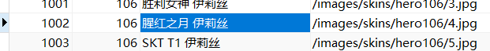

# Navicat

Navicat是香港卓软数码科技有限公司生产的一系列MySQL、MariaDB、MongoDB、Oracle、SQLite、PostgreSQL及Microsoft SQL Server的图形化资料库管理及发展软件。它有一个类似浏览器的图形使用者介面，支援多重连线到本地和远端资料库。它的设计合乎各种使用者的需求，从资料库管理员和程序员，到各种为客户服务并与合作伙伴共享信息的不同企业或公司。

## Navicat数据格式化显示设置

顶部菜单栏 $→$ 工具 $→$ 选项：

选项 $→$ 外观 $→$ 数据&网格 $→$ 显示格式：

## Navicat查看1000行以后的内容

使用Navicat查看表的内容，此时已经达到1000行，发现下面没有内容了，无法查看：

怎么回事呢？
此时应该看右下角，那个1是页码，点击→可查看下一页：

实际上对于Navicat，每1000行会分页，我们在翻页之后可以查看下一页的内容：

## Navicat安装方法

推荐阅读：[Navicat官方下载](https://learnku.com/articles/67706)

# DataGrip

下载地址：[DataGrip官网](https://www.jetbrains.com/datagrip/)

推荐阅读：[DataGrip用法](https://zhuanlan.zhihu.com/p/272163266)
