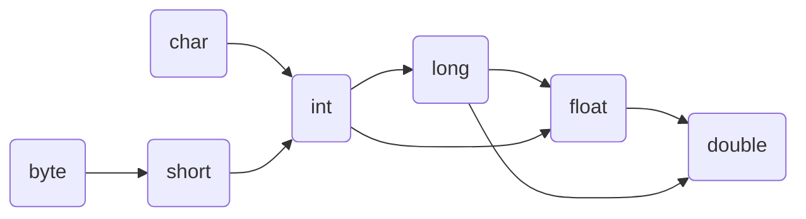
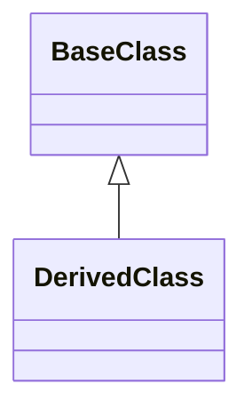

---
title: 数据类型转换
date: 2021-07-04 17:17:01
summary: 本文分享数据类型转换的内容，以Java、Python、C/C++举例。
tags:
- 程序设计
categories:
- 程序设计
---

# Java数据类型转换

基本数据类型：


引用数据类型：


## 向上类型转换

如果系统支持把某种基本类型的值直接赋给另一种基本类型的变量，则这种方式被称为自动类型转换。

当把任何基本类型的值和字符串值进行连接运算时，基本类型的值会自动类型转换为字符串类型。字符串是引用类型，字符串与基本类型数值连接时，结果是字符串。

对于基本类型，如上图，低级别的基本类型数值可以(自动)向上类型转换为高级别的基本类型数值。

对于引用类型，如上图，派生类实例可以(自动)向上类型转换为基类实例。

## 向下类型转换

与向上类型转换相反的是向下类型转换。向下类型转换必须明确指定，因此称为强制类型转换，其语法格式是：`(TargetType)value`。

强制类型转换需要小心溢出导致的数据异常。

## 常见类型转换

### 数值与字符串的转换

数值转字符串：
```java
int x = 123;
String xStr = Integer.toString(x);
```

字符串转数值：
```java
String xStr = "4321";
int x = Integer.parseInt(xStr);
```

### 字符串和字符数组的转换

字符串转字符数组：
```java
char[] str2Chars = str.toCharArray();
```

字符数组转字符串：
```java
String chars2Str = new String(chars);
```

### 数值数组和字符串数组的转换

虽然数值和字符串可以直接互转，但数值数组和字符串数组不能直接互转。

数值数组转字符串数组：
```java
int[] nums = new int[]{1, 2, 3, 4, 5};
String[] strings = new String[nums.length];
for (int i = 0; i < nums.length; i++) {
    strings[i] = Integer.toString(nums[i]);
}
```

字符串数组转数值数组：
```java
String[] strings = new String[]{"1", "2", "3", "4", "5"};
int[] nums = new int[strings.length];
for (int i = 0; i < strings.length; i++) {
    nums[i] = Integer.parseInt(strings[i]);
}
```

# Python数据类型转换

| 函数 | 描述 |
|:----:|:----:|
| int(x, [, base]) | x转整数 |
| float(x) | x转浮点数 |
| complex(real [, imag]) | 创建一个复数 |
| str(x) | 将x转换为字符串 |
| repr(x) | 将x转换为表达式字符串 |
| eval(x) | 用来计算在字符串x中的有效Python表达式，并返回一个对象 |
| tuple(x) | 将序列x转换为一个元组 |
| list(x) | 将序列x转换为一个列表 |
| set(x) | 将x转换为可变集合 |
| dict(x) | 创建一个字典。x必须是一个序列(key, value)元组 |
| frozenset(x) | 将x转换为不可变集合 |
| chr(x) | 将一个整数x转换为一个字符 |
| unichr(x) | 将一个整数x转换为一个Unicode字符 |
| ord(x) | 将一个字符x转换为它的十进制整数值 |
| hex(x) | 将一个整数x转换为一个十六进制字符串 |
| oct(x) | 将一个整数x转换为一个八进制字符串 |

说明：int()函数传入浮点数实参时会取整而非四舍五入。

# C/C++数据类型转换

C/C++数据类型转换应该注意以下问题：
1. 有符号数和无符号数之间的转换。例如，由`signed`型转换为等长`unsigined`型数据时，符号位成为数据的一部分，即负数转换为无符号数时，数值将发生变化。同理，由`unsigned`转换为`signed`时最高位作为符号位，也可能发生数值变化。
2. 数据的截取与保留。当一个浮点数转换为整数时，浮点数的小数部分全部舍去，并按整数形式存储。但浮点数的整数部分不能超过整型数允许的最大范围，否则溢出。
3. 数据转换中的精度丢失。四舍五入会丢失一定的精度，截取小数也会丢失一些精度。此外，数据由`long`型转换为`float`型或`double`型时，有可能存在存储时不能准确地表达该长整数的有效数字，精度也会受到影响。
4. 数据转换结果的不确定性。当较长的整数转换为较短的整数时，要将高位舍去。例如，`long`型转换为`short`型时，只将低16位送过去，这样会造成很大的误差。当较长的浮点数转换为较短的浮点数时，如`double`型转换为`float`型，当数值超过`float`型的表示范围时，所得到的结果将是不确定的。
