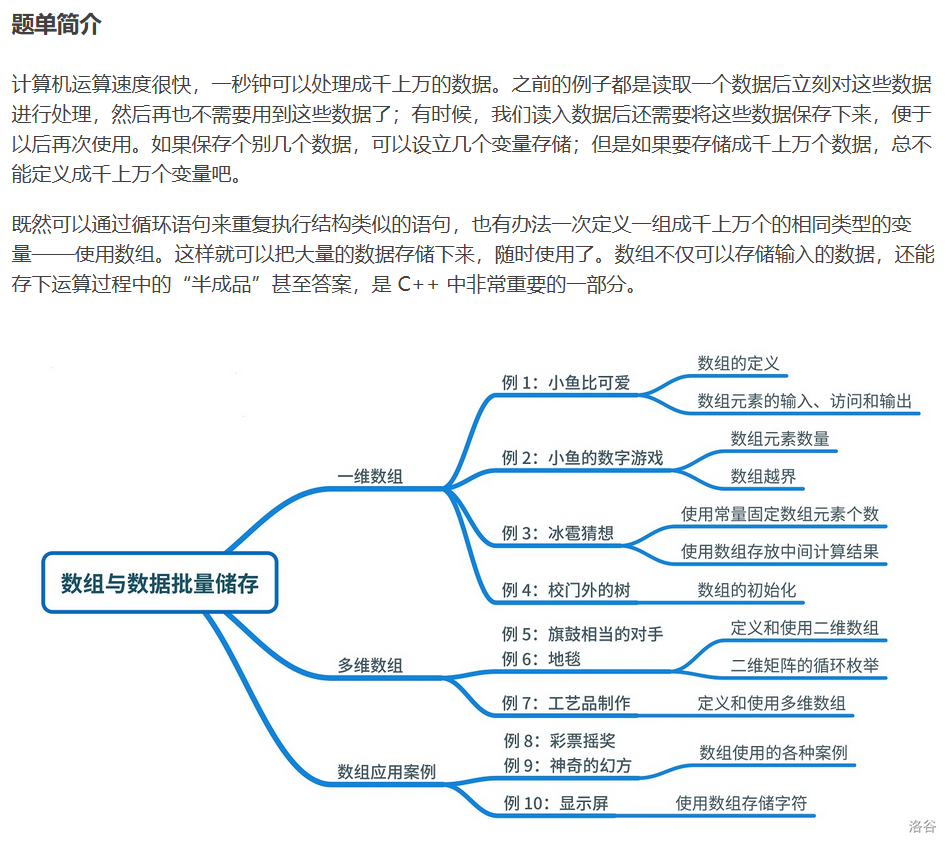

---
title: 数组题单
date: 2020-05-02 01:10:17
summary: 本文通过洛谷数组题单，分享数组相关程序设计的一些技巧和心得。
mathjax: true
tags:
- 程序设计
categories:
- 程序设计
---

# 题单简介



# P1428 小鱼比可爱

## 题目描述

人比人，气死人；鱼比鱼，难死鱼。小鱼最近参加了一个“比可爱”比赛，比的是每只鱼的可爱程度。参赛的鱼被从左到右排成一排，头都朝向左边，然后每只鱼会得到一个整数数值，表示这只鱼的可爱程度，很显然整数越大，表示这只鱼越可爱，而且任意两只鱼的可爱程度**可能一样**。由于所有的鱼头都朝向左边，所以每只鱼只能看见在它左边的鱼的可爱程度，它们心里都在计算，在自己的眼力范围内有多少只鱼不如自己可爱呢。请你帮这些可爱但是鱼脑不够用的小鱼们计算一下。

## 输入格式

第一行输入一个正整数 $n$，表示鱼的数目。

第二行内输入 $n$ 个正整数，用空格间隔，依次表示从左到右每只小鱼的可爱程度 $a_i$。

## 输出格式

一行，输出 $n$ 个整数，用空格间隔，依次表示每只小鱼眼中有多少只鱼不如自己可爱。

## 样例 #1

### 样例输入 #1

```
6
4 3 0 5 1 2
```

### 样例输出 #1

```
0 0 0 3 1 2
```

## 提示

对于 $100\%$ 的数据，$1 \leq n\leq 100$，$0 \leq a_i \leq 10$。

## 程序设计

略

## 实现代码

```java
import java.util.Scanner;

public class Main {
    public static void main(String[] args) {
        Scanner scan = new Scanner(System.in);
        int n = scan.nextInt();
        int[] array = new int[n];
        int[] result = new int[n];
        int m;
        int count;
        for (int i = 0; i < n; i++) {
            m = scan.nextInt();
            array [i] = m;
            count = 0;
            for (int j = i; j>=0; j--) {
                if (array [i] > array [j]) {
                    count++;
                }
            }
            result[i] = count;
        }
        for (int i : result) {
            System.out.print(i + " ");
        }
        scan.close();
    }
}
```

## 代码提交

[洛谷 P1428 小鱼比可爱](https://www.luogu.com.cn/problem/P1428)

# P1427 小鱼的数字游戏

## 题目描述

小鱼最近被要求参加一个数字游戏，要求它把看到的一串数字 $a_i$（长度不一定，以 $0$ 结束），记住了然后反着念出来（表示结束的数字 $0$ 就不要念出来了）。这对小鱼的那点记忆力来说实在是太难了，你也不想想小鱼的整个脑袋才多大，其中一部分还是好吃的肉！所以请你帮小鱼编程解决这个问题。

## 输入格式

一行内输入一串整数，以 $0$ 结束，以空格间隔。

## 输出格式

一行内倒着输出这一串整数，以空格间隔。

## 样例 #1

### 样例输入 #1

```
3 65 23 5 34 1 30 0
```

### 样例输出 #1

```
30 1 34 5 23 65 3
```

## 提示

### 数据规模与约定

对于 $100\%$ 的数据，保证 $0 \leq a_i \leq 2^{31} - 1$，数字个数不超过 $100$。

## 程序设计

略

## 实现代码

```java
import java.util.ArrayList;
import java.util.Scanner;

public class Main {
    public static void main(String[] args) {
        ArrayList<Integer> array = new ArrayList<>();
        Scanner scan = new Scanner(System.in);
        while(scan.hasNext()) {
            int x = scan.nextInt();
            if (x != 0) {
                array.add(x);
            } else {
                break;
            }
        }
        int length = array.size();
        for (int i = length-1; i >= 0; i--) {
            System.out.print(array.get(i) + " ");
        }
        scan.close();
    }
}
```

## 代码提交

[洛谷 P1427 小鱼的数字游戏](https://www.luogu.com.cn/problem/P1427)

# P5727 冰雹猜想

## 题目描述

给出一个正整数 $n$，然后对这个数字一直进行下面的操作：如果这个数字是奇数，那么将其乘 $3$ 再加 $1$，否则除以 $2$。经过若干次循环后，最终都会回到 $1$。经过验证很大的数字（$7\times10^{11}$）都可以按照这样的方式比变成 $1$，所以被称为“冰雹猜想”。例如当 $n$ 是 $20$，变化的过程是 $20\to 10\to 5\to 16\to 8\to 4\to 2\to 1$。

根据给定的数字，验证这个猜想，并从最后的 $1$ 开始，倒序输出整个变化序列。

## 输入格式

输入一个正整数 $n$。

## 输出格式

输出若干个由空格隔开的正整数，表示从最后的 $1$ 开始倒序的变化数列。

## 样例 #1

### 样例输入 #1

```
20
```

### 样例输出 #1

```
1 2 4 8 16 5 10 20
```

## 提示

数据保证，$1 \le n\le 100$。

## 程序设计

略

## 实现代码

```java
import java.util.LinkedList;
import java.util.Scanner;

public class Main {
    public static void main(String[] args) {
        Scanner scanner = new Scanner(System.in);
        int num = scanner.nextInt();
        scanner.close();
        LinkedList<Integer> list = new LinkedList<>();
        while (num > 1) {
            list.push(num);
            if (num % 2 == 0) {
                num /= 2;
            } else {
                num*=3;
                ++num;
            }
        }
        list.push(1);
        for (int i = 0; i < list.size()-1; i++) {
            System.out.print(list.get(i) + " ");
        }
        System.out.println(list.get(list.size()-1));
    }
}
```

## 代码提交

[洛谷 P5727 冰雹猜想](https://www.luogu.com.cn/problem/P5727)

# P1047 校门外的树

## 题目描述

某校大门外长度为 $l$ 的马路上有一排树，每两棵相邻的树之间的间隔都是 $1$ 米。我们可以把马路看成一个数轴，马路的一端在数轴 $0$ 的位置，另一端在 $l$ 的位置；数轴上的每个整数点，即 $0,1,2,\dots,l$，都种有一棵树。


由于马路上有一些区域要用来建地铁。这些区域用它们在数轴上的起始点和终止点表示。已知任一区域的起始点和终止点的坐标都是整数，区域之间可能有重合的部分。现在要把这些区域中的树（包括区域端点处的两棵树）移走。你的任务是计算将这些树都移走后，马路上还有多少棵树。

## 输入格式

第一行有两个整数，分别表示马路的长度 $l$ 和区域的数目 $m$。

接下来 $m$ 行，每行两个整数 $u, v$，表示一个区域的起始点和终止点的坐标。

## 输出格式

输出一行一个整数，表示将这些树都移走后，马路上剩余的树木数量。

## 样例 #1

### 样例输入 #1

```
500 3
150 300
100 200
470 471
```

### 样例输出 #1

```
298
```

## 提示

**【数据范围】**

- 对于 $20\%$ 的数据，保证区域之间没有重合的部分。
- 对于 $100\%$ 的数据，保证 $1 \leq l \leq 10^4$，$1 \leq m \leq 100$，$0 \leq u \leq v \leq l$。

**【题目来源】**

NOIP 2005 普及组第二题

## 程序设计

略

## 实现代码

```java
import java.util.Scanner;

public class Main {
    public static void main(String[] args) {
        Scanner scanner = new Scanner(System.in);
        int length = scanner.nextInt();
        int lineNum = scanner.nextInt();
        int counter = 0;
        //注意树维L+1棵
        int[] array = new int[length+1];
        for (int i = 0; i < lineNum; i++) {
            int from = scanner.nextInt(), to = scanner.nextInt();
            for (int j = from; j <= to; j++) {
                array[j] = 1;
            }
        }
        for (int i = 0; i <= length; i++) {
            if (array[i] == 0) {
                counter++;
            }
        }
        System.out.println(counter);
        scanner.close();
    }
}
```

## 代码提交

[洛谷 P1047 校门外的树](https://www.luogu.com.cn/problem/P1047)

# P5728 旗鼓相当的对手

## 题目描述

现有 $N$ 名同学参加了期末考试，并且获得了每名同学的信息：语文、数学、英语成绩（均为不超过 $150$ 的自然数）。如果某对学生 $\text{<}i,j\text{>}$ 的每一科成绩的分差都不大于 $5$，且总分分差不大于 $10$，那么这对学生就是“旗鼓相当的对手”。现在想知道这些同学中，有几对“旗鼓相当的对手”？同样一个人可能会和其他好几名同学结对。

## 输入格式

第一行一个正整数 $N$。

接下来 $N$ 行，每行三个整数，其中第 $i$ 行表示第 $i$ 名同学的语文、数学、英语成绩。最先读入的同学编号为 $1$。

## 输出格式

输出一个整数，表示“旗鼓相当的对手”的对数。

## 样例 #1

### 样例输入 #1

```
3
90 90 90
85 95 90
80 100 91
```

### 样例输出 #1

```
2
```

## 提示

数据保证，$2 \le N\le 1000$ 且每科成绩为不超过 $150$ 的自然数。

## 程序设计

略

## 实现代码

```java
import java.util.Scanner;

public class Main {
    public static void main(String[] args) {
        Scanner scanner = new Scanner(System.in);
        int num = Integer.parseInt(scanner.nextLine());
        int[] chinese_array = new int[num], math_array = new int[num],
                english_array = new int[num], grade_array = new int[num];
        for (int i = 0; i < num; i++) {
            String str = scanner.nextLine();
            String[] arr = str.split(" ");
            chinese_array[i] = Integer.parseInt(arr[0]);
            math_array[i] = Integer.parseInt(arr[1]);
            english_array[i] = Integer.parseInt(arr[2]);
            grade_array[i] = chinese_array[i] + math_array[i] + english_array[i];
        }
        int counter = 0;
        for (int i = 0; i < num; i++) {
            for (int j = i+1; j < num; j++) {
                if (Math.abs(chinese_array[i]-chinese_array[j]) <= 5 &&
                        Math.abs(math_array[i]-math_array[j]) <= 5 &&
                        Math.abs(english_array[i]-english_array[j]) <= 5 &&
                        Math.abs(grade_array[i]-grade_array[j]) <= 10) {
                    counter++;
                }
            }
        }
        scanner.close();
        System.out.println(counter);
    }
}
```

## 代码提交

[洛谷 P5728 旗鼓相当的对手](https://www.luogu.com.cn/problem/P5728)

# P5729 工艺品制作

## 题目描述

现有一个长宽高分别为 $w,x,h$ 组成的实心玻璃立方体，可以认为是由 $1\times1\times1$ 的数个小方块组成的，每个小方块都有一个坐标 $( i,j,k )$。现在需要进行 $q$ 次切割。每次切割给出 $(x_1,y_1,z_1),(x_2,y_2,z_2)$ 这 6 个参数，保证 $x_1\le x_2$，$y_1\le y_2$，$z_1\le z_2$；每次切割时，使用激光工具切出一个立方体空洞，空洞的壁平行于立方体的面，空洞的对角点就是给出的切割参数的两个点。

换句话说，所有满足  $x_1  \le i \le x_2$，$y_1 \le j \le y_2$，$z_1 \le k \le z_2$ 的小方块 $(i,j,k)$ 的点都会被激光蒸发。例如有一个  $4\times4\times 4$ 的大方块，其体积为 $64$；给出参数 $(1,1,1),(2,2,2)$ 时，中间的 $8$ 块小方块就会被蒸发，剩下 $56$ 个小方块。现在想知道经过所有切割操作后，剩下的工艺品还剩下多少格小方块的体积？

## 输入格式

第一行三个正整数 $w,x,h$。

第二行一个正整数 $q$。

接下来 $q$ 行，每行六个整数 $(x_1,y_1,z_1),(x_2,y_2,z_2)$。

## 输出格式

输出一个整数表示答案。

## 样例 #1

### 样例输入 #1

```
4 4 4
1
1 1 1 2 2 2
```

### 样例输出 #1

```
56
```

## 提示

数据保证，$1\le w,x,h\le 20$，$1 \leq q\le 100$。$1 \leq x_1 \leq x_2 \leq w$，$1 \leq y_1\leq y_2 \leq x$，$1 \leq z_1 \leq z_2 \leq h$。

## 程序设计

略

## 实现代码

```java
import java.util.Scanner;

public class Main {
    public static void main(String[] args) {
        Scanner scanner = new Scanner(System.in);
        byte x = scanner.nextByte(), y = scanner.nextByte(), z = scanner.nextByte(), num = scanner.nextByte();
        byte[][][] cuboid = new byte[x+1][y+1][z+1];
        for (byte i = 0; i < num; i++) {
            byte x1 = scanner.nextByte(), y1 = scanner.nextByte(), z1 = scanner.nextByte();
            byte x2 = scanner.nextByte(), y2 = scanner.nextByte(), z2 = scanner.nextByte();
            for (byte j = x1; j <= x2; j++) {
                for (byte k = y1; k <= y2; k++) {
                    for (byte l = z1; l <= z2; l++) {
                        cuboid[j][k][l] = 1;
                    }
                }
            }
        }
        scanner.close();
        int counter = 0;
        for (byte i = 1; i <= x; i++) {
            for (byte j = 1; j <= y; j++) {
                for (byte k = 1; k <= z; k++) {
                    if (cuboid[i][j][k] == 0) {
                        counter++;
                    }
                }
            }
        }
        System.out.println(counter);
    }
}
```

## 代码提交

[洛谷 P5729 工艺品制作](https://www.luogu.com.cn/problem/P5729)

# P2550 彩票摇奖

## 题目描述

为了丰富人民群众的生活、支持某些社会公益事业，北塔市设置了一项彩票。该彩票的规则是：

1. 每张彩票上印有 $7$ 个各不相同的号码，且这些号码的取值范围为 $1\sim33$。
2. 每次在兑奖前都会公布一个由七个各不相同的号码构成的中奖号码。
3. 共设置 $7$ 个奖项，特等奖和一等奖至六等奖。

兑奖规则如下：
- 特等奖：要求彩票上 $7$ 个号码都出现在中奖号码中。
- 一等奖：要求彩票上有 $6$ 个号码出现在中奖号码中。
- 二等奖：要求彩票上有 $5$ 个号码出现在中奖号码中。
- 三等奖：要求彩票上有 $4$ 个号码出现在中奖号码中。
- 四等奖：要求彩票上有 $3$ 个号码出现在中奖号码中。
- 五等奖：要求彩票上有 $2$ 个号码出现在中奖号码中。
- 六等奖：要求彩票上有 $1$ 个号码出现在中奖号码中。

注：兑奖时并不考虑彩票上的号码和中奖号码中的各个号码出现的位置。例如，中奖号码为 $23\ 31\ 1\ 14\ 19\ 17\ 18$，则彩票 $12\ 8\ 9\ 23\ 1\ 16\ 7$ 由于其中有两个号码（$23$ 和 $1$）出现在中奖号码中，所以该彩票中了五等奖。

现已知中奖号码和小明买的若干张彩票的号码，请你写一个程序帮助小明判断他买的彩票的中奖情况。

## 输入格式

输入的第一行只有一个自然数 $n$，表示小明买的彩票张数；

第二行存放了 $7$ 个介于 $1$ 和 $33$ 之间的自然数，表示中奖号码；

在随后的 $n$ 行中每行都有 $7$ 个介于 $1$ 和 $33$ 之间的自然数，分别表示小明所买的 $n$ 张彩票。

## 输出格式

依次输出小明所买的彩票的中奖情况（中奖的张数），首先输出特等奖的中奖张数，然后依次输出一等奖至六等奖的中奖张数。

## 样例 #1

### 样例输入 #1

```
2
23 31 1 14 19 17 18
12 8 9 23 1 16 7
11 7 10 21 2 9 31
```

### 样例输出 #1

```
0 0 0 0 0 1 1
```

## 提示

### 数据规模与约定

对于 $100\%$ 的数据，保证 $1 \leq n\lt1000$。

## 程序设计

略

## 实现代码

```java
import java.util.HashSet;
import java.util.Scanner;
import java.util.Set;

public class Main {
    public static void main(String[] args) {
        Scanner scanner = new Scanner(System.in);
        int num = Integer.parseInt(scanner.nextLine());
        String[] correctArray = scanner.nextLine().split(" ");
        Set<String> set = new HashSet<>();
        for (String str : correctArray) {
            set.add(str);
        }
        int[] resultArray = new int[7];
        for (int i = 0; i < num; i++) {
            int counter = 0;
            for (int j = 0; j < 7; j++) {
                if (set.contains(scanner.next())) {
                    counter++;
                }
            }
            if (counter != 0) {
                resultArray[7-counter]++;
            }
        }
        for (int i = 0; i < 6; i++) {
            System.out.print(resultArray[i] + " ");
        }
        System.out.println(resultArray[6]);
        scanner.close();
    }
}
```

## 代码提交

[洛谷 P2550 彩票摇奖](https://www.luogu.com.cn/problem/P2550)

# P2615 神奇的幻方

## 题目描述

幻方是一种很神奇的 $N\times N$ 矩阵：它由数字 $1,2,3,\cdots \cdots ,N \times N$ 构成，且每行、每列及两条对角线上的数字之和都相同。

当 $N$ 为奇数时，我们可以通过下方法构建一个幻方：

首先将 $1$ 写在第一行的中间。

之后，按如下方式从小到大依次填写每个数 $K (K=2,3,\cdots,N \times N)$ ：

1. 若 $(K-1)$ 在第一行但不在最后一列，则将 $K$ 填在最后一行， $(K-1)$ 所在列的右一列；
2. 若 $(K-1)$ 在最后一列但不在第一行，则将 $K$ 填在第一列， $(K-1)$ 所在行的上一行；
3. 若 $(K-1)$ 在第一行最后一列，则将 $K$ 填在 $(K-1)$ 的正下方；
4. 若 $(K-1)$ 既不在第一行，也不在最后一列，如果 $(K-1)$ 的右上方还未填数，则将 $K$ 填在 $(K-1)$ 的右上方，否则将 $K$ 填在 $(K-1)$ 的正下方。

现给定 $N$ ，请按上述方法构造 $N \times N$ 的幻方。

## 输入格式

一个正整数 $N$，即幻方的大小。

## 输出格式

共 $N$ 行，每行 $N$ 个整数，即按上述方法构造出的 $N \times N$ 的幻方，相邻两个整数之间用单空格隔开。

## 样例 #1

### 样例输入 #1

```
3
```

### 样例输出 #1

```
8 1 6
3 5 7
4 9 2
```

## 样例 #2

### 样例输入 #2

```
25
```

### 样例输出 #2

```
327 354 381 408 435 462 489 516 543 570 597 624 1 28 55 82 109 136 163 190 217 244 271 298 325
353 380 407 434 461 488 515 542 569 596 623 25 27 54 81 108 135 162 189 216 243 270 297 324 326
379 406 433 460 487 514 541 568 595 622 24 26 53 80 107 134 161 188 215 242 269 296 323 350 352
405 432 459 486 513 540 567 594 621 23 50 52 79 106 133 160 187 214 241 268 295 322 349 351 378
431 458 485 512 539 566 593 620 22 49 51 78 105 132 159 186 213 240 267 294 321 348 375 377 404
457 484 511 538 565 592 619 21 48 75 77 104 131 158 185 212 239 266 293 320 347 374 376 403 430
483 510 537 564 591 618 20 47 74 76 103 130 157 184 211 238 265 292 319 346 373 400 402 429 456
509 536 563 590 617 19 46 73 100 102 129 156 183 210 237 264 291 318 345 372 399 401 428 455 482
535 562 589 616 18 45 72 99 101 128 155 182 209 236 263 290 317 344 371 398 425 427 454 481 508
561 588 615 17 44 71 98 125 127 154 181 208 235 262 289 316 343 370 397 424 426 453 480 507 534
587 614 16 43 70 97 124 126 153 180 207 234 261 288 315 342 369 396 423 450 452 479 506 533 560
613 15 42 69 96 123 150 152 179 206 233 260 287 314 341 368 395 422 449 451 478 505 532 559 586
14 41 68 95 122 149 151 178 205 232 259 286 313 340 367 394 421 448 475 477 504 531 558 585 612
40 67 94 121 148 175 177 204 231 258 285 312 339 366 393 420 447 474 476 503 530 557 584 611 13
66 93 120 147 174 176 203 230 257 284 311 338 365 392 419 446 473 500 502 529 556 583 610 12 39
92 119 146 173 200 202 229 256 283 310 337 364 391 418 445 472 499 501 528 555 582 609 11 38 65
118 145 172 199 201 228 255 282 309 336 363 390 417 444 471 498 525 527 554 581 608 10 37 64 91
144 171 198 225 227 254 281 308 335 362 389 416 443 470 497 524 526 553 580 607 9 36 63 90 117
170 197 224 226 253 280 307 334 361 388 415 442 469 496 523 550 552 579 606 8 35 62 89 116 143
196 223 250 252 279 306 333 360 387 414 441 468 495 522 549 551 578 605 7 34 61 88 115 142 169
222 249 251 278 305 332 359 386 413 440 467 494 521 548 575 577 604 6 33 60 87 114 141 168 195
248 275 277 304 331 358 385 412 439 466 493 520 547 574 576 603 5 32 59 86 113 140 167 194 221
274 276 303 330 357 384 411 438 465 492 519 546 573 600 602 4 31 58 85 112 139 166 193 220 247
300 302 329 356 383 410 437 464 491 518 545 572 599 601 3 30 57 84 111 138 165 192 219 246 273
301 328 355 382 409 436 463 490 517 544 571 598 625 2 29 56 83 110 137 164 191 218 245 272 299
```

## 提示

对于$100\%$的数据，对于全部数据， $1 \leq N \leq 39$ 且 $N$ 为奇数。

NOIp2015 提高组 d1t1

## 程序设计

略

## 实现代码

```java
import java.util.Scanner;

public class Main {
    public static void main(String[] args) {
        Scanner scanner = new Scanner(System.in);
        int num = scanner.nextInt();
        scanner.close();
        int[][] array = new int[num][num];
        int last_x = 0, last_y = num/2;
        // 肯定是奇数
        array[0][last_y] = 1;
        for (int i = 2; i <= num*num; i++) {
            if (last_x == 0 && last_y != num-1) {
                last_x = num-1;
                ++last_y;
            } else if (last_x != 0 && last_y == num-1) {
                --last_x;
                last_y = 0;
            } else if (last_x == 0 && last_y == num-1) {
                ++last_x;
            } else if (array[last_x-1][last_y+1] == 0) {
                --last_x;
                ++last_y;
            } else {
                ++last_x;
            }
            array[last_x][last_y] = i;
        }
        StringBuilder result;
        for (int i = 0; i < num; i++) {
            result = new StringBuilder();
            for (int j = 0; j < num; j++) {
                result.append(array[i][j]).append(" ");
            }
            System.out.println(result.toString().trim());
        }
    }
}
```

## 代码提交

[洛谷 P2615 神奇的幻方](https://www.luogu.com.cn/problem/P2615)

# P5730 显示屏

## 题目描述

液晶屏上，每个阿拉伯数字都是可以显示成 $3\times5$ 的点阵的（其中 `X` 表示亮点，`.` 表示暗点）。现在给出数字位数（不超过 $100$）和一串数字，要求输出这些数字在显示屏上的效果。数字的显示方式如同样例输出，注意每个数字之间都有一列间隔。

## 输入格式

第一行输入一个正整数 $n$，表示数字的位数。

第二行输入一个长度为 $n$ 的自然数。

## 输出格式

输出五行，表示显示屏上的数字。

## 样例 #1

### 样例输入 #1

```
10
0123456789
```

### 样例输出 #1

```
XXX...X.XXX.XXX.X.X.XXX.XXX.XXX.XXX.XXX
X.X...X...X...X.X.X.X...X.....X.X.X.X.X
X.X...X.XXX.XXX.XXX.XXX.XXX...X.XXX.XXX
X.X...X.X.....X...X...X.X.X...X.X.X...X
XXX...X.XXX.XXX...X.XXX.XXX...X.XXX.XXX
```

## 提示

数据保证，$1 \leq n \leq 100$。

## 程序设计

略

## 实现代码

```java
import java.util.Scanner;

public class Main {
    public static void main(String[] args) {
        StringBuilder line1 = new StringBuilder();
        StringBuilder line2 = new StringBuilder();
        StringBuilder line3 = new StringBuilder();
        StringBuilder line4 = new StringBuilder();
        StringBuilder line5 = new StringBuilder();
        Scanner scanner = new Scanner(System.in);
        scanner.nextLine();
        char[] nums = scanner.nextLine().toCharArray();
        scanner.close();
        for (char c : nums) {
            switch (c) {
                case '0':
                    line1.append("XXX.");
                    line2.append("X.X.");
                    line3.append("X.X.");
                    line4.append("X.X.");
                    line5.append("XXX.");
                    break;
                case '1':
                    line1.append("..X.");
                    line2.append("..X.");
                    line3.append("..X.");
                    line4.append("..X.");
                    line5.append("..X.");
                    break;
                case '2':
                    line1.append("XXX.");
                    line2.append("..X.");
                    line3.append("XXX.");
                    line4.append("X...");
                    line5.append("XXX.");
                    break;
                case '3':
                    line1.append("XXX.");
                    line2.append("..X.");
                    line3.append("XXX.");
                    line4.append("..X.");
                    line5.append("XXX.");
                    break;
                case '4':
                    line1.append("X.X.");
                    line2.append("X.X.");
                    line3.append("XXX.");
                    line4.append("..X.");
                    line5.append("..X.");
                    break;
                case '5':
                    line1.append("XXX.");
                    line2.append("X...");
                    line3.append("XXX.");
                    line4.append("..X.");
                    line5.append("XXX.");
                    break;
                case '6':
                    line1.append("XXX.");
                    line2.append("X...");
                    line3.append("XXX.");
                    line4.append("X.X.");
                    line5.append("XXX.");
                    break;
                case '7':
                    line1.append("XXX.");
                    line2.append("..X.");
                    line3.append("..X.");
                    line4.append("..X.");
                    line5.append("..X.");
                    break;
                case '8':
                    line1.append("XXX.");
                    line2.append("X.X.");
                    line3.append("XXX.");
                    line4.append("X.X.");
                    line5.append("XXX.");
                    break;
                default:
                    line1.append("XXX.");
                    line2.append("X.X.");
                    line3.append("XXX.");
                    line4.append("..X.");
                    line5.append("XXX.");
                    break;
            }
        }
        int length = line1.length();
        System.out.println(line1.substring(0, length-1));
        System.out.println(line2.substring(0, length-1));
        System.out.println(line3.substring(0, length-1));
        System.out.println(line4.substring(0, length-1));
        System.out.println(line5.substring(0, length-1));
    }
}
```

## 代码提交

[洛谷 P5730 显示屏](https://www.luogu.com.cn/problem/P5730)

# P1554 梦中的统计

## 题目背景

Bessie 处于半梦半醒的状态。过了一会儿，她意识到她在数数，不能入睡。

## 题目描述

Bessie 的大脑反应灵敏，仿佛真实地看到了她数过的一个又一个数。她开始注意每一个数码（$0 \ldots 9$）：每一个数码在计数的过程中出现过多少次？

给出两个整数 $M$ 和 $N$，求在序列 $[M, M + 1, M + 2, \ldots, N - 1, N]$ 中每一个数码出现了多少次。

## 输入格式

第 $1$ 行: 两个用空格分开的整数 $M$ 和 $N$。

## 输出格式

第 $1$ 行: 十个用空格分开的整数，分别表示数码 $0 \ldots 9$ 在序列中出现的次数。

## 样例 #1

### 样例输入 #1

```
129 137
```

### 样例输出 #1

```
1 10 2 9 1 1 1 1 0 1
```

## 提示

数据保证，$1 \leq M \leq N \leq 2 \times 10^9$，$N-M \leq 5 \times 10^5$。

## 程序设计

略

## 实现代码

```java
import java.util.Scanner;
import java.util.ArrayList;

public class Main {
    public static void  main(String[] args) {
        ArrayList<Integer> collector= new ArrayList<>();
        int x = 0, y = 0, a = 0, b = 0, c = 0;
        int[] count = new int[10];
        Scanner scan = new Scanner(System.in);
        x = scan.nextInt();
        y = scan.nextInt();
        String stry = y + " ";
        int len2 = stry.length()-1;
        for (int i = x; i <= y; i++) {
            c = i;
            for (int j = len2-1; j >= 0; j--) {
                a = (int)Math.pow(10, j);
                b = c/a;
                c %= a;
                collector.add(b);
            }
        }
        for (int i : collector) {
            switch (i) {
                case 0:
                    count[0] ++;
                    break;
                case 1:
                    count[1] ++;
                    break;
                case 2:
                    count[2] ++;
                    break;
                case 3:
                    count[3] ++;
                    break;
                case 4:
                    count[4] ++;
                    break;
                case 5:
                    count[5] ++;
                    break;
                case 6:
                    count[6] ++;
                    break;
                case 7:
                    count[7] ++;
                    break;
                case 8:
                    count[8] ++;
                    break;
                case 9:
                    count[9] ++;
                    break;
                default:
                    System.err.println("Error!");
            }
        }
        for (int i : count) {
            System.out.print(i + " ");
        }
        scan.close();
    }
}
```

## 代码提交

[洛谷 P1554 梦中的统计](https://www.luogu.com.cn/problem/P1554)

# P2141 珠心算测验

## 题目描述

珠心算是一种通过在脑中模拟算盘变化来完成快速运算的一种计算技术。珠心算训练，既能够开发智力，又能够为日常生活带来很多便利，因而在很多学校得到普及。

某学校的珠心算老师采用一种快速考察珠心算加法能力的测验方法。他随机生成一个正整数集合，集合中的数各不相同，然后要求学生回答：其中有多少个数，恰好等于集合中另外两个（不同的）数之和？

最近老师出了一些测验题，请你帮忙求出答案。

(本题目为 2014NOIP 普及 T1)

## 输入格式

共两行，第一行包含一个整数 $n$，表示测试题中给出的正整数个数。


第二行有 $n$ 个正整数，每两个正整数之间用一个空格隔开，表示测试题中给出的正整数。

## 输出格式

一个整数，表示测验题答案。

## 样例 #1

### 样例输入 #1

```
4
1 2 3 4
```

### 样例输出 #1

```
2
```

## 提示

【样例说明】

由 $1+2=3,1+3=4$，故满足测试要求的答案为 $2$。  

注意，加数和被加数必须是集合中的两个不同的数。

【数据说明】

对于 $100\%$ 的数据，$3 \leq n \leq 100$，测验题给出的正整数大小不超过 $10,000$。

## 程序设计

略

## 实现代码

```java
import java.util.Scanner;

public class Main {
    public static void main(String[] args) {
        Scanner scanner = new Scanner(System.in);
        int num = scanner.nextInt();
        int[] array = new int[num];
        for (int i = 0; i < num; i++) {
            array[i] = scanner.nextInt();
        }
        int[] counterArr = new int[num];
        for (int i = 0; i < num; i++) {
            int now = array[i];
            for (int j = 0; j < num; j++) {
                if (j == i) {
                    continue;
                }
                int num1 = array[j];
                for (int k = 0; k < num; k++) {
                    if (k == i || k == j) {
                        continue;
                    }
                    int num2 = array[k];
                    if (num1 + num2 == now) {
                        counterArr[i] = 1;
                        break;
                    }
                }
            }
        }
        int counter = 0;
        for (int i = 0; i < num; i++) {
            if (counterArr[i] == 1) {
                counter++;
            }
        }
        System.out.println(counter);
        scanner.close();
    }
}
```

## 代码提交

[洛谷 P2141 珠心算测验](https://www.luogu.com.cn/problem/P2141)

# P1614 爱与愁的心痛

## 题目背景

（本道题目隐藏了两首歌名，找找看哪~~~）

《爱与愁的故事第一弹·heartache》第一章。

《我为歌狂》当中伍思凯神曲《舞月光》居然没赢给萨顶顶，爱与愁大神心痛啊~~~而且最近还有一些令人伤心的事情，都让人心痛（最近真的很烦哈)……

## 题目描述

最近有 $n$ 个不爽的事，每句话都有一个正整数刺痛值（心理承受力极差）。爱与愁大神想知道连续 $m$ 个刺痛值的和的最小值是多少，但是由于业务繁忙，爱与愁大神只好请你编个程序告诉他。

## 输入格式

第一行有两个用空格隔开的整数，分别代表 $n$ 和 $m$。

第 $2$ 到第 $(n + 1)$ 行，每行一个整数，第 $(i + 1)$ 行的整数 $a_i$ 代表第 $i$ 件事的刺痛值 $a_i$。

## 输出格式

输出一行一个整数，表示连续 $m$ 个刺痛值的和的最小值是多少。

## 样例 #1

### 样例输入 #1

```
8 3
1
4
7
3
1
2
4
3
```

### 样例输出 #1

```
6
```

## 提示

### 数据规模与约定

- 对于 $30\%$ 的数据，保证 $n \leq 20$。
- 对于 $60\%$ 的数据，保证 $n \leq 100$。
- 对于 $90\%$ 的数据，保证 $n \leq 10^3$。
- 对于 $100\%$ 的数据，保证 $0 \leq m \leq n \leq 3 \times 10^3$，$1 \leq a_i \leq 100$。

## 程序设计

略

## 实现代码

```java
import java.util.Scanner;

public class Main {
    public static void main(String[] args) {
        Scanner scanner = new Scanner(System.in);
        int num = scanner.nextInt(), range = scanner.nextInt(), sum = 0, pointer = 0, tempSum;
        int[] array = new int[range];
        for (int i = 0; i < range; i++) {
            int temp = scanner.nextInt();
            sum += temp;
            array[i] = temp;
        }
        tempSum = sum;
        for (int i = range; i < num; i++) {
            int temp = scanner.nextInt();
            tempSum = tempSum - array[pointer] + temp;
            array[pointer] = temp;
            pointer = (pointer+1)%range;
            if (tempSum < sum) {
                sum = tempSum;
            }
        }
        scanner.close();
        System.out.println(sum);
    }
}
```

## 代码提交

[洛谷 P1614 爱与愁的心痛](https://www.luogu.com.cn/problem/P1614)

# P2911 Bovine Bones G

## 题面翻译

贝茜喜欢玩棋盘游戏和角色扮演游戏，所以她说服了约翰开车带她去小商店.在那里她买了三个骰子。这三个不同的骰子的面数分别为 $s_1,s_2,s_3$。

对于一个有 $S$ 个面的骰子每个面上的数字是 $1,2,3,\ldots,S$。每个面（上的数字）出现的概率均等。贝茜希望找出在所有“三个面上的数字的和”中，哪个和的值出现的概率最大。

现在给出每个骰子的面数，需要求出哪个所有“三个面上的数字的和”出现得最频繁。如果有很多个和出现的概率相同，那么只需要输出最小的那个。

数据范围： $2\le s_1\leq 20$，$2 \leq s_2\leq 20$，$2 \leq s_3\leq 40$。

## 题目描述

Bessie loves board games and role-playing games so she persuaded Farmer John to drive her to the hobby shop where she purchased three dice for rolling. These fair dice have S1, S2, and S3 sides

respectively (2 <= S1 <= 20; 2 <= S2 <= 20; 2 <= S3 <= 40). 

Bessie rolls and rolls and rolls trying to figure out which three-dice sum appears most often.

Given the number of sides on each of the three dice, determine which three-dice sum appears most frequently. If more than one sum can appear most frequently, report the smallest such sum.

POINTS: 70

## 输入格式

\* Line 1: Three space-separated integers: S1, S2, and S3

## 输出格式

\* Line 1: The smallest integer sum that appears most frequently when the dice are rolled in every possible combination.

## 样例 #1

### 样例输入 #1

```
3 2 3
```

### 样例输出 #1

```
5
```

## 提示

Here are all the possible outcomes.

```
1 1 1 -> 3  
1 2 1 -> 4  
2 1 1 -> 4  
2 2 1 -> 5  
3 1 1 -> 5  
3 2 1 -> 6 
1 1 2 -> 4  
1 2 2 -> 5  
2 1 2 -> 5  
2 2 2 -> 6  
3 1 2 -> 6  
3 2 2 -> 7 
1 1 3 -> 5  
1 2 3 -> 6  
2 1 3 -> 6  
2 2 3 -> 7  
3 1 3 -> 7  
3 2 3 -> 8
```
Both 5 and 6 appear most frequently (five times each), so 5 is the answer.

## 程序设计

略

## 实现代码

```java
import java.util.Scanner;

public class Main {
    public static void main(String[] args) {
        Scanner scanner = new Scanner(System.in);
        int a = scanner.nextInt(), b = scanner.nextInt(), c = scanner.nextInt();
        int[] array = new int[a+b+c+1];
        for (byte i = 1; i <= a; i++) {
            for (byte j = 1; j <= b; j++) {
                for (byte k = 1; k <= c; k++) {
                    array[i+j+k]++;
                }
            }
        }
        scanner.close();
        int max = 0, i = 0;
        for (int j = 1; j < array.length; j++) {
            if (array[j] > max) {
                max = array[j];
                i = j;
            }
        }
        System.out.println(i);
    }
}
```

## 代码提交

[洛谷 P2911 Bovine Bones G](https://www.luogu.com.cn/problem/P2911)

# P1161 开灯

## 题目描述

在一条无限长的路上，有一排无限长的路灯，编号为 $1,2,3,4,\dots$。

每一盏灯只有两种可能的状态，开或者关。如果按一下某一盏灯的开关，那么这盏灯的状态将发生改变。如果原来是开，将变成关。如果原来是关，将变成开。

在刚开始的时候，所有的灯都是关的。小明每次可以进行如下的操作：

指定两个数，$a,t$（$a$ 为实数，$t$ 为正整数）。将编号为 $\lfloor a\rfloor,\lfloor 2 \times a\rfloor,\lfloor3 \times a\rfloor,\dots,\lfloor t  \times a\rfloor$ 的灯的开关各按一次。其中 $\lfloor k \rfloor$ 表示实数 $k$ 的整数部分。

在小明进行了 $n$ 次操作后，小明突然发现，这个时候只有一盏灯是开的，小明很想知道这盏灯的编号，可是这盏灯离小明太远了，小明看不清编号是多少。

幸好，小明还记得之前的 $n$ 次操作。于是小明找到了你，你能帮他计算出这盏开着的灯的编号吗？

## 输入格式

第一行一个正整数 $n$，表示 $n$ 次操作。

接下来有 $n$ 行，每行两个数，$a_i,t_i$。其中 $a_i$ 是实数，小数点后一定有 $6$ 位，$t_i$ 是正整数。

## 输出格式

仅一个正整数，那盏开着的灯的编号。

## 样例 #1

### 样例输入 #1

```
3
1.618034 13
2.618034 7
1.000000 21
```

### 样例输出 #1

```
20
```

## 提示

记 $T=\sum \limits_{i=1}^n = t_1+t_2+t_3+\dots+t_n$。

对于 $30\%$ 的数据，满足 $T \le 1000$；

对于 $80\%$ 的数据，满足 $T \le 200000$；

对于 $100\%$ 的数据，满足 $T \le 2000000$；

对于 $100\%$ 的数据，满足 $n \le 5000,1 \le a_i<1000,1 \le t_i \le T$。

数据保证，在经过 $n$ 次操作后，有且只有一盏灯是开的，不必判错。而且对于所有的 $i$ 来说，$t_i\times a_i$ 的最大值不超过 $2000000$。

## 程序设计

略

## 实现代码

```java
import java.util.Scanner;

public class Main {
    public static void main(String[] args) {
        Scanner scanner = new Scanner(System.in);
        int num = scanner.nextInt(), t, result=0;
        double a;
        for (int i = 0; i < num; i++) {
            a = scanner.nextDouble();
            t = scanner.nextInt();
            for (int j = 1; j <= t; j++) {
                int x = (int)Math.floor(a*j);
                result ^= x;
            }
        }
        System.out.println(result);
        scanner.close();
    }
}
```

## 代码提交

[洛谷 P1161 开灯](https://www.luogu.com.cn/problem/P1161)

# P5731 蛇形方阵

## 题目描述

给出一个不大于 $9$ 的正整数 $n$，输出 $n\times n$ 
的蛇形方阵。

从左上角填上 $1$ 开始，顺时针方向依次填入数字，如同样例所示。注意每个数字有都会占用 $3$ 个字符，前面使用空格补齐。

## 输入格式

输入一个正整数 $n$，含义如题所述。

## 输出格式

输出符合题目要求的蛇形矩阵。

## 样例 #1

### 样例输入 #1

```
4
```

### 样例输出 #1

```
1  2  3  4
 12 13 14  5
 11 16 15  6
 10  9  8  7
```

## 提示

数据保证，$1 \leq n \leq 9$。

## 程序设计

略

## 实现代码

```java
import java.util.Scanner;

public class Main {
    public static void main(String[] args) {
        Scanner scanner = new Scanner(System.in);
        int n = scanner.nextInt();
        scanner.close();
        switch (n) {
            case 1:
                System.out.println("  1\n");
                break;
            case 2:
                System.out.println("  1  2\n  4  3\n");
                break;
            case 3:
                System.out.println("  1  2  3\n  8  9  4\n  7  6  5\n");
                break;
            case 4:
                System.out.println("  1  2  3  4\n 12 13 14  5\n 11 15 16  6\n 10  9  8  7\n");
                break;
            case 5:
                System.out.println("  1  2  3  4  5\n 16 17 18 19  6\n 15 24 25 20  7\n 14 23 22 21  8\n" +
                        " 13 12 11 10  9\n");
                break;
            case 6:
                System.out.println("  1  2  3  4  5  6\n 20 21 22 23 24  7\n 19 32 33 34 25  8\n 18 31 36 35 26  9\n"
                        + " 17 30 29 28 27 10\n 16 15 14 13 12 11\n");
                break;
            case 7:
                System.out.println("  1  2  3  4  5  6  7\n 24 25 26 27 28 29  8\n 23 40 41 42 43 30  9\n" +
                        " 22 39 48 49 44 31 10\n 21 38 47 46 45 32 11\n 20 37 36 35 34 33 12\n 19 18 17 16 15 14 13\n");
                break;
            case 8:
                System.out.println("  1  2  3  4  5  6  7  8\n 28 29 30 31 32 33 34  9\n 27 48 49 50 51 52 35 10\n" +
                        " 26 47 60 61 62 53 36 11\n 25 46 59 64 63 54 37 12\n 24 45 58 57 56 55 38 13\n" +
                        " 23 44 43 42 41 40 39 14\n 22 21 20 19 18 17 16 15\n");
                break;
            case 9:
                System.out.println("  1  2  3  4  5  6  7  8  9\n 32 33 34 35 36 37 38 39 10\n" +
                        " 31 56 57 58 59 60 61 40 11\n 30 55 72 73 74 75 62 41 12\n 29 54 71 80 81 76 63 42 13\n" +
                        " 28 53 70 79 78 77 64 43 14\n 27 52 69 68 67 66 65 44 15\n 26 51 50 49 48 47 46 45 16\n" +
                        " 25 24 23 22 21 20 19 18 17\n");
                break;
        }
    }
}
```

## 代码提交

[洛谷 P5731 蛇形方阵](https://www.luogu.com.cn/problem/P5731)

# P5732 杨辉三角

## 题目描述

给出 $n(n\le20)$，输出杨辉三角的前 $n$ 行。

如果你不知道什么是杨辉三角，可以观察样例找找规律。

## 输入格式

## 输出格式

## 样例 #1

### 样例输入 #1

```
6
```

### 样例输出 #1

```
1
1 1
1 2 1
1 3 3 1
1 4 6 4 1
1 5 10 10 5 1
```

## 程序设计

略

## 实现代码

```java
import java.util.Scanner;

public class Main {
    public static void main(String[] args) {
        Scanner scanner = new Scanner(System.in);
        int num = scanner.nextInt();
        scanner.close();
        int[][] array = new int[num][num];
        for (int i = 0; i < num; i++) {
            for (int j = 0; j <= i; j++) {
                array[i][j] = 1;
            }
        }
        for (int i = 1; i < num; i++) {
            for (int j = 0; j < i; j++) {
                if (j == 0) {
                    array[i][j] = array[i-1][j];
                } else {
                    array[i][j] = array[i-1][j] + array[i-1][j-1];
                }
            }
        }
        for (int i = 0; i < num; i++) {
            StringBuilder builder = new StringBuilder();
            for (int j = 0; j <= i; j++) {
                builder.append(array[i][j]).append(' ');
            }
            System.out.println(builder.toString().trim());
        }
    }
}
```

## 代码提交

[洛谷 P5732 杨辉三角](https://www.luogu.com.cn/problem/P5732)

# P1789 Mc生存插火把

## 题目背景

初一党应该都知道......

## 题目描述

话说有一天 linyorson 在“我的世界”开了一个 $n \times n$ 的方阵，现在他有 $m$ 个火把和 $k$ 个萤石，分别放在 $(x_1, y_1) \sim (x_m, y_m)$ 和 $(o_1, p_1) \sim (o_k, p_k)$ 的位置，没有光并且没放东西的地方会生成怪物。请问在这个方阵中有几个点会生成怪物？

P.S. 火把的照亮范围是：

```
    |暗|暗| 光 |暗|暗|
    |暗|光| 光 |光|暗|
    |光|光|火把|光|光|
    |暗|光| 光 |光|暗|
    |暗|暗| 光 |暗|暗|
```

萤石：

```
    |光|光| 光 |光|光|
    |光|光| 光 |光|光|
    |光|光|萤石|光|光|
    |光|光| 光 |光|光|
    |光|光| 光 |光|光|
```

## 输入格式

输入共 $m + k + 1$ 行。  
第一行为 $n, m, k$。  
第 $2$ 到第 $m + 1$ 行分别是火把的位置 $x_i, y_i$。  
第 $m + 2$ 到第 $m + k + 1$ 行分别是萤石的位置 $o_i, p_i$。

注：可能没有萤石，但一定有火把。

## 输出格式

有几个点会生出怪物。

## 样例 #1

### 样例输入 #1

```
5 1 0
3 3
```

### 样例输出 #1

```
12
```

## 提示

数据保证，$1 \le n \le 100$，$1 \leq m+k \leq 25$，$1 \leq m \leq 25$，$0 \leq k \leq 5$。

## 程序设计

略

## 实现代码

```java
import java.util.Scanner;

public class Main {
    public static void main(String[] args) {
        Scanner scanner = new Scanner(System.in);
        // 矩阵大小参数
        int matrixLen = scanner.nextInt();
        // 火把数
        int torchNum = scanner.nextInt();
        // 萤石数
        int candNum = scanner.nextInt();
        // 创建矩阵
        boolean[][] matrix = new boolean[matrixLen][matrixLen];
        // 填充火把可以照亮的位置
        for (int i = 0; i < torchNum; i++) {
            int x = scanner.nextInt() - 1;
            int y = scanner.nextInt() - 1;
            // 左不越界
            if (x - 1 >= 0) {
                // 左不越界+上不越界
                if (y - 1 >= 0) {
                    matrix[x-1][y-1] = true;
                }
                // 左不越界+下不越界
                if (y + 1 < matrixLen) {
                    matrix[x-1][y+1] = true;
                }
            }
            // 右不越界
            if (x + 1 < matrixLen) {
                // 右不越界+上不越界
                if (y - 1 >= 0) {
                    matrix[x+1][y-1] = true;
                }
                // 右不越界+下不越界
                if (y + 1 < matrixLen) {
                    matrix[x+1][y+1] = true;
                }
            }
            for (int j = 0; j <= 2; j++) {
                // 左不越界
                if (x - j >= 0) {
                    matrix[x-j][y] = true;
                }
                // 右不越界
                if (x + j < matrixLen) {
                    matrix[x+j][y] = true;
                }
                // 上不越界
                if (y - j >= 0) {
                    matrix[x][y-j] = true;
                }
                // 下不越界
                if (y + j < matrixLen) {
                    matrix[x][y+j] = true;
                }
            }
        }
        // 填充萤石可以照亮的位置
        for (int i = 0; i < candNum; i++) {
            int x = scanner.nextInt() - 1;
            int y = scanner.nextInt() - 1;
            for (int j = 0; j <= 2; j++) {
                if (x - j >= 0) {
                    for (int k = 0; k <= 2; k++) {
                        if (y - k >= 0) {
                            matrix[x-j][y-k] = true;
                        }
                        if (y + k < matrixLen) {
                            matrix[x-j][y+k] = true;
                        }
                    }
                }
                if (x + j < matrixLen) {
                    for (int k = 0; k <= 2; k++) {
                        if (y - k >=0) {
                            matrix[x+j][y-k] = true;
                        }
                        if (y + k < matrixLen) {
                            matrix[x+j][y+k] = true;
                        }
                    }
                }
            }
        }
        // 计算数量
        int count = 0;
        for (int i = 0; i < matrixLen; i++) {
            for (int j = 0; j < matrixLen; j++) {
                if (!matrix[i][j]) {
                    count++;
                }
            }
        }
        System.out.println(count);
        // 关闭输入流
        scanner.close();
    }
}
```

## 代码提交

[洛谷 P1789 Mc生存插火把](https://www.luogu.com.cn/problem/P1789)

# P1319 压缩技术

## 题目描述

设某汉字由 $N \times N$ 的 $\texttt 0$ 和 $\texttt 1$ 的点阵图案组成。

我们依照以下规则生成压缩码。连续一组数值：从汉字点阵图案的第一行第一个符号开始计算，按书写顺序从左到右，由上至下。第一个数表示连续有几个 $\texttt 0$，第二个数表示接下来连续有几个 $\texttt 1$，第三个数再接下来连续有几个 $\texttt 0$，第四个数接着连续几个 $\texttt 1$，以此类推……

例如: 以下汉字点阵图案：

```
0001000
0001000
0001111
0001000
0001000
0001000
1111111
```

对应的压缩码是： $\texttt {7 3 1 6 1 6 4 3 1 6 1 6 1 3 7}$ （第一个数是 $N$ ,其余各位表示交替表示0和1 的个数，压缩码保证 $N \times N=$ 交替的各位数之和）

## 输入格式

数据输入一行，由空格隔开的若干个整数，表示压缩码。

## 输出格式

表示最后的汉字点阵图（点阵符号之间不留空格）。

## 样例 #1

### 样例输入 #1

```
7 3 1 6 1 6 4 3 1 6 1 6 1 3 7
```

### 样例输出 #1

```
0001000
0001000
0001111
0001000
0001000
0001000
1111111
```

## 提示

数据保证，$3\leq N\leq 200$。

## 程序设计

略

## 实现代码

```java
import java.util.Scanner;

public class Main {
    public static void main(String[] args) {
        Scanner scanner = new Scanner(System.in);
        String[] str_array = scanner.nextLine().split("\\s+");
        scanner.close();
        int num = Integer.parseInt(str_array[0]);
        boolean zero = true;
        StringBuilder tempString = new StringBuilder();
        for (int i = 1; i < str_array.length; i++) {
            int tempNum = Integer.parseInt(str_array[i]);
            if (zero) {
                for (int j = 0; j < tempNum; j++) {
                    tempString.append(0);
                    if (tempString.length() == num) {
                        System.out.println(tempString);
                        tempString = new StringBuilder();
                    }
                }
            } else {
                for (int j = 0; j < tempNum; j++) {
                    tempString.append(1);
                    if (tempString.length() == num) {
                        System.out.println(tempString);
                        tempString = new StringBuilder();
                    }
                }
            }
            // 改变下一次的标记
            if (zero) {
                zero = false;
            } else {
                zero = true;
            }
        }
    }
}
```

## 代码提交

[洛谷 P1319 压缩技术](https://www.luogu.com.cn/problem/P1319)

# P1320 压缩技术

## 题目描述

设某汉字由 $N \times N$ 的 $\texttt 0$ 和 $\texttt 1$ 的点阵图案组成。

我们依照以下规则生成压缩码。连续一组数值：从汉字点阵图案的第一行第一个符号开始计算，按书写顺序从左到右，由上至下。第一个数表示连续有几个 $\texttt 0$，第二个数表示接下来连续有几个 $\texttt 1$，第三个数再接下来连续有几个 $\texttt 0$，第四个数接着连续几个 $\texttt 1$，以此类推……

例如: 以下汉字点阵图案：

```
0001000
0001000
0001111
0001000
0001000
0001000
1111111
```

对应的压缩码是： $\texttt {7 3 1 6 1 6 4 3 1 6 1 6 1 3 7}$ （第一个数是 $N$ ,其余各位表示交替表示0和1 的个数，压缩码保证 $N \times N=$ 交替的各位数之和）

## 输入格式

汉字点阵图（点阵符号之间不留空格）。

## 输出格式

输出一行，压缩码。

## 样例 #1

### 样例输入 #1

```
0001000
0001000
0001111
0001000
0001000
0001000
1111111
```

### 样例输出 #1

```
7 3 1 6 1 6 4 3 1 6 1 6 1 3 7
```

## 提示

数据保证，$3\leq N\leq 200$。

## 程序设计

略

## 实现代码

```java
import java.util.Scanner;

public class Main {
    public static void main(String[] args) {
        Scanner scanner = new Scanner(System.in);
        String firstLine = scanner.nextLine();
        int num = firstLine.length(), tempCounter = 0;
        boolean zero = true;
        String[] array = new String[num];
        array[0] = firstLine;
        for (int i = 1; i < num; i++) {
            array[i] = scanner.nextLine();
        }
        scanner.close();
        StringBuilder builder = new StringBuilder(num + " ");
        for (int i = 0; i < num; i++) {
            char[] chars = array[i].toCharArray();
            for (char c : chars) {
                if (c == '0') {
                    if (zero) {
                        tempCounter++;
                    } else {
                        builder.append(tempCounter).append(" ");
                        tempCounter = 1;
                        zero = true;
                    }
                } else {
                    if (zero) {
                        builder.append(tempCounter).append(" ");
                        tempCounter = 1;
                        zero = false;
                    } else {
                        tempCounter++;
                    }
                }
            }
        }
        if (tempCounter != 0) {
            builder.append(tempCounter);
        }
        System.out.println(builder.toString().trim());
    }
}
```

## 代码提交

[洛谷 P1320 压缩技术](https://www.luogu.com.cn/problem/P1320)

# P1205 方块转换

## 题目描述

一块 $n \times n$ 正方形的黑白瓦片的图案要被转换成新的正方形图案。写一个程序来找出将原始图案按照以下列转换方法转换成新图案的最小方式：

- 转 $90\degree$：图案按顺时针转 $90\degree$。

- 转 $180\degree$：图案按顺时针转 $180\degree$。

- 转 $270\degree$：图案按顺时针转 $270\degree$。

- 反射：图案在水平方向翻转（以中央铅垂线为中心形成原图案的镜像）。

- 组合：图案在水平方向翻转，然后再按照 $1 \sim 3$ 之间的一种再次转换。

- 不改变：原图案不改变。

- 无效转换：无法用以上方法得到新图案。

如果有多种可用的转换方法，请选择序号最小的那个。

只使用上述 $7$ 个中的一个步骤来完成这次转换。

## 输入格式

第一行一个正整数 $n$。   

然后 $n$ 行，每行 $n$ 个字符，全部为 `@` 或 `-`，表示初始的正方形。

接下来 $n$ 行，每行 $n$ 个字符，全部为 `@` 或 `-`，表示最终的正方形。

## 输出格式

单独的一行包括 $1 \sim 7$ 之间的一个数字（在上文已描述）表明需要将转换前的正方形变为转换后的正方形的转换方法。

## 样例 #1

### 样例输入 #1

```
3
@-@
---
@@-
@-@
@--
--@
```

### 样例输出 #1

```
1
```

## 提示

【数据范围】  
对于 $100\%$ 的数据，$1\le n \le 10$。

题目翻译来自 NOCOW。

USACO Training Section 1.2

## 程序设计

略

## 实现代码

```java
import java.util.Arrays;
import java.util.Scanner;

public class Main {

    private static char[][] chars1, chars2;

    private static int num;

    private static boolean judge1(char[][] chars1) {
        char[][] newChars = new char[num][num];
        for (int i = 0; i < num; i++) {
            for (int j = 0; j < num; j++) {
                newChars[j][num-i-1] = chars1[i][j];
            }
        }
        return Arrays.deepEquals(newChars, chars2);
    }

    private static boolean judge2(char[][] chars1) {
        char[][] newChars = new char[num][num];
        for (int i = 0; i < num; i++) {
            for (int j = 0; j < num; j++) {
                newChars[num-i-1][num-j-1] = chars1[i][j];
            }
        }
        return Arrays.deepEquals(newChars, chars2);
    }

    private static boolean judge3(char[][] chars1) {
        char[][] newChars = new char[num][num];
        for (int i = 0; i < num; i++) {
            for (int j = 0; j < num; j++) {
                newChars[num-j-1][i] = chars1[i][j];
            }
        }
        return Arrays.deepEquals(newChars, chars2);
    }

    private static char[][] generateJudge4Arr() {
        char[][] newChars = new char[num][num];
        for (int i = 0; i < num; i++) {
            for (int j = 0; j < num; j++) {
                newChars[i][num-j-1] = chars1[i][j];
            }
        }
        return newChars;
    }

    private static boolean judge4() {
        char[][] newChars = generateJudge4Arr();
        return Arrays.deepEquals(newChars, chars2);
    }

    private static boolean judge5() {
        char[][] newChars = generateJudge4Arr();
        return judge1(newChars) || judge2(newChars) || judge3(newChars);
    }

    private static boolean judge6() {
        return Arrays.deepEquals(chars1, chars2);
    }

    public static void main(String[] args) {
        Scanner scanner = new Scanner(System.in);
        num = Integer.parseInt(scanner.nextLine());
        chars1 = new char[num][num];
        chars2 = new char[num][num];
        for (int i = 0; i < num; i++) {
            char[] tempChars = scanner.nextLine().toCharArray();
            System.arraycopy(tempChars, 0, chars1[i], 0, num);
        }
        for (int i = 0; i < num; i++) {
            char[] tempChars = scanner.nextLine().toCharArray();
            System.arraycopy(tempChars, 0, chars2[i], 0, num);
        }
        scanner.close();
        if (judge1(chars1)) {
            System.out.println(1);
        } else if (judge2(chars1)) {
            System.out.println(2);
        } else if (judge3(chars1)) {
            System.out.println(3);
        } else if (judge4()) {
            System.out.println(4);
        } else if (judge5()) {
            System.out.println(5);
        } else if (judge6()) {
            System.out.println(6);
        } else {
            System.out.println(7);
        }
    }

}
```

## 代码提交

[洛谷 P1205 方块转换](https://www.luogu.com.cn/problem/P1205)
