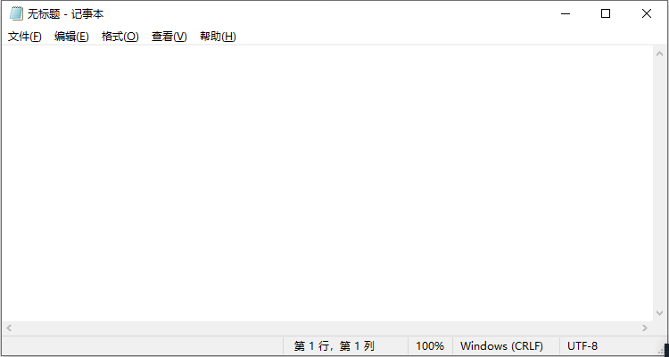

---
title: 文件行末的CR与LF
date: 2023-03-09 13:32:16
summary: 本文分享文件行末的CR与LF的含义。
tags:
- 程序设计
categories:
- 程序设计
---

# 问题引入

打开Notepad记事本时，右下角的`Windows (CRLF)`很多人可能都不知道是什么意思。本文带读者认识其含义。

# 回车符与换行符

对于一贯使用Windows系统的我们，“回车”与“换行”看起来是一个功能，因为只需要按下键盘的“Enter”键即可。然而，在计算机系统中，“回车符”和“换行符”并不一样。

“回车符”和“换行符”起源于早期的计算机打纸带时期。“回车符”告诉打字机把打印头定位在纸带的左边界，而“换行符”告诉打字机把纸带向下移一行。
现如今，“回车符”告诉计算机将光标到行首，而“换行符”告诉计算机将光标下移一格。

回车，英文为Carriage Return，简称**CR**。回车符的转义字符表示是`\r`，其十进制ASCII码是**13**，十六进制ASCII码是**0x0D**。
换行，英文为Line Feed，简称**LF**。换行符的转义字符表示是`\n`，其十进制ASCII码是**10**，十六进制ASCII码是**0x0A**。

推荐阅读：[ASCII码表](https://blankspace.blog.csdn.net/article/details/102652402)

# 不同操作系统的行末字符

对于MacOS系统，其文本文件的每行结尾只有回车符，记作CR，即`\r`。
对于UNIX/Linux系统，其文本文件的每行结尾只有换行符，记作LF，即`\n`。
对于DOS/Windows系统，其文本文件的每行结尾既有回车符也有换行符，记作CRLF，即`\r\n`。

之所以可以只用`\r`或`\n`，是因为有的计算机科学家认为`\r\n`占用两个字节有些浪费。

由于Windows的文本文件的行末使用`\r\n`，因此把这样的文件上传到Linux后，有些版本的vi不能识别`\r`，显示时在行尾会出现`^M`。甚至，由于跨操作系统的行末字符不兼容，一些奇怪的错误可能出现。
