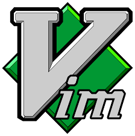

---
title: 文本编辑器
date: 2023-03-26 20:21:25
summary: 本文分享文本编辑器的相关内容。
tags:
- 程序设计
categories:
- 程序设计
---

# 文本编辑器

文本编辑器是一种用于编辑纯文本文件的应用程序。与字处理软件不同，它不会对文本格式进行格式化或布局。它主要用于编辑代码、配置文件、文本文件等。

下面是文本编辑器的一些常见特点和功能：
- 纯文本编辑：文本编辑器只能编辑纯文本，不能编辑包含格式或样式的文件，如图像、音频、视频、HTML、XML等。
- 代码高亮：为了让代码更易于阅读和编辑，文本编辑器通常会对不同的编程语言和语法进行高亮显示，使代码结构更加清晰。
- 自动缩进：文本编辑器可以根据代码结构自动缩进，使代码更加整洁和易于阅读。
- 代码折叠：对于较长的代码文件，文本编辑器可以将一些代码块折叠起来，以便更好地掌握整个代码的结构。
- 搜索和替换：文本编辑器支持查找和替换功能，可以在整个文本文件中快速查找和替换指定的文本。
- 多行编辑：文本编辑器可以在多行中同时插入、删除和编辑文本，提高了编辑效率。
- 支持多种编码格式：文本编辑器可以支持多种编码格式，如UTF-8、GBK、ANSI等。
- 可配置性：文本编辑器通常可以通过设置来配置其外观和行为，如字体、主题、快捷键等。
- 插件和扩展：许多文本编辑器支持插件和扩展，可以添加新功能和自定义行为。

常见的文本编辑器包括Windows下的Notepad、Sublime Text、Visual Studio Code、Linux下的Vim、Emacs、nano等，以及MacOS下的TextEdit、Sublime Text、Atom等。

# Sublime Text

Sublime Text是一款跨平台的代码编辑器，它可以运行在Windows、Linux和Mac OS X操作系统上。

Sublime Text的主要特点包括：
- 速度快：Sublime Text使用C++编写，因此它非常快。它的速度比许多其他文本编辑器都快，因此它被广泛地用于编写代码。
- 插件支持：Sublime Text支持插件，可以添加许多额外的功能。用户可以通过官方插件仓库或第三方插件仓库来下载和安装插件。
- 多选择编辑：Sublime Text支持多选择编辑功能。用户可以选择多个文本区域进行编辑，这可以提高编辑效率。
- 多光标编辑：Sublime Text支持多光标编辑。用户可以在文本文件中创建多个光标，以便同时编辑多个位置的文本。
- 命令面板：Sublime Text有一个命令面板，可以让用户快速访问各种功能，而不必浏览菜单或使用快捷键。
- 自动完成：Sublime Text支持自动完成功能。它可以自动补全代码、函数名和变量名等。
- 语法高亮：Sublime Text支持语法高亮。它可以根据代码语言和语法将不同类型的代码块着色，使代码更易于阅读。
- 主题和外观：Sublime Text支持主题和外观。用户可以选择自己喜欢的主题和外观来定制编辑器的外观。
- 快捷键：Sublime Text支持各种快捷键，用户可以使用快捷键来执行各种操作，如打开文件、保存文件、复制、粘贴等。

总之，Sublime Text是一款功能强大的文本编辑器，特别适合程序员和开发人员使用。它具有许多有用的功能，可以帮助用户提高编码效率和舒适性。

# Visual Studio Code

Visual Studio Code是一款由微软开发的轻量级代码编辑器，支持多种编程语言和平台，包括Windows、Linux和macOS。

Visual Studio Code的主要特点包括：
- 插件生态系统：Visual Studio Code拥有一个强大的插件生态系统，用户可以从官方插件库或第三方插件库中下载并安装各种插件，以便在编辑器中添加新功能或扩展现有功能。
- 代码自动完成：Visual Studio Code内置了代码自动完成功能，它可以根据已经输入的代码内容，智能提示代码片段、函数名和变量名等，从而减少了手工输入的时间。
- 代码片段：Visual Studio Code支持代码片段，用户可以预先定义一些常用的代码片段，然后在需要的时候使用代码片段加快编写速度。
- 内置调试器：Visual Studio Code内置了调试器，可以直接在编辑器中进行调试。用户可以设置断点、单步执行程序、查看变量的值和调用堆栈等。
- 版本控制：Visual Studio Code支持多种版本控制工具，如Git和SVN。用户可以在编辑器中直接进行版本控制操作，比如提交、回滚和合并等。
- 主题和外观：Visual Studio Code支持许多主题和外观，用户可以自由选择自己喜欢的主题和外观，以适应个人偏好和工作环境。
- 任务管理器：Visual Studio Code支持任务管理器，可以帮助用户管理和运行各种任务，如编译、测试和部署等。
- 轻量级：相比于其他IDE，Visual Studio Code是一款轻量级的编辑器，启动速度快，占用系统资源少，适合在较低配置的计算机上使用。

总之，Visual Studio Code是一款非常优秀的代码编辑器，它拥有许多有用的功能，可以帮助开发人员提高工作效率。同时，它的插件生态系统也让它变得非常灵活，可以适应不同的编程语言和工作流程。

# Vim

Vim是一款功能强大的文本编辑器，主要用于在终端中编辑文本文件，支持多种操作系统，如Unix、Linux、MacOS和Windows等。

Vim的主要特点包括：
- 模式：Vim有多种模式，包括普通模式、插入模式、可视模式和命令行模式。普通模式下可以进行移动光标、复制、粘贴等基本操作；插入模式下可以输入文本；可视模式下可以选择文本；命令行模式下可以执行命令。
- 快捷键：Vim内置了大量的快捷键，可以通过快捷键完成各种操作，例如复制、粘贴、搜索等。由于Vim的快捷键非常丰富，因此需要一定的学习成本，但是一旦掌握了快捷键，编辑文本的速度会大大提高。
- 插件：Vim支持插件，用户可以从插件库中下载并安装各种插件，以便在编辑器中添加新功能或扩展现有功能。常用的插件包括语法高亮、自动补全、代码片段等。
- 宏：Vim支持宏，用户可以录制一系列操作，然后将它们保存为宏，并在需要的时候重复执行。宏可以帮助用户快速重复一些重复性的操作，从而提高工作效率。
- 自定义：Vim支持自定义配置，用户可以根据自己的需求配置各种参数，例如快捷键、插件和外观等。由于Vim的配置非常灵活，因此可以适应不同的编程语言和工作流程。
- 跨平台：Vim支持多种操作系统，可以在不同的平台上使用，并且具有相同的界面和功能。

总之，Vim是一款非常强大的文本编辑器，它具有很多有用的功能，可以帮助用户高效地编辑文本文件。虽然Vim的学习曲线比较陡峭，但一旦掌握了它的基本操作和快捷键，就可以大大提高编写文本的效率。
