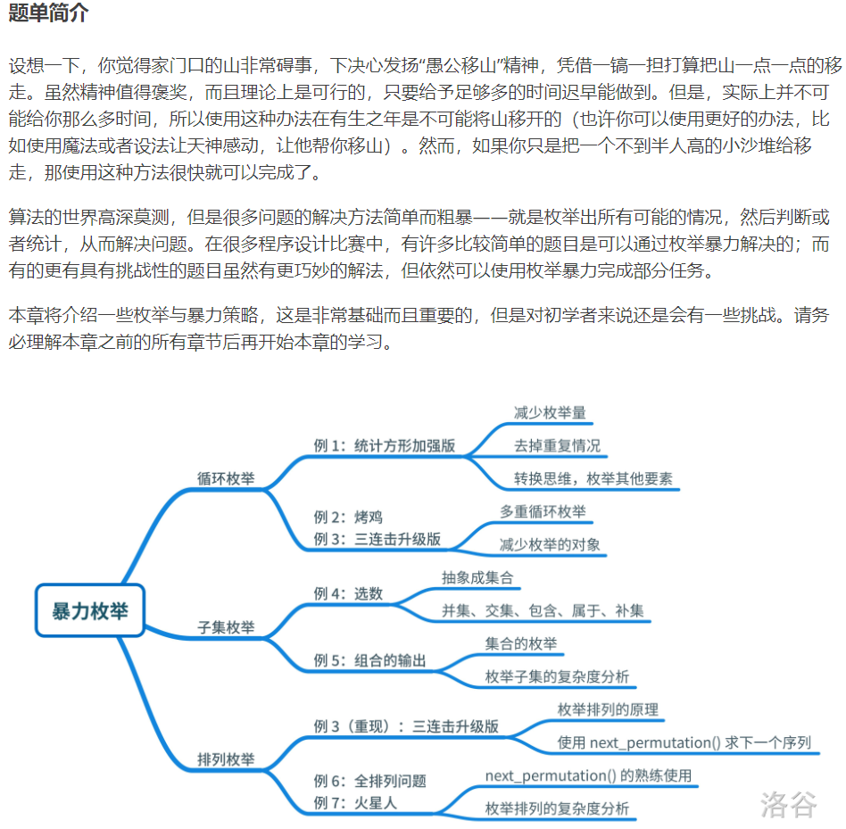

---
title: 暴力枚举
date: 2021-04-03 22:41:23
summary: 本文通过洛谷暴力枚举题单，分享暴力枚举类程序设计的一些技巧和心得。
mathjax: true
tags:
- 程序设计
categories:
- 程序设计
---

# 题单简介

洛谷暴力枚举题单内容：



# P2241 统计方形

## 题目背景

1997年普及组第一题

## 题目描述

有一个 $n \times m$ 方格的棋盘，求其方格包含多少正方形、长方形（不包含正方形）。

## 输入格式

一行，两个正整数 $n,m$（$n \leq 5000,m \leq 5000$）。

## 输出格式

一行，两个正整数，分别表示方格包含多少正方形、长方形（不包含正方形）。

## 样例 #1

### 样例输入 #1

```
2 3
```

### 样例输出 #1

```
8 10
```

## 程序设计

根据排列组合，得到矩形（含正方形）的数量为$C_{n+1}^{2}C_{m+1}^{2}$。

而对于一个边长为$i$ ($1≤i≤\min\{n, m\}$) 的正方形，数量为$(n-i+1)×(m-i+1)$，所以所有的正方形的数量是$\sum\limits_{i=1}^{\min\{n, m\}}(n-i+1)(m-i+1)$。

由于本题的长方形不考虑正方形，所以真实数值为上面两个数值做减法，即$C_{n+1}^{2}C_{m+1}^{2}-\sum\limits_{i=1}^{\min\{n, m\}}(n-i+1)(m-i+1)$。

## 实现代码

```java
import java.util.Scanner;

public class Main {
    public static void main(String[] args) {
        Scanner scanner = new Scanner(System.in);
        long m = scanner.nextLong(), n = scanner.nextLong();
        scanner.close();
        long rectangle = (m*(m+1)/2)*(n*(n+1)/2), square = 0;
        for (long i = 1; i <= Math.min(m, n); i++) {
            square += (n-i+1)*(m-i+1);
        }
        System.out.println(square + " " + (rectangle-square));
    }
}
```

## 代码提交

[洛谷 P2241 统计方形](https://www.luogu.com.cn/problem/P2241)


# P2089 烤鸡

## 题目背景

猪猪 Hanke 得到了一只鸡。

## 题目描述

猪猪 Hanke 特别喜欢吃烤鸡（本是同畜牲，相煎何太急！）Hanke 吃鸡很特别，为什么特别呢？因为他有 $10$ 种配料（芥末、孜然等），每种配料可以放 $1$ 到 $3$ 克，任意烤鸡的美味程度为所有配料质量之和。

现在， Hanke 想要知道，如果给你一个美味程度 $n$ ，请输出这 $10$ 种配料的所有搭配方案。

## 输入格式

一个正整数 $n$，表示美味程度。

## 输出格式

第一行，方案总数。

第二行至结束，$10$ 个数，表示每种配料所放的质量，按字典序排列。

如果没有符合要求的方法，就只要在第一行输出一个 $0$。

## 样例 #1

### 样例输入 #1

```
11
```

### 样例输出 #1

```
10
1 1 1 1 1 1 1 1 1 2 
1 1 1 1 1 1 1 1 2 1 
1 1 1 1 1 1 1 2 1 1 
1 1 1 1 1 1 2 1 1 1 
1 1 1 1 1 2 1 1 1 1 
1 1 1 1 2 1 1 1 1 1 
1 1 1 2 1 1 1 1 1 1 
1 1 2 1 1 1 1 1 1 1 
1 2 1 1 1 1 1 1 1 1 
2 1 1 1 1 1 1 1 1 1
```

## 提示

对于 $100\%$ 的数据，$n \leq 5000$。

## 程序设计

略

## 实现代码

```java
import java.util.LinkedList;
import java.util.List;
import java.util.Scanner;

public class Main {
    public static void main(String[] args) {
        Scanner scanner = new Scanner(System.in);
        int num = scanner.nextInt(), counter = 0;
        scanner.close();
        List<StringBuilder> list = new LinkedList<>();
        for (int a = 1; a <= 3; a++) {
            for (int b = 1; b <= 3; b++) {
                for (int c = 1; c <= 3; c++) {
                    for (int d = 1; d <= 3; d++) {
                        for (int e = 1; e <= 3; e++) {
                            for (int f = 1; f <= 3; f++) {
                                for (int g = 1; g <= 3; g++) {
                                    for (int h = 1; h <= 3; h++) {
                                        for (int i = 1; i <= 3; i++) {
                                            for (int j = 1; j <= 3; j++) {
                                                if (a + b + c + d + e + f + g + h + i + j == num) {
                                                    counter++;
                                                    StringBuilder str = new StringBuilder();
                                                    str.append(a).append(" ").append(b).append(" ").append(c)
                                                            .append(" ").append(d).append(" ").append(e).append(" ")
                                                            .append(f).append(" ").append(g).append(" ").append(h)
                                                            .append(" ").append(i).append(" ").append(j);
                                                    list.add(str);
                                                }
                                            }
                                        }
                                    }
                                }
                            }
                        }
                    }
                }
            }
        }
        System.out.println(counter);
        for (StringBuilder str : list) {
            System.out.println(str);
        }
    }
}
```

## 代码提交

[洛谷 P2089 烤鸡](https://www.luogu.com.cn/problem/P2089)

# P1008 三连击

## 题目背景

本题为提交答案题，您可以写程序或手算在本机上算出答案后，直接提交答案文本，也可提交答案生成程序。

## 题目描述

将 $1, 2, \ldots , 9$ 共 $9$ 个数分成 $3$ 组，分别组成 $3$ 个三位数，且使这 $3$ 个三位数构成 $1 : 2 : 3$ 的比例，试求出所有满足条件的 $3$ 个三位数。

## 输入格式

无

## 输出格式

若干行，每行 $3$ 个数字。按照每行第 $1$ 个数字升序排列。

## 样例 #1

### 样例输入 #1

```
无
```

### 样例输出 #1

```
192 384 576
* * *
...

* * *
（剩余部分不予展示）
```

## 程序设计

略

## 实现代码

```java
public class Main {

    private static byte[] arr = new byte[9];

    public static void main(String[] args) {
        for (int i = 123; i < 333; i++) {
            arr = new byte[9];
            int two = 2*i, three = 3*i;
            if (judge(i) && judge(two) && judge(three)) {
                System.out.println(i + " " + two + " " + three);
            }
        }
    }

    private static boolean judge(int i) {
        int a = i / 100;
        int b = (i % 100) / 10;
        int c = i - a*100 - b*10;
        if (b == 0 || c == 0 || a == b || a == c || b == c || arr[a-1] == 1 || arr[b-1] == 1 || arr[c-1] == 1) {
            return false;
        }
        arr[a-1] = arr[b-1] = arr[c-1] = 1;
        return true;
    }
    
}
```

## 代码提交

[洛谷 P1008 三连击](https://www.luogu.com.cn/problem/P1008)

# P1036 选数

## 题目描述

已知 $n$ 个整数 $x_1,x_2,\cdots,x_n$，以及 $1$ 个整数 $k$（$k<n$）。从 $n$ 个整数中任选 $k$ 个整数相加，可分别得到一系列的和。例如当 $n=4$，$k=3$，$4$ 个整数分别为 $3,7,12,19$ 时，可得全部的组合与它们的和为：

$3+7+12=22$

$3+7+19=29$

$7+12+19=38$

$3+12+19=34$

现在，要求你计算出和为素数共有多少种。

例如上例，只有一种的和为素数：$3+7+19=29$。

## 输入格式

第一行两个空格隔开的整数 $n,k$（$1 \le n \le 20$，$k<n$）。

第二行 $n$ 个整数，分别为 $x_1,x_2,\cdots,x_n$（$1 \le x_i \le 5\times 10^6$）。

## 输出格式

输出一个整数，表示种类数。

## 样例 #1

### 样例输入 #1

```
4 3
3 7 12 19
```

### 样例输出 #1

```
1
```

## 提示

**【题目来源】**

NOIP 2002 普及组第二题

## 程序设计

略

## 实现代码

```java
import java.util.Scanner;

public class Main {

    private static int num, k;

    private static int[] array = new int[25];

    private static long result;

    private static boolean isPrime(int a){//判断素数
        for(int i = 2; i*i <= a; i++) {
            if(a % i == 0) {
                return false;
            }
        }
        return true;
    }

    private static void dfs(int m, int sum, int starts) {
        if(m == k) {
            if(isPrime(sum)) {
                result++;
            }
            return;
        }
        for(int i = starts; i < num; i++) {
            dfs(m+1, sum+ array[i], i+1);
        }
    }

    public static void main(String[] args) {
        Scanner scanner = new Scanner(System.in);
        num = scanner.nextInt();
        k = scanner.nextInt();
        for(int i = 0; i < num; i++) {
            array[i] = scanner.nextInt();
        }
        dfs(0, 0, 0);
        System.out.println(result);
    }

}
```

## 代码提交

[洛谷 P1036 选数](https://www.luogu.com.cn/problem/P1036)

# P1157 组合的输出

## 题目描述

排列与组合是常用的数学方法，其中组合就是从 $n$ 个元素中抽出 $r$ 个元素（不分顺序且 $r \le n$），我们可以简单地将 $n$ 个元素理解为自然数 $1,2,\dots,n$，从中任取 $r$ 个数。

现要求你输出所有组合。

例如 $n=5,r=3$，所有组合为：

$123,124,125,134,135,145,234,235,245,345$。

## 输入格式

一行两个自然数 $n,r(1<n<21,0 \le r \le n)$。

## 输出格式

所有的组合，每一个组合占一行且其中的元素按由小到大的顺序排列，每个元素占三个字符的位置，所有的组合也按字典顺序。

**注意哦！输出时，每个数字需要 $3$ 个场宽。以 C++ 为例，你可以使用下列代码：**

```cpp
cout << setw(3) << x;
```

输出占 $3$ 个场宽的数 $x$。注意你需要头文件 `iomanip`。

## 样例 #1

### 样例输入 #1

```
5 3
```

### 样例输出 #1

```
1  2  3
  1  2  4
  1  2  5
  1  3  4
  1  3  5
  1  4  5
  2  3  4
  2  3  5
  2  4  5
  3  4  5
```

## 程序设计

略

## 实现代码

```java
import java.util.Scanner;

public class Main {

    private static int r, n;

    private static int[] array;

    private static void dfs(int k) {
        if(k > r) {
            StringBuilder builder = new StringBuilder();
            for(int i = 1; i <= r; i++) {
                if (array[i] >= 10) {
                    builder.append(" ").append(array[i]);
                } else {
                    builder.append("  ").append(array[i]);
                }
            }
            System.out.println(builder);
            return;
        }
        for(int i = array[k-1]+1; i <= n; i++){
            array[k] = i;
            dfs(k+1);
        }
    }

    public static void main(String[] args) {
        Scanner scanner = new Scanner(System.in);
        n = scanner.nextInt();
        r = scanner.nextInt();
        scanner.close();
        array = new int[n+1];
        dfs(1);
    }
    
}
```

## 代码提交

[洛谷 P1157 组合的输出](https://www.luogu.com.cn/problem/P1157)

# P1706 全排列问题

## 题目描述

按照字典序输出自然数 $1$ 到 $n$ 所有不重复的排列，即 $n$ 的全排列，要求所产生的任一数字序列中不允许出现重复的数字。

## 输入格式

一个整数 $n$。

## 输出格式

由 $1 \sim n$ 组成的所有不重复的数字序列，每行一个序列。

每个数字保留 $5$ 个场宽。

## 样例 #1

### 样例输入 #1

```
3
```

### 样例输出 #1

```
1    2    3
    1    3    2
    2    1    3
    2    3    1
    3    1    2
    3    2    1
```

## 提示

$1 \leq n \leq 9$。

## 程序设计

略

## 实现代码

```java
import java.util.Scanner;

public class Main {

    private static StringBuilder result = new StringBuilder();

    private static int num;

    private static int[] sequence;

    private static boolean[] used;

    private static void dfs(int k) {
        if (k == num) {
            for (int j = 1; j <= num; j++) {
                result.append(' ').append(' ').append(' ').append(' ').append(sequence[j]);
            }
            result.append('\n');
            return;
        }
        for (int i = 1; i <= num; i++) {
            if (!used[i]) {
                used[i] = true;
                sequence[k+1] = i;
                dfs(k+1);
                used[i] = false;
            }
        }
    }

    public static void main(String[] args) {
        Scanner scanner = new Scanner(System.in);
        num = scanner.nextInt();
        scanner.close();
        sequence = new int[num+1];
        used = new boolean[num+1];
        dfs(0);
        System.out.print(result);
    }

}
```

## 代码提交

[洛谷 P1706 全排列问题](https://www.luogu.com.cn/problem/P1706)

# P1088 火星人

## 题目描述

人类终于登上了火星的土地并且见到了神秘的火星人。人类和火星人都无法理解对方的语言，但是我们的科学家发明了一种用数字交流的方法。这种交流方法是这样的，首先，火星人把一个非常大的数字告诉人类科学家，科学家破解这个数字的含义后，再把一个很小的数字加到这个大数上面，把结果告诉火星人，作为人类的回答。

火星人用一种非常简单的方式来表示数字――掰手指。火星人只有一只手，但这只手上有成千上万的手指，这些手指排成一列，分别编号为 $1,2,3,\cdots$。火星人的任意两根手指都能随意交换位置，他们就是通过这方法计数的。

一个火星人用一个人类的手演示了如何用手指计数。如果把五根手指――拇指、食指、中指、无名指和小指分别编号为 $1,2,3,4$ 和 $5$，当它们按正常顺序排列时，形成了 $5$ 位数 $12345$，当你交换无名指和小指的位置时，会形成 $5$ 位数 $12354$，当你把五个手指的顺序完全颠倒时，会形成 $54321$，在所有能够形成的 $120$ 个 $5$ 位数中，$12345$ 最小，它表示 $1$；$12354$ 第二小，它表示 $2$；$54321$ 最大，它表示 $120$。下表展示了只有 $3$ 根手指时能够形成的 $6$ 个 $3$ 位数和它们代表的数字：


| 三进制数 | 代表的数字 |
|:-:|:-:|
| $123$ | $1$ |
| $132$ | $2$ |
| $213$ | $3$ |
| $231$ | $4$ |
| $312$ | $5$ |
| $321$ | $6$ |

现在你有幸成为了第一个和火星人交流的地球人。一个火星人会让你看他的手指，科学家会告诉你要加上去的很小的数。你的任务是，把火星人用手指表示的数与科学家告诉你的数相加，并根据相加的结果改变火星人手指的排列顺序。输入数据保证这个结果不会超出火星人手指能表示的范围。

## 输入格式

共三行。  
第一行一个正整数 $N$，表示火星人手指的数目（$1 \le N \le 10000$）。  
第二行是一个正整数 $M$，表示要加上去的小整数（$1  \le  M  \le  100$）。  
下一行是 $1$ 到 $N$ 这 $N$ 个整数的一个排列，用空格隔开，表示火星人手指的排列顺序。

## 输出格式

$N$ 个整数，表示改变后的火星人手指的排列顺序。每两个相邻的数中间用一个空格分开，不能有多余的空格。

## 样例 #1

### 样例输入 #1

```
5
3
1 2 3 4 5
```

### 样例输出 #1

```
1 2 4 5 3
```

## 提示

对于 $30\%$ 的数据，$N \le 15$。

对于 $60\%$ 的数据，$N \le 50$。

对于 $100\%$ 的数据，$N \le 10000$。

noip2004 普及组第 4 题

## 程序设计

略

## 实现代码

```cpp
#include <iostream>
#include <algorithm>

using namespace std;

int nums[10010];

int main() {
    int n, m;
    cin >> n >> m;
    for (int i = 0; i < n; i++) {
        cin >> nums[i];
    }
    while (m--) {
        next_permutation(nums, nums+n);
    }
    for (int i = 0; i < n; i++) {
        cout << nums[i] << " ";
    }
    return 0;
}
```

## 代码提交

[洛谷 P1088 火星人](https://www.luogu.com.cn/problem/P1088)

# P3392 涂国旗

## 题目描述

某国法律规定，只要一个由 $N \times M$ 个小方块组成的旗帜符合如下规则，就是合法的国旗。（毛熊：阿嚏——）

- 从最上方若干行（至少一行）的格子全部是白色的；
- 接下来若干行（至少一行）的格子全部是蓝色的；
- 剩下的行（至少一行）全部是红色的；

现有一个棋盘状的布，分成了 $N$ 行 $M$ 列的格子，每个格子是白色蓝色红色之一，小 a 希望把这个布改成该国国旗，方法是在一些格子上涂颜料，盖住之前的颜色。

小a很懒，希望涂最少的格子，使这块布成为一个合法的国旗。

## 输入格式

第一行是两个整数 $N,M$。

接下来 $N$ 行是一个矩阵，矩阵的每一个小方块是`W`（白），`B`（蓝），`R`（红）中的一个。

## 输出格式

一个整数，表示至少需要涂多少块。

## 样例 #1

### 样例输入 #1

```
4 5
WRWRW
BWRWB
WRWRW
RWBWR
```

### 样例输出 #1

```
11
```

## 提示

### 样例解释

目标状态是：

```plain
WWWWW
BBBBB
RRRRR
RRRRR
```
一共需要改 $11$ 个格子。

### 数据范围

对于 $100\%$ 的数据，$N,M \leq 50$。

## 程序设计

由于三种颜色都至少有一行，所以：
- $W$: $[0, N-2)$
- $B$ : $[1, N-1)$
- $R$ : $[2, N)$

这是最极限的情况，也是理论上的情况，实际上$B$被$W$约束着，$R$被$B$直接约束且被$W$间接约束。暴力枚举需要确定的就是$W$的右边界以及基于$W$右边界的$B$右边界。

先循环$i$和$j$，再内部循环白、蓝、红，千万别搞错。由于是取最小值，所以初始化的$min$值要定的大一些，比如**0x7fffffff**。

暴力枚举下来，算法的时间复杂度为$O(n^3×m)$。

算法可以优化到[$O(n^2+nm)$](https://www.luogu.com.cn/blog/home/solution-p3392#)

## 实现代码

```java
import java.io.BufferedReader;
import java.io.IOException;
import java.io.InputStreamReader;

public class Main {
    public static void main(String[] args) throws IOException {
        BufferedReader reader = new BufferedReader(new InputStreamReader(System.in));
        String[] line1 = reader.readLine().split("\\s+");
        int n = Integer.parseInt(line1[0]), m = Integer.parseInt(line1[1]);
        char[][] graph = new char[n][m];
        for (int i = 0; i < n; i++) {
            char[] read_temp = reader.readLine().toCharArray();
            for (int j = 0; j < m; j++) {
                graph[i][j] = read_temp[j];
            }
        }
        reader.close();
        int min_result = 0x7fffffff, temp_result = 0;
        //确定白行数
        for (int i = 0; i < n-2; i++) {
            //确定蓝行数
            for (int j = i+1; j < n-1; j++) {
                //循环白
                for (int k = 0; k <= i; k++) {
                   for (int p = 0; p < m; p++) {
                     if (graph[k][p] != 'W') {
                          temp_result++;
                        }
                    }
                }
                //循环蓝
                for (int k = i+1; k <= j; k++) {
                    for (int p = 0; p < m; p++) {
                        if (graph[k][p] != 'B') {
                            temp_result++;
                        }
                    }
                }
                //循环红
                for (int k = j+1; k < n; k++) {
                    for (int p = 0; p < m; p++) {
                        if (graph[k][p] != 'R') {
                            temp_result++;
                        }
                    }
                }
                if (temp_result < min_result) {
                    min_result = temp_result;
                }
                temp_result = 0;
            }
        }
        System.out.println(min_result);
    }
}
```

## 代码提交

[洛谷 P3392 涂国旗](https://www.luogu.com.cn/problem/P3392)

# P3654 First Step

## 题目背景

我们 Aqours，要第一次举办演唱会啦！

虽然学生会长看上去不怎么支持我们的样子，可是有了理事长的支持，我们还是被允许在校内的篮球场里歌唱！

歌曲也好好地准备过了，名字叫“[最喜欢的话就没问题！ (ダイスキだったらダイジョウブ！)](https://zh.moegirl.org/%E6%9C%80%E5%96%9C%E6%AC%A2%E7%9A%84%E8%AF%9D%E5%B0%B1%E6%B2%A1%E9%97%AE%E9%A2%98)“，大家一定会喜欢的吧！

演唱会一定会顺利进行的！

希望不要发生**停电**什么的事故哦……！

## 题目描述

可是……这个篮球场，好像很久没有使用过的样子啊……

里面堆满了学校的各种杂物呢……

我们 Aqours 的成员要怎么在里面列队站下呢？


我们浦之星女子学院的篮球场是一个 $R$ 行 $C$ 列的矩阵，其中堆满了各种学校的杂物 (用 `#` 表示)，空地 (用 `.` 表示) 好像并不多的样子呢……

我们 Aqours 现在已经一共有 $K$ 个队员了，要歌唱舞蹈起来的话，我们得排成一条 $1\times K$ 的直线，一个接一个地站在篮球场的空地上呢 (横竖均可)。

我们想知道一共有多少种可行的站位方式呢。

Aqours 的真正的粉丝的你，能帮我们算算吗？

## 输入格式

第一行三个整数 $R, C, K$。

接下来的 $R$ 行 $C$ 列，表示浦之星女子学院篮球场。

## 输出格式

总共的站位方式数量。

## 样例 #1

### 样例输入 #1

```
5 5 2
.###.
##.#.
..#..
#..#.
#.###
```

### 样例输出 #1

```
8
```

## 提示

|  | $R$ | $C$ | $K$ | 备注 |
| :----------: | :----------: | :----------: | :----------: | :----------: |
|$1\sim2$|$\leq 10$|$\leq 10$|$\leq \min(R,C)$|无|
|$3\sim4$|$\leq 100$|$\leq 100$|$\leq 1$|无|
|$5\sim6$|$\leq 100$|$\leq 100$|$\leq \min(R,C)$|没有障碍|
|$7\sim10$|$\leq 100$|$\leq 100$|$\leq \min(R,C)$|无|

对于所有数据，$1 \leq R,C \leq 100$，$1 \leq k \leq \min(R,C)$。

## 程序设计

题意提到的连续的`.`，可以是水平连续或是垂直连续。

可以暴力枚举搜索，从开始搜到最后，每次只搜右向和下向，避免重复搜索，注意防止越界。

当连续值为1的时候，直接找一下一共几个点就行了，否则就会重复一倍。

## 实现代码

```java
import java.io.BufferedReader;
import java.io.IOException;
import java.io.InputStreamReader;

public class Main {
    public static void main(String[] args) throws IOException {
        int result = 0;
        BufferedReader reader = new BufferedReader(new InputStreamReader(System.in));
        String[] line1 = reader.readLine().split("\\s+");
        int n = Integer.parseInt(line1[0]), m = Integer.parseInt(line1[1]), k = Integer.parseInt(line1[2]);
        char[][] graph = new char[n][m];
        for (int i = 0; i < n; i++) {
            char[] read_temp = reader.readLine().toCharArray();
            for (int j = 0; j < m; j++) {
                graph[i][j] = read_temp[j];
            }
        }
        reader.close();
        if (k == 1) {
            for (int i = 0; i < n; i++) {
                for (int j = 0; j < m; j++) {
                    if (graph[i][j] == '.') {
                        result++;
                    }
                }
            }
            System.out.println(result);
            return;
        }
        boolean flag = false;
        for (int i = 0; i < n; i++) {
            for (int j = 0; j < m; j++) {
                for (int p = 0; p < k; p++) {
                    if (i+p >= n) {
                        flag = true;
                        break;
                    } else if (graph[i+p][j] != '.') {
                        flag = true;
                    }
                }
                if (flag) {
                    flag = false;
                } else {
                    result++;
                }
                for (int p = 0; p < k; p++) {
                    if (j+p >= m) {
                        flag = true;
                        break;
                    } else if (graph[i][j+p] != '.') {
                        flag = true;
                    }
                }
                if (flag) {
                    flag = false;
                } else {
                    result++;
                }
            }
        }
        System.out.println(result);
    }
}
```

## 代码提交

[洛谷 P3654 First Step](https://www.luogu.com.cn/problem/P3654)

# P1217 回文质数

## 题目描述

因为 $151$ 既是一个质数又是一个回文数（从左到右和从右到左是看一样的），所以 $151$ 是回文质数。

写一个程序来找出范围 $[a,b] (5 \le a < b \le 100,000,000)$（一亿）间的所有回文质数。

## 输入格式

第一行输入两个正整数 $a$ 和 $b$。

## 输出格式

输出一个回文质数的列表，一行一个。

## 样例 #1

### 样例输入 #1

```
5 500
```

### 样例输出 #1

```
5
7
11
101
131
151
181
191
313
353
373
383
```

## 提示

Hint 1: Generate the palindromes and see if they are prime.

提示 1: 找出所有的回文数再判断它们是不是质数（素数）.


Hint 2: Generate palindromes by combining digits properly. You might need more than one of the loops like below.

提示 2: 要产生正确的回文数，你可能需要几个像下面这样的循环。


题目翻译来自NOCOW。

USACO Training Section 1.5


产生长度为 $5$ 的回文数：

```cpp
for (d1 = 1; d1 <= 9; d1+=2) {    // 只有奇数才会是素数
     for (d2 = 0; d2 <= 9; d2++) {
         for (d3 = 0; d3 <= 9; d3++) {
           palindrome = 10000*d1 + 1000*d2 +100*d3 + 10*d2 + d1;//(处理回文数...)
         }
     }
 }
```

## 程序设计

可以用线性筛去筛质数，这里用打表法处理。

打表法就是将题目中需要的答案集合提前算出来，存到代码里，根据题目所需取答案，这种方法通常只需要将程序挂着，在表打完后进行加工，最终取答案程序时间复杂度为$O(1)$，空间复杂度为$O(n)$($n$为答案规模)。

常识：
- 除$11$外，偶数位数回文数必定不是质数，所以只要运行到$10,000,000$。
- 偶数肯定不是质数。这样至少排除一半多的数据量。

## 实现代码

```java
import java.util.Scanner;

public class Main {
    public static void main(String[] args) {
        int [] array = new int[] {5,7,11,101,131,151,181,191,313,353,373,383,727,757,787,797,919,929,10301,
                10501,10601,11311,11411,12421,12721,12821,13331,13831,13931,14341,14741,15451,15551,16061,
                16361,16561,16661,17471,17971,18181,18481,19391,19891,19991,30103,30203,30403,30703,30803,
                31013,31513,32323,32423,33533,34543,34843,35053,35153,35353,35753,36263,36563,37273,37573,
                38083,38183,38783,39293,70207,70507,70607,71317,71917,72227,72727,73037,73237,73637,74047,
                74747,75557,76367,76667,77377,77477,77977,78487,78787,78887,79397,79697,79997,90709,91019,
                93139,93239,93739,94049,94349,94649,94849,94949,95959,96269,96469,96769,97379,97579,97879,
                98389,98689,1003001,1008001,1022201,1028201,1035301,1043401,1055501,1062601,1065601,1074701,
                1082801,1085801,1092901,1093901,1114111,1117111,1120211,1123211,1126211,1129211,1134311,
                1145411,1150511,1153511,1160611,1163611,1175711,1177711,1178711,1180811,1183811,1186811,
                1190911,1193911,1196911,1201021,1208021,1212121,1215121,1218121,1221221,1235321,1242421,
                1243421,1245421,1250521,1253521,1257521,1262621,1268621,1273721,1276721,1278721,1280821,
                1281821,1286821,1287821,1300031,1303031,1311131,1317131,1327231,1328231,1333331,1335331,
                1338331,1343431,1360631,1362631,1363631,1371731,1374731,1390931,1407041,1409041,1411141,
                1412141,1422241,1437341,1444441,1447441,1452541,1456541,1461641,1463641,1464641,1469641,
                1486841,1489841,1490941,1496941,1508051,1513151,1520251,1532351,1535351,1542451,1548451,
                1550551,1551551,1556551,1557551,1565651,1572751,1579751,1580851,1583851,1589851,1594951,
                1597951,1598951,1600061,1609061,1611161,1616161,1628261,1630361,1633361,1640461,1643461,
                1646461,1654561,1657561,1658561,1660661,1670761,1684861,1685861,1688861,1695961,1703071,
                1707071,1712171,1714171,1730371,1734371,1737371,1748471,1755571,1761671,1764671,1777771,
                1793971,1802081,1805081,1820281,1823281,1824281,1826281,1829281,1831381,1832381,1842481,
                1851581,1853581,1856581,1865681,1876781,1878781,1879781,1880881,1881881,1883881,1884881,
                1895981,1903091,1908091,1909091,1917191,1924291,1930391,1936391,1941491,1951591,1952591,
                1957591,1958591,1963691,1968691,1969691,1970791,1976791,1981891,1982891,1984891,1987891,
                1988891,1993991,1995991,1998991,3001003,3002003,3007003,3016103,3026203,3064603,3065603,
                3072703,3073703,3075703,3083803,3089803,3091903,3095903,3103013,3106013,3127213,3135313,
                3140413,3155513,3158513,3160613,3166613,3181813,3187813,3193913,3196913,3198913,3211123,
                3212123,3218123,3222223,3223223,3228223,3233323,3236323,3241423,3245423,3252523,3256523,
                3258523,3260623,3267623,3272723,3283823,3285823,3286823,3288823,3291923,3293923,3304033,
                3305033,3307033,3310133,3315133,3319133,3321233,3329233,3331333,3337333,3343433,3353533,
                3362633,3364633,3365633,3368633,3380833,3391933,3392933,3400043,3411143,3417143,3424243,
                3425243,3427243,3439343,3441443,3443443,3444443,3447443,3449443,3452543,3460643,3466643,
                3470743,3479743,3485843,3487843,3503053,3515153,3517153,3528253,3541453,3553553,3558553,
                3563653,3569653,3586853,3589853,3590953,3591953,3594953,3601063,3607063,3618163,3621263,
                3627263,3635363,3643463,3646463,3670763,3673763,3680863,3689863,3698963,3708073,3709073,
                3716173,3717173,3721273,3722273,3728273,3732373,3743473,3746473,3762673,3763673,3765673,
                3768673,3769673,3773773,3774773,3781873,3784873,3792973,3793973,3799973,3804083,3806083,
                3812183,3814183,3826283,3829283,3836383,3842483,3853583,3858583,3863683,3864683,3867683,
                3869683,3871783,3878783,3893983,3899983,3913193,3916193,3918193,3924293,3927293,3931393,
                3938393,3942493,3946493,3948493,3964693,3970793,3983893,3991993,3994993,3997993,3998993,
                7014107,7035307,7036307,7041407,7046407,7057507,7065607,7069607,7073707,7079707,7082807,
                7084807,7087807,7093907,7096907,7100017,7114117,7115117,7118117,7129217,7134317,7136317,
                7141417,7145417,7155517,7156517,7158517,7159517,7177717,7190917,7194917,7215127,7226227,
                7246427,7249427,7250527,7256527,7257527,7261627,7267627,7276727,7278727,7291927,7300037,
                7302037,7310137,7314137,7324237,7327237,7347437,7352537,7354537,7362637,7365637,7381837,
                7388837,7392937,7401047,7403047,7409047,7415147,7434347,7436347,7439347,7452547,7461647,
                7466647,7472747,7475747,7485847,7486847,7489847,7493947,7507057,7508057,7518157,7519157,
                7521257,7527257,7540457,7562657,7564657,7576757,7586857,7592957,7594957,7600067,7611167,
                7619167,7622267,7630367,7632367,7644467,7654567,7662667,7665667,7666667,7668667,7669667,
                7674767,7681867,7690967,7693967,7696967,7715177,7718177,7722277,7729277,7733377,7742477,
                7747477,7750577,7758577,7764677,7772777,7774777,7778777,7782877,7783877,7791977,7794977,
                7807087,7819187,7820287,7821287,7831387,7832387,7838387,7843487,7850587,7856587,7865687,
                7867687,7868687,7873787,7884887,7891987,7897987,7913197,7916197,7930397,7933397,7935397,
                7938397,7941497,7943497,7949497,7957597,7958597,7960697,7977797,7984897,7985897,7987897,
                7996997,9002009,9015109,9024209,9037309,9042409,9043409,9045409,9046409,9049409,9067609,
                9073709,9076709,9078709,9091909,9095909,9103019,9109019,9110119,9127219,9128219,9136319,
                9149419,9169619,9173719,9174719,9179719,9185819,9196919,9199919,9200029,9209029,9212129,
                9217129,9222229,9223229,9230329,9231329,9255529,9269629,9271729,9277729,9280829,9286829,
                9289829,9318139,9320239,9324239,9329239,9332339,9338339,9351539,9357539,9375739,9384839,
                9397939,9400049,9414149,9419149,9433349,9439349,9440449,9446449,9451549,9470749,9477749,
                9492949,9493949,9495949,9504059,9514159,9526259,9529259,9547459,9556559,9558559,9561659,
                9577759,9583859,9585859,9586859,9601069,9602069,9604069,9610169,9620269,9624269,9626269,
                9632369,9634369,9645469,9650569,9657569,9670769,9686869,9700079,9709079,9711179,9714179,
                9724279,9727279,9732379,9733379,9743479,9749479,9752579,9754579,9758579,9762679,9770779,
                9776779,9779779,9781879,9782879,9787879,9788879,9795979,9801089,9807089,9809089,9817189,
                9818189,9820289,9822289,9836389,9837389,9845489,9852589,9871789,9888889,9889889,9896989,
                9902099,9907099,9908099,9916199,9918199,9919199,9921299,9923299,9926299,9927299,9931399,
                9932399,9935399,9938399,9957599,9965699,9978799,9980899,9981899,9989899};
        Scanner scanner = new Scanner(System.in);
        int from = scanner.nextInt(), to = scanner.nextInt();
        scanner.close();
        for (int i : array) {
            if (i >= from) {
                if (i > to) {
                    break;
                } else {
                    System.out.println(i);
                }
            }
        }
    }
}
```

## 代码提交

[洛谷 P1217 回文质数](https://www.luogu.com.cn/problem/P1217)

# P1149 火柴棒等式

## 题目描述

给你 $n$ 根火柴棍，你可以拼出多少个形如 $A+B=C$ 的等式？等式中的 $A$、$B$、$C$ 是用火柴棍拼出的整数（若该数非零，则最高位不能是 $0$）。用火柴棍拼数字 $0\sim9$ 的拼法如图所示：

  

注意：

1. 加号与等号各自需要两根火柴棍；

2. 如果 $A\neq B$，则 $A+B=C$ 与 $B+A=C$ 视为不同的等式（$A,B,C\geq0$）；

3. $n$ 根火柴棍必须全部用上。

## 输入格式

一个整数 $n(1 \leq n\leq 24)$。

## 输出格式

一个整数，能拼成的不同等式的数目。

## 样例 #1

### 样例输入 #1

```
14
```

### 样例输出 #1

```
2
```

## 样例 #2

### 样例输入 #2

```
18
```

### 样例输出 #2

```
9
```

## 提示

【输入输出样例 1 解释】

$2$ 个等式为 $0+1=1$ 和 $1+0=1$。

【输入输出样例 2 解释】

$9$ 个等式为

$0+4=4$、$0+11=11$、$1+10=11$、$2+2=4$、$2+7=9$、$4+0=4$、$7+2=9$、$10+1=11$、$11+0=11$。

## 程序设计

预先把每一位的数值算出来就好：
- key = 0, value = 6
- key = 1, value = 2
- key = 2, value = 5
- key = 3, value = 5
- key = 4, value = 4
- key = 5, value = 5
- key = 6, value = 6
- key = 7, value = 3
- key = 8, value = 7
- key = 9, value = 6

接下来根据这个每一个数值的火柴棒数就可以根据每一位的累加出来啦，开一个循环即可。最后我们可以根据输入的num，开双层循环进行遍历，暴力枚举所有可能，找到合适的答案，计数器数值+1。

不要忘记加号有两根火柴，等号也有两根火柴就好啦！！

我们保证24根火柴的情况能包含起来就行了。

## 实现代码

```java
import java.util.Scanner;

public class Main {
    public static void main(String[] args) {
        int[] num_array = new int[2001], basic_array = {6, 2, 5, 5, 4, 5, 6, 3, 7, 6};
        num_array[0] = 6;
        Scanner scanner = new Scanner(System.in);
        int num = scanner.nextInt();
        scanner.close();
        //求每个数需要的火柴棒数量
        for(int i = 1; i <= 2000; i++) {
            int temp = i;
            while(temp >= 1) {
                num_array[i] += basic_array[temp%10];
                temp = temp/10;
            }
        }
        int counter = 0;
        //暴力枚举判断等式是否符合要求
        for(int i = 0; i <= 1000; i++) {
            for(int j = 0; j <= 1000; j++) {
                //加号算2个等号算2个
                if(num_array[i] + num_array[j] + num_array[i+j] + 4 == num) {
                    counter++;
                }
            }
        }
        System.out.println(counter);
    }
}
```

## 代码提交

[洛谷 P1149 火柴棒等式](https://www.luogu.com.cn/problem/P1149)

# P3799 妖梦拼木棒

## 题目背景

上道题中，妖梦斩了一地的木棒，现在她想要将木棒拼起来。

## 题目描述

有 $n$ 根木棒，现在从中选 $4$ 根，想要组成一个正三角形，问有几种选法？

答案对 $10^9+7$ 取模。

## 输入格式

第一行一个整数 $n$。

第二行往下 $n$ 行，每行 $1$ 个整数，第 $i$ 个整数 $a_i$ 代表第 $i$ 根木棒的长度。

## 输出格式

一行一个整数代表答案。

## 样例 #1

### 样例输入 #1

```
4 
1
1
2
2
```

### 样例输出 #1

```
1
```

## 提示

### 数据规模与约定

- 对于 $30\%$ 的数据，保证 $n \le 5 \times 10^3$。
- 对于 $100\%$ 的数据，保证 $1 \leq n \le 10^5$，$1 \le a_i \le 5 \times 10^3$。

## 程序设计

略

## 实现代码

```cpp
#include <iostream>

using namespace std;

const long long mod = 1e9+7;

int nums[100100], visited[100100];

long long combine(long long k) {
    // $C_{k}^{2}$ 然后取模
    return ((k*(k-1))/2)%mod;
}

int main() {
    int n, max_len = -1, i, j;
    cin >> n;
    for (i = 0; i < n; i++) {
        cin >> nums[i];
        max_len = max(max_len, nums[i]);
        visited[nums[i]]++;
    }
    long long result = 0;
    for (i = 0; i < max_len; i++) {
        for (j = i; j < max_len; j++) {
            if (i == j) {
                result = (result+(combine(visited[i])*combine(visited[i+j])))%mod;
            } else {
                result = (result+((visited[i]*visited[j])%mod*combine(visited[i+j]))%mod)%mod;
            }
        }
    }
    cout << result;
    return 0;
}
```

## 代码提交

[洛谷 P3799 妖梦拼木棒](https://www.luogu.com.cn/problem/P3799)

# P2392 kkksc03考前临时抱佛脚

## 题目背景

kkksc03 的大学生活非常的颓废，平时根本不学习。但是，临近期末考试，他必须要开始抱佛脚，以求不挂科。

## 题目描述

这次期末考试，kkksc03 需要考 $4$ 科。因此要开始刷习题集，每科都有一个习题集，分别有 $s_1,s_2,s_3,s_4$ 道题目，完成每道题目需要一些时间，可能不等（$A_1,A_2,\ldots,A_{s_1}$，$B_1,B_2,\ldots,B_{s_2}$，$C_1,C_2,\ldots,C_{s_3}$，$D_1,D_2,\ldots,D_{s_4}$）。


kkksc03 有一个能力，他的左右两个大脑可以同时计算 $2$ 道不同的题目，但是仅限于同一科。因此，kkksc03 必须一科一科的复习。


由于 kkksc03 还急着去处理洛谷的 bug，因此他希望尽快把事情做完，所以他希望知道能够完成复习的最短时间。

## 输入格式

本题包含 $5$ 行数据：第 $1$ 行，为四个正整数 $s_1,s_2,s_3,s_4$。

第 $2$ 行，为 $A_1,A_2,\ldots,A_{s_1}$ 共 $s_1$ 个数，表示第一科习题集每道题目所消耗的时间。

第 $3$ 行，为 $B_1,B_2,\ldots,B_{s_2}$ 共 $s_2$ 个数。

第 $4$ 行，为 $C_1,C_2,\ldots,C_{s_3}$ 共 $s_3$ 个数。

第 $5$ 行，为 $D_1,D_2,\ldots,D_{s_4}$ 共 $s_4$ 个数，意思均同上。

## 输出格式

输出一行,为复习完毕最短时间。

## 样例 #1

### 样例输入 #1

```
1 2 1 3		
5
4 3
6
2 4 3
```

### 样例输出 #1

```
20
```

## 提示

$1\leq s_1,s_2,s_3,s_4\leq 20$。

$1\leq A_1,A_2,\ldots,A_{s_1},B_1,B_2,\ldots,B_{s_2},C_1,C_2,\ldots,C_{s_3},D_1,D_2,\ldots,D_{s_4}\leq60$。

## 程序设计

略

## 实现代码

```cpp
#include <iostream>
#include <cstring>

using namespace std;

int homework[20], dp[1234];

int main() {
    int nums[4], i, j, k, sum, result = 0;
    for (i = 0; i < 4; i++) {
        cin >> nums[i];
    }
    for (i = 0; i < 4; i++) {
        sum = 0;
        for (j = 0; j < nums[i]; j++) {
            cin >> homework[j];
            sum += homework[j];
        }
        for (j = 0; j < nums[i]; j++) {
            for (k = sum/2; k >= homework[j]; k--) {
                dp[k] = max(dp[k], dp[k-homework[j]]+homework[j]);
            }
        }
        result += sum - dp[sum / 2];
        memset(dp, 0, sizeof(dp));
    }
    cout << result;
    return 0;
}
```

## 代码提交

[洛谷 P2392 kkksc03考前临时抱佛脚](https://www.luogu.com.cn/problem/P2392)

# P2036 PERKET

## 题目描述

Perket 是一种流行的美食。为了做好 Perket，厨师必须谨慎选择食材，以在保持传统风味的同时尽可能获得最全面的味道。你有 $n$ 种可支配的配料。对于每一种配料，我们知道它们各自的酸度 $s$ 和苦度 $b$。当我们添加配料时，总的酸度为每一种配料的酸度总乘积；总的苦度为每一种配料的苦度的总和。

众所周知，美食应该做到口感适中，所以我们希望选取配料，以使得酸度和苦度的绝对差最小。

另外，我们必须添加至少一种配料，因为没有任何食物以水为配料的。

## 输入格式

第一行一个整数 $n$，表示可供选用的食材种类数。

接下来 $n$ 行，每行 $2$ 个整数 $s_i$ 和 $b_i$，表示第 $i$ 种食材的酸度和苦度。

## 输出格式

一行一个整数，表示可能的总酸度和总苦度的最小绝对差。

## 样例 #1

### 样例输入 #1

```
1
3 10
```

### 样例输出 #1

```
7
```

## 样例 #2

### 样例输入 #2

```
2
3 8
5 8
```

### 样例输出 #2

```
1
```

## 样例 #3

### 样例输入 #3

```
4
1 7
2 6
3 8
4 9
```

### 样例输出 #3

```
1
```

## 提示

### 数据规模与约定
对于 $100\%$ 的数据，有 $1 \leq n \leq 10$，且将所有可用食材全部使用产生的总酸度和总苦度小于 $1 \times 10^9$，酸度和苦度不同时为 $1$ 和 $0$。

### 说明
- 本题满分 $70$ 分。
- 题目译自 [COCI2008-2009](https://hsin.hr/coci/archive/2008_2009/) [CONTEST #2](https://hsin.hr/coci/archive/2008_2009/contest2_tasks.pdf) PERKET，译者 @[mnesia](https://www.luogu.com.cn/user/115711)。

## 程序设计

略

## 实现代码

```java
import java.util.Scanner;

public class Main {

    private static int[] acidity_array;

    private static int[] sweetness_array;

    private static int num;

    private static long result = 0x3f3f3f3f;

    private static void dfs(int i, long x, long y) {
        if(i > num){
            if(x!=1 || y!=0) {
                result = Math.min(Math.abs(x-y), result);
            }
            return;
        }
        //添加的情况
        dfs(i + 1, x * acidity_array[i], y + sweetness_array[i]);
        //不添加的情况
        dfs(i + 1, x, y);
    }

    public static void main(String[] args) {
        Scanner scanner = new Scanner(System.in);
        num = scanner.nextInt();
        acidity_array = new int[num+1];
        sweetness_array = new int[num+1];
        for (int i = 1; i <= num; i++) {
            acidity_array[i] = scanner.nextInt();
            sweetness_array[i] = scanner.nextInt();
        }
        scanner.close();
        dfs(1, 1, 0);
        System.out.println(result);
    }

}
```

## 代码提交

[洛谷 P2036 PERKET](https://www.luogu.com.cn/problem/P2036)
