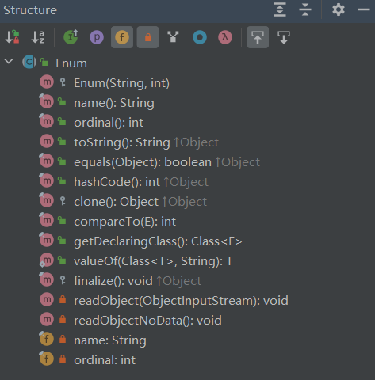

---
title: 枚举
date: 2023-02-08 00:19:09
summary: 本文分享枚举的相关知识，以Java、C/C++、Python为例。
tags:
- 程序设计
categories:
- 程序设计
---

# Java枚举

Java5引入enum，用来定义枚举类。枚举类是一种特殊的类，可以有自己的成员变量、方法，可以实现一个或多个接口，也可以定义自己的构造方法。

在Java的单继承约束下，枚举类默认继承java.lang.Enum。因此，枚举类可以实现一个或多个接口，但不能显式继承其他基类。

java.lang.Enum声明如下：`public abstract class Enum<E extends Enum<E>> implements Comparable<E>, Serializable`，因此枚举类默认实现了java.lang.Comparable和java.lang.Serializable。


重点API总结：
- `int compareTo(E o)`：与相同类型的枚举对象比较顺序。
- `String name()`：返回枚举实例的名称，即定义枚举时的命名。
- `int ordinal()`：返回枚举值在枚举类中的索引值。
- `String toString()`：枚举常量的名称，比name()更好用。
- `public static <T extends Enum<T>> T valueOf(Class<T> enumType, String name)`：返回指定枚举类中指定名称的枚举值。 

非抽象的枚举类默认会采用final修饰，因此枚举类不能派生子类。

枚举类的构造方法只能采用private修饰。即便不显式声明，枚举类的默认的构造方法也是private的。

枚举类的所有实例必须在枚举类的第一行显式列出(分号前有换行或空行也行)，这些实例默认会采用public static final修饰。

```java
public enum Season {
    SPRING, SUMMER, FALL, WINTER;
}
```

引入枚举后，switch语句也支持枚举类。

```java
switch(season) {
    case SPRING:
        // TODO
        break;
    case SUMMER:
        // TODO
        break;
    case FALL:
        // TODO
        break;
    case WINTER:
        // TODO
        break;
}
```

枚举类定义属性、构造方法、实例方法：
```java
public enum Gender {

    // 此处枚举值必须调用对应的构造方法来创建
    MALE("男"), FEMALE("女");

    private final String name;

    private Gender(String name) {
        this.name = name;
    }

    public String getName() {
        return this.name;
    }

}
```

# C/C++枚举

C/C++也可以定义枚举：
```c
enum SEASON {SPRING, SUMMER, AUTUMN, WINTER};
```

```c
enum DAY_OF_WEEK
{
    MONDAY=1, TUESDAY, WEDNESDAY, THURSDAY, FRIDAY, SATURDAY, SUNDAY
};
```

可以通过以下三种方式来定义枚举变量：
- 先定义枚举类型，再定义枚举变量。
    ```c
    enum DAY_OF_WEEK
    {
        MONDAY, TUESDAY, WEDNESDAY, THURSDAY, FRIDAY, SATURDAY, SUNDAY
    };
    enum DAY_OF_WEEK day;
    ```
- 定义枚举类型的同时定义枚举变量。
    ```c
    enum DAY_OF_WEEK
    {
        MONDAY, TUESDAY, WEDNESDAY, THURSDAY, FRIDAY, SATURDAY, SUNDAY
    } day;
    ```
- 省略枚举名称，直接定义枚举变量。
    ```c
    enum
    {
        MONDAY, TUESDAY, WEDNESDAY, THURSDAY, FRIDAY, SATURDAY, SUNDAY
    } day;
    ```

在C/C++中，枚举类型是被当做 int 或者 unsigned int 类型来处理的，所以按照C/C++规范是没有办法遍历枚举类型的。

C/C++支持switch选择枚举：
```java
switch(day) {
    case MONDAY:
        // TODO
        break;
    case TUESDAY:
        // TODO
        break;
    case WEDNESDAY:
        // TODO
        break;
    case THURSDAY:
        // TODO
        break;
    case FRIDAY:
        // TODO
        break;
    case SATURDAY:
        // TODO
        break;
    case SUNDAY:
        // TODO
        break;
}
```

# Python枚举

Python也支持枚举。可以导入系统内置的enum模块，enum模块常用的是Enum、IntEnum、unique。

```python
from enum import Enum


class Season(Enum):
    SPRING = 1
    SUMMER = 2
    AUTUMN = 3
    WINTER = 4


print(Season.SPRING)
print(type(Season.SPRING))

print(Season.SPRING.value)
print(type(Season.SPRING.value))

print(Season.SPRING == 1)
print(Season.SPRING.value == 1)
print(Season.SPRING == Season.SPRING)
print(Season.SPRING is Season.SPRING)

print(Season(1))
print(type(Season(1)))
```

输出结果：
```text
Season.SPRING
<enum 'Season'>
1
<class 'int'>
False
True
True
True
Season.SPRING
<enum 'Season'>
```
