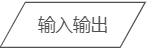
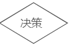
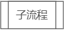
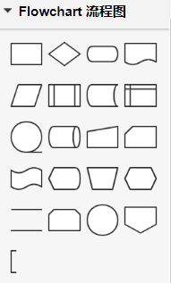
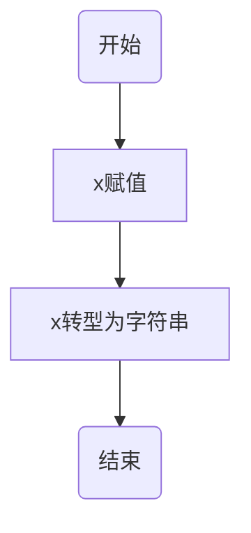
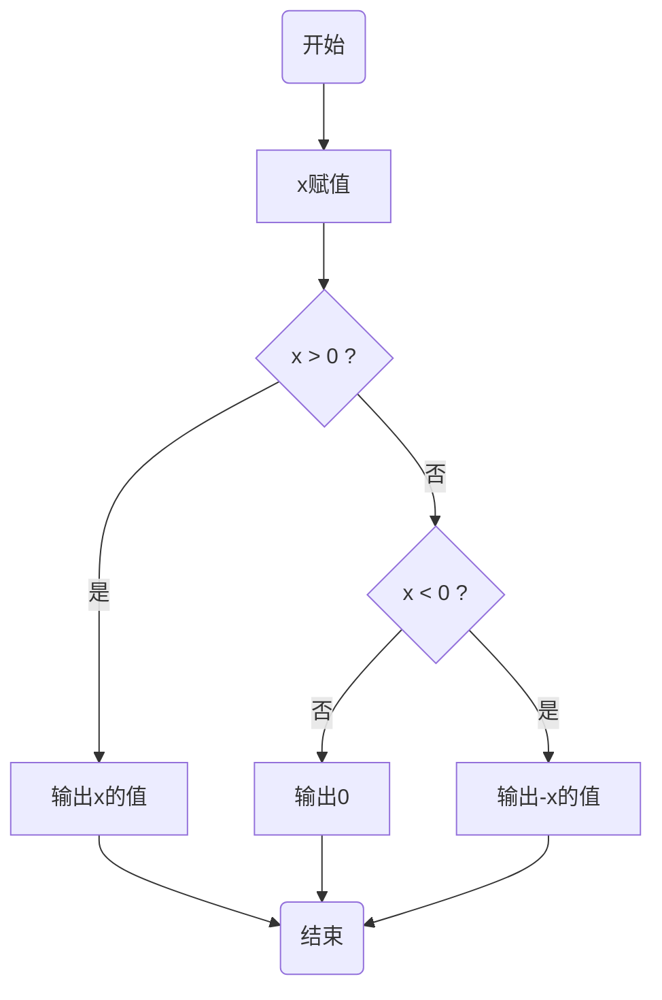

---
title: 程序结构与流程图
date: 2022-02-25 15:27:25
summary: 本文介绍流程图的规范，结合程序结构分享绘制方法。
tags:
- 程序设计
categories:
- 程序设计
---

# 流程图

流程图和伪代码都可以简洁地、语言无关地表示对应的算法逻辑。

流程图由一定数量的标准化符号绘制而成，这样的标准确保了每一个懂得编程的人都可以读懂并遵从流程图中所示的内容进行程序设计。

以下为流程图的基本结构：

|  样式 | 名称 | 描述 |
|:-----:|:----:|:----:|
|  | 端点 | 表示流程模块的开始和结束 |
|  | 过程 | 表示任何处理功能 |
|  | 输入输出 | 表示输入输出操作 |
|  | 决策 | 表示程序分支点 |
|  | 子流程 | 表示一个子流程 |

另外，箭头代表程序控制流，各个基本结构之间通过连线和箭头构成一个有向图。

CSDN的Markdown支持直接引入[流程图](http://flowchart.js.org/)，但容易导致页面比较卡顿，所以截图仍然是比较方便的呈现方式。

[ProcessOn](https://www.processon.com/)是一款非常优秀的免费在线流程图思维导图绘制工具：



通常可以使用ProcessOn快速完成流程图绘制。

# 顺序结构

```java
int x = 123;
String xStr = Integer.toString(x);
```



# 选择结构

选择结构主要分为if结构和switch结构，switch结构能实现的任务目标if结构都能完成。switch结构局限性较大，但有些场景会显得比较直接。下面以if选择结构举例。

```java
int x = 123;
if (x > 0) {
    System.out.println(x);
} else if (x == 0) {
    System.out.println(0);
} else {
    System.out.println(-x);
}
```



# 循环结构

循环结构主要分为for结构和while结构，二者完全可以等效转换，因此下文以while循环举例。

## 前置检测循环和后置检测循环

前置检测循环的结构：
```java
while () {
    // ...
}
```

后置检测循环的结构：
```java
do {
    // ...
} while ()
```

前置检测循环和后置检测循环的区别：
- 从定义上看，前置检测循环在程序开头有测试条件（决定循环体能否得到执行的语句）；后置检测循环的测试条件在程序最后。
- 后置检测循环的循环体总会至少执行一次；对于前置检测循环，如果循环条件在第一轮就为假，循环体根本不会被执行。
- 在进入前置检测循环之前，循环条件中的变量必须初始化；后置监测循环的循环条件中的变量可以在循环体中被初始化。

不过，无论是前置检测循环还是后置检测循环，都可以用来完成某个给定的任务，只不过不同的任务更适合于不同的循环结构。

## 哨兵控制器

程序设计里面，有一个“哨兵控制器”的概念，俗称“哨兵值”。

所谓哨兵值，是指一个特定的数据项，它通常作为数据输入结束的信号。
哨兵值应该被谨慎的选择，使它在输入数据时不可能被误用。

使用哨兵值循环也可以用于数据验证。

```cpp
#include <iostream>

using namespace std;

int main() {
    int x, sum = 0;
    cin >> x;
    while (x != -1) {
        sum += x;
        cin >> x;
    }
    cout << sum << endl;
    return 0;
}
```

比如以上C++代码，求输入的任意数量的自然数之和（输入数据不需要校验），以-1结束。
-1本就不是自然数，用来做结束循环的“哨兵控制器”，是符合预期的。
