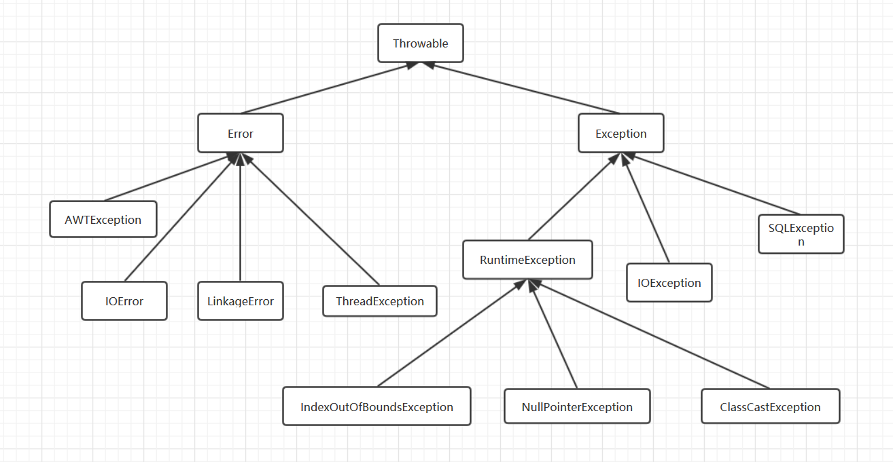
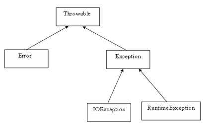

---
title: 程序错误与异常处理
date: 2022-02-27 15:00:39
summary: 本文分享程序错误与异常处理的相关内容。
tags:
- 程序设计
categories:
- 程序设计
---

# 程序错误

如果程序在测试运行时遇到问题，我们必须调试，也就是说必须定位并排除错误，难度取决于错误的类型和程序员的调试技巧。

程序可能出现的两类基本错误类型是语法错误和逻辑错误。

# 语法错误

语法错误是指出现了与程序设计语言合法语句相违背的错误，例如单词拼写错误、漏标点符号等。

语法错误通常会被语言软件检测到，或者是输入非法语句的时候，或者是计算机把程序翻译成机器语言的时候。当软件检测到语法错误时，通常会发出一条警告信息，同时将出错语句以高亮显示。

语法错误通常很容易找到并更正。但有时候，软件发现一个地方有错误，实际上是由代码中其他地方的错误引起的，这时就需要运用程序设计技巧来分析错误信息，找到错误的根源并修复。

# 逻辑错误

逻辑错误是由于在完成任务时用了不正确的语句组合而引起的，可能由于错误的分析、错误的设计，或者没有正确地编码引起的。

以下是几类逻辑错误：
- 计算期望结果所使用的公式不对。
- 实现语法的语句序列不对。
- 没有预测在程序运行时某些输入数据会引起非法操作(例如除以0)，这类错误有时称为运行时错误。

逻辑错误常常导致程序在某处运行不下去(崩溃、挂起、停滞)，或者得出错误的结果。

逻辑错误不能像语法错误那样被程序语言软件检测到，通常需要用足够多的测试数据来运行程序才能发现。

尽管测试不能保证没有逻辑错误，但大量的测试是尽可能保证程序在逻辑上无误的最好方法。

# 异常处理



Java中，所有非正常情况被分为两种：Error和Exception。

Error错误，一般是与JVM相关的问题，比如虚拟机崩溃、虚拟机错误、动态链接失败等等，这种错误无法恢复或不可能捕获，将导致应用程序中断。通常应用程序不应该使用catch块捕获Error对象。定义方法时也无须在其throws子句中声明该方法可能抛出Error及其任何子类。

Exception中有checked和unchecked（runtime）之分，checked是指普通的Exception，而unchecked是指RuntimeException。当用throw语句抛出异常时，若异常为unchecked，那么就无须使用throws子句或者try...catch语句捕获异常；反之则必须做一定的处理或者直接声明抛出。当然，既然RuntimeException继承自Exception，那么自然也是可以try...catch捕获处理的。

自行抛出的RuntimeException比起自行抛出的Checked异常灵活性更好，同样地，抛出Checked异常则可以让编译器提醒程序员必须处理该异常。

## UncheckedException

| 异常 | 描述 |
|:----:|:----:|
| ArithmeticException | 当出现异常的运算条件时，抛出此异常。例如，一个整数"除以零"时，抛出此类的一个实例。| 
| ArrayIndexOutOfBoundsException | 用非法索引访问数组时抛出的异常。如果索引为负或大于等于数组大小，则该索引为非法索引。| 
| ArrayStoreException | 试图将错误类型的对象存储到一个对象数组时抛出的异常。| 
| ClassCastException | 当试图将对象强制转换为不是实例的子类时，抛出该异常。| 
| IllegalArgumentException | 抛出的异常表明向方法传递了一个不合法或不正确的参数。| 
| IllegalMonitorStateException | 抛出的异常表明某一线程已经试图等待对象的监视器，或者试图通知其他正在等待对象的监视器而本身没有指定监视器的线程。| 
| IllegalStateException | 在非法或不适当的时间调用方法时产生的信号。换句话说，即 Java 环境或 Java 应用程序没有处于请求操作所要求的适当状态下。| 
| IllegalThreadStateException | 线程没有处于请求操作所要求的适当状态时抛出的异常。| 
| IndexOutOfBoundsException | 指示某排序索引（例如对数组、字符串或向量的排序）超出范围时抛出。| 
| NegativeArraySizeException | 如果应用程序试图创建大小为负的数组，则抛出该异常。| 
| NullPointerException | 当应用程序试图在需要对象的地方使用 null 时，抛出该异常。| 
| NumberFormatException | 当应用程序试图将字符串转换成一种数值类型，但该字符串不能转换为适当格式时，抛出该异常。| 
| SecurityException | 由安全管理器抛出的异常，指示存在安全侵犯。| 
| StringIndexOutOfBoundsException | 此异常由 String 方法抛出，指示索引或者为负，或者超出字符串的大小。| 
| UnsupportedOperationException | 当不支持请求的操作时，抛出该异常。| 

## CheckedException

| 异常 | 描述 |
|:----:|:----:|
| ClassNotFoundException | 应用程序试图加载类时，找不到相应的类，抛出该异常。| 
| CloneNotSupportedException | 当调用 Object 类中的 clone 方法克隆对象，但该对象的类无法实现 Cloneable 接口时，抛出该异常。| 
| IllegalAccessException | 拒绝访问一个类的时候，抛出该异常。| 
| InstantiationException | 当试图使用 Class 类中的 newInstance 方法创建一个类的实例，而指定的类对象因为是一个接口或是一个抽象类而无法实例化时，抛出该异常。| 
| InterruptedException | 一个线程被另一个线程中断，抛出该异常。| 
| NoSuchFieldException | 请求的变量不存在。| 
| NoSuchMethodException | 请求的方法不存在。| 

## java.lang.Throwable

重要API：

| 方法名 | 说明 |
|:----:|:----:|
| public Throwable fillInStackTrace() | 用当前的调用栈层次填充Throwable 对象栈层次，添加到栈层次任何先前信息中。 |
| public Throwable getCause() | 返回一个Throwable 对象代表异常原因。 |
| public String getMessage() | 返回关于发生的异常的详细信息。这个消息在Throwable 类的构造函数中初始化了。 |
| public void printStackTrace() | 打印toString()结果和栈层次到System.err，即错误输出流。 |
| public StackTraceElement[] getStackTrace() | 返回一个包含堆栈层次的数组。下标为0的元素代表栈顶，最后一个元素代表方法调用堆栈的栈底。 |
| public String toString() | 使用getMessage()的结果返回类的串级名字。 |



其实Error、Exception、RuntimeException这些类都没有额外附加什么方法，基本还是用着java.lang.Throwable的方法。

## Java异常处理基本结构

经典try...catch...finally...结构。其中catch可能出现多层，其中finally可能还需要嵌套一层try...catch...（.close()等操作可能引发异常）。

```java
// 代码上文
try {
    // 可能抛出异常的代码片段
} catch (Exception e) {  // 尽量不要简单的使用Exception，具体一些
    // 处理异常或抛出异常
} finally {
    // 回收资源等操作
}
// 代码下文
```

声明抛出异常结构。

```java
public void methodName() throws Exception {  // 尽量不要简单的使用Exception，具体一些
    // do something
}
```

支持回收资源的try()...catch...结构。

```java
try () {  // 括号里创建I/O等资源
    // 可能抛出异常的代码片段
} catch (Exception e) {  // 尽量不要简单的使用Exception，具体一些
    // 处理异常或抛出异常
}
```

还可以手动抛出(throw)异常，注意区分throw和throws，二者完全不同。
