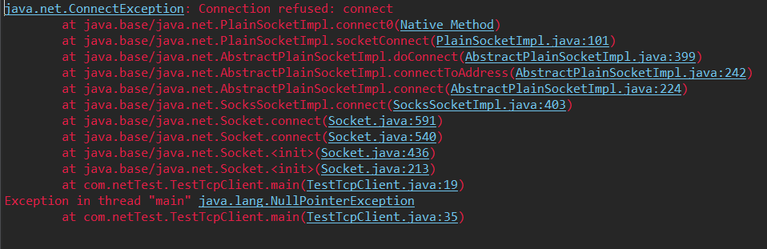
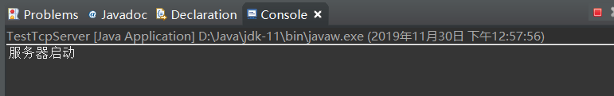
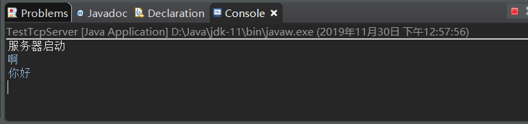
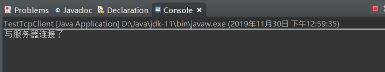
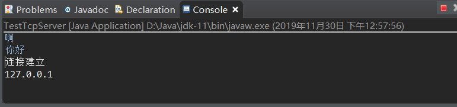
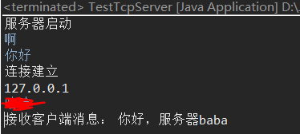

---
title: 网络Socket
date: 2019-10-22 13:58:39
summary: 本文介绍Socket的基本概念，分享一则基于Socket的C-S网络聊天程序。
tags:
- 程序设计
categories:
- 程序设计
---

# Socket

Socket（套接字）是计算机网络中实现通信的一种基本技术，它是一种对传输层协议（如 TCP 或 UDP）的封装，提供了一组标准的接口和方法，使得应用程序能够通过网络进行通信。

Socket 的工作原理可以简单概括为：
1. 服务器端创建一个 Socket，并绑定到一个特定的 IP 地址和端口上，等待客户端连接请求。
2. 客户端创建一个 Socket，并指定要连接的服务器的 IP 地址和端口号，向服务器发起连接请求。
3. 服务器接收到客户端的连接请求，创建一个新的 Socket 与客户端进行通信。
4. 客户端与服务器进行通信，通过 Socket 传输数据。
5. 通信结束后，客户端和服务器都可以关闭自己的 Socket，结束通信。

Socket 的使用可以分为两个方面：Socket 编程和 Socket API。Socket 编程是指使用 Socket 来实现网络通信的编程方式，包括创建、连接、通信和关闭等操作。Socket API 是指提供给开发者使用的一组标准接口和方法，包括 Socket、ServerSocket、SocketAddress 等类和相关的方法和属性，用来简化 Socket 编程的复杂度。

在实际应用中，Socket 可以用来实现各种不同的网络通信，如 HTTP、FTP、SMTP 等协议，以及各种应用程序之间的通信。由于 Socket 提供了一种简单、可靠、灵活的网络通信方式，因此被广泛应用于计算机网络领域。

# Java Socket 编程

Java Socket 编程是基于 Java Socket API 实现的网络编程，通过 Socket 和 ServerSocket 类提供的接口和方法，实现了客户端和服务器之间的网络通信。Java Socket 编程基于 TCP/IP 协议族，支持可靠的数据传输和面向连接的通信，适用于各种不同的网络应用场景。

Java Socket 编程主要包括以下步骤：
1. 创建一个 ServerSocket 对象，绑定到一个指定的 IP 地址和端口号上，等待客户端的连接请求。
    ```java
    ServerSocket serverSocket = new ServerSocket(port);
    ```
2. 创建一个 Socket 对象，指定要连接的服务器的 IP 地址和端口号，向服务器发起连接请求。
    ```java
    Socket socket = new Socket(host, port);
    ```
3. 在客户端或服务器端，通过 Socket 对象获取输入流和输出流，进行数据的读写操作。
    ```java
    // 从输入流中读取数据
    InputStream inputStream = socket.getInputStream();
    byte[] buffer = new byte[1024];
    int length = inputStream.read(buffer);
    // 向输出流中写入数据
    OutputStream outputStream = socket.getOutputStream();
    outputStream.write(buffer, 0, length);
    ```
4. 在通信结束后，关闭 Socket 和 ServerSocket 对象。
    ```java
    // 关闭 Socket 对象
    socket.close();
    // 关闭 ServerSocket 对象
    serverSocket.close();
    ```

Java Socket 编程还可以使用多线程、IO 多路复用、NIO 等技术来提高性能和并发性，使得网络通信更加高效、稳定和可靠。Java Socket 编程在实际应用中被广泛使用，例如 Web 服务器、聊天室、文件传输等应用场景。

# 实现 Socket 聊天程序

## 实现服务端程序

```java
import java.io.BufferedReader;
import java.io.IOException;
import java.io.InputStreamReader;
import java.net.ServerSocket;
import java.net.Socket;

public class ChatTcpServer {
    public static void main(String[] args) {
        ServerSocket ss = null;
        BufferedReader in = null;
        try {
            ss = new ServerSocket(8888);
            System.out.println("服务器启动");
            Socket socket = ss.accept();
            System.out.println("连接建立");
            System.out.println(socket.getInetAddress().getHostAddress());
            // 服务器接收客户端发送的数据
            in = new BufferedReader(new InputStreamReader(socket.getInputStream()));
            String clientContent = in.readLine();
            System.out.println("接收客户端消息：" +clientContent);
        } catch (IOException e) {
            e.printStackTrace();
        }
    }
}
```

## 实现客户端程序

```java
import java.io.BufferedWriter;
import java.io.IOException;
import java.io.OutputStreamWriter;
import java.net.Socket;
import java.net.UnknownHostException;
import java.util.Scanner;

public class ChatTcpClient {
    public static void main(String[] args) {
        Socket socket = null;
        BufferedWriter out = null;
        // 客户端发送数据，服务器端接收
        try {
            socket = new Socket("127.0.0.1",8888);
            System.out.println("与服务器连接了");
            Scanner sc = new Scanner(System.in);
            String content = sc.nextLine();
            out = new BufferedWriter((new OutputStreamWriter(socket.getOutputStream())));
            out.write(content);
            out.flush();
            sc.close();
        } catch (UnknownHostException e) {
            e.printStackTrace();
        } catch (IOException e) {
            e.printStackTrace();
        } finally {
            try {
                out.close();
                socket.close();
            } catch (IOException e) {
                e.printStackTrace();
            }
        }
    }
}
```

## 运行结果展示

应该先运行Server端，否则会遇到`java.net.ConnectException`：


先启动Server端：


此时Server端处于闲置等待状态：


再启动Client端：


此时Server端会收到建立连接的请求，并通过三次握手与Client建立连接：


由Client端向Server端发送消息：


Server端收到来自Client端的消息，并向Client端返回消息。


应用程序终止。
