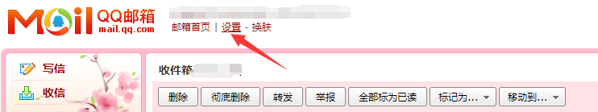
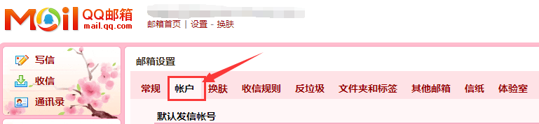
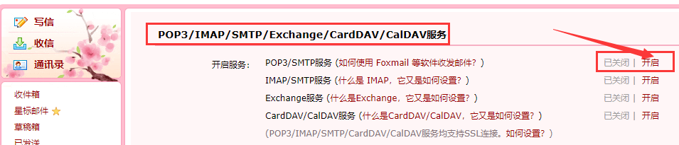
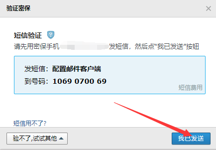
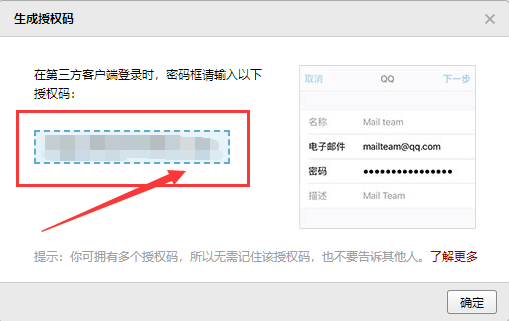
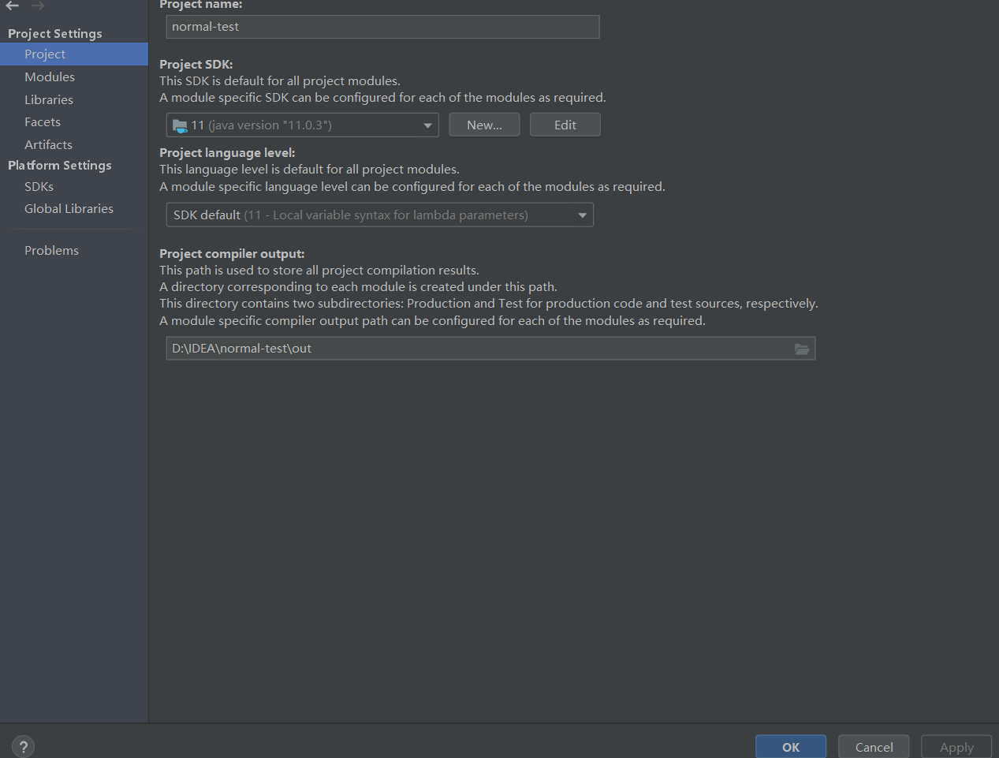
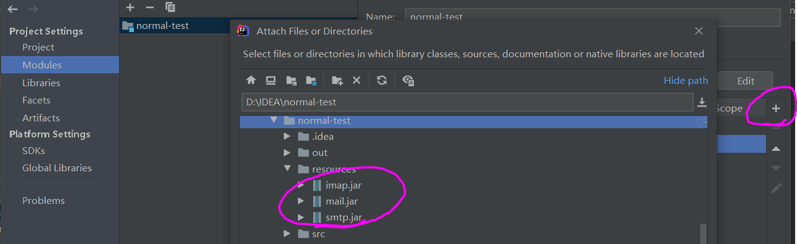
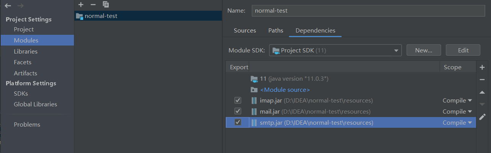
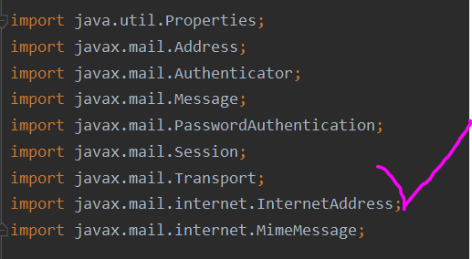

---
title: 网络邮件收发
date: 2020-03-03 21:59:42
summary: 本文分享网络邮件收发的相关内容，以Java和Python为例。
tags:
- 程序设计
categories:
- 程序设计
---

# QQ邮箱开启POP3/SMTP服务











经过一系列操作，最终获得第三方邮件客户端授权码。该授权码为一个16位字符串。

# Java发送邮件

## jakarta-mail

推荐阅读：[JavaMail邮件发送不成功的那些坑人情况及分析说明](https://segmentfault.com/a/1190000008030346)

推荐阅读：[javax.mail.AuthenticationFailedException异常的处理](https://blog.csdn.net/zouxucong/article/details/60578824)

推荐阅读：[java.lang.IllegalStateException: Not provider of jakarta.mail.util.StreamProvider was found异常的处理](https://stackoverflow.com/questions/74101364/getting-illegalstateexception-when-getting-instance-of-jakarta-mail-session-obje)

### JAR依赖引入

在IDEA中要配置好JavaEE，不然就没法玩耍，我用的是JavaEE6，自动下载的。
不然就会出现`java.lang.NoClassDefFounfError: javax/activation/DataSource`

其他几个包也要导进去：




不装好JavaEE，或者只装好JavaEE没导入单独的包，就会报错。


使用QQ邮箱会可能出现：`javax.mail.AuthenticationFailedException`这个异常，请查阅上面的荐读文章来了解这个问题，与QQ邮箱本身有关。

实现代码：
```java
import java.util.Properties;

import javax.mail.Address;
import javax.mail.Authenticator;
import javax.mail.Message;
import javax.mail.PasswordAuthentication;
import javax.mail.Session;
import javax.mail.Transport;
import javax.mail.internet.InternetAddress;
import javax.mail.internet.MimeMessage;

public class MailDemo {

    public static void main(String[] args) {
        // 创建邮件的发送过程中用到的主机和端口号的属性文件
        Properties properties = new Properties();
        // 设置邮件发送方的主机地址，qq邮箱为smtp.qq.com
        properties.put("mail.smtp.host", "smtp.qq.com");
        // 设置发送邮件端口号
        properties.put("mail.smtp.port", "25");
        // 设置邮件发送需要认证
        properties.put("mail.smtp.auth", "true");
        // 邮件发送方地址
        String senderEmailAddress = "xxxxxx";
        // 邮件接收方地址
        String receiverEmailAddress = "xxxxxx";
        // 开通pop3/smtp服务时的验证码
        String verificationCode = "xxxxxx";
        // 创建邮件验证信息，即发送邮件的用户名和密码
        Authenticator authenticator = new Authenticator() {
            @Override
            protected PasswordAuthentication getPasswordAuthentication() {
                // 重写验证方法，填写用户名，密码
                return new PasswordAuthentication(senderEmailAddress, verificationCode);
            }
        };
        // 根据邮件会话 构建一个邮件的session
        Session sendMailSession = Session.getDefaultInstance(properties, authenticator);
        // 创建一个邮件消息
        Message message = new MimeMessage(sendMailSession);
        try {
            // 创建邮件发送者地址
            Address senderAddress = new InternetAddress(senderEmailAddress);
            // 将原地址设置到消息的信息中
            message.setFrom(senderAddress);
            // 创建邮件的接收者地址
            Address receiverAddress = new InternetAddress(receiverEmailAddress);
            // 将接收者的地址设置到消息的信息中
            message.setRecipient(Message.RecipientType.TO, receiverAddress);
            // 设置邮件的主题
            message.setSubject("日常聊天");
            // 设置邮件的发送内容
            message.setText("Hello, BlankSpace");
            Transport.send(message);
        } catch (Exception e) {
            e.printStackTrace();
        }
    }

}
```

### Maven依赖引入

- [Jakarta Mail API](https://mvnrepository.com/artifact/jakarta.mail/jakarta.mail-api)：`jakarta.mail` » `jakarta.mail-api`
- [Angus Mail Default Provider](https://mvnrepository.com/artifact/org.eclipse.angus/jakarta.mail)：`org.eclipse.angus` » `jakarta.mail`

```xml
<!-- https://mvnrepository.com/artifact/jakarta.mail/jakarta.mail-api -->
<dependency>
    <groupId>jakarta.mail</groupId>
    <artifactId>jakarta.mail-api</artifactId>
    <version>2.1.1</version>
</dependency>
<!-- https://mvnrepository.com/artifact/org.eclipse.angus/jakarta.mail -->
<dependency>
    <groupId>org.eclipse.angus</groupId>
    <artifactId>jakarta.mail</artifactId>
    <version>2.0.1</version>
</dependency>
```

实现代码：
```java
import java.util.Properties;

import jakarta.mail.Address;
import jakarta.mail.Authenticator;
import jakarta.mail.Message;
import jakarta.mail.MessagingException;
import jakarta.mail.PasswordAuthentication;
import jakarta.mail.Session;
import jakarta.mail.Transport;
import jakarta.mail.internet.InternetAddress;
import jakarta.mail.internet.MimeMessage;

public class MailDemo {

    public static void main(String[] args) {
        // 创建邮件的发送过程中用到的主机和端口号的属性文件
        Properties properties = new Properties();
        // 设置邮件发送方的主机地址，qq邮箱为smtp.qq.com
        properties.put("mail.smtp.host", "smtp.qq.com");
        // 设置发送邮件端口号
        properties.put("mail.smtp.port", "25");
        // 设置邮件发送需要认证
        properties.put("mail.smtp.auth", "true");
        // 邮件发送方地址
        String senderEmailAddress = "xxxxxx";
        // 邮件接收方地址
        String receiverEmailAddress = "xxxxxx";
        // 开通pop3/smtp服务时的验证码
        String verificationCode = "xxxxxx";
        // 创建邮件验证信息，即发送邮件的用户名和密码
        Authenticator authenticator = new Authenticator() {
            @Override
            protected PasswordAuthentication getPasswordAuthentication() {
                // 重写验证方法，填写用户名，密码
                return new PasswordAuthentication(senderEmailAddress, verificationCode);
            }
        };
        // 根据邮件会话 构建一个邮件的session
        Session sendMailSession = Session.getDefaultInstance(properties, authenticator);
        // 创建一个邮件消息
        Message message = new MimeMessage(sendMailSession);
        try {
            // 创建邮件发送者地址
            Address senderAddress = new InternetAddress(senderEmailAddress);
            // 将原地址设置到消息的信息中
            message.setFrom(senderAddress);
            // 创建邮件的接收者地址
            Address receiverAddress = new InternetAddress(receiverEmailAddress);
            // 将接收者的地址设置到消息的信息中
            message.setRecipient(Message.RecipientType.TO, receiverAddress);
            // 设置邮件的主题
            message.setSubject("日常聊天");
            // 设置邮件的发送内容
            message.setText("Hello, BlankSpace");
            Transport.send(message);
        } catch (MessagingException e) {
            e.printStackTrace();
        }
    }

}
```

# Python发送邮件

## smtplib

以前也试过模拟发Email，但好像都忘了，于是按照菜鸟教程的smtplib方法重新试了一下：

```python
import smtplib
from email.mime.text import MIMEText
from email.header import Header
 
sender = 'from@runoob.com'
receivers = ['<username>@qq.com']  # 接收邮件，可设置为你的QQ邮箱或者其他邮箱
 
# 三个参数：第一个为文本内容，第二个 plain 设置文本格式，第三个 utf-8 设置编码
message = MIMEText('Python 邮件发送测试...', 'plain', 'utf-8')
message['From'] = Header("菜鸟教程", 'utf-8')   # 发送者
message['To'] =  Header("测试", 'utf-8')        # 接收者
 
subject = 'Python SMTP 邮件测试'
message['Subject'] = Header(subject, 'utf-8')
 
 
try:
    smtpObj = smtplib.SMTP('localhost')
    smtpObj.sendmail(sender, receivers, message.as_string())
    print "邮件发送成功"
except smtplib.SMTPException:
    print "Error: 无法发送邮件"
```

结果疯狂报错，说是什么<font color="red">ConnectionRefusedError: [WinError 10061] 由于目标计算机积极拒绝,无法连接.</font>

这个问题查搜索引擎发现都是说什么网络连接问题（比如防火墙、局域网等等），但其实不是关键问题，主要是这个代码有点问题。

修正后的代码是这样的：
```python
import smtplib
from email.mime.text import MIMEText
from email.header import Header

f = open('./config.txt', 'r')

# \n换行符需要删掉
sender = f.readline()[:-1]
receiver = f.readline()[:-1]
password = f.readline()[:-1]

f.close()

receivers = [receiver]

message = MIMEText('Python骚扰邮件', 'plain', 'utf-8')
message['From'] = Header("Python骚扰邮件", 'utf-8')
message['To'] = Header("Python骚扰邮件", 'utf-8')

subject = 'Python-SMTP邮件测试'
message['Subject'] = Header(subject, 'utf-8')

try:
    smtpObj = smtplib.SMTP_SSL("smtp.qq.com", 465)
    smtpObj.connect("smtp.qq.com", 465)
    smtpObj.login(sender, password)
    smtpObj.sendmail(sender, receivers, message.as_string())
    print("邮件发送成功")
except smtplib.SMTPException:
    print("Error: 无法发送邮件")
```

做几点必要说明：
1. 个人信息存在文件里是比较妥善的做法，通过读文件来获取信息。
2. 读的一行文件带有换行符，需要去掉末尾`\n`。
3. 发QQ邮箱需要开启SMTP服务并获取授权码。
4. 注意异常处理，其实这里的异常处理比较暴力，真的出错也不便于排错。
