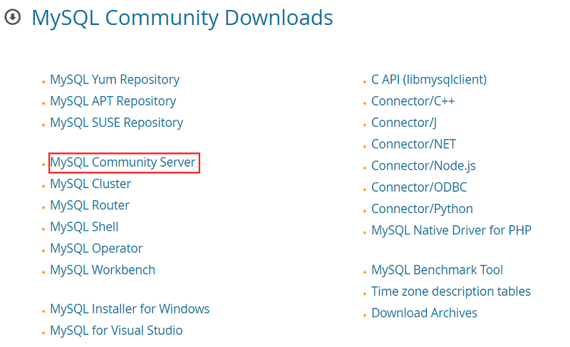

# MySQL下载安装

[MySQL下载页面](https://dev.mysql.com/downloads)




点击Archive可以选择历史版本。

下载得到.zip，解压后配置环境变量。

管理员身份启动CMD，切到mysql的bin目录下。
1. MySQL服务随操作系统启动：`mysqld --install`
2. 初始化MySQL，产生一个密码(需要牢记)：`mysqld --initialize --console`
3. 开启MySQL服务：`net start mysql`
4. 登录MySQL的root用户：`mysql -u root -p`
5. 修改root用户的密码：`ALTER USER 'root'@'localhost' IDENTIFIED WITH MYSQL_NATIVE_PASSWORD BY 'new_password';`

```shell
# MySQL服务随操作系统启动
mysqld --install
# 初始化MySQL，产生一个密码(需要牢记)
mysqld --initialize --console
# 开启MySQL服务
net start mysql
# 登录MySQL的root用户
mysql -u root -p
# 修改root用户的密码
ALTER USER 'root'@'localhost' IDENTIFIED WITH MYSQL_NATIVE_PASSWORD BY 'new_password';
```

输入用户名和密码即可登录（免密除外）

```
mysql -u (your username such as 'root') -p
Enter password: ***************(your password)
Welcome to the MySQL monitor.  Commands end with ; or \g.
Your MySQL connection id is 8
Server version: 8.0.16 MySQL Community Server - GPL

Copyright (c) 2000, 2019, Oracle and/or its affiliates. All rights reserved.

Oracle is a registered trademark of Oracle Corporation and/or its
affiliates. Other names may be trademarks of their respective
owners.

Type 'help;' or '\h' for help. Type '\c' to clear the current input statement.
```

# Java访问MySQL

```java
import java.sql.Connection;
import java.sql.DriverManager;
import java.sql.SQLException;

public class JDBCDemo {
    public static void main(String[] args) {
        String driverName="com.mysql.cj.jdbc.Driver";
        // dbName数据库名，自己写
        String dbURL="jdbc:mysql://localhost:3306/<dbName>?useUnicode=true&characterEncoding=UTF-8&useSSL=false&serverTimezone=Asia/Shanghai";
        // 你的登录名，自己写，比如root
        String userName="userName";
        // 你的登录密码，自己写
        String userPassword="userPassword";
        try {
            Class.forName(driverName);
            System.out.println("加载MySQL驱动成功");
        } catch (ClassNotFoundException e) {
            System.out.println("加载MySQL驱动失败");
        }
        try (Connection dbConnection = DriverManager.getConnection(dbURL, userName, userPassword)) {
            System.out.println("连接数据库成功");
        } catch(SQLException e) {
            System.out.println("数据库连接失败");
        }
    }
}
```

# C语言访问MySQL

```c
#include <stdio.h>
#include <mysql.h>

// 声明 MySQL 的句柄
MYSQL mysql, *sock;

int main() {
    const char *host = "127.0.0.1";
    const char *user = "...";  // 自己填
    const char *password = "...";  // 自己填
    const char *db_name = "...";  // 自己填
    unsigned int port = 3306;
    const char *unix_socket = NULL;    // Windows是NULL
    unsigned long client_flag = 0;
    const char *query_users = "select * from `user`";
    const char *add_users = "insert into `user` values (4, 'candy', 'can_can_need')";
    MYSQL_RES *result;
    MYSQL_ROW row;
    // 初始化
    mysql_init(&mysql);
    // 连接 MySQL
    if ((sock = mysql_real_connect(&mysql, host, user, password, db_name,
                                   port, unix_socket, client_flag)) == NULL){
        printf("连接MySQL失败，原因是: \n");
        fprintf(stderr, " %s\n", mysql_error(&mysql));
        exit(1);
    } else {
        fprintf(stderr, "连接MySQL成功！\n");
    }
    // 执行 MySQL 查询
    if (mysql_query(&mysql, query_users) != 0) {
        fprintf(stderr, "查询失败！\n");
        exit(1);
    } else {
        if ((result = mysql_store_result(&mysql)) == NULL) {
            fprintf(stderr, "保存结果集失败！\n");
            exit(1);
        } else {
            // 读取结果集中的数据，返回的是下一行（因为保存结果集时，当前的游标在第一行之前）
            while ((row = mysql_fetch_row(result)) != NULL) {
                printf("用户ID：%s\t", row[0]);
                printf("用户姓名：%s\t\n", row[1]);
            }
        }
    }
    if (mysql_query(&mysql, add_users) != 0) {
        fprintf(stderr, "插入失败！\n");
        exit(1);
    } else {
        fprintf(stdout, "插入成功！\n");
    }
    // 释放结果集
    mysql_free_result(result);
    // 断开连接
    mysql_close(sock);
    // 退出系统
    exit(EXIT_SUCCESS);
}
```

# Python访问MySQL

```python
import pymysql

# 打开文件
f = open('./config.txt', 'r')

# \n换行符需要删掉
username = f.readline()[:-1]
password = f.readline()[:-1]
database_name = f.readline()[:-1]

# 打开数据库连接 数据从配置文件中来 配置文件会被ignore掉
db = pymysql.connect("localhost", username, password, database_name)

# 关闭文件连接
f.close()

# 使用cursor()方法获取操作游标
cursor = db.cursor()

# SQL插入语句
# 如果报错，MySQL命令行输入：SET @@global.sql_mode= '';即可
sql = "INSERT INTO user_login(user_id, username, password, telephone, vip) VALUES ('%d', '%s','%s','%s','%d')" \
      % (10012, 'Baolan', '123456', '13141314', 1)

# print(sql)

try:
    # 执行sql语句
    cursor.execute(sql)
    # 执行sql语句
    db.commit()
    # 表示执行成功
    print("执行成功")
except:
    # 发生错误时回滚
    db.rollback()
    # 表示执行失败
    print("执行失败")

# 关闭数据库连接
db.close()
```
