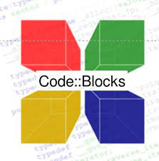

---
title: 集成开发环境
date: 2023-03-05 22:31:08
summary: 本文分享集成开发环境的相关知识和常见IDE的用法攻略。
tags:
- 程序设计
categories:
- 程序设计
---

# IDE

集成开发环境(IDE，Integrated Development Environment)是一种帮助程序员高效开发软件代码的软件应用程序，一般包括代码编辑器、编译器、调试器和图形用户界面等工具。它通过将软件编辑、分析、构建、调试、测试和打包等功能结合到一个易于使用的应用程序中，提高了开发人员的工作效率。

# IDE的代表

## IntelliJ IDEA

推荐阅读：[IntelliJ IDEA 用法总结](https://blankspace.blog.csdn.net/article/details/104643857)

## Eclipse

推荐阅读：[Eclipse 用法总结](https://blankspace.blog.csdn.net/article/details/101846956)

## CLion

推荐阅读：[CLion 用法总结](https://blankspace.blog.csdn.net/article/details/103297890)

## Code::Blocks

推荐阅读：[Code::Blocks 用法总结](https://blankspace.blog.csdn.net/article/details/129410992)

## PyCharm

推荐阅读：[PyCharm 用法总结](https://blankspace.blog.csdn.net/article/details/106093626)

## Visual Studio

推荐阅读：[VB.NET程序设计学习指南](https://blankspace.blog.csdn.net/article/details/106082342)

# IDE对软件开发的帮助

开发者可以使用任何文本编辑器(VSCode、Notepad++等)来编写代码。然而，大多数IDE都包含文本编辑之外的功能。IDE为常用开发工具提供了一个中央接口，使软件开发过程更加高效。开发人员可以基于IDE快速开始编写新应用程序，而无需手动集成和配置不同的软件。开发人员也不必了解所有工具，可以只专注于一个应用程序。

## 智能代码编辑

编程语言具有关于语句必须如何构造的语法规则。IDE被告知这些规则，并支持自动生成、自动补全、自动修复等智能化代码编辑。

## 语法突出显示

IDE可以通过自动将某些单词设置为粗体或斜体，或使用不同的字体颜色来格式化书面文本。这些视觉提示使源代码更具可读性，并提供有关意外语法错误的即时反馈。

## 智能代码推荐

当开发者在搜索引擎中键入单词时，系统会显示各种搜索词推荐。类似地，IDE可以在开发人员键入代码时提供完成代码语句的建议。[GitHub Copilot](https://github.com/features/copilot)等插件工具对此有帮助。

## 代码重构支持

代码重构是在不改变其核心功能的情况下，重新构造源代码以提高其效率和可读性的过程。IDE可以在某种程度上自动重构，从而允许开发人员快速轻松地改进代码。其他团队成员可以更快地理解可读代码，从而支持团队内部的协作。

## 代码构建自动化

IDE通过执行可重复开发任务来提高程序员的工作效率，可重复开发任务通常是每次代码更改的一部分。

以下是IDE执行的一些常规编码任务示例。

### 软件编译

IDE将代码编译或转换为操作系统可以理解的简化语言。一些编程语言可实现实时编译，此时IDE可将应用程序内的人类可读代码转换为机器代码。

### 软件测试

推荐阅读：[软件测试](https://blankspace.blog.csdn.net/category_9747018.html)

IDE允许开发者先在本地自动完成单元测试，然后再将软件与其他开发者的代码集成，并运行更复杂的集成测试。

### 软件调试

调试是修复测试发现的任何错误的过程。IDE可以在代码运行时逐行遍历代码并检查代码行为。IDE可以集成多个调试工具，这些工具可以实时突出显示人为因素导致的错误，即使开发人员正在键入代码也是如此。

## 一键版本管理

IDE比较重视版本管理，尤其是Git。很多复杂的版本控制操作都可以被可视化并支持一键完成。

# IDE的类型
 
IDE可以大致分为几个不同的类别，具体取决于IDE支持的应用程序开发以及IDE的工作方式。

## 本地IDE

开发人员直接在本地计算机上安装和运行本地IDE。他们还必须根据自己的编码首选项、项目需求和开发语言下载和安装各种附加库。

本地IDE的优势：
- 可定制。
- 安装后不需要互联网连接。

本地IDE的劣势：
- 耗时且难以设置。
- 消耗本地计算机资源，并会显著降低计算机性能。
- 本地计算机和生产环境之间的配置差异可能会导致软件错误。

## 云IDE

开发人员使用云IDE直接在浏览器中编写、编辑和编译代码，这样他们就不需要在本地计算机上下载软件。

与传统IDE相比，基于云的IDE的优势在于：
- 开发环境的标准化：软件开发团队可以集中配置基于云的IDE，以创建标准开发环境。此方法可以帮助他们避免由于本地计算机配置差异而可能发生的错误。
- 平台的独立性：云IDE直接连接到云供应商的平台，独立于本地开发环境。因此，开发人员可以从任何计算机使用它们。
- 更高的性能：在IDE中构建和编译函数需要大量内存，并且会降低开发人员计算机的速度。云IDE使用云中的计算资源，因此能够释放本地计算机的资源。

# IDE的选择

您可以在市场上找到许多现代化的IDE，它们具有一系列功能，价格也不尽相同。许多IDE是开源的，或者可以免费使用和配置，例如Eclipse。也有许多IDE是付费的，例如Visual Studio、IntelliJ IDEA等。

选择合适IDE时需要考虑编程语言、操作系统、自动化支持等因素。
