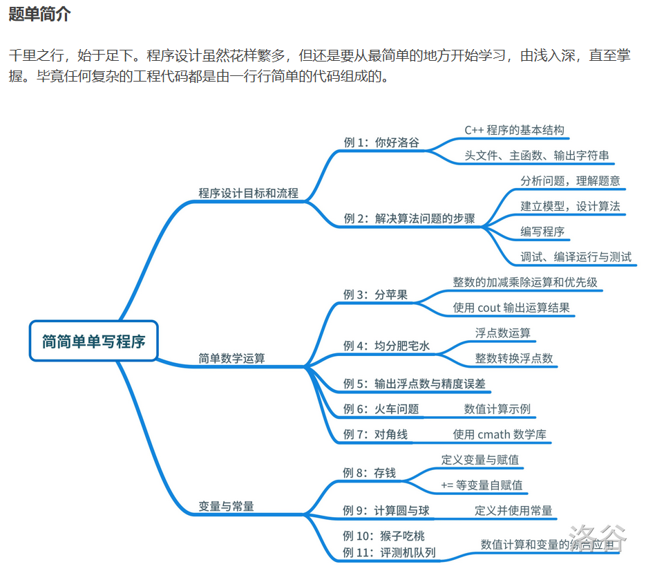
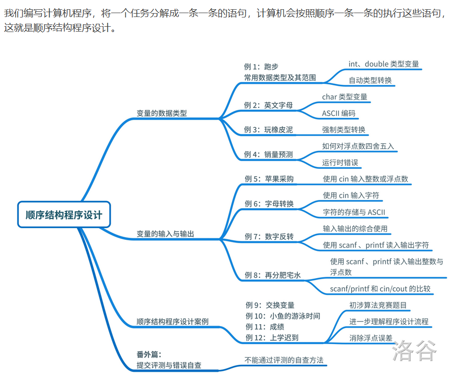

---
title: 顺序结构
date: 2020-05-01 23:17:07
summary: 本文通过洛谷顺序结构题单，分享顺序结构程序设计的一些技巧和心得。
mathjax: true
tags:
- 程序设计
categories:
- 程序设计
---

# 题单简介

洛谷顺序结构题单内容：




# P1001 A+B Problem

## 题目描述

输入两个整数 $a, b$，输出它们的和（$|a|,|b| \le {10}^9$）。

注意

1. Pascal 使用 `integer` 会爆掉哦！
2. 有负数哦！
3. C/C++ 的 main 函数必须是 `int` 类型，而且 C 最后要 `return 0`。这不仅对洛谷其他题目有效，而且也是 NOIP/CSP/NOI 比赛的要求！

好吧，同志们，我们就从这一题开始，向着大牛的路进发。

> 任何一个伟大的思想，都有一个微不足道的开始。

## 输入格式

两个以空格分开的整数。

## 输出格式

一个整数。

## 样例 #1

### 样例输入 #1

```
20 30
```

### 样例输出 #1

```
50
```

## 程序设计

略

## 实现代码

```java
import java.util.Scanner;

public class Main {
    public static void main(String args[]) {
        Scanner scanner = new Scanner(System.in);
        int a = scanner.nextInt(), b = scanner.nextInt();
        System.out.println(a+b);
        scanner.close();
    }
}
```

## 代码提交

[洛谷 P1001 A+B Problem](https://www.luogu.com.cn/problem/P1001)

# P1000 超级玛丽游戏

## 题目描述

超级玛丽是一个非常经典的游戏。请你用字符画的形式输出超级玛丽中的一个场景。

```
                ********
               ************
               ####....#.
             #..###.....##....
             ###.......######              ###            ###
                ...........               #...#          #...#
               ##*#######                 #.#.#          #.#.#
            ####*******######             #.#.#          #.#.#
           ...#***.****.*###....          #...#          #...#
           ....**********##.....           ###            ###
           ....****    *****....
             ####        ####
           ######        ######
##############################################################
#...#......#.##...#......#.##...#......#.##------------------#
###########################################------------------#
#..#....#....##..#....#....##..#....#....#####################
##########################################    #----------#
#.....#......##.....#......##.....#......#    #----------#
##########################################    #----------#
#.#..#....#..##.#..#....#..##.#..#....#..#    #----------#
##########################################    ############
```

## 输入格式

无

## 输出格式

如描述

## 程序设计

略

## 实现代码

```java
public class Main {
    public static void main(String[] args) {
        System.out.println("                ********\r\n" + 
                "               ************\r\n" + 
                "               ####....#.\r\n" + 
                "             #..###.....##....\r\n" + 
                "             ###.......######              ###            ###\r\n" + 
                "                ...........               #...#          #...#\r\n" + 
                "               ##*#######                 #.#.#          #.#.#\r\n" + 
                "            ####*******######             #.#.#          #.#.#\r\n" + 
                "           ...#***.****.*###....          #...#          #...#\r\n" + 
                "           ....**********##.....           ###            ###\r\n" + 
                "           ....****    *****....\r\n" + 
                "             ####        ####\r\n" + 
                "           ######        ######\r\n" + 
                "##############################################################\r\n" + 
                "#...#......#.##...#......#.##...#......#.##------------------#\r\n" + 
                "###########################################------------------#\r\n" + 
                "#..#....#....##..#....#....##..#....#....#####################\r\n" + 
                "##########################################    #----------#\r\n" + 
                "#.....#......##.....#......##.....#......#    #----------#\r\n" + 
                "##########################################    #----------#\r\n" + 
                "#.#..#....#..##.#..#....#..##.#..#....#..#    #----------#\r\n" + 
                "##########################################    ############");
    }
}
```

## 代码提交

[洛谷 P1000 超级玛丽游戏](https://www.luogu.com.cn/problem/P1000)

# P5703 苹果采购

## 题目描述

现在需要采购一些苹果，每名同学都可以分到固定数量的苹果，并且已经知道了同学的数量，请问需要采购多少个苹果？

## 输入格式

输入两个不超过 $10^9$ 正整数，分别表示每人分到的数量和同学的人数。

## 输出格式

一个整数，表示答案。保证输入和答案都在 int 范围内的非负整数。

## 样例 #1

### 样例输入 #1

```
5 3
```

### 样例输出 #1

```
15
```

## 程序设计

略

## 实现代码

```java
import java.math.BigInteger;
import java.util.Scanner;

public class Main {
    public static void main(String[] args) {
        Scanner scanner = new Scanner(System.in);
        String a = scanner.next(), b = scanner.next();
        System.out.println(new BigInteger(a).multiply(new BigInteger(b)));
    }
}
```

## 代码提交

[洛谷 P5703 苹果采购](https://www.luogu.com.cn/problem/P5703)

# P5704 字母转换

## 题目描述

输入一个小写字母，输出其对应的大写字母。例如输入 q[回车] 时，会输出 Q。

## 输入格式

## 输出格式

## 样例 #1

### 样例输入 #1

```
q
```

### 样例输出 #1

```
Q
```

## 程序设计

略

## 实现代码

```java
import java.util.Scanner;

public class Main {
    public static void main(String[] args) {
        Scanner scanner = new Scanner(System.in);
        System.out.println(scanner.nextLine().toUpperCase());
        scanner.close();
    }
}
```

## 代码提交

[洛谷 P5704 字母转换](https://www.luogu.com.cn/problem/P5704)

# P5705 数字反转

## 题目描述

输入一个不小于 $100$ 且小于 $1000$，同时包括小数点后一位的一个浮点数，例如 $123.4$ ，要求把这个数字翻转过来，变成 $4.321$ 并输出。

## 输入格式

一行一个浮点数

## 输出格式

一行一个浮点数

## 样例 #1

### 样例输入 #1

```
123.4
```

### 样例输出 #1

```
4.321
```

## 程序设计

略

## 实现代码

```java
import java.util.Scanner;

public class Main {
    public static void main(String[] args) {
        Scanner scanner = new Scanner(System.in);
        char[] chars = scanner.nextLine().toCharArray();
        for (int i = chars.length-1; i >= 0; i--) {
            System.out.print(chars[i]);
        }
        scanner.close();
    }
}
```

## 代码提交

[洛谷 P5705 数字反转](https://www.luogu.com.cn/problem/P5705)

# P5706 再分肥宅水

## 题目描述

现在有 $t$ 毫升肥宅快乐水，要均分给 $n$ 名同学。每名同学需要 $2$ 个杯子。现在想知道每名同学可以获得多少毫升饮料（严格精确到小数点后 $3$ 位），以及一共需要多少个杯子。

## 输入格式

输入一个实数 $t$ 和一个正整数 $n$，使用空格隔开。

## 输出格式

输出两行。

第一行输出一个三位小数，表示可以获得多少毫升饮料。第二行输出一个正整数，表示一共需要多少个杯子。

## 样例 #1

### 样例输入 #1

```
500.0 3
```

### 样例输出 #1

```
166.667
6
```

## 提示

对于所有数据，$0\leq t\leq 10000$ 且小数点后不超过 $3$ 位，$1\leq n\leq 1000$。

## 程序设计

略

## 实现代码

```java
import java.util.Scanner;

public class Main {
    public static void main(String[] args) {
        Scanner scanner = new Scanner(System.in);
        double all = scanner.nextDouble();
        int num = scanner.nextInt();
        scanner.close();
        System.out.printf("%.3f\n", all/num);
        System.out.println(2*num);
    }
}
```

## 代码提交

[洛谷 P5706 再分肥宅水](https://www.luogu.com.cn/problem/P5706)

# P1425 小鱼的游泳时间

## 题目描述

伦敦奥运会要到了，小鱼在拼命练习游泳准备参加游泳比赛，可怜的小鱼并不知道鱼类是不能参加人类的奥运会的。

这一天，小鱼给自己的游泳时间做了精确的计时（本题中的计时都按 $24$ 小时制计算），它发现自己从 $a$ 时 $b$ 分一直游泳到当天的 $c$ 时 $d$ 分，请你帮小鱼计算一下，它这天一共游了多少时间呢？

小鱼游的好辛苦呀，你可不要算错了哦。

## 输入格式

一行内输入四个整数，以空格隔开，分别表示题目中的 $a, b, c, d$。

## 输出格式

一行内输出两个整数 $e$ 和 $f$，用空格间隔，依次表示小鱼这天一共游了多少小时多少分钟。其中表示分钟的整数 $f$ 应该小于 $60$。

## 样例 #1

### 样例输入 #1

```
12 50 19 10
```

### 样例输出 #1

```
6 20
```

## 提示

对于全部测试数据，$0\le a,c \le 24$，$0\le b,d \le 60$，且结束时间一定晚于开始时间。

## 程序设计

略

## 实现代码

```java
import java.util.Scanner;

public class Main {
    public static void main(String[] args) {
        Scanner scan = new Scanner(System.in);
        int a = scan.nextInt(), b = scan.nextInt(), c = scan.nextInt(), d = scan.nextInt();
        int e = c - a, f = d - b;
        if (f <= 0) {
            e--;
            f+=60;
        }
        System.out.println(e + " " + f);
        scan.close();
    }
}
```

## 代码提交

[洛谷 P1425 小鱼的游泳时间](https://www.luogu.com.cn/problem/P1425)

# P2433 小学数学N合一

## 题目描述

### 问题 1

请输出 `I love Luogu!`

### 问题 2

这里有 $10$ 个苹果，小 A 拿走了 $2$ 个，Uim 拿走了 $4$ 个，八尾勇拿走剩下的所有的苹果。我们想知道：

1. 小A 和 Uim 两个人一共拿走多少苹果？
2. 八尾勇能拿走多少苹果？

现在需要编写一个程序，输出两个数字作为答案，中间使用空格分开。

### 问题 3

现在有 $14$ 个苹果。要均分给 $4$ 名同学，分不掉的苹果放回冰箱。请问：

1. 每位同学能分得几个苹果？
2. 一共分出去多少苹果？
3. 把几个苹果放回冰箱？

现在需要编写一个程序，输出三个数字作为答案，每个数字一行。

### 问题 4

现在有 $500$ 毫升的肥宅快乐水，要均分给 $3$ 名同学，每位同学可以分到多少毫升？请输出一个数字作为输出。保留 $6$ 位有效数字，且不使用科学计数法。

### 问题 5

甲列火车长 $260$ 米，每秒行 $12$ 米；乙列火车长 $220$ 米，每秒行 $20$ 米，两车相向而行，从两车车头相遇时开始计时，多长时间后两车车尾相离？已知答案是整数。

### 问题 6

一个长方形长宽分别是 $6 \text{ cm}$、$9 \text{ cm}$，求它的对角线长度（$\text{cm}$）。直接使用 `cout` 输出。

### 问题 7

Uim 银行账户里面有 $100$ 元。经过了下面的操作：

1. 往里面存了 $10$ 元；
2. 购物花掉了 $20$ 元；
3. 把里面的钱全部取出。

请在每次操作后输出账户余额，并使用换行符隔开。

### 问题 8

当半径为 $r=5$，请输出圆的周长、面积和球体积。取 $\pi=3.141593$。请直接使用 `cout` 输出答案，每行一个数字。

### 问题 9

一只小猴买了若干个桃子。第一天他刚好吃了这些桃子的一半，又贪嘴多吃了一个；第二天他也刚好吃了剩余桃子的一半，贪嘴多吃了一个；第三天他又刚好吃了剩下的桃子的一半，并贪嘴多吃了一个。第四天起来一看，发现桃子只剩下一个了。请问小猴买了几个桃子？

### 问题 10

洛谷的评测任务是单位时间内均匀增加的。$8$ 台评测机 $30$ 分钟可以刚好把评测队列中的程序评测完毕，$10$ 台评测机 $6$ 分钟可以刚好把评测队列中的程序评测完毕，请问几台评测机可以在 $10$ 分钟时刚好把评测队列中的程序评测完毕？

### 问题 11

小 A 跑步速度 $5 \text{ m/s}$，八尾勇跑步速度 $8 \text{ m/s}$，八尾勇在小 A 后面 $100 \text{ m}$，他们同时起跑，请问需要多长时间八尾勇可以追上小 A？输出一个数字表示答案，使用 `cout` 直接输出。

### 问题 12

大家都知道有 $26$ 个英文字母，其中 A 是第一个字母。现在请编程求出：

1. M 是字母表中的第几个字母？
2. 第 $18$ 个字母是什么？

输出一个数字和一个字母，使用换行隔开。

### 问题 13

小 A 有两块球形橡皮泥，一个半径是 $4$，一个半径是 $10$。他想把这两块橡皮泥揉在一起，然后塑造成一个正方体，请问这个正方体的棱长是多少？如果结果不是整数，则舍去小数点之后的数字。取 $\pi = 3.141593$。

### 问题 14

根据咕咕网校的预测，当课程定价为 $110$ 元时，会有 $10$ 人报名。如果课程价格每降低 $1$ 元，就会多 $1$ 名报名者（反之亦然）。如果希望总共能收到 $3500$ 元学费的话，那么应该定价多少呢？已知本题有两个答案符合要求，则取较小的那一个。如果这个答案不是整数，则需四舍五入精确到整数。

## 输入格式

输入一个正整数，表示第几个问题。

## 输出格式

根据所输入的问题编号，输出对应问题的答案。

## 样例 #1

### 样例输入 #1

```
2
```

### 样例输出 #1

```
6 4
```

## 提示

请解决以下小学数学题。你可以提交答案，也可以写一个程序。

对于本题来说，如果你不知道怎么输入，也可以这么抄：

```cpp
#include<iostream>
// 填上你觉得需要的其他头文件
using namespace std;
int main() {
    int T;
    cin >> T;
    if (T == 1) {
        // 粘贴问题 1 的主函数代码，除了 return 0
        cout << "I love Luogu!";
    } else if (T == 2) {
        // 粘贴问题 2 的主函数代码，除了 return 0
        cout << 2 + 4 << " " << 10 - 2 - 4;
    } else if (T == 3) {
        // 请自行完成问题 3 的代码
    } else if (T == 4) {
        // 请自行完成问题 4 的代码
    } else if (T == 5) {
        // 请自行完成问题 5 的代码
    } else if (T == 6) {
        // 请自行完成问题 6 的代码
    } else if (T == 7) {
        // 请自行完成问题 7 的代码
    } else if (T == 8) {
        // 请自行完成问题 8 的代码
    } else if (T == 9) {
        // 请自行完成问题 9 的代码
    } else if (T == 10) {
        // 请自行完成问题 10 的代码
    } else if (T == 11) {
        // 请自行完成问题 11 的代码
    } else if (T == 12) {
        // 请自行完成问题 12 的代码
    } else if (T == 13) {
        // 请自行完成问题 13 的代码
    } else if (T == 14) {
        // 请自行完成问题 14 的代码
    }
    return 0;
}
```

## 程序设计

略

## 实现代码

```java
import java.util.Scanner;

public class Main {
    public static void main(String[] args) {
        Scanner scanner = new Scanner(System.in);
        double pi = 3.141593;
        switch (scanner.nextInt()) {
            case 1:
                System.out.println("I love Luogu!");
                break;
            case 2:
                System.out.println("6 4");
                break;
            case 3:
                System.out.println("3\n12\n2");
                break;
            case 4:
                System.out.println("166.667");
                break;
            case 5:
                System.out.println(15);
                break;
            case 6:
                System.out.println("10.8167");
                break;
            case 7:
                System.out.println("110\n90\n0");
                break;
            case 8:
                System.out.println("31.4159\n78.5398\n523.599");
                break;
            case 9:
                System.out.println(22);
                break;
            case 10:
                System.out.println(9);
                break;
            case 11:
                System.out.println("33.3333");
                break;
            case 12:
                System.out.println("13\nR");
                break;
            case 13:
                System.out.println((int)(Math.pow(4.0/3*pi*(4*4*4+10*10*10),1.0*1/3)));
                break;
            case 14:
                System.out.println(50);
                break;
        }
        scanner.close();
    }
}
```

## 代码提交

[洛谷 P2433 小学数学N合一](https://www.luogu.com.cn/problem/P2433)

# P5708 三角形面积

## 题目描述

一个三角形的三边长分别是 $a$、$b$、$c$，那么它的面积为 $\sqrt{p(p-a)(p-b)(p-c)}$，其中 $p=\frac{1}{2}(a+b+c)$。输入这三个数字，计算三角形的面积，四舍五入精确到 $1$ 位小数。

## 输入格式

第一行输入三个实数 $a,b,c$，以空格隔开。

## 输出格式

输出一个实数，表示三角形面积。精确到小数点后 $1$ 位。

## 样例 #1

### 样例输入 #1

```
3 4 5
```

### 样例输出 #1

```
6.0
```

## 提示

数据保证能构成三角形，$0\leq a,b,c\leq 1000$，每个边长输入时不超过 $2$ 位小数。

## 程序设计

略

## 实现代码

```java
import java.util.Scanner;

public class Main {
    public static void main(String[] args) {
        Scanner scanner = new Scanner(System.in);
        double a = scanner.nextDouble(), b = scanner.nextDouble(), c = scanner.nextDouble(), p = (a+b+c)/2;
        System.out.printf("%.1f", Math.sqrt(p*(p-a)*(p-b)*(p-c)));
        scanner.close();
    }
}
```

## 代码提交

[洛谷 P5708 三角形面积](https://www.luogu.com.cn/problem/P5708)

# P1421 小玉买文具

## 题目描述

班主任给小玉一个任务，到文具店里买尽量多的签字笔。已知一只签字笔的价格是 $1$ 元 $9$ 角，而班主任给小玉的钱是 $a$ 元 $b$ 角，小玉想知道，她最多能买多少只签字笔呢。

## 输入格式

输入只有一行两个整数，分别表示 $a$ 和 $b$。

## 输出格式

输出一行一个整数，表示小玉最多能买多少只签字笔。

## 样例 #1

### 样例输入 #1

```
10 3
```

### 样例输出 #1

```
5
```

## 提示

### 数据规模与约定

对于全部的测试点，保证 $0 \leq a \leq 10^4$，$0 \leq b \leq 9$。

## 程序设计

略

## 实现代码

```java
import java.util.Scanner;

public class Main {
    public static void main(String args[]) throws Exception {
        Scanner scanner = new Scanner(System.in);
        int a = scanner.nextInt(), b = scanner.nextInt();
        if (a<=10000 && b<=9 && a>=0 && b>=0) {
            int c = (int) (a*10 + b)/19;
            System.out.println(c);
        }
        scanner.close();  
    }
}
```

## 代码提交

[洛谷 P1421 小玉买文具](https://www.luogu.com.cn/problem/P1421)

# P5709 苹果和虫子

## 题目描述

八尾勇喜欢吃苹果。她现在有 $m$（$1 \le m \le 100$）个苹果，吃完一个苹果需要花费 $t$（$0 \le t \le 100$）分钟，吃完一个后立刻开始吃下一个。现在时间过去了 $s$（$1 \le s \le 10000$）分钟，请问她还有几个完整的苹果？

## 输入格式

输入三个**非负整数**表示 $m, t, s$。

## 输出格式

输出一个整数表示答案。

## 样例 #1

### 样例输入 #1

```
50 10 200
```

### 样例输出 #1

```
30
```

## 提示

如果你出现了 RE，不如检查一下被零除？

## 程序设计

略

## 实现代码

```java
import java.util.Scanner;

public class Main {
    public static void main(String[] args) {
        Scanner scanner = new Scanner(System.in);
        int m = scanner.nextInt(), t = scanner.nextInt(), s = scanner.nextInt();
        if (t == 0) {
            System.out.println(0);
            return;
        }
        int temp =  (int) Math.ceil((double)s / t);
        m -= temp;
        if (m < 0) {
            System.out.println(0);
        } else {
            System.out.println(m);
        }
        scanner.close();
    }
}
```

## 代码提交

[洛谷 P5709 苹果和虫子](https://www.luogu.com.cn/problem/P5709)

# P2181 对角线

## 题目描述

对于一个 $n$ 个顶点的凸多边形，它的任何三条对角线都不会交于一点。请求出图形中对角线交点的个数。

例如，$6$ 边形：


## 输入格式

输入只有一行一个整数 $n$，代表边数。

## 输出格式

输出一行一个整数代表答案。

## 样例 #1

### 样例输入 #1

```
3
```

### 样例输出 #1

```
0
```

## 样例 #2

### 样例输入 #2

```
6
```

### 样例输出 #2

```
15
```

## 提示

### 数据规模与约定

- 对于 $50 \%$ 的数据，保证 $3 \leq n \leq 100$。
- 对于 $100 \%$ 的数据，保证 $3 \leq n \leq 10^5$。

## 程序设计

首先由题意得，不会有三条对角线交于一点，所以过某一个交点有且只能有$2$条对角线。而这两条对角线实质上是确定$4$个顶点（也可以看做是一个四边形的两条对角线交于一点，求四边形的数量），因此我们只需要确定$4$个顶点就得到了这个唯一确定的交点。

因此我们只需要求这样$4$个顶点的组合有多少个，即从$n$个顶点中取$4$个出来的组合数。

此时，这个问题变成了排列组合问题。根据组合数的公式，得：$C_{n}^{4}=\frac{n(n-1)(n-2)(n-3)}{4!}=\frac{n(n-1)(n-2)(n-3)}{24}$

但我们这么处理，由于连乘再除，要考虑溢出和精度，所以我们可以化简为$n*(n-1)/2*(n-2)/3*(n-3)/4$。该式子除得尽：
首先，$n$和$n-1$一定有一个是$2$的倍数，因此$2$可以除尽。
同理，$n$、$n-1$、$n-2$中一定有一个是$3$的倍数，因此$3$可以除尽（除掉$2$只会消除因数$2$而对$3$没有影响）
再同理，$4$也可以除尽。

## 实现代码

```java
import java.math.BigInteger;
import java.util.Scanner;

public class Main {
    public static void main(String[] args) {
        Scanner scanner = new Scanner(System.in);
        BigInteger number = scanner.nextBigInteger();
        scanner.close();
        BigInteger num1 = new BigInteger("1");
        BigInteger num2 = new BigInteger("2");
        BigInteger num3 = new BigInteger("3");
        BigInteger num4 = new BigInteger("4");
        number = number.multiply(number.subtract(num1)).divide(num2).multiply(number.subtract(num2)).divide(num3)
                .multiply(number.subtract(num3)).divide(num4);
        System.out.println(number);
    }
}
```

## 代码提交

[洛谷 P2181 对角线](https://www.luogu.com.cn/problem/P2181)
