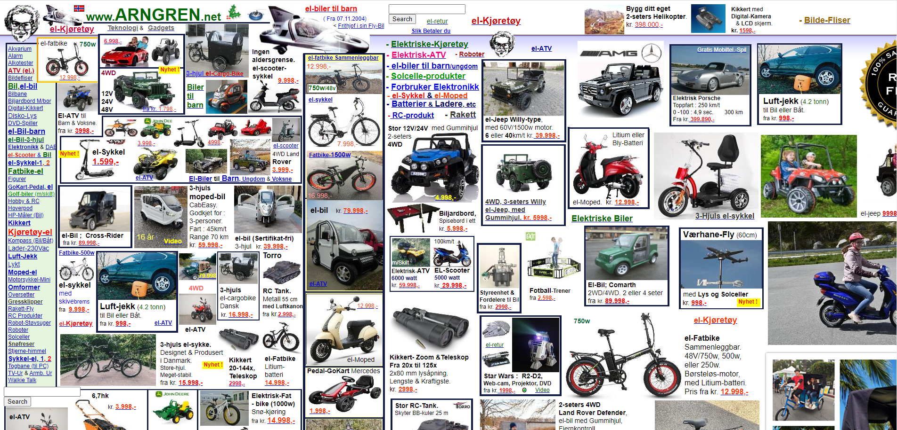
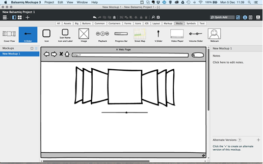
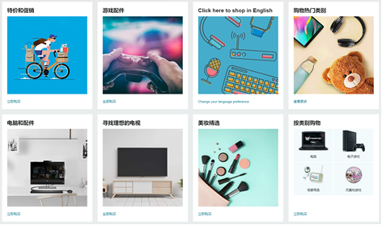

---
title: 网站UI设计批评案例
date: 2023-02-24 02:18:15
summary: 本文分享一则网站UI设计批评案例。
tags:
- 人机交互
- 软件工程
categories:
- 软件工程
---

# 题目要求

What you must do:
1.	Choose an application to observe. This can be a Web page, a standard application, a utility program—even a gadget or appliance that has interesting user-interface features. 
2.	Write an essay of no more than ten pages in length. The essay should include: 
    - A brief description of the system or application you are critiquing. If at all possible, include a picture or drawing to help us understand this application. (10 points)
    - A concise statement of the problem you have observed. (10 points)
    - An explanation of why you believe this is a problem based on the content of "Basic Psychology Needed for Interface Design." (Don't merely say that a feature is "annoying" or "ugly," but explain how it forces a user to perform the tasks of perceiving, processing, or acting in ways that are difficult for people.) (10 points)
    - A suggestion for improving the design and a rationale for that suggestion. (10 points)
(When proposing a solution, try to be as realistic as possible and not suggest costly or complicated enhancements. For example, it probably would not be reasonable to propose that VCRs should recognize and process human speech, as this would make them very expensive, if not unfeasible to build.) 
    - A method for testing your new design to see if it actually solves the problem. This part should include brief descriptions of 
        - What you would measure about people's behavior as they use the original application and your modified redesign. (10 points)
        - The types of people you would use in your test (e.g., computer-savvy experts or novices, etc.). (10 points)
        - The tasks that you would ask those people to perform. (10 points)
        - A prediction of the results you might get. (10 points)
        - What those results would mean if you got them. (10 points)
3. Format your report as Word documents. (10 points)
    - Details of format requirements refer to the homework template.

# 系统概述

连续数年荣登“十大最差网站”的诺威小工具销售网站[https://arngren.net](https://arngren.net)是这次研究的主题。凭借其混乱的布局，这个庞大的挪威小工具销售网站毫无疑问是最疯狂的。它的内容大多更新很快，但是对于现在的访客而言，它更有趣的地方在于收集那些稀奇古怪的动画图片而非购买。

下图为此网站的首页，令人眼花缭乱。令人震惊的是，此网站仍然在正常运行。

# 发现的问题

这个以混乱拥挤而著称的网站首页信息量简直像是要爆炸开一样，至于它究竟是一个在线商店还是线上目录，根本没有人会深究，因为绝大多数人打开个网站的目的只有一个：前来膜拜这糟糕的设计。

该网站将图片、内容和红绿蓝颜色的链接胡乱放置，这些元素聚在一起让该网站变得不可思议地混乱。想在这个被低像素贴图塞满的网站当中找到特定的物品是一件真正意义上海底捞针的事情。

这个网页设计可以说是违法了网页设计的一切原则，无法找到任何符合网页设计原则的线索。它最大的问题是网格的缺失，因此所有布局和内容都随意放置，杂乱不堪。其次，导航结构也混乱，字体排版又过于小而乱，访客根本无从阅读，配色也是很随意，没有任何规划。

此网页设计的不合理性可以总结为以下几点：
1. 不使用网格。
2. 令人难以置信的导航结构。
3. 糟糕的排版使其难以阅读。
4. 混乱的颜色使用。
5. 底部栏的糟糕动画造成视觉污染。

# 问题阐述

重要的信息、面板、窗口或工具在用户界面中都应该有相应的体现。在用户完成任务的过程中，正在进行的操作应该置于中心区域，而其他辅助面板、工具集应该在触手可及的位置。人的眼睛（和意识）有一种本能就是会优先注意力放在有用的或者好看的事物上。

“正经”的用户浏览这个网站的首页主要的任务是选择和购买商品。由于页面的中心区域没有给出产品目录，浏览者首先注意到的可能是画面中部黄白框里的自行车，然后马上被其他物品分散了注意力。这与Center Stage的理念背道而驰，因为它只是在同一个界面杂乱地放出很多图文，造成一片信息的海洋，没有对信息进行精心布局，以引导用户顺利地完成目标并达到预期成果。这样的页面设计不仅没有方便浏览者的下一步操作，而且把浏览者淹没在图文的大杂烩中。即使这个页面展示了很多非常好的商品，却没有一条清晰易懂的故事线。此网站首页更像是一张无序的传单而不是购物网站。

哥伦比亚大学做过一个研究，挑选出两组人，分别给他们展示24种口味和6种口味的果酱，问他们是否想购买。结果有24种口味挑选的那组人，购买转化率仅有3%，相反，只有6种口味的那组转化率高达30%，所以选择太多反而会降低人们的购买欲。而这个网站首页展示超过50个商品，转化率自然很低。

人们很容易被过多的信息分散注意力，所以这个页面对用户的主要任务（选择或购买商品）很不友好。虽然这是一个反例，我们也应该对它进行一番审慎的研究。找到痛点，思考解决方案和预估解决成本。

# 改进建议

用户界面的布局要给用户强烈的视觉暗示，让他们意识到哪一部分最重要，哪些部分次之。让最重要的元素在用户界面中占据最大的面积，可以确保用户一打开界面就将注意力放在这片区域上。紧跟着，用户就可以判定其余的是与之相关的、发挥辅助作用的面板。换句话说，用户马上就能意识到自己可以使用其他面板上的工具，在中央面板上进行各种操作。如果在设计过程中很好地贯彻了这个理念，兴许你的第一个原型就能获得碰头彩——你的测试者能够很自然地理解“用户体验故事”中下一步要做的事。
1. 首先要确定用户界面中的哪个面板、工具集或窗口是最重要的。通常这一点都会很明显，因为它一般都是用户的中央操作面板，比如包含用户文本文档、电子表格或“画布”的面板。
2. 保证最重要的面板的面积最大，而且要比其他面板大得多。一些用户界面设计专家建议，处于Center Stage的面板应该至少是其他的面板（如工具栏）的两倍大。
3. 用颜色来区分面板的内容。通常，最大面板的中心区域用白色，而非中心区域用灰色。
4. 用标题来区分面板，并帮助用户识别特定的工具集、操作集和其他辅助面板。
5. 根据用户的期望展布其他元素。完成Center Stage的同时，合理地安排其他面板，使用户尽可能快速而准确地找到他们想要进行的操作也是一个不容忽视的问题。请记住，辅助面板既不能让遮住主面板，也不能藏在用户的视线之外。

这个来自模拟应用程序Balsamiq的示例展示了如何实现Center Stage：最重要的面板占据最大的面积；用颜色和标题区分主面板和其他面板；其他面板根据用户的需求被放置在主面板周围。用户可以迅速推断出各种面板和按钮执行什么功能，以及去哪里找他们想要的工具。

另一种实践方式是基于网格使内容和元素的布局组织有序。它将所有元素保持在适当的位置，并帮助确定元素的大小、文本的大小和空间等等。通过网格，设计者可以创建一个一致而设计良好的界面。同样是购物网页，Amazon的网格布局网页与之形成了鲜明的对比。

# 改进评估

1.用户行为评估
1.1. 行为事件分析
作用：行为事件分析方法主要用于研究某行为事件的发生对产品的影响以及影响程度。
应用：查看渗透率，比较混乱布局、Center Stage布局、网格布局的差异。
1.2. 页面点击分析
作用：精准评估用户与产品交互背后的深层关系；实现产品的跳转路径分析，完成产品页面之间的深层次的关系需求挖掘；直观的对比和分析用户在页面的聚焦度、页面浏览次数和人数以及页面内各个可点击元素的百分比。
应用：基于PV、UV等指标绘制可视化热力图以进一步分析。
1.3. 用户画像分析
作用：根据用户的属性、用户偏好、生活习惯、用户行为等信息而抽象出来的标签化用户模型。通过高度精炼用户特征来描述用户，可以让人更容易理解用户，并且可以方便计算机处理。
应用：定义用户画像，产品面向带有不同标签的人群，甚至做到“千人千面”，还能简化设计。

2.参与测试的用户类型
2.1. 经常使用此网站进行购物的用户。
2.2. 偶尔使用此网站进行购物的用户。
2.3. 几乎不使用此网站进行购物的用户。
2.4. 从不使用此网站进行购物的用户。

3.测试用户需完成的任务
3.1. 检测能否正常浏览主页而不产生厌烦。
3.2. 检测能否准确地理解主页所需要传递的信息。
3.3. 检测能否在主页有效地检索所需要的信息。

4.测试结果预测
4.1. Center Stage布局和网格布局能使绝大多数用户能正常浏览主页而不产生厌烦。
4.2. Center Stage布局下浏览者能够更明确地捕获网站更为推介的内容；网格布局下浏览者能够明确网站商品的不同分类。
4.3. Center Stage布局对浏览者检索信息稍有不便，需要为用户设置检索的功能；网格布局下用户即使不使用检索功能也能更好地通过分类检索信息。

5.结果分析
即使对用户群的总体偏好有非常深的理解，我们能做的也仅仅是间接地猜测每个用户的使用方式。想要获得直接信息，唯一有效的方法就是收集用户反馈。所以，我们应该大胆地去测试，同时做好不断学习和迭代的准备。
进入这个阶段以前，应该遵循的一条黄金法则是：永远不要让用户陷入迷茫。如若不然，用户就会不清楚随后应该怎么做。这种犹豫是用户对我们的产品彻底失望的第一步。
检查面板布局是否合理的唯一途径是进行用户测试。在设计的早期采用这个方法，再通过纸上原型进行快速迭代，可以为后续的设计省去许多麻烦。
Center Stage布局下，最重要的面板处于界面中心并占据最大的面积，这有助于用户集中注意力而不被其他因素干扰。一些用户界面设计专家建议，中心面板应该至少是其他面板（如工具栏）的两倍大。
网格布局下，内容的分布是有序的。如果配上合理的分类，会极大地简化用户的筛选难度。
通过纸上原型测试和快速迭代，能够确定面板的最佳布局。这种设计模式可以帮助用户更顺利地完成任务，还能帮你省去许多后期的麻烦，最重要的是，你可能会因此而得到一个很棒的设计成果。
