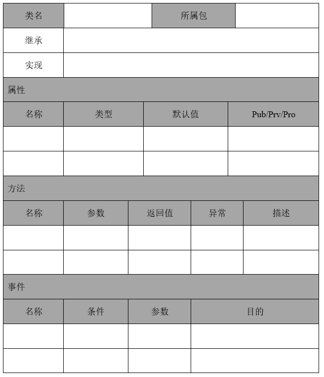

# 详细设计说明书

## 1. 引言

### 1.1. 编写目的

*依照需求规格说明书和概要设计说明书，在本文档中详尽说明软件的详细设计，包括修正或者发行版本号，以便于编程。如果这个软件详细设计只与整个系统的一部分有关系，那么只叙述文档中说明的部分或子系统。为系统编码提供依据。*

示例：
根据概要设计说明书中的设计内容，本说明书对整个系统所需实现的功能以及系统的功能模块的划分和功能模块的具体实现过程提供详细的说明，为整个系统的开发、测试、评定和移交的提供基础。

### 1.2. 适用范围

*本文档的适合使用的业务范围或部门范围。*

### 1.3. 名词术语定义

*将详细设计报告中的术语、缩写进行定义，包括用户应用领域和计算机领域的术语与缩写等。*

表1.	术语说明
| 术语、缩略语 | 解释 |
|:----:|:----:|
|
|

### 1.4. 参考资料

*列举编写软件详细设计说明书时所直接参考的资料或其他资源。系统需求规格说明、使用实例文档或相关软件需求规格说明、概要设计说明等。在这里，最好给出详细的信息，包括标题名称、作者、版本号、日期、出版单位或资料来源，以便于读者查阅这些文献。格式如下：*

[1] 作者，书名/期刊名称，出版社，出版时间。
[2] 作者，期刊名称，出处，出版时间。

## 2. 综合描述

### 2.1. 系统目标

*系统最终要解决的实际问题或要达到的用户要求，系统如何能够做到客户满意。*

### 2.2. 系统概述

*简述系统功能，映射详细设计的基础轮廓。*

### 2.3. 运行环境

*描述软件的运行环境，包括硬件平台、操作系统和版本，还有其他软件组件或与其共存的应用程序。如与概要设计说明中一致，可注明参照概要设计说明，如果概要设计中描述的运行环境较为概括无法明确程序的具体分布和运行方式，须在本处详细说明运行环境，以便能明确程序的具体分布和运行。*

### 2.4. 程序结构说明

*最终的程序分布图及说明（可执行程序、自己开发的动态链接库、自己开发的静态链接库、数据配置文件、资源文件等最终程序包中包含的程序文件，并非源程序结构）、结构图及功能与调用关系简要说明、程序种类说明。本节为以下详细设计的简要索引，为系统程序的上层结构体系描述。详细设计时可能得不到精确的最终程序文件名列表，但是应当尽量完整说明其种类和主要文件内容，在程序编码结束前应将本节补齐，如果在开发过程中设计发生变化，本节也应当做相应变更。*

图1. 系统部署图

表2. 系统文件夹结构说明表

## 3. 系统详细设计

*系统详细设计应当以2.4节内容为索引，换句话说，应当以最终的物理功能实现为主线索。*

### 3.1. XX模块详细设计

#### 3.1.1. 模块职责与功能描述

*针对每个模块进行职责描述。*

#### 3.1.2. 模块交互模型

*针对每个模块通过创建交互模型对模块进行详细设计。*

图2. XX模块时序图

#### 3.1.3. 模块设计类图

*基于模块交互模型创建的模块设计类图。*

图3. XX模块类图

#### 3.1.4. 设计类说明

*类图详细说明模板（类或接口说明）。*

注：这部分应该带有文字说明。

图4. XX模块类说明表

# 注意事项

1. 用例是需求分析的结果，尤其是事件流将参与者（最终用户）与系统的交互过程进行了详细描述，每个交互过程都是需要软件实现的功能点。
2. 模块是架构设计时设计的，一般针对信息化系统，通过层次架构模式，确定每一层的模块，然后通过建立模块之间的交互模型（时序图表示），实现用例的行为（实现用例的事件流）。通俗而言，系统内的模块相互作用，在系统外部看来是实现了用例行为。如此便通过需求确定了系统内的功能模块。
3. 模块的交互模型实现了用例的行为，而设计类的交互模型实现了模块的职责。模块的职责通过模块的交互模型确定，即由哪些对外接口（消息对应到接口）来确定。
4. 面向对象技术核心方法：先确定对象（可大可小，大到整个系统，小到一个设计类）的职责，即它能干什么（表现形式就是一个个方法），然后通过职责确定这一对象内部都有哪些更小的对象，它们的交互实现了这些职责。通过这样反复递进，直到确定一个个设计类（能用编码实现的类）。
5. 详细设计说明书主要是给编程人员和单元测试人员来应用的。从逻辑上，他们应该通过这一设计文档来编写代码。编写目的正是要描述编写详细设计说明的目的是什么。
6. 参考资料部分应该重点参考当前项目前期《需求分析说明书》和《系统架构设计说明书》成果物。这两个成果是参考的核心，也是需要认真理解后，在详细设计中具体设计与实现的。
7. 模块职责与功能描述，主要是讲在架构设计阶段的模块职责描述，主要描述模块的接口和接口功能。
8. 模块交互模型中的设计类与模块设计类图中设计类应该是一致的。同时设计类图中每个设计类的主要方法要与交互模型中的消息一致。这是详细设计中最核心的部分。
9. 设计类不能用中文来标识，这是非常不合适的。
10. 在正式工程文档中要把文档编写的说明内容都去掉。从文档形式上，这是正规性要求。
