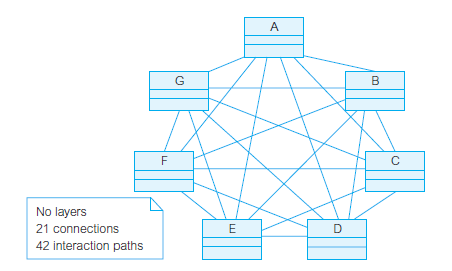

# 软件体系结构

> Bass, Clements, and Kazman (2003) :
> The software architecture of a program or computing system is the structure or structures of the system, which comprise software elements, the externally visible properties of those elements, and the relationships among them.

> 程序或计算系统的软件体系结构(架构)是系统的一个或多个结构，它包括软件元素、这些元素的外部可见属性、 以及他们之间的关系。

软件架构是那些(通常是抽象的)业务目标和最终(具体的)结果系统之间的桥梁。软件体系结构提供了系统的整体视图，描述软件构件的结构和组织、构件的特性以及组件之间的连接。软件组件包括程序模块和程序操作的各种数据表示。

软件体系结构是一种表达，使软件工程师能够：
 - 分析设计在满足规定需求方面的有效性。
- 在设计变更相对容易的阶段，考虑体系结构可能的选择方案。
- 降低与软件构造相关联的风险。

软件体系结构是软件的集合。结构是由关系保持在一起的一组元素。软件系统由许多结构组成，没有一个结构可以声称是架构。
体系结构分为三类：
- 模块分解结构(modules decomposition structure)：一些结构将系统划分为实现单元，称为模块。
    - 模块被分配了特定的计算职责，是编程团队工作分配的基础。
    - 面向对象的分析与设计下，一个模块可以通过一张类图展现。
    - 模块结构是静态结构，因为它们关注系统功能的划分方式和分配给实施团队的方式。
- 组件和连接器结构(component-and-connector structures)
    - 假设系统要构建为一组服务，C&C结构是动态的。
    - C&C结构关注元素在运行时相互交互以执行系统功能的方式。
    - 运行时结构可称为组件和连接器(C&C)结构。
- 分配结构：描述了从软件结构到系统的组织、开发、安装和执行环境的映射。这些映射称为分配结构。

软件体系结构设计包括：
- 数据设计：数据构件和类的定义。
- 体系结构设计：软件构件的结构、属性和交互作用。

诚然，许多架构决策都是在早期做出的。但，架构不一定能一开始就能被确定，例如敏捷开发或螺旋式开发。

我们可以使用一些已知的技术来设计、分析、记录和实现软件架构。

## 软件数据设计

数据设计是把分析模型中定义的数据对象转化成软件构件级的数据结构，并且在必要时转化为应用程序级的数据库体系结构。

体系结构级的数据设计：数据结构、数据库、数据仓库的设计
- 数据挖掘:也成为数据库中的知识发现（Knowledge discovery in Database,KDD）,遍历现有的数据库以试图抽取出合适的业务级信息。
- 数据仓库：是一个独立的数据环境，不直接与日常的应用系统相结合，但包含了某业务使用的所有数据。是一个庞大的、独立的数据库，能够访问存于数据库中的数据，为某项业务所需要的一组应用系统服务。为数据体系结构增加了一个附加层

组件级的数据设计：关注被一个或多个软件构件直接访问的数据结构的表示。其原则包括：
- 应用于功能和行为的系统分析原则也可应用于数据。
- 标识所有数据结构及其完成的操作。
- 提供建立定义数据对象内容的机制，并用于定义数据及操作。
- 低层的数据结构设计决策应该延迟到设计过程的后期。
- 只有那些直接使用数据结构内部数据的模块才能看到该数据结构的表示。
- 应该开发一个由有用的数据结构及其操作组成的库。
- 软件设计和程序设计语言应该支持抽象数据类型的规格说明和实现。

# 软件体系结构风格

体系结构风格：一种加在整个系统设计上面的变换。

体系结构风格分类：
- 以数据为中心的体系结构：数据存储驻留在这种体系结构的中心，其他构件会经常访问数据存储，并对存储中的数据进行更新、增加、删除或者修改。

- 数据流体系结构：当输入数据经过一系列的计算和操作构件的变换形成输出数据。

- 调用和返回体系结构：主程序/子程序的构件分布在网络的多个计算机上。

- 面向对象体系结构
- 层次体系结构：定义了一些列的层次，每个层次各自完成操作，这些操作不断接近机器的指令集。

# 软件体系结构模式

体系结构模式：对体系结构的设计施加一种变换，更多集中在体系结构的某一局部而不是体系结构的整体。

例如处理系统某些行为特征的方法。
- 并发性：以一种模拟并行的方式来操作多个任务。
- 持久性：数据从创建它的进程执行以来一直存在，则该数据是持久性存在的数据。
- 分布性：强调系统或系统中构件在一个分布的环境中相互通信的方式。

# 软件体系结构评估

体系结构权衡分析方法（ATAM）：
1. 收集场景。
2. 诱导需求、约束和环境描述。
3. 描述那些已经被选用于解决场景和需求的体系结构风格/模式。
4. 通过孤立地考虑每个属性来评估质量属性。
5. 针对特定的体系结构风格，弄清质量属性对各种体系结构属性的敏感性。
6. 使用在第5步中进行的敏感性分析鉴定侯选体系结构。

判断体系结构的方法：对体系结构复杂性进行评估，可以通过考虑体系结构中构件间的依赖关系来进行。
- 共享依赖：例如两个构件a和b，如果a和b引用相同的全局数据，则在a和b之间存在共享依赖关系。
- 流依赖：例如两个构件a和b，如果a在控制流入b之前完成，或如果a和b通过参数通信，则在a和b之间存在流依赖关系。
- 约束依赖：例如两个构件a和b，如果a和b不能同时执行（互斥），则在a和b之间存在约束依赖关系。

# 软件体系结构的复杂性

## 复杂性

复杂性具有不同的种类和形态，一种简明的度量是类之间通信路径的数量，通信路径是类之间存在的持久或暂时连接。

复杂性存在四种维度的解释：
- 问题复杂性：问题问题域本身的复杂性，也称为计算复杂性。
- 算法复杂性：目标是度量软件算法的效率。具有降低相关性应归于从算法到交互计算模式的转变。
- 结构复杂性：目标是建立软件结构之间的关系及易于维护和易于演化。对郎被应用到软件对象之间的依赖。
- 认知复杂性：度量理解软件所需要的努力，即捕获程序的逻辑流，并度量逻辑流的各种特性。

从适应能力的角度，认知复杂性度量可以增强可理解性质量，结构复杂性可以增强可维护性和可伸缩性质量。这两种度量是有关系的，对于低结构复杂性，认知复杂性的较小值虽然是必要不充分条件，这与修改代码的需求是一致的，在修改之前首先要理解它。

## 空间认知复杂性

计算机现代程序的可认知复杂性的最合适的度量就是空间复杂性度量，其目标是度量软件工程师为了构造软件的智力模型而必须在代码中移动的距离，空间复杂性的度量体现出不同的特点。

空间复杂性的度量有面向过程的理论和面向对象的理论，面向对象的理论基础很差且常常是错误的，而函数程序设计的空间复杂性公式则是存在的。

导出复杂性的值应该这么做：
1. 计算程序中每个函数的复杂性：$FC=\sum\limits_{i=1}^{total\_calls}{dist_{i}}$
2. 将这些值累加得到整个程序的复杂性：$PC=\sum\limits_{i=1}^{total\_functions}{FC_{i}}$

上述公式的主要弱点是以代码行计算距离。对于更现代的程序设计方法，代码行缺少相关性，当进行分析时也缺少将程序代码可视化的方法。另外，在这种情况下，代码行曲解了空间的含义。

## 结构复杂性

认知复杂性关注逻辑流，结构复杂性关注程序对象间的依赖。

> 一个依赖在模型元素之间定义了一种供应者/客户关系，对供应者的修改可能会影响客户模型的元素、依赖意味着没有供应者，客户的语义是不完整的。

> 如果更改提供服务的对象，则有必要修改此服务的客户对象，那么这两个系统对象之间就存在依赖。

如果系统中的所有依赖都被标识和理解，则说系统有适应性，即具有可理解性、可维护性、可伸缩性。适应性的一个必要条件是依赖可追踪，软件工程师的任务是减少依赖。

在软件系统中，可以根据不同粒度的对象（构件、包、类、方法）来识别依赖。位于低层次粒度上的较特殊对象的依赖会向上传递，在高层次粒度上产生依赖。依赖管理有必要更详细地研究代码，识别数据结构之间的所有关系以及软件对象之间的代码调用。

### 网络结构复杂性

网络的每条通信路径一般都允许类之间进行双向交互，其复杂性可以表示为${}_{net}CCD=n(n-1)$。

我们以类的数量而不是以对象的数量来测量复杂性。程序中，是对象而不是类发送消息给相同类或不同类的其他对象，这对于负责移交应用程序逻辑和管理程序变量和其他数据结构的程序员来说又引入了另外的困难。然而，这种困难在这种情况下不重要，可以忽略。

只有两个对象之间存在持久或瞬态连接，一个对象才可以向另一个对象发送消息。瞬态连接是在单个程序调用中解决的，在程序结构中直接可见，也可以不直接可见。只有在类模型中定义了连接，持久连接才存在。

### 层次结构复杂性

复杂性控制结构的解决方案是通过将类组织成类的合并结构来减少网络结构。用这种方法，类可以很自然地形成层，强调类之间的层次体系分解，而层的内部允许类似网络的交互。

分等级的层次组织通过限制类之间潜在交互路径的数量而降低复杂性，方法是：将类分到层中，只有同一层的内部及一层与层次体系中下面的相邻层之间才允许直接的类交互。

令$size(l_{i})$表示第$l_{i}$层的对象数，$l_{i}$为第$l_{i}$层的双亲数，$p_{j}(l_{i})$为第$l_{i}$层的第$j$个双亲。

$_{holarchy}CCD=\sum\limits_{i=1}^{n}{\frac{size(l_{i})\times(size(l_{i})-1)}{2}}+\sum\limits_{i=1}^{n}\sum\limits_{j=1}^{l_{i}}(size(l_{i})\times{size(p_{j}(l_{i}))})$

