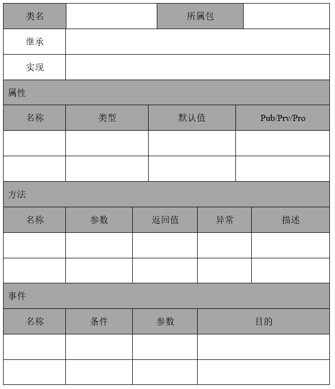

---
title: 软件文档
date: 2022-02-27 01:50:30
summary: 本文介绍软件文档的注意事项，并给出一些模板案例。
tags:
- 软件工程
categories:
- 软件工程
---

# 软件文档

软件产品的文档至关重要，必须是完整的、正确的、最新的。
例如，在分析阶段，规格说明文档必须反映规格说明的当前版本，其他阶段也是一样。

确保文档最新很重要的一个原因是软件行业中的人员的流动性较大。

如果前一阶段的文档不是完整的、正确的、最新的，几乎不可能执行下一阶段的步骤。
例如，不完整的规格说明文档一定会不可避免地造成不完整的设计，继而造成不完整的实现。

除非提供文档来说明对一个软件产品期望的性能，否则不可能测试该软件产品是否正确工作。

如果没有一套完整的、正确的文档精确地描述产品的当前版本做些什么，维护几乎是不可能的。

因此，如同没有独立的计划或测试阶段一样，也没有独立的文档阶段。相反，计划、测试和文档活动应该伴随着建造软件产品的所有其他活动进行。

下面给出一些软件文档的例子:
- 需求规格说明书
- 架构设计说明书
- 详细设计说明书

# 需求规格说明书

推荐阅读：[需求规格说明书](https://blankspace.blog.csdn.net/article/details/114108155)

## 1. 引言

*规格说明是需求工程师完成的最终工作产品，是后续软件工程师活动的基础，描述了一个基于计算机系统的功能和性能，以及那些将影响系统开发的约束。*

### 1.1. 编写目的

*概述开发本系统的意图，编写本文档的用途和主要作用。*

示例：
1. 定义软件总体要求，作为用户和软件开发人员之间相互了解的基础。
2. 明确系统的用例和活动流程，而后续的进一步建模打好基础。
3. 确认系统的功能性需求，为后续的系统架构和模块划分提供指导和依据，也为后续的用户手册编写提供参考。
4. 确认系统的非功能性需求，为后续的系统架构和开发测试明确约束和指标。
5. 保证软件开发的质量、需求的完整与可追溯性。通过此文档，保证业务需求提出者与需求分析人员、开发人员、测试人员及其他利益相关者对需求达成共识。

### 1.2. 背景

*概述描述项目开发的背景。*

### 1.3. 名词术语定义

*将用户需求报告中的术语、缩写进行定义，包括用户应用领域和计算机领域的术语与缩写等。*

*说明：
业务词汇表有助于增强交流、避免误解，需要与利益相关者共享。
至少一部分术语词汇可能是存在于企业中，可能来自于相关系统的开发中。如果词汇表不存在，则应当在需求确定阶段构造词汇表。如果词汇表存在，则需要进行审查并扩展。
词汇表应该以表格的形式书写，该表应当提供术语和定义，按照术语的字母表次序排序，尽可能带有相近术语的链接。*

表1.	术语说明
| 术语、缩略语 | 解释 |
|:----:|:----:|
|
|

### 1.4. 参考资料

*编写本文档的主要参考资文献或资料，格式如下：*

[1] 作者，书名/期刊名称，出版社，出版时间。
[2] 作者，期刊名称，出处，出版时间。

## 2. 项目概述

### 2.1. 项目目标

*项目目标应该是明确的、可度量的、可以达到的。项目目标的确定也就确定了项目范围。
对于项目的目标可以逐步细化，以便于与系统软件需求建立对应关系，检查系统软件需求是否覆盖了系统目标。*

### 2.2. 用户特点

*本系统所涉及到的用户描述。就是相关人员分析内容。*
*角色名指的是直接或间接与系统有利益关系的人所扮演的角色，角色说明指的是针对角色给出角色说明。*

表2.	相关人员分析表
| 角色名 | 角色说明 |
|:----:|:----:|
|
|

### 2.3. 假定与约束

[*何谓系统约束*](https://blankspace.blog.csdn.net/article/details/114607016)

示例：
1. 约束
    1. 本系统上线后，要保证最少正常运行3年。
    2. 本系统以解决用户需求为目标，全体人员应高效完成本项目。
    3. 本系统的开发经费不应超过100万元人民币。
    4. 本系统最长开发时间不应超过60天。
    5. 本系统应该严格做好相关信息的安全保护。
    6. 本系统开发过程中不得使用盗版软件。
    7. 本系统至少支持浏览器客户端和移动手机App客户端。
    8. 原则上，本系统的开发工程师不超过8人，测试工程师不超过3人，运维工程师不超过3人。
    9. 如若用户使用过程中出现重大bug造成重大损失，应追究相关人员责任。
2. 假定
    1. 用户使用的手机操作系统只有Android和iOS，其他与之兼容的操作系统也可以接受。
    2. 用户可以忍受至多2s的加载延时。
    3. 用户能更为喜欢多下拉框和分页而非滚动条的前端界面。
    4. 系统提供的数据分析模板能满足用户的需要。

## 3. 需求分析建模

### 3.1. 功能需求

#### 3.1.1. 系统业务需求描述

*说明：用文字描述系统的总体需求，同时通过业务流程模型将主要业务场景进行展现说明。*

图1. 系统活动图

#### 3.1.2.	系统用例模型

*标识该软件必须满足的各项功能需求。通过用例建模技术进行系统用例建模。*

*要对系统用例模型进行必要的文字说明，并绘制用例图。*

图2. 系统用例图

*要对系统参与者按照如下表格进行说明。*

表3. 系统参与者表
|参与者|说明|
|:----:|:----:|
|
|

#### 3.1.3.	功能模块分析

*采用用例建模技术创建的用例模型，通过用例详述对每个用例进行详述，详细分析说明参与者与系统之间的交互关系。
说明：对要主要用例创建界面原型，详细描述每个功能的流程、数据流等，采用面向对象技术，要对各个用例构建活动图。*

表4.	XX用例分析表
|标题|内容|
|:----:|:----:|
|用例名称	|
|用例简要说明|
|前置条件|
|事件流|
|后置条件|
|扩展点|
|优先级|\<高、中、低\>

图3. XX用例活动图

### 3.2. 非功能需求

#### 3.2.1. 系统非功能需求

*针对系统非功能需求进行说明。*

#### 3.2.2. 特性要求

*针对特定用例进行进一步详细说明。比如：（1）响应时间，最长等待时间。（2）更新处理时间，如记账的最长时间。（3）数据的转换和传送时间，如远程数据传输的时间要求。*

示例：
1. 高可扩展性
App或者网站的访问量弹性很大，刚开始的时候访问量可能比较小，随着系统的不断普及，访问量可能急剧增加，或者随时间的波动明显，需要在设计的时候将系统进行很好的切割，分成功能单一的服务，根据各个系统负载的情况启动规模不同的集群。
2. 高可靠性
系统采取分布式集群方式提供服务，设置异常检查系统，及时识别有问题的节点和重启，保证服务的高可用性。
3. 性能需求
根据推广的计划，给出各个阶段的性能需求，根据常规经验预估满足性能的硬件需求，在做出原型后评估性能，根据性能表现再优化设计，或者通过优化系统提高系统的性能，例如增加缓存。
具体到本项目，性能要求不需要太高，但也要保证用户流畅的使用体验（这部分的具体规范在3.2.2会做说明）。
4. 可维护性
采用自动化的持续集成技术，自动编译、自动部署、自动测试，降低软件迭代过程中的重复劳动强度，减少出错的几率，让软件的修改bug和增加功能时更可靠；特别是代码的单元测试一定要做，将边界条件进行测试，让集成测试的过程中尽量发现价值比较大bug，避免在系统测试过程中去修改那些低水平的bug，毕竟系统测试的成本和代价都比较大。
5. 对技术和业务的可适应性
模块划分的功能单一，充分实现各个层的分离，单职责的模块可扩展性、可维护性都要比复杂模块强。
6. 异步
通过异步消息传递，将进行不同微结构之间传递，让数据分阶段处理，系统结构更清晰。
7. 安全
采用恰当的安全策略，既让客户舒适的登陆，又要保证安全。必须做好数据的加密，防止DDOS攻击、SQL注入式攻击等方式（具体的安全要求在3.3会做说明）。
8. 并发
此系统不易遭遇高并发的情况，但是要防止偶遇的中小规模并发，故系统通常支持的并发量在1000左右即可。

#### 3.2.3. 故障处理要求

*对出现的一些错误或者故障时需要采取的处理方法和手段进行描述。*

示例：
1. 响应时间：最长等待时间遵循“2-5-10原则”，尽最大可能使用户能够在2秒以内得到响应。
2. 更新处理时间：考虑到系统的远程网络传输延迟和响应加载延迟，结合2s的最长响应时间，数据库的更新处理时间应该在0.5s以内。
3. 数据的转换和传送时间：远程网络数据传输延迟应该尽量保证在1s以内，如遇网络拥塞可以考虑重传或失败。

### 3.3. 其他专门要求

*对其他专门要求进行进一步详细说明。比如：（1）进度要求：系统开发的阶段性进度要求。（2）安全性需求：系统安全性方面的要求。（3）培训需求：描述用户对培训的需求，如是否提供多媒体教学光盘、培训时间和培训方式等。（4）推广需求：如在上百个远程部门推广该系统，是否有支持软件等。*

示例：
1. 信息系统出现无法进行本地解决的，应向系统运维工程师进行故障申报。对无法解决的故障，应立即向软硬件最终提供商、代理商或者维保服务商（以下简称厂商）提出技术支持申请，督促厂商安排技术支持，必要时进行跟踪处理，与厂商一起到现场进行解决。
2. 如果故障问题比较严重并牵扯到相关学校，在解决故障期间应给相关学校进行通知，提前做好备份工作。
3. 厂商技术人员现场处理故障时，当地运维工程师应全程陪同并积极协助，并在故障解决后进行书面确认。
4. 故障解决后，运维工程师应对故障的产生原因、解决方案填写详细记录，为以后如果出现类似问题时提供参考方案。
5. 对于系统隐患或暂时不能彻底解决的故障应纳入问题管理，每月应对存在的问题进行跟踪分析。

## 4. 运行环境规定

### 4.1. 基础架构

*对将来系统运行时需要使用的基础架构以及规格等进行描述。*

### 4.2. 支持软件

*对使用的软件工具、平台、操作系统等进行描述。*

示例：
1. 客户端
操作系统：Windows、Mac OS、Linux/Unix。
浏览器：推荐 Firefox、Chrome，也支持诸如IE6+浏览器。
2. 应用服务器端
操作系统：Linux/Unix。
应用服务器： Tomcat 5.5 或更新版本。
数据库访问： JDBC。
Java集成开发环境：Eclipse。
3. 数据库服务器端
操作系统： Windows2000 Server 或更新版本。
数据库系统： SQL Server 2000 或更新版本。
数据库管理工具：Navicat 11 或更新版本。

# 架构设计说明书

推荐阅读：[架构设计说明书](https://blankspace.blog.csdn.net/article/details/114108919)

## 1. 引言

### 1.1. 编写目的

*编写本文档的用途和主要作用。*

示例：
《系统架构设计说明书》用于确定问卷调查系统的整体架构，明确业务功能结构、技术方向以及设计原则，为后续阶段进行概要设计、详细设计、编码开发以及测试提供方向性、原则性的指导。问卷调查系统主要针对我国高等教育体系的问卷调查业务运营需求而设计，本说明书将从问卷调查业务特征分析为切入点，从业务架构、逻辑架构、技术架构等多个维度，逐步分析采用何种技术架构可以在最大程度地满足现有业务需求的同时，也能兼顾未来一段时间内的业务发展变化。

### 1.2. 读者对象

*概述本文档的读者。*

示例：
项目经理、项目团队、高层经理、研发部经理、SQA。

### 1.3. 名词术语定义

*将架构设计报告中的术语、缩写进行定义，包括用户应用领域和计算机领域的术语与缩写等。*

表1.	术语说明
| 术语、缩略语 | 解释 |
|:----:|:----:|
|
|

### 1.4. 参考资料

*编写本文档的主要参考资文献或资料，格式如下：*

[1] 作者，书名/期刊名称，出版社，出版时间。
[2] 作者，期刊名称，出处，出版时间。

## 2. 系统概述

*提示：（1）说明本系统“是什么”。（2）描述本系统的业务需求和主要功能需求。* 

## 3. 架构设计目标和约束

### 3.1. 架构设计目标

*解释描述架构设计的目标。*

示例：
本文档全面与系统地表述目标软件系统的构架，并通过使用多种视图来从不同角度描述系统的各个主要方面，以满足相关涉众（客户、设计人员等）对目标系统的不同的关注焦点。
本文档记录并表述了架构师对系统构架方面做出的重要决策；项目经理将根据构架定义的构件结构制定项目的开发计划；设计人员将据此进行各构件的详细设计；测试设计人员按照构架设计系统的总体测试框架；另外构架文档还用于指导各构件的实施、集成及测试。

### 3.2. 约束需求

*从需求文档（如《用户需求说明书》和《软件需求规格说明书》）中提取需求约束，例如：*
- *本系统应当遵循的标准或规范*
- *软件、硬件环境（包括运行环境和开发环境）的约束*
- *接口/协议的约束*
- *用户界面的约束*
- *软件质量的约束，如正确性、健壮性、可靠性、效率（性能）、易用性、清晰性、安全性、可扩展- 性、兼容性、可移植性等等。*

示例：
1. 本系统至少支持浏览器客户端和移动手机App客户端。
2. 网络通信的应用层协议为HTTP，传输层协议为TCP，网络层协议为IP。
3. 用户使用的移动手机操作系统只有Android和iOS，其他与之兼容的操作系统也可以接受。
4. 用户可以忍受至多2s的加载延时。
5. 用户能更为喜欢多下拉框和分页而非滚动条的前端界面。
6. 系统提供的数据分析模板能满足用户的需要。
7. 不允许出现任何形式的信息外泄。
8. 更多的用户喜欢默认暖色系基调的UI设计。
9. 即使系统崩溃，也不会造成数据丢失，至少也能完全恢复数据。
10. 客户机内存在256MB以上。
11. 简便易用的系统更受欢迎。
12. 系统具备良好的可扩展性，不会因为个别功能的调整引起大面积重构。

### 3.3. 开发与运行环境

*说明本系统应当在什么样的环境下开发和运行，有什么强制要求和建议。*

表2. 开发、测试、运行环境配置说明表
|类别|标准配置|最低配置|
|:----:|:----:|:----:|
|开发环境|
|测试环境|
|运行环境|

## 4. 系统总体设计

### 4.1. 设计思想

*阐明进行架构设计的思想，可参考一些架构设计的模式。*

示例：
1. 面向对象程序设计的六个原则：单一职责原则(SRP)、开闭原则(OCP)、里氏替换原则(LSP)、依赖倒置原则(DIP)、接口隔离原则(ISP)、迪米特原则(LOD)。
2. 中间层思想：MVC模式、J2EE三层体系结构等都具有中间层；还可以设置缓存层以提高性能。
3. 缓存思想：通过设置CPU（多级）缓存、浏览器缓存、网络中的缓存（CDN、反向代理）、服务端缓存（内存级、分布式）、数据库缓存等来提高系统性能。
4. ACID四个特性：ACID分别是原子性、一致性、隔离性、持久性的缩写，数据库的事务就遵循ACID四个特性。
5. CAP（帽子原理）：在一个分布式系统中，CAP三个要素（一致性、可用性、分区容错性）最多只能同时实现两点，不可能三者兼顾。
6. 时间性能和空间性能的折中：没有完美的软件系统，通常在多种因素的影响下权衡利弊。为了达到系统的各种非功能性需求，可能需要时间换空间或空间换时间。

### 4.2. 软件逻辑架构设计

*根据架构分析和设计思想设计系统的逻辑架构，并对系统逻辑架构进行描述，说明分层的原因、层次的职责。*

图1. 系统架构图

图2. 系统包图

### 4.3. 系统主要业务流程设计

*根据每个用例的用例详述，基于系统逻辑架构设计确定的功能模块，设计系统实现这一用例的交互模型。*

图3. XX用例时序图

### 4.4. 功能模块划分

#### 4.4.1. XX模块描述

*根据系统逻辑架构模型进行模块划分，并阐明模块划分的理由和模块的职责。*

表3. XX模块概述表
|模块名称|模块功能（职责）概述|
|:----:|:----:|
|
|

#### 4.4.2. XX模块接口设计

*根据系统交互模型确定的模块职责，对模块接口进行设计，并声明其对其它模块的接口要求。可以提供一定的伪代码。*

## 5. 数据库设计概述

### 5.1. 数据库环境说明

*说明所采用的数据库系统，设计工具，编程工具，有关配置等。*

### 5.2. 系统概念架构设计

*基于需求分析规约（如用例模型）设计系统概念模型，创建实体类类图。*

图4. 系统实体类类图

### 5.3. 数据库逻辑架构设计

*根据系统概念模型，以及根据需求分析和系统逻辑架构，进行数据库逻辑架构设计。*

图5. 系统数据库逻辑架构设计图

### 5.4. 数据表汇总说明

表4. 系统数据表汇总表
|数据表|用途|
|:----:|:----:|
|
|

## 6. 用户界面设计

*主要对系统核心功能内容进行界面原型设计。*

图6. XX功能原型图

# 详细设计说明书

推荐阅读：[详细设计说明书](https://blankspace.blog.csdn.net/article/details/114108945)

## 1. 引言

### 1.1. 编写目的

*依照需求规格说明书和概要设计说明书，在本文档中详尽说明软件的详细设计，包括修正或者发行版本号，以便于编程。如果这个软件详细设计只与整个系统的一部分有关系，那么只叙述文档中说明的部分或子系统。为系统编码提供依据。*

示例：
根据概要设计说明书中的设计内容，本说明书对整个系统所需实现的功能以及系统的功能模块的划分和功能模块的具体实现过程提供详细的说明，为整个系统的开发、测试、评定和移交的提供基础。

### 1.2. 适用范围

*本文档的适合使用的业务范围或部门范围。*

### 1.3. 名词术语定义

*将详细设计报告中的术语、缩写进行定义，包括用户应用领域和计算机领域的术语与缩写等。*

表1.	术语说明
| 术语、缩略语 | 解释 |
|:----:|:----:|
|
|

### 1.4. 参考资料

*列举编写软件详细设计说明书时所直接参考的资料或其他资源。系统需求规格说明、使用实例文档或相关软件需求规格说明、概要设计说明等。在这里，最好给出详细的信息，包括标题名称、作者、版本号、日期、出版单位或资料来源，以便于读者查阅这些文献。格式如下：*

[1] 作者，书名/期刊名称，出版社，出版时间。
[2] 作者，期刊名称，出处，出版时间。

## 2. 综合描述

### 2.1. 系统目标

*系统最终要解决的实际问题或要达到的用户要求，系统如何能够做到客户满意。*

### 2.2. 系统概述

*简述系统功能，映射详细设计的基础轮廓。*

### 2.3. 运行环境

*描述软件的运行环境，包括硬件平台、操作系统和版本，还有其他软件组件或与其共存的应用程序。如与概要设计说明中一致，可注明参照概要设计说明，如果概要设计中描述的运行环境较为概括无法明确程序的具体分布和运行方式，须在本处详细说明运行环境，以便能明确程序的具体分布和运行。*

### 2.4. 程序结构说明

*最终的程序分布图及说明（可执行程序、自己开发的动态链接库、自己开发的静态链接库、数据配置文件、资源文件等最终程序包中包含的程序文件，并非源程序结构）、结构图及功能与调用关系简要说明、程序种类说明。本节为以下详细设计的简要索引，为系统程序的上层结构体系描述。详细设计时可能得不到精确的最终程序文件名列表，但是应当尽量完整说明其种类和主要文件内容，在程序编码结束前应将本节补齐，如果在开发过程中设计发生变化，本节也应当做相应变更。*

图1. 系统部署图

表2. 系统文件夹结构说明表

## 3. 系统详细设计

*系统详细设计应当以2.4节内容为索引，换句话说，应当以最终的物理功能实现为主线索。*

### 3.1. XX模块详细设计

#### 3.1.1. 模块职责与功能描述

*针对每个模块进行职责描述。*

#### 3.1.2. 模块交互模型

*针对每个模块通过创建交互模型对模块进行详细设计。*

图2. XX模块时序图

#### 3.1.3. 模块设计类图

*基于模块交互模型创建的模块设计类图。*

图3. XX模块类图

#### 3.1.4. 设计类说明

*类图详细说明模板（类或接口说明）。*

注：这部分应该带有文字说明。

图4. XX模块类说明表

