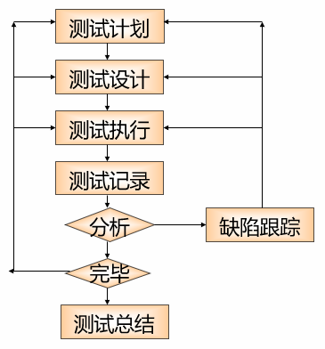

---
title: 单元测试
date: 2023-02-24 20:41:16
summary: 本文分享单元测试的基本内容。
tags:
- 软件测试
- 软件工程
categories:
- 软件工程
---

# 单元测试

**单元测试**(Unit Testing)，又称**单体测试**、**模块测试**，是最小单位的测试，其依据是详细设计、程序源代码或编码标准，对模块内所有重要的控制路径设计测试用例，以便发现模块内部的错误，使代码达到设计要求。

单元测试是所有的测试活动中最早进行的，它能以最低的成本发现和修复软件单元中的错误。单元测试针对编码过程中可能存在的各种错误，例如用户输入验证过程中的边界值的错误。

**单元测试应使用白盒测试和黑盒测试方法对被测单元进行测试，以白盒方法为主。**

多个被测模块之间的单元测试可同时进行，以提高单元测试效率。

**单元测试的目的**：
- 验证代码能否达到详细设计的预期要求。
- 发现代码中不符合编码规范的地方。
- 准确定位发现的错误，以便排除错误。

**单元测试的重要性**：
- 节省时间。
- 测试效果明显。
- 降低测试成本。
- 直接影响产品质量。

**单元测试的开展时机**：单元测试当然是越早越好，通常在编码阶段进行。

**单元测试的测试参与人员**：绝大部分情况下，由白盒测试工程师或开发人员做单元测试的设计和执行，由开发人员测试的最好是进行交叉测试。

# 单元测试流程

# 单元测试准则

1. Keep unit tests small and fast (单元测试应该是小而快的)
2. Unit tests should be fully automated and non-interactive (单元测试应该是完全自动化和非交互式的)
3. Make unit tests simple to run (单元测试应该是易运行的)
4. Measure the tests (度量单元测试)
5. Fix failing tests immediately (立即根据失败的单元测试修复程序)
6. Keep testing at unit level (单元测试应该是单元级别)
7. Start off simple (单元测试应该从简单的测试开始)
8. Keep tests independent (单元测试应该是独立的)
9. Keep tests close to the class being tested (单元测试应该靠近被测试的类)
10. Name tests properly (单元测试应该被正确地命名)
11. Test public API (单元测试应该对公共的API开展测试)
12. Think black-box (单元测试应该考虑开展黑盒测试)
13. Think white-box (单元测试应该考虑开展白盒测试)
14. Test the trivial cases too (单元测试不要放过不那么重要的测试用例)
15. Focus on execution coverage first (单元测试首要关注测试覆盖率)
16. Cover boundary cases (单元测试要覆盖边界情况)
17. Provide a random generator (单元测试需要提供一个随机数生成器)
18. Test each feature once  (单元测试对每个功能点测试一次)
19. Use explicit asserts (单元测试要采用显式断言)
20. Provide negative tests (单元测试必须提供负面测试，即测试功能模块是否不会具备它不该完成的功能)
21. Design code with testing in mind (单元测试在设计代码的时候就应该被考虑)
22. Don't connect to predefined external resources (单元测试不要连接到预定义的外部资源)
23. Know the cost of testing (单元测试的开展要清楚测试成本)
24. Prioritize testing (单元测试的测试用例要按优先性排列)
25. Prepare test code for failures (单元测试要为失败准备测试代码)
26. Write tests to reproduce bugs (单元测试要编写复现BUG的测试用例)
27. Know the limitations (单元测试的局限性应该被了解)

# 单元测试的划分

## 黑盒测试

黑盒测试也称**功能测试**或**数据驱动的测试**，它是通过测试来检测每个功能是否都能正常使用。

黑盒测试是用户视角的，不是开发者视角的。黑盒测试认为，任何程序都可以看做从输入定义域到输出值域的一个映射(函数)。黑盒测试着眼于程序**外部结构**，不考虑内部逻辑结构，主要针对软件**界面**和软件**功能**进行测试。 

黑盒测试可以在开发的同时进行。

黑盒测试只有穷举才能完全覆盖但是这不可能，所以要进行以最少的测试用例发现最多的错误。

黑盒测试能发现的问题：
- 功能不对或功能遗漏。
- 界面错误。
- 数据结构或数据库访问错误。
- 性能问题。
- 初始化和终止错误。

黑盒测试不仅仅用于单元测试，也可以用于组件测试、配置项测试、系统测试等。

黑盒测试分为静态黑盒测试和静态黑盒测试。静态黑盒测试产品需求文档、用户手册、帮助文件等，动态黑盒开展功能测试、验收测试、性能测试等等。

**黑盒测试的优点**：
- 从产品功能角度测试可以最大限度地满足用户的需求。
- 相同动作可重复执行，最枯燥的部分可由机器完成。
- 依据测试用例有针对性地寻找问题，定位更为准确，容易生成测试数据。
- 将测试直接和程序/系统要完成的操作相关联。

**黑盒测试的缺点**：
- 代码得不到测试。
- 如果规格说明设计有误，很难发现。
- 测试不能充分地进行。
- 结果的准确性取决于**测试用例**的设计。

**黑盒测试的方法**：
- [等价类划分法](https://blankspace.blog.csdn.net/article/details/114012879)
- [边界值划分法](https://blankspace.blog.csdn.net/article/details/115015934)
- [决策表法](https://blankspace.blog.csdn.net/article/details/115018061)
- [因果图法](https://blankspace.blog.csdn.net/article/details/115026181)
- [正交试验法](https://blankspace.blog.csdn.net/article/details/114993893)
- [场景测试法](https://blankspace.blog.csdn.net/article/details/115024092)

## 白盒测试

白盒测试也称**结构测试**或**逻辑驱动的测试**，它是按照程序内部的结构测试程序，通过测试来检测产品内部动作是否按照设计规格说明书的规定正常进行，检验程序中的**每条通路**是否都能按预定要求正确工作。

白盒测试着眼于内部结构与逻辑设计，把测试对象看作一个打开的盒子，测试人员依据程序内部逻辑结构相关信息，设计或选择测试用例，对程序所有逻辑路径进行测试，通过在不同点检查程序的状态，确定实际的状态是否与预期的状态一致。 

白盒测试一般以单元或者模块为基础进行测试，也可以用于组件测试、配置项测试等。

白盒测试分为静态白盒测试和静态白盒测试。静态白盒测试检查程序代码，走查评审等。动态白盒测试检查代码并观察运行状况，针对单元测试、集成测试、部分性能测试。

**白盒测试的优点**：
- 迫使测试人员去仔细思考软件的**实现**。
- 可以检测代码中的**每条分支和路径**。
- 揭示隐藏在代码中的错误。
- 对代码的测试比较**彻底**。

**白盒测试的缺点**：
- 昂贵。
- 无法检测代码中**遗漏的路径**和**数据敏感性错误**。
- 不验证规格的正确性。

**白盒测试的方法**：
- [逻辑覆盖法](https://blankspace.blog.csdn.net/article/details/115039924)
- [基路径法](https://blankspace.blog.csdn.net/article/details/115076997)
- [数据流测试](https://blankspace.blog.csdn.net/article/details/115044716)
- [突变测试](https://blankspace.blog.csdn.net/article/details/115221671)

## 灰盒测试

灰盒测试，是介于白盒测试与黑盒测试之间的，可以这样理解，灰盒测试关注输出对于输入的正确性，同时也关注内部表现，但这种关注不像白盒那样详细、完整， 只是通过一些表征性的现象、事件、标志来判断内部的运行状态，有时候输出是正确的，但内部其实已经错误了，这种情况非常多，如果每次都通过白盒测试来操作，效率会很低，因此需要采取这样的一种灰盒的方法。 

**灰盒测试相对于黑盒测试的优点**：
- 测试可以及早介入。
- 有助于测试人员理解系统结构。
- 有助于管理层了解真实的开发进度。
- 可以构造更好的测试用例。
- 利于提升测试人员能力。

**灰盒测试相对于白盒测试的优点**：
- 招聘成本相对较低。
- 培训成本较低。
- 人力成本较低。
- 强化开发文档。
- 自行开发自动化。

**灰盒测试的缺点：**
- 不适用于简单的系统。
- 对测试人员的要求比黑盒测试高。
- 不如白盒测试深入。

# 单元测试框架JUnit

JUnit主要功能包括：
- 用于测试预期结果的断言。
- 用于共享通用测试数据的测试装置。
- 测试套件，可轻松组织和运行测试。
- 图形化和文本形式测试运行。
