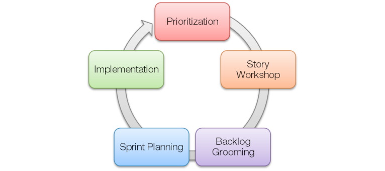
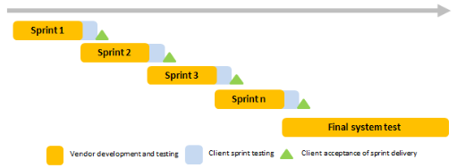

---
title: 敏捷方法与测试左移
date: 2023-02-16 21:56:13
summary: 本文讨论敏捷方法与测试左移的相关内容。
tags:
- 软件测试
- 软件工程
categories:
- 软件工程
---

# 敏捷方法

当敏捷开发方法(Agile Development Methods)出现时，人们认为它们“最适合约 50 人或更小的团队，这些团队可以轻松接触到用户和业务专家，并且正在开发非生命攸关的项目”。如今，敏捷方法越来越多地用于其他环境，例如大型软件开发项目。敏捷方法在大规模开发中的应用提出了许多新的挑战，包括应如何组织测试活动。

大型软件开发项目通常在对质量和效率有很高期望的大型组织中运行，涉及现有软件系统和客户组织的高度复杂性。大型开发项目中的一个挑战可能是在开发后期引入测试工作，这可能会导致延迟交付给客户。延迟测试的一个原因是，在客户可以对系统进行验收测试之前，通常需要实施大量的用户故事流程链。

推荐阅读：[敏捷和Scrum](https://blankspace.blog.csdn.net/article/details/123287693)

# 测试左移

延迟测试存在很多弊病，测试左移对解决此问题更有帮助。测试左移，也称高级TDD，将测试活动的重点转移到开发早期阶段。

推荐阅读：[测试驱动开发与行为驱动开发](https://blankspace.blog.csdn.net/article/details/115186839)

有研究人员指出，超过一半的缺陷不是由编码错误引起的，而是由于需求和设计决策引起的。由于一半以上的缺陷是在开发过程的早期引入的，在项目生命周期中消除这些缺陷的成本会增加，因此尽早开始测试开发(测试左移)是有意义的。在敏捷环境中，测试左移意味着将测试活动转移到早期冲刺(sprint)和每个冲刺的开始。值得关注的点包括在每个开发迭代中尽早高度关注测试和组织测试来实现这一目标的方法。

交付给Scrum团队的设计文档有时包含了可以根据团队先前对系统的经验进行不同解释的信息。这一点，结合Scrum团队缺乏对客户资源的访问，明确了团队在对不明确或模棱两可的需求和设计做出澄清时必须承担的责任。此外，系统的高度互联性和并行工作于相互依赖任务的Scrum团队的数量也对测试提出了挑战。

为确保每个Scrum团队都有有效的测试和质量保证方法，为每个Scrum团队分配了专门的QA资源/测试人员。QA人员将持续参与设计文档的质量保证工作，确定实施是否可测试，准备测试模型和测试数据，并与开发人员和Scrum Master密切合作以确保高质量的代码。QA人员还确保尽早执行所有测试活动。QA人员在冲刺期间帮助团队并促进客户的参与，以确保提供必要的说明。除了审查冲刺测试计划和测试方法之外，客户还被邀请参加走查会议。在冲刺结束期间，客户被邀请参加冲刺演练。这些演练的目的是演示系统的新部分，提供有关如何执行测试以及团队在测试已实现功能时遇到的问题的信息。

推荐阅读：[软件质量控制与软件质量保证](https://blankspace.blog.csdn.net/article/details/115059962)

我们的测试策略描述了在冲刺系统测试之前完成的明确定义，更重要的是，它描述了开发人员对测试的期望。以下是这些期望的一些示例：
- 测试期望并要求在没有单元测试的情况下不签入代码。单元测试应始终在同一个签入中。
- 测试期望并要求在任务可以设置为完成之前完成代码的同行评审，并且同行评审涵盖单元和集成测试以及这些测试的质量。

补充说明：[What does it mean to check-in Code?](https://stackoverflow.com/questions/47874778/what-does-it-mean-to-check-in-code)
> 签入(check-in)代码是指将代码上传到主分支仓库，以便其管理员可以审查代码并最终更新项目版本。此外，签出(check-out)代码与此相反，这意味着从存储库下载代码副本。例如，在GitHub上，克隆意味着签出代码，拉取请求意味着签入代码。

# 测试左移与DevOps

左移是DevOps方法论中的一个关键部分，它要求尽早且频繁的对软件进行测试。左移将测试集成到了CI/CD管道中，这样就可以尽早的发现它们。测试、反馈和修复应该成为每天的日常工作。左移和其他DevOps流程一样，都是为了促进敏捷性，并让项目团队扩展他们的工作以提高生产力。
