---
title: 白盒测试
date: 2020-04-10 01:04:50
summary: 本文以结构化分支和循环语句为例分享白盒测试的相关内容。
tags:
- 软件测试
- 软件工程
categories:
- 软件工程
---

# 黑盒测试与白盒测试

黑盒测试也称功能测试，它是通过测试来检测每个功能是否都能正常使用。

白盒测试测试应用程序的内部结构或运作，而不是测试应用程序的功能。测试者输入数据验证数据流在程序中的流动路径，并确定适当的输出。

# 分支语句的白盒测试

## 测试用例设计方法

- 语句覆盖：语句覆盖设计测试用例的标准是确保被测试对象的**每一行程序代码**都至少执行一次。

- 分支覆盖：分支覆盖设计测试用例的标准是确保程序中**每个判断的每个结果**都至少满足一次。
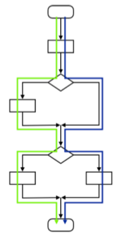
- 路径覆盖：路径覆盖测试用例的标准是确保程序中**每条独立执行路径**都至少执行一次。
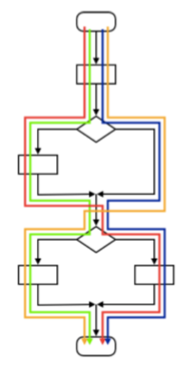

## 举例

```java
public class Customer {
    //积分额度
    int bonus;
    //......
    //预计算消费行为后的积分额
    int getBonus(boolean cashPayment, int consumption, boolean vip) {
        //已有的bonus需要调整getBonus，不能直接使用
        int preBonus = this.getBonus();
        if (cashPayment) {
            preBonus += consumption;
        }
        if (vip) {
            preBonus *= 1.5;
        } else {
            preBonus *= 1.2;
        }
        return preBonus;
    }
}
```

### 画流程图

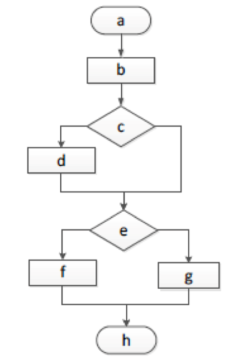

### 设计语句覆盖测试用例

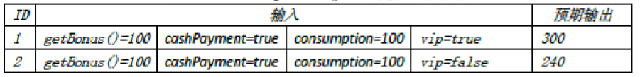

### 设计分支覆盖测试用例

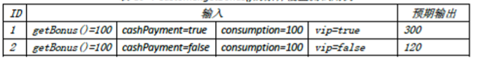

### 设计路径覆盖测试用例

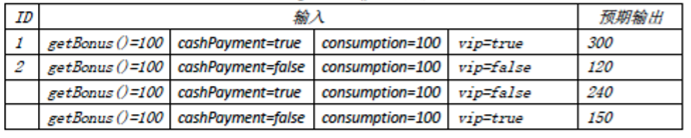

# 循环语句的白盒测试

- 简单循环
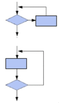
- 嵌套循环
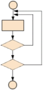
- 连锁循环
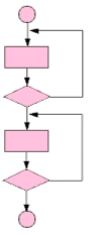
- 不规则循环
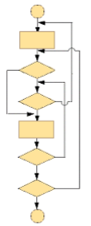

## 简单循环

下列测试集用于简单循环，其中n表示允许通过循环的最大次数：
- 整个跳过循环
- 只有一次通过循环
- 两次通过循环
- m次通过循环，其中m<n
- n-1次通过循环
- n次通过循环

举例：
```java
// number 是大于0，小于100的数
void function(int number) {
    if (number % 2) == 0) {
        printf("even \n");
    }
    for (; number < 9; number++) {
        printf("number is %d\n", number);
    }
} 
```

测试用例：
```java
function(11);   //整个跳过循环
function(8);    //只有一次通过循环
function(7);    //两次通过循环
function(6);    //m次通过循环，其中m<n
function(1);    //n-1次通过循环
function(0);    //n次通过循环
```

## 嵌套循环

- 除最内层的循环外，所有其他层的循环变量置为最小值，对最内层的循环进行简单循环的全部测试
- 逐步外推，对其外面一层循环进行测试。测试时，所有外层循环的循环变量取最小值，所有其他嵌套内层循环的循环变量取"典型"值
- 反复进行，直到所有各层循环测试完毕
- 对全部各层循环同时取最小循环次数，或者最大循环次数

## 连锁循环

- 对于连锁循环，如果各个循环是相互独立的，则可以用与简单循环相同的方法进行测试
- 但是如果两个循环串接起来，而第一个循环是第二个循环的初始值，则这两个循环并不是独立的，则推荐使用嵌套循环的方法进行测试

## 不规则循环

不规则循环**不能进行测试**，尽量重新设计结构化的程序后再进行测试。

# 白盒测试与N-S图

## 基本结构

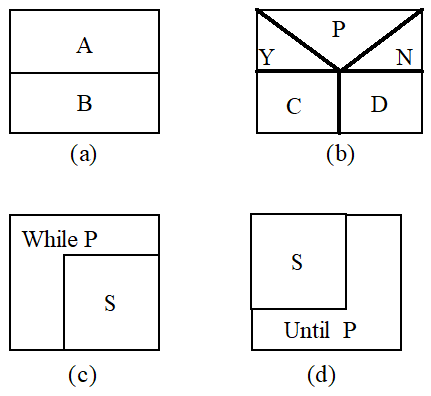

## 测试用例个数

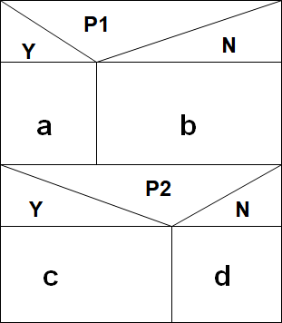

谓词 P1、P2 取不同值的时候将分别执行 a 或 b ，c 或 d 操作。
测试这个程序至少需要$2\times{2}=4$个测试用例。

## N-S图实例

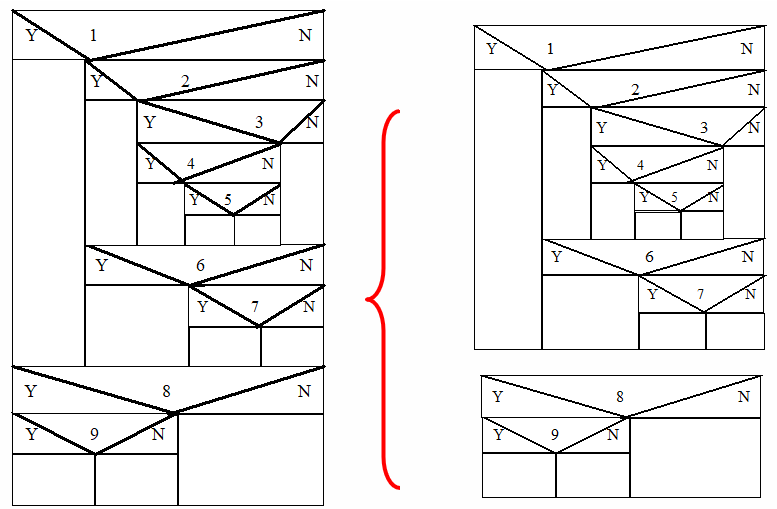

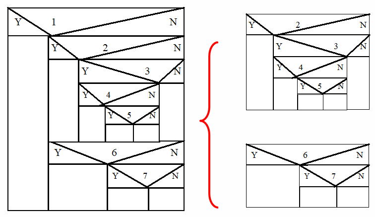

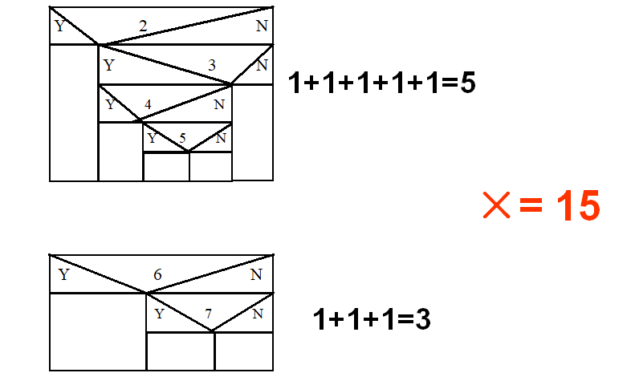

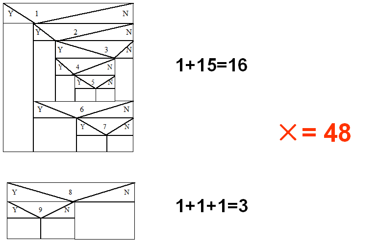
