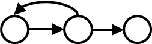

# 控制流图

程序流程图用来描述程序的结构性，是一个有向图，又叫框图，它采用不同的图形符号标明条件或者处理等。

由于这些符号在路径分析是不重要，为了突出控制流结构，我们将程序流程图简化，产生控制流图。

## 基本形式

- 顺序结构：

- While 循环结构：

- Until 循环结构：

- If 选择结构：

- Case 选择结构：

## 流程图改控制流图

## 逻辑拆分

由于具有$and$逻辑，所以$A>1 and B=0$可以分拆为$A>1$和$B=0$：

## 生成测试用例

先根据程序代码绘制流程图，再可以拆分它的逻辑，最后依据需要的[逻辑覆盖方法](https://blankspace.blog.csdn.net/article/details/115039924)去生成测试用例。

# 基路径法

此方法的目的是获得过程设计的逻辑复杂度度量，并将其作为定义基本执行路径集的指南。

使用 Basic Set 的测试用例将至少执行每条语句一次。

# 圈复杂度

圈复杂度的计算：
- 基本方法：
    - 不闭环：$圈复杂度=边数-结点数+2$
    - 闭环：$圈复杂度=边数-结点数+1$
- $圈复杂度=判定结点数+1$
- $圈复杂度=围成的区域数(外部也算一个)$

# 说明

1. 给定程序流程图转换控制流图注意两个要点。
2. 给定程序片段绘制控制流图要注意 if-then-else 语句和 if-then 语句的区别。
3. 用基路径法测试注意控制流图是否是强连接。
4. 通过将复合判定条件分解的方式可以提高测试强度，但生成的测试用例会增加。
5. 基路径测试是路径测试的一种，尽管也考虑了循环问题，但是要着重测试循环体要用循环测试策略。

# 示例

!

不闭环，所以$圈复杂度=11-9+2=4$

所以独立路径条数等于圈复杂度，即为4

写出独立路径：
- 1, 9 
- 1, 2, 3, 8, 1, 9 
- 1, 2, 4, 5, 7, 8, 1, 9 
- 1, 2, 4, 6, 7, 8, 1, 9 
