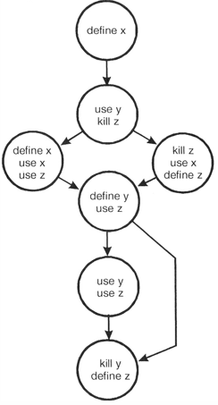
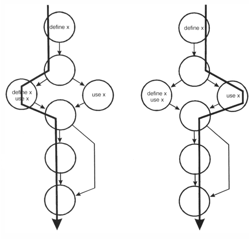
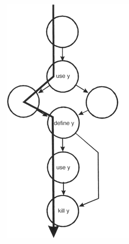
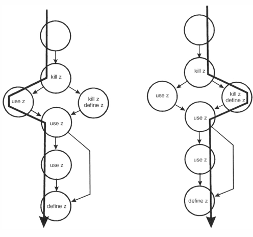

---
title: 白盒测试の数据流测试
date: 2021-03-21 11:21:03
summary: 本文介绍白盒测试的数据流测试。
tags:
- 软件测试
- 软件工程
categories:
- 软件工程
---

# 数据流测试

数据流测试方法根据程序中定义的位置和变量的使用来选择程序的测试路径。

数据流测试是一种强大的工具，用于检测由于编码错误而导致的数据值的不当使用：
- 错误的赋值或输入语句
- 缺少定义（使用null定义）
- 谓词错误（采用错误的路径，从而导致错误的定义）

数据流测试还需要集中精力进行这些测试（而不是基于覆盖率的测试）：
- 探索与数据状态有关的事件序列以及数据可能发生的不合理事件
- 探索使用每次计算产生的值的效果

包含数据值的变量具有定义的生命周期：创建，使用，终止（销毁）。

变量作用域：

```java
{                 // begin outer block
    int x;        // x is defined as an integer within this outer block
                  // x can be accessed here
    {             // begin inner block
        int y;    // y is defined within this inner block
                  // both x and y can be accessed here
    }             // y is automatically destroyed at the end of
                  // this block
                  // x can still be accessed, but y is gone
}                 // x is automatically destroyed
```

通过程序路径第一次出现变量有三种可能:
- \~d：变量不存在(用\~表示)，则定义(d)，这种是正确的， 该变量不存在，然后定义。
- \~u：变量不存在，则使用(u)，这种是不正确的， 在定义变量之前，不得使用变量。
- \~k：变量不存在，则该变量被杀死或销毁(k)，这种可能是不正确的， 在创建变量之前对其进行销毁指示编程错误。

定义如下内容：
- d：定义，创建，初始化（数据声明在计算的左侧）
- k：已杀死，不确定，已释放
- u：用于某物（=c和p）
- c：计算的右侧，指针（计算）
- p：在谓词中使用（或用作循环的控制变量）

定义(d)、使用(u)和终止(k)的时间序列对：
- dd：再次定义和定义，无效但可疑，可能是编程错误。
- du：定义和使用，完全正确，正常情况。
- dk：已定义然后被杀死，不是无效的，但可能是编程错误。
- ud：使用和定义，可以接受。
- uu：可以再次使用，可以接受。
- uk：使用并杀死，可以接受。
- kd：被杀死并被定义为可接受的。变量将被杀死，然后重新定义。
- ku：被杀死并被使用，严重的缺陷。使用不存在或未定义的变量始终是错误。
- kk：被杀死并被杀死，可能是编程错误。

# 数据流图

数据流图类似于控制流程图，因为它显示了通过模块的处理流程。此外，它详细介绍了每个模块变量的定义，使用和销毁。

技术：
- 构造图
- 对图执行静态测试
- 在模块上执行动态测试



对图执行静态测试方法如下：
- 对于模块中的每个变量，我们将检查控制流路径上的“define-use-kill”模式
- x的“define-use-kill”模式（在遵循这些路径时成对使用）是：

    - 〜define：正确，正常情况
    - define-define：可疑，可能是编程错误
    - define-use：正确，正常情况
- y的“define-use-kill”模式（在遵循这些路径时成对使用）是：

    - 〜use：重大失误
    - use-define：可以接受
    - define-use：正确，正常情况
    - use-kill：可以接受
    - define-kill：可能的编程错误
- z的“define-use-kill”模式（在遵循这些路径时成对使用）是：

    - 〜kill：编程错误
    - kill-use：重大失误
    - use-use：正确，正常情况
    - use-define：可以接受
    - kill-kill：可能是编程错误
    - kill-define：可以接受
    - define-use：正确，正常情况

在对此数据流模型执行静态分析时，发现了以下问题：
- x：define-define
- y：~use
- y：define-kill
- z：~kill
- z：kill-use
- z：kill-kill

# 动态数据流测试

虽然静态测试可以检测到许多数据流错误，但无法找到所有错误。此时可以使用动态数据流测试。

动态数据流测试：
- 每个“define”都追溯到其每个“use”
- 每个“use”都从其相应的“定义”中追溯

动态数据流测试的步骤：
- 列举通过模块的路径
- 对于每个变量，至少创建一个测试用例以覆盖每个"define-use"对。
