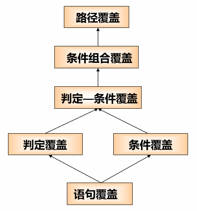
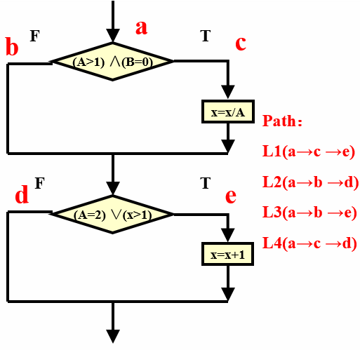
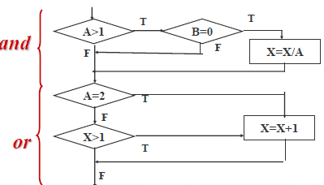

---
title: 白盒测试の逻辑覆盖法
date: 2021-03-21 10:39:26
summary: 本文分享白盒测试的逻辑覆盖法。
tags:
- 软件测试
- 软件工程
categories:
- 软件工程
---

# 逻辑覆盖 Logic Coverage





# 语句覆盖 Statement Coverage

语句覆盖就是设计若干个测试用例，运行被测程序，使得每一条可执行语句至少执行一次。

在图例中，正好所有的可执行语句都在路径L1上，所以选择路径L1设计测试用例，就可以覆盖所有的可执行语句。

| 测试用例 | 通过路径 | 覆盖条件 |
|:----:|:----:|:----:|
| (2, 0, 4) | ace (L1) | T1T2T3T4 |

语句覆盖可能发现不了判断中逻辑运算中出现的错误。

例如：
```java
for (int i = 0; i <= 10; i++) {
    statement;
}
```

错写为：
```java
for (int i = 0; i < 10; i++) {
    statement;
}
```

例如：
```java
while (x > 3 && x < 7) {
    statement;
}
```

错写为：
```java
while (x > 3) {
    statement;
}
```

优点：
可以很直观地从源代码得到测试用例，无须细分每条判定表达式。

缺点：
由于这种测试方法仅仅针对程序逻辑中显式存在的语句，但对于隐藏的条件是无法测试的，如在多分支的逻辑运算中无法全面的考虑。

语句覆盖是最弱的逻辑覆盖。

# 判定覆盖 Decision coverage

判定覆盖就是设计若干个测试用例，运行被测程序，使得程序中每个判断的取真分支和取假分支至少经历一次。

判定覆盖又称为分支覆盖。

以下两组测试用例可覆盖所有判定的真假分支：

| 测试用例 | 通过路径 | 覆盖条件 |
|:----:|:----:|:----:|
| (2, 0, 4), (2, 0, 3) | ace (L1) | T1T2T3T4 |
| (1, 1, 1), (1, 1, 1) | abd(L2) | F1F2F3F4 |

判定覆盖不能保证一定能查出在判断条件中存在的错误。

优点：
判定覆盖具有比语句覆盖更强的测试能力。同样判定覆盖也具有和语句覆盖一样的简单性，无须细分每个判定就可以得到测试用例。

缺点：
往往大部分的判定语句是由多个逻辑条件组合而成，若仅仅判断其整个最终结果，而忽略每个条件的取值情况，必然会遗漏部分测试路径。

判定覆盖仍是弱的逻辑覆盖。

# 条件覆盖 Condition Coverage

条件覆盖就是设计若干个测试用例，运行被测程序，使得程序中每个判断的每个条件的可能取值至少执行一次。

- 对于第一个判断
    - 条件A＞1，取真为T1，取假为F1
    - 条件B＝0，取真为T2，取假为F2
- 对于第二个判断
    - 条件A＝2，取真为T3，取假为F3
    - 条件X＞1，取真为T4，取假为F4

测试用例通过路径覆盖条件：

| 测试用例 | 通过路径 | 覆盖条件 |
|:----:|:----:|:----:|
| (2, 0, 4), (2, 0, 3) | ace (L1) | T1T2T3T4 |
| (1, 0, 1), (1, 0, 1) | abd(L2) | F1T2F3F4 |
| (2, 1, 1), (2, 1, 2) | abe(L3) | T1F2T3F4 |

 或

| 测试用例 | 通过路径 | 覆盖条件 |
|:----:|:----:|:----:|
| (1, 0, 3), (1, 0, 4) | ace (L3) | F1T2F3T4 |
| (2, 1, 1), (2, 1, 2) | abd(L3) | T1F2T3F4 |

优点：
增加了对条件判定情况的测试，增加了测试路径。

缺点：
- 条件覆盖不一定包含判定覆盖。
- 条件覆盖只能保证每个条件至少有一次为真和假，而不考虑所有的判定结果。

# 判定-条件覆盖 Condition / Decision Coverage

判定-条件覆盖实际上是将判定覆盖和条件覆盖结合起来的一种方法。

设计足够的测试用例，使得判断中每个条件的所有可能取值至少执行一次，同时每个判定的可能结果也至少出现一次。

测试用例通过路径覆盖条件：

| 测试用例 | 通过路径 | 覆盖条件 |
|:----:|:----:|:----:|
| (2, 0, 4), (2, 0, 3) | ace (L1) | T1T2T3T4 |
| (1, 1, 1), (1, 1, 1) | abd(L2) | F1F2F3F4 |



优点：
能同时满足判定、条件两种覆盖标准。

缺点：
判定/条件覆盖准则的缺点是未考虑条件的组合情况。

# 条件组合覆盖 Condition Combination Coverage

条件组合覆盖就是设计足够的测试用例，运行被测程序，使得每个判断的所有可能的条件取值组合至少执行一次。

1. A＞1, B＝0, 作T1T2
2. A＞1, B ≠ 0, 作T1F2
3. A ≤ 1, B＝0, 作F1T2
4. A ≤ 1, B ≠ 0, 作F1F2
5. A＝2, X＞1, 作T3T4
6. A＝2, X ≤ 1, 作T3F4
7. A ≠ 2, X＞1, 作F3T4
8. A ≠ 2, X ≤ 1, 作F3F4

测试用例通过路径覆盖条件：

| 测试用例 | 通过路径 | 覆盖条件 |
|:----:|:----:|:----:|
| (2, 0, 4), (2, 0, 3) | ace (L1) | T1T2T3T4 |
| (2, 1, 1), (2, 1, 2) | abe(L3) | T1F2T3F4 |
| (1, 0, 3), (1, 0, 4) | abe(L3) | F1T2F3T4 |
| (1, 1, 1), (1, 1, 1) | abd(L2) | F1F2F3F4 |

分析：上面这组测试用例覆盖了所有8种条件取值的组合，覆盖了所有判定的真假分支，但是却丢失了一条路径L4。

优点：
条件组合覆盖准则满足判定覆盖、条件覆盖和判定/条件覆盖准则。

缺点：
线性地增加了测试用例的数量。

# 路径覆盖 Path Coverage

路径覆盖就是设计足够的测试用例，覆盖程序中所有可能的路径。

测试用例通过路径覆盖条件：

| 测试用例 | 通过路径 | 覆盖条件 |
|:----:|:----:|:----:|
| (2, 0, 4), (2, 0, 3) | ace (L1) | T1T2T3T4 |
| (1, 1, 1), (1, 1, 1) | abe(L2) | F1F2F3F4 |
| (1, 1, 2), (1, 1, 3) | abe(L3) | F1F2F3T4 |
| (3, 0, 3), (3, 0, 1) | abd(L4) | T1T2F3F4 |

分析：虽然前面一组测试用例满足了路径覆盖，但并没有覆盖程序中所有的条件组合，即满足路径覆盖的测试用例并不一定满足组合覆盖。

在实际测试中，即使对程序做到了路径覆盖，仍然不能保证被测试程序的正确性，还需要采用其他测试方法进行补充。

# 代码覆盖率

逻辑覆盖是白盒测试的主要测试方法。

采用白盒法进行测试时，考虑的是测试用例对程序内部逻辑的覆盖程度。

最彻底的白盒法是覆盖程序中的每一条路径，但这往往无法实现。

采用其它一些标准来度量覆盖的程度，并希望覆盖程度尽可能高些。

对单元测试来说，语句覆盖和判定覆盖是最基本的要求。

由于程序中错误（异常）处理工作的重要性以及其结构相对简单，要求错误处理要做到路径覆盖。

对质量要求高的软件单元，可根据情况提出条件覆盖、分支-条件覆盖以及路径覆盖要求。
