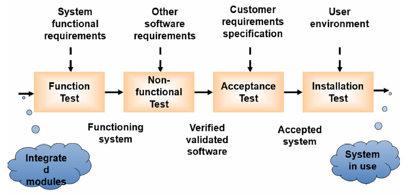

---
title: 系统测试
date: 2021-03-21 23:59:57
summary: 本文分享系统测试的基本理论。
tags:
- 软件测试
- 软件工程
categories:
- 软件工程
---

# 系统测试

系统测试是在单元和集成测试之后，在用户的使用环境下测试的。系统测试将已经集成好的软件系统，作为整个基于计算机系统的一个元素，与硬件、支持软件、数据和人员等其它系统元素结合在一起，在实际运行环境下，对系统进行一系列测试，用来评估系统的符合指定的要求。

系统测试的对象是整个产品系统。不仅包括产品系统的软件，还包含系统软件所依赖的硬件、外设甚至包括接口。

从软件测试的V模型来看，系统测试是产品提交给用户之前进行的最后阶段的测试，因此很多公司将其视为产品的最后一道防线。系统测试所用的数据必须尽可能地像真实数据一样精确和有代表性，也必须和真实数据的大小和复杂性相当。满足上述测试数据需求的一个方法是使用真实数据。

进行系统测试的理由：
- 可安装性、可用性、兼容性、可维护性等属性只能在系统级验证。
- 我们可能会涉及到这个级别的用户，用例可能不映射到任何特定的集成单元。
- 考虑系统环境。

系统测试属于黑盒测试的范畴。因此，系统测试不需要知道代码或逻辑的内部设计。

系统测试是一种比较有限的测试类型，它试图检测“内部装配”和整个系统中的缺陷。

系统测试是在功能需求规范(FRS)和/或系统需求规范(SRS)的上下文中对整个系统执行的。系统测试的目的在于通过与系统的需求定义作比较，发现软件与系统的定义不符合的地方，以验证软件系统的功能和性能等方面是否满足系统的要求。

系统测试的依据：
- 系统测试依据为系统的需求规格说明书、各种规范。
- 通信产品与一般的软件产品不同，其系统测试往往需要依据 大量的既定规范。
- 对于海外产品，系统测试依据还包括各个国家自定的规范。

# 系统测试过程

系统测试评价整个应用的功能和性能。

类似于单元测试和集成测试，系统测试也需要遵循一定的过程。

# 系统测试方法

1. GUI software Testing（图形用户界面测试）：GUI测试是对使用图形用户界面的产品进行测试的过程，以确保其符合书面规范。GUI测试包括两部分：一是验证吻合界面设计和接口的实现，二是确认接口处理的正确性。为了更好的进行GUI测试，提倡界面与功能的设计分离，把GUI系统分为三层：界面层、界面与功能的接口层、功能层。设计测试用例时分三步：
    1. 划分界面元素并根据界面的复杂性进行分层
    2. 在不同的界面层次确定不同的测试策略
    3. 进行测试数据分析，提取测试用例
2. Usability Testing（可用性测试）：是一种通过对用户进行测试来评估产品的技术，它专注于测量一个人造产品满足其预期目的的能力。与可操作性测试有很大的相似性，都是为了检验用户在理解和使用系统方面的能力。
3. Performance Testing（性能测试）：性能测试用于确定计算机、网络、软件程序或设备的速度或有效性，其目标是消除瓶颈、提高系统的可靠性，还可以评估可靠性、可伸缩性和互操作性等定性属性。性能测试支持在实验室开展定量测试，也通常与压力测试一起进行。
4. Compatibility Testing（兼容性测试）：是软件非功能测试的一部分，用于评估应用程序与计算环境的兼容性。
5. Load Testing（负载测试）：对系统或设备提出要求并测量其响应的过程。最适合多用户系统，通常是使用客户机/服务器模型构建的系统，例如Web服务器。当施加在系统上的负载超出正常使用模式时，为了测试系统在异常高或峰值负载下的响应，称为应力测试。
6. Volume Testing（容量测试）：批量测试是指使用一定数量的数据对软件应用程序进行测试。
是面向数据的，其目的是显示系统可以处理目标内确定的数据容量。这个数量可以是数据库大小，也可以是接口文件的大小。容量测试的方法如下：
    1. 分析系统的外部数据源并分类
    2. 对每类数据源分析可能的容量限制
    3. 对每类数据源构造大容量数据进行系统测试
    4. 分析测试结果，并与期望值比较，确定目前系统的容量瓶颈
    5. 对系统进行优化，重复上述步骤，直到系统达到期望的容量处理能力
7. Stress Testing（压力测试）：指在高负载下更加强调健壮性、可用性和错误处理的测试，而不是在正常情况下认为正确的行为。压力测试是为使系统受压力而设计的，其目的是提高可恢复性。这种测试方式在执行系统下需要异常的数量、频率或资源。压力测试属于边界测试。
8. Security Testing（安全性测试）：安全测试检查系统对非法侵入的防范能力。安全测试期间，测试人员假扮非法入侵者，采用各种办法试图突破防线。 
9. Scalability Testing（可扩展性测试）：验证代码设计是否良好允许更多的功能在必要时可以被插入到适当的位置中。
10. Sanity Testing（理智测试）：软件主要功能成分的简单测试以保证它是否能进行基本的测试。
11. Smoke Testing（冒烟测试）：对软件的主要功能进行快餐式测试，最早来自于硬件测试实践，以确定新的硬件在第一次使用时不会着火。用于确认代码中的更改会按预期运行，且不会破坏整个版本的稳定性。 
12. Exploratory Testing（探索测试）：一边测试一边探索，是一个交互式的过程，在某种意义上讲是一个自由形式的测试过程。
13. Ad hoc Testing随机测试：测试人员通过随机的尝试系统的功能，试图是系统中断。
14. Regression Testing（回归测试）：发生修改后重新测试先前的测试以保证修改的正确性。
15. Reliability Testing（可靠性测试）：对系统在规定条件下在指定时间内执行期需要功能的能力进行的测试。
16. Recovery Testing（恢复性测试）：恢复测试是测试应用程序从崩溃、硬件故障和其他类似问题中恢复的能力的活动。在某种情况下，系统必须是容错的，运行过程中的错误不能使整个系统的功能都停止。在其他情况下，一个系统中的错误必须在一定时间段内改正，否则就会产生严重的经济损失。恢复测试采用各种人工干预的手段使软件出错，验证系统的恢复能力。如果系统本身能够自动恢复，检验恢复和重新启动是否正确；如果这一恢复需要人工干预，则应该考虑平均修复时间是否在限定范围以内。
17. Installation Testing（可安装性测试）：安装程序是否正确的测试。
18. Maintenance Testing（可维护性测试）：测试系统是否满足可维护性指标，缺陷纠正、性能改进、特性增加引起的。
19. Accessibility Testing（可访问性测试）：可用性（Usability）、可访问性（Accessibility）和可维护性（Maintainability）。探求人们怎样才能轻松利用网站以及反馈那些可以改进设计和实施的信息。  

## 功能测试

功能测试是系统测试中最基本的测试，它不管软件内部的实现逻辑，主要根据产品的需求规格说明书和测试功能列表，验证产品的功能实现是否符合产品的需求规格。

## 性能测试

性能测试是要检查系统是否满足在需求说明书中规定的性能。

性能测试通常需要与压力测试结合起来，并要求同时进行硬件和软件检测。

通常，需要测试性能信息包括：
- CPU的使用情况
- IO使用情况
- 内存使用情况
- 每个模块执行时间百分比
- 系统响应时间
- 系统吞吐量
- 网络

## 可用性测试

可用性测试是指让一群有代表性的用户对产品进行典型操作，同时测试人员或开发人员在一旁观察，记录。

可用性测试被用来改善软件的易用性，为用户提供一系列操作场景和任务让他们去完成，来发现过程中出现了什么问题、用户喜欢或不喜欢哪些功能和操作方式，原因是什么。针对问题所在，提出改进。

测试人员和程序员通常不宜作可用性测试。

可用性测试中最重要的就是UI(User Interface)测试，即用户跟计算机交互。

具体方法：
- 实验室实验
- 现场观察
- 问卷表
- 启发式评估

## 压力测试

压力测试用来测试系统在其资源超负荷情况下的表现。

压力测试的模拟场景：
- 成千上万的用户同时登录某系统
- 短时间内引入超负荷的数据容量
- 同时引入大量的操作

压力测试的建议步骤： 
- 压力依次增大，直到系统中断
- 重复进行压力测试

## 恢复测试

恢复测试是指验证系统从软件或硬件失败中恢复的能力。

可采用各种人工干预的手段，模拟硬件故障，故意造成软件出错。并由此检查：
- 错误探测功能：系统能否发现硬件失效与故障
- 能否切换或启动备用的硬件
- 在故障发生时能否保护正在运行的作业和系统状态
- 在系统恢复后能否从最后记录下来的无错误状态开始继续执行作业
- 掉电测试：其目的是测试软件系统在发生电源中断时能否保护当时的状态且不毁坏数据，然后在电源恢复时从保留的断点处重新进行操作

## 安全性测试

安全性测试用来验证集成在系统内的保护机制是否能够在实际中保护系统不受到非法的入侵。

安全性测试包括：
- 操作系统的安全性(**系统层安全**)
- 网络的安全性(**网络层安全**)
- 应用的安全性(**应用层安全**)

### 系统层安全性测试

测试操作系统配置安全性的某些主要问题：
- 不必要的用户帐号
- 文件和目录权限、特别是关键的配置文件
- 日志文件
- 口令策略

### 网络层安全性测试

- Internet中，主机之间传输的数据的安全性。这类测试过程中，主要是在数据通信和数据交互过程中，对数据进行截取分析，目前最为流行的是网络数据包的捕获技术，通常称为Capture，利用该技术可以测试网络数据加密效果。
- 企业内部局域网防火墙安全性。

### 应用层安全性测试

- 身份验证
- 权限管理
    - 功能权限
    - 数据对象权限
    - 时间权限

## 安装和卸载测试

### 安装测试

安装测试的目的不是找软件错误，而是找安装错误。

安装程序错误可能源于以下几个方面：
- 环境检测
- 文件复制
- 系统和环境配置
- 软件和硬件不兼容
- 后台干扰，例如病毒检查程序，它运行于后台，可能以多种途径对安装进行干扰

### 卸载测试

卸载测试的目的就是验证成功卸载系统的能力。

在卸载程序过程通常会有以下活动：
- 删除目录
- 删除应用程序的EXE文件和专用DLL文件
- 检查特定文件是否被其他已安装的应用程序使用
- 如果没有其他应用程序使用，删除共享文件
- 删除注册表项
- 恢复原有注册表项
- 通过添加/删除程序执行卸载

## 兼容性测试

兼容性测试用来测试应用对其他应用或者系统的兼容性。

兼容性测试考虑以下问题：
- 硬件兼容性
- 浏览器兼容性
- 数据库兼容性
- 操作系统兼容性
