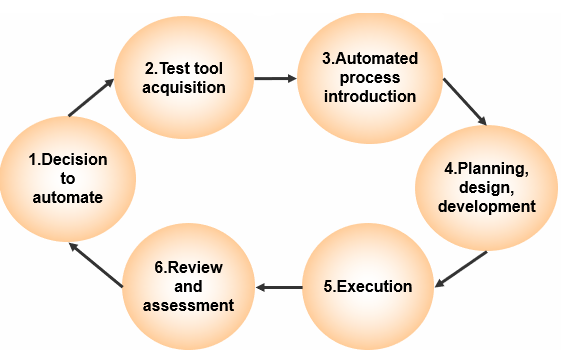
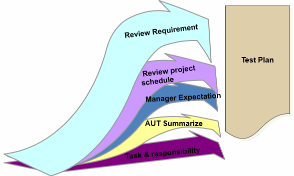

---
title: 自动化测试
date: 2021-03-21 23:59:47
summary: 本文分享自动化测试的基础理论。
tags:
- 软件测试
- 软件工程
categories:
- 软件工程
---

# 自动化测试

自动化测试通过软件来控制测试的执行，它把实际的输出与预期的输出作比较，通过设定测试的先决条件来实现测试控制和测试报告生成的功能。

自动化测试支持使用相同的脚本执行频繁测试，也有更多的内涵。

接口自动化是保证后端的数据是否能正常展示在前端的基础。

UI自动化是为了让之前实现好的功能进行更加有效率的回归测试，而不用投入更多的人力，这样可以更加节省人力成本。

自动化测试适用情况：
- 大困难的测试，如性能、压力、配置
- 一致性测试，如性能回归
- 反复测试
- 稳定性测试
- 单元测试
- 集成测试
- 系统测试

对自动化测试的错误观念：
1. 我们的项目日程安排得太紧了，那么让我们使用自动化测试。
2. 自动化将消除所有手工测试的需要。
3. 我们不需要任何培训。

自动化测试的优点：
- 加速测试以加速发布
- 允许更频繁地进行测试
- 通过减少手工劳动来降低测试成本
- 提高测试覆盖率
- 确保一致性
- 提高测试的可靠性
- 允许测试由技能较低的人员完成
- 定义测试过程，减少对少数知道它的人的依赖
- 可靠性：执行相同的操作——消除人为错误
- 可重用性：可以在应用程序的不同版本上重用测试
- 更好的软件质量：用更少的资源在更短的时间内运行更多的测试，获得较高的覆盖率
- 快速：运行测试的速度明显快于人类用户
- 减少开销：用于测试的资源数量减少
- 替换：手工完成平凡的劳动密集型任务

自动化测试的缺点：
- 工具和培训需要大量投资
- 测试准备工作对人力要求高
- 许多测试区域没有被覆盖

人工测试和自动化测试的对比：

| 比较点 | 自动化测试 | 人工测试 | 
|:----:|:----:|:----:|
| 生产率 | 较高 | 非常耗时，可能会犯错误 |
| 重复性和一致性 | 测试可以准确地复制和重复 | 很难再现故障的确切情况 |
| 执行速度 | 快速 | 较慢 |
| 最大化机器资源 | 测试可以免费运行数小时 | 在几个小时内雇用一组测试人员是很昂贵的 |
| 结果记录 | 自动记录所有结果 | 仅记录失败 |
| 临时和探索性测试 | 不合适 | 非常适合 |
| 动态应用 | 自动化脚本需要高水平的维护 | 易于适应动态应用 |

# 自动化测试生命周期

测试工具导入过程：

# 自动化测试工具

| 工具类型 | 说明 |
|:----:|:----:|
| 测试数据生成器 | 根据需求/设计/对象模型创建测试过程 |
| 代码（测试）覆盖率分析器代码管理 | 白盒测试 |
| 内存泄漏检查 | 确认应用程序是否正确管理内存资源
| 测量报告工具 | 分析数据流\构造\控制流的复杂性，根据模块\操作员\代码行提供代码大小测量 |
| 可用的测量工具  | 用户配置，任务分析，开发原型系统... |
| 测试管理工具 | 提供一些管理测试功能以管理测试文件/缺陷状态等 |
| 网络测试工具 | 监控，测量，测试并总结网络性能 |
| GUI测试工具（记录/重放） | 重新编码用户与交互系统之间的对话框 |
| 负载/性能/压力测试工具 | 用于负载/性能/压力测试 |
| 专用测试工具 | 一些特定于特殊技术和形式的测试工具，例如嵌入式系统测试 |

选择自动化工具要考虑的因素：
1. 易于集成
2. 兼容性
3. 性能
4. 类型的测试
5. 可维护性
6. 负担能力

# 自动化测试的虚拟测试人员

自动化测试由虚拟的测试人员完成，可以是专用的测试工具，用来载入被测试的单元，然后自动执行测试脚本中的步骤和验证点。

虚拟的测试人员是一个捕获/回放工具。
- 该工具可以根据被测试单元执行期间所捕获的GUI以及发生的事件来创建测试脚本。
- 该工具可以回放所记录的脚本并反复检查被测试的单元是否像所预期的那样执行。

自动化测试被广泛应用于回归测试。
回归测试就是在不断地代码迭代后重新执行相关的验收测试，其目的是保证对代码的迭代扩充不会产生非故意的副作用，而且原有代码中的错误在迭代过程中应该不允许改变。
