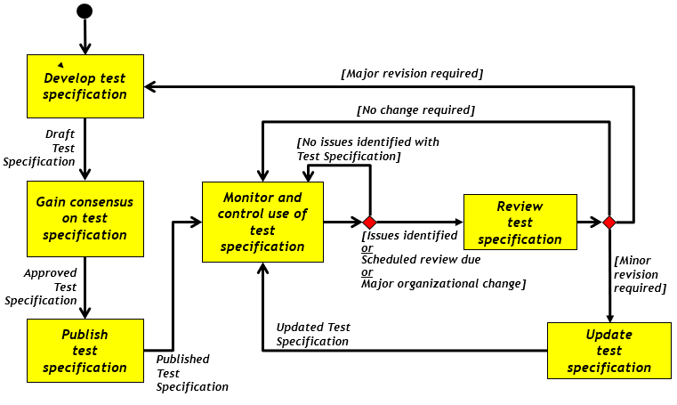
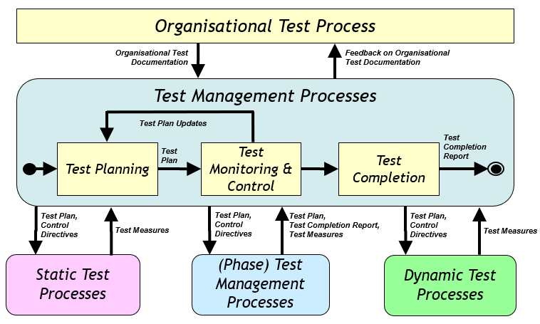
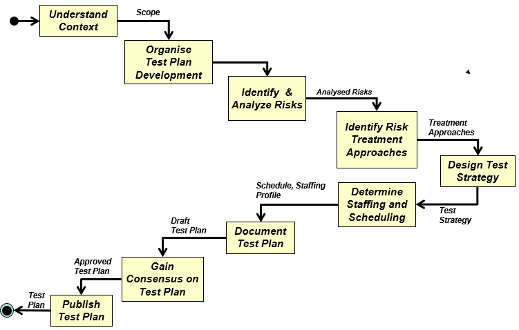
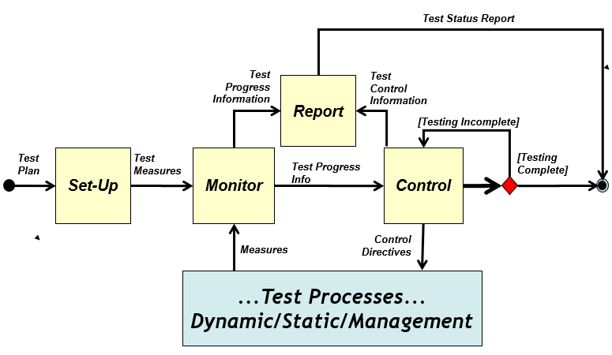
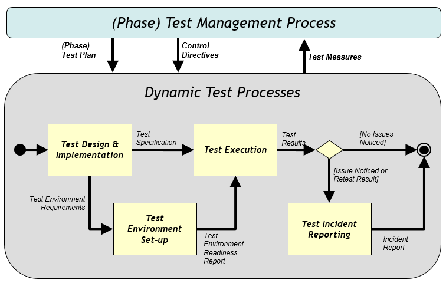
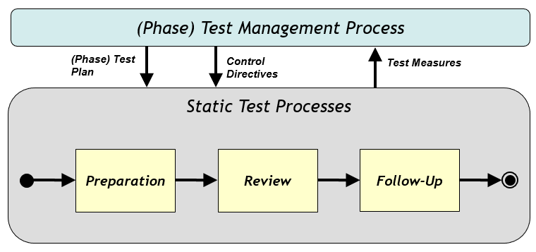

---
title: 软件测试
date: 2021-03-19 21:01:53
summary: 本文分享软件测试的基础内容。
tags:
- 软件测试
- 软件工程
categories:
- 软件工程
---

# 软件测试

制造高质量软件产品比制造低质量软件产品实际上额外开销更少。

完全测试程序是不可能的。好的测试人员并非追求完美，而是知道何时完美无法企及，何时已经足够“完美”。

尽可能早的开展测试，越早发现错误，修改的代价越小。

软件测试是有风险的行为。造成软件测试风险的原因：测试计划不充分、测试方法有误、测试过程偏离。

## 软件缺陷

软件缺陷具有群集现象，即容易出现缺陷扎堆的现象。发现错误较多的程序段时，应进行更深入的测试。

推荐阅读：[软件缺陷](https://blankspace.blog.csdn.net/article/details/129200026)

## 软件测试方法

- 单元测试：依据是详细设计、程序源代码或编码标准，对模块内所有重要的控制路径设计测试用例，以便发现模块内部的错误，使代码达到设计要求。
- 集成测试：将经过单元测试的模块逐步组装成完整的程序。主要目的是检查各单元与其它程序部分之间的接口是否存在问题，各模块功能之间是否有影响。
- 系统测试：是将已经确认的软件、计算机硬件、外设、网络等其他元素结合在一起进行测试。系统测试是针对整个产品系统进行的测试，目的是验证系统是否满足了需求规格的定义，找出与需求规格不符或与之矛盾的地方，进行改正。
- 验收测试：验收测试是在软件产品完成了单元测试、集成测试和系统测试之后，产品发布之前所进行的最后一次软件测试活动，也称为交付测试。 通常由业务专家或用户进行，以确认产品能真正符合用户业务上的需要。

|测试分类 |内容说明|
|:----:|:----:|
|**单元测试**|模块测试，检查每个程序单元是否正确实现详细设计说明中的模块功能 |
|**集成测试**|组装测试，将所有的程序模块进行有序、递增的测试，检验程序单元或部件的接口关系 |
|**系统测试**|检查完整的程序系统能否和系统（包括硬件、外设和网络、系统软件、支持平台等）正确配置、连接，并满足用户需求 |
|**确认测试**|证实软件是否满足特定于其用途的需求，是否满足软件需求说明书的规定 |
|**验收测试**|按照项目任务或合同，供需双方签订的验收依据文档进行的对整个系统的测试与评审，决定是否接受或拒收系统 |
|**回归测试**|指修改了旧代码后，重新进行测试以确认修改没有引入新的错误或导致其他代码产生错误 |

推荐阅读：[软件测试方法](https://blankspace.blog.csdn.net/article/details/105319362)

接口错误只有在集成测试和系统测试中才能发现。

## 通过性测试与失效性测试

测试存在通过性测试(test-to-pass)和失效性测试(test-to-fail)两种测试。错误提示信息既可以视作通过性测试也可以视作失效性测试。

## 黑盒测试与白盒测试

单元测试和集成测试一般是由开发人员或白盒测试工程师进行，系统测试一般由黑盒测试工程师进行。

- 单元测试：黑盒测试、白盒测试、静态测试
- 组件测试：黑盒测试、白盒测试、静态测试
- 配置项测试：黑盒测试、白盒测试
- 系统测试：黑盒测试

## 静态测试与动态测试

静态测试通过阅读需求文档、查看效果图和原型图就可以进行测试。静态测试分为静态黑盒测试和静态白盒测试。

动态测试需要运行被测试的对象（比如页面跳转/状态变更）。动态测试分为动态黑盒测试和动态白盒测试。

## 软件测试的参考依据

单元测试：根据代码实现来评估软件。

模块测试：根据详细设计来评估软件。

集成测试：根据子系统的设计（软件体系结构的构造）来评估软件。

系统测试：根据体系结构的设计和系统整体的行为来评估软件。

验收测试：根据需求和用户需要来评估软件（一般由用户进行或有用户参与）。

## 软件测试与软件开发

软件测试过程与软件开发过程的关系：同步、依赖、互异。

软件项目一启动，软件测试就应该开始，而不是等程序写完，才开始进行测试 。

软件开发人员即程序员应当避免测试自己的程序。

## 软件测试与软件调试

软件测试通过执行测试并观测Failure的方式，旨在发现Bug；而软件调试(Debug)通过定位、理解、修复Fault的方式，旨在修复Bug。
Debugging是在软件失败的前提下寻找故障的过程。

软件测试不属于编程领域的内容（并不意味着开发人员不应该测试）；而软件调试属于编程领域的内容。

## 软件测试组件

在软件测试的领域，一个组件是一个可以独立于整个程序或系统的可以测试的程序块。类、模块、方法、包甚至代码块都可以看作是组件。不可执行的软件工件(XML文件、XML模块和数据库)也可以看做组件。

# 审查和走查

评审可针对软件开发的任何阶段，发现隐藏错误并排除。

| 项目 | 走查 | 审查 |
|:----:|:----:|:----:|
| 准备 | 通读设计和编码 | 应准备好需求描述文档、程序设计文档、程序源代码清单、代码编码标准和代码缺陷检查表 |
| 形式 | 非正式会议 | 正式会议 |
| 参加人员 | 开发人员为主 | 项目组成员，包括测试人员 |
| 主要技术方法 | 无 | 错误检查表 |
| 注意事项 | 限时、不需要现场修改代码 | 限时、不要现场修改代码 |
| 生成文档 | 会议记录 | 静态分析错误报告 | 静态分析错误报告 |
| 目标 | 代码标准规范、无逻辑错误 | 代码标准规范、无逻辑错误 |

# 组织测试流程

# 测试管理流程

## 测试计划流程

测试过程应该严格执行测试计划，排除测试的随意性，以避免发生疏漏或者重复无效的工作。

## 测试监控流程

## 动态测试流程

动态测试需要运行被测试的对象，比如页面跳转、状态变更。

## 静态测试流程

静态测试通过阅读需求文档、查看效果图和原型图就可以进行测试。

# 测试文档

- 组织
    - 测试政策
    - 测试策略
- 项目
    - 项目测试计划
    - 测试完成报告
- 测试
    - 测试规范
    - 检测结果
    - 事故报告
    - 测试环境报告
    - 测试状态报告
    - 测试完成报告
- 附录
    - 每个测试级别的文档示例
