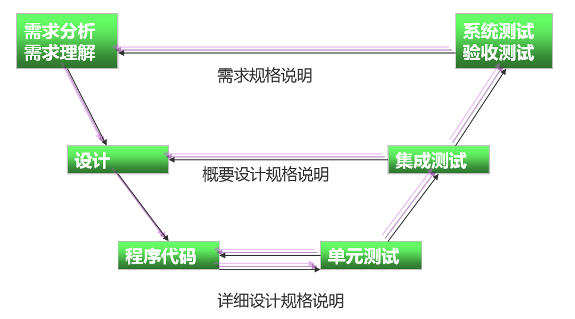

# 软件测试方法

## 按照开发阶段划分

|测试分类 |内容说明|
|:----:|:----:|
|**单元测试**|模块测试，检查每个程序单元是否正确实现详细设计说明中的模块功能
|**集成测试**|组装测试，将所有的程序模块进行有序、递增的测试，检验程序单元或部件的接口关系
|**系统测试**|检查完整的程序系统能否和系统（包括硬件、外设和网络、系统软件、支持平台等）正确配置、连接，并满足用户需求
|**确认测试**|证实软件是否满足特定于其用途的需求，是否满足软件需求说明书的规定
|**验收测试**|按照项目任务或合同，供需双方签订的验收依据文档进行的对整个系统的测试与评审，决定是否接受或拒收系统
|**回归测试**|指修改了旧代码后，重新进行测试以确认修改没有引入新的错误或导致其他代码产生错误

下图描述了一种**经典模式**：

下图表示了一种软件测试层次：

### 单元测试

**单元测试**（Unit Testing）又称**单体测试**、**模块测试**，是最小单位的测试，其依据是详细设计、程序源代码或编码标准，对模块内所有重要的控制路径设计测试用例，以便发现模块内部的错误。

单元测试是所有的测试活动中**最早**进行的，它能以最低的成本发现和修复软件单元中的错误。

**单元测试应使用白盒测试和黑盒测试方法对被测单元进行测试，以白盒方法为主。**

多个被测模块之间的单元测试可同时进行，以提高单元测试效率。

**目的**：
- 验证代码能否达到详细设计的预期要求。
- 发现代码中不符合编码规范的地方。
- 准确定位发现的错误，以便排除错误。

**重要性**：
- 节省时间
- 测试效果明显
- 降低测试成本
- 直接影响产品质量

**进行时间**：单元测试当然是越早越好，通常在编码阶段进行。

**测试人员**：绝大部分情况下，由白盒测试工程师或开发人员做单元测试的设计和执行，由开发人员测试的最好是进行交叉测试。

### 集成测试

**集成测试**又称**组装测试**，集成测试是在单元测试的基础上，将所有模块按照设计要求组装成子系统或系统进行的测试活动。

集成测试重点**关注以下内容**：
- 穿越模块接口的数据是否正确
- 模块间会否产生不利的影响。
- 各个子系统组合起来，能否达到预期要求的父功能。
- 全局数据结构是否有问题。

**策略**：
- 非增量式集成
- 增量式集成

#### 非增量式集成测试

非增量式测试是采用一步到位的方法来构造测试：对所有模块进行单元测试后，按照程序结构图将各模块连接起来，把连接后的程序当作一个整体进行测试。

非增量式测试的缺点： 当一次集成的模块较多时，非增量式测试容易出现混乱，因为测试时可 能发现了许多故障，为每一个故障定位和纠正非常困难，并且在修正一 个故障的同时，可能又引入了新的故障，新旧故障混杂，很难判定出错 的具体原因和位置。

#### 增量式集成测试

**增量式集成测试是逐步实现的**： 逐次将未曾集成测试的模块和已经集成测试的模块（或子系统） 结合成程序包，再将这些模块集成为较大系统，在集成的过程中边 连接边测试，以发现连接过程中产生的问题。

按照不同的实施次序，增量式集成测试又可以分为三种不同的方法： 
- 自顶向下增量式测试 
- 自底向上增量式测试
- 混合增量式测试

##### 自顶向下增量式测试

自顶向下增量式测试表示逐步集成和逐步测试是按照结构图自上而下进行的，即模块集成的顺序是首先集成主控模块（主程序），然后依照控制层次结构向下进行集成。从属于主控模块的按深度优先方式（纵向）或者广度优先方式（横向）集成到结构中去。

- 深度优先方式的集成： 首先集成在结构中的一个主控路径下的所有模块，主控路径的选择是任意的。
- 广度优先方式的集成： 首先沿着水平方向，把每一层中所有直接隶属于上一层的模块集成起来，直到底层。

###### 深度优先方式的集成

###### 广度优先方式的集成

集成测试的整个过程由以下**步骤**完成：
1. 主控模块作为测试驱动器。
2. 根据集成的方式（深度或广度），下层的桩模块一次一次地被替换为真正的模块。
3. 在每个模块被集成时，都必须进行单元测试。 
4. 重复第2步，直到整个系统被测试完成。

**优点**：在早期即对主要控制及关键的模块进行检验。

**缺点**：对低层模块的模拟，测试时没有重要的数据自下往上流，许多重要的测试须推迟进行，而且在早期不能充分展开人力。

##### 自底向上增量式测试

自底向上增量式测试表示逐步集成和逐步测试的工作是按结构图自下而上进行的，即从程序模块结构的最底层模块开始集成和测试。

由于是从最底层开始集成，对于一个给定层次的模块，它的子模块（包括子模块的所有下属模块）已经集成并测试完成，所以不再需要使用桩模块进行辅助测试。在模块的测试过程中需要从子模块得到的信息可以直接运行子模块得到。

##### 混合增量式测试

自底向上——自顶向下的增量测试
- 首先对含**读操作**的子系统自底向上直至根结点模块进行组装测试。
- 然后对含**写操作**的子系统做自顶向下的组装测试。

##### 自顶向下与自底向上增量式测试的比较

自顶向下增量式测试：
优点：它可以自然的做到逐步求精，一开始就能让测试者看到系统的框架。
缺点：需要提供桩模块，并且在输入/输出模块接入系统以前，在桩模块中表示测试数据有一定困难。

自底向上增量式测试： 
优点：测试环境比较容易建立
缺点：直到最后一个模块被加进去之后才能看到整个程序（系统）的框架。

#### 非增量式测试与增量式测试的比较

- 非增量式测试的方法是先分散测试，然后集中起来再一次完成集成测试。 假如在模块的接口处存在错误，只会在最后的集成测试时一下子暴露出来。
- 增量式测试是逐步集成和逐步测试的方法，把可能出现的差错分散暴露 出来，便于找出问题和修改。而且一些模块在逐步集成的测试中，得到 了较多次的考验，因此，可能会取得较好的测试效果。

### 回归测试

在集成测试中，回归测试是对某些已经进行过测试的某些子集再重新进行一遍，以保证（由于测试或其他原因的）程序的修改不会带来不可预料的行为或另外的错误。

回归测试可以通过重新执行部分测试用例，人工地进行，也可以使用自动化的捕获回放工具来进行。

### 系统测试

系统测试是将**已经集成好**的软件系统，作为整个基于计算机系统的一个元素，与硬件、支持软件、数据和人员等其它系统元素结合在一起，在实际运行环境下，对系统进行一系列的测试。

系统测试的目的在于通过与系统的**需求定义**作比较，发现软件与系统的定义不符合的地方，以验证软件系统的功能和性能等方面是否满足系统的要求。

从软件测试的V模型来看，系统测试是产品提交给用户之前进行的**最后阶段**的测试，因此很多公司将其视为产品的**最后一道防线**。

系统测试阶段主要使用**黑盒方法**设计测试用例。

系统测试所用的数据必须尽可能地像真实数据一样精确和有代表性，也必须和真实数据的大小和复杂性相当。满足上述测试数据需求的一个方法是使用真实数据。

系统测试对象为**整个产品系统**，**它不仅包括产品系统的软件，还要包含系统软件所依赖的硬件、外设甚至包括接口**。

系统测试的依据：
- 系统测试依据为系统的需求规格说明书、各种规范。
- 通信产品与一般的软件产品不同，其系统测试往往需要依据 大量的既定规范。
- 对于海外产品，系统测试依据还包括各个国家自定的规范。

#### 功能测试

功能测试是系统测试中最基本的测试，它不管软件内部的实现逻辑，主要根据产品的需求规格说明书和测试功能列表，验证产品的功能实现是否符合产品的需求规格。

#### 性能测试

性能测试是要检查系统是否满足在需求说明书中规定的性能。

性能测试通常需要与压力测试结合起来，并要求同时进行硬件和软件检测。
通常需要测试性能信息包括：
- CPU的使用情况
- IO使用情况
- 内存使用情况
- 每个模块执行时间百分比
- 系统响应时间
- 系统吞吐量
- 网络

#### 可用性测试

**可用性测试**是指让一群**有代表性的用户**对产品进行典型操作，同时测试人员或开发人员在一旁观察，记录。

可用性测试被用来改善软件的易用性，为用户提供一系列操作场景和任务让他们去完成，来发现过程中出现了什么问题、用户喜欢或不喜欢哪些功能和操作方式，原因是什么。针对问题所在，提出改进。

测试人员和程序员通常不宜作可用性测试。

可用性测试中最重要的就是UI(User interface)测试，即用户跟计算机交互。

具体方法：
- 实验室实验
- 现场观察
- 问卷表
- 启发式评估

#### 压力测试

**压力测试**用来测试系统在其资源超负荷情况下的表现

**例子**
- 成千上万的用户同时登录某系统
- 短时间内引入超负荷的数据容量
- 同时引入大量的操作

**建议步骤**： 
- 压力依次增大，直到系统中断
- 重复进行压力测试

#### 恢复测试

**恢复测试**是指验证系统从软件或硬件失败中**恢复**的能力。

可采用各种人工干预的手段，模拟硬件故障，故意造成软件出错。并由此检查：
- 错误探测功能──系统能否发现硬件失效与故障
- 能否切换或启动备用的硬件
- 在故障发生时能否保护正在运行的作业和系统状态
- 在系统恢复后能否从最后记录下来的无错误状态开始继续执行作业
- 掉电测试：其目的是测试软件系统在发生电源中断时能否保护当时的状态且不毁坏数据，然后在电源恢复时从保留的断点处重新进行操作

#### 安全性测试

安全性测试用来验证集成在系统内的保护机制是否能够在实际中保护系统不受到非法的入侵。

安全性测试包括：
- 操作系统的安全性(**系统层安全**)
- 网络的安全性(**网络层安全**)
- 应用的安全性(**应用层安全**)

##### 系统层安全性测试

测试操作系统配置安全性的某些主要问题：
- 不必要的用户帐号
- 文件和目录权限、特别是关键的配置文件
- 日志文件
- 口令策略

##### 网络层安全性测试

- Internet中，主机之间传输的数据的安全性
这类测试过程中，主要是在数据通信和数据交互过程中，对数据进行截取分析，目前最为流行的是网络数据包的捕获技术，通常称为Capture，利用该技术可以测试网络数据加密效果
- 企业内部局域网防火墙安全性

##### 应用层安全性测试

 - 身份验证
- 权限管理
  - 功能权限
  - 数据对象权限
  - 时间权限

#### 安装和卸载测试

##### 安装测试

安装测试的目的不是找软件错误，而是找安装错误。

安装程序错误可能源于以下几个方面：
- 环境的检测（比如有多少可用磁盘空间？）
- 文件复制
- 系统和环境配置
- 软件和硬件不兼容
- 后台干扰，例如病毒检查程序，它运行于后台，可能以多种途径对安装进行干扰。

##### 卸载测试

卸载测试的目的就是验证成功卸载系统的能力。

在卸载程序过程通常会有以下活动：
- 删除目录
- 删除应用程序的EXE文件和专用DLL文件
- 检查特定文件是否被其他已安装的应用程序使用
- 如果没有其他应用程序使用，删除共享文件
- 删除注册表项
- 恢复原有注册表项
- 通过添加/删除程序执行卸载

#### 兼容性测试

兼容性测试用来测试应用对其他应用或者系统的兼容性。

兼容性测试考虑以下问题：
- 硬件兼容性
- 浏览器兼容性
- 数据库兼容性
- 操作系统兼容性

### 验收测试

**验收测试**是部署软件之前的最后一个测试操作。

**目的**：确保软件准备就绪，向未来的用户表明系统能够像预定要求那样工作。也就是验证软件的有效性。

**任务**： 验证软件的功能和性能如同用户所合理期待的那样。

**过程**：
1. **软件需求分析**：了解软件功能和性能要求、软硬件环境要求等，并特别要了解软件的质量要求和验收要求。
2. **编制《验收测试计划》和《项目验收准则》**：根据软件需求和验收要求编制测试计划，制定需测试的测试项，制定测试策略及验收通过准 则，并经过客户参与计划评审。
3. **测试设计和测试用例设计**：根据《验收测试计划》和《项目验收准则》编制测试用例，并经过评审。
4. **测试环境搭建**：建立测试的硬件环境、软件环境等。（可在委托客户提供的环境中进行测试）
5. **测试实施**：测试并记录测试结果。
6. **测试结果分析**：根据验收通过准则分析测试结果，作出验收是否通过及测试评价。
7. **测试报告**：根据测试结果编制缺陷报告和验收测试报告，并提交给客户。

实施验收测试的**常用策略**有三种，它们分别是：
- **正式验收测试**
- **非正式验收测试**
- **β 测试**

选择的策略通常建立在**合同需求**、**组织和公司标准**以及**应用领域**的基础上。

**用户验收测试实施**：
如果执行了所有的测试案例、测试程序或脚本，用户验收测试中发现的所有软件问题都已解决，而且所有的软件配置均已更新和审核，可以反映出软件在用户验收测试中所发生的变化，用户验收测试就完成了。

#### 正式验收测试

**正式验收测试**是一项**管理严格**的过程，它通常是**系统测试的延续**。 计划和设计这些测试的周密和详细程度不亚于系统测试。选择的测试用例应该是系统测试中所执行测试用例的子集。

**两种方式**： 
1. 开发组织（或其独立的测试小组）与最终用户一起执行验收测试。
2. 验收测试完全由最终用户组织执行，或者由最终用户选择人员组成一个客观公正的小组来执行。

**优点**： 
1. 要测试的功能和特性都是已知的。 
2. 测试的细节是已知的，并且可以对其进行评测。
3. 可以对测试过程进行评测和监测。 
4. 可接受性的标准是已知的。 

**缺点**： 
1. 要求大量的资源和计划。 
2. 这些测试可能是系统测试的再次实施。

#### 非正式验收测试

在**非正式验收测试**中，执行测试过程的限定不像正式验收测试中那样严格。在此测试中，确定并记录要研究的功能和业务任务，但没有可以遵循的特定测试用例。测试内容由各测试员决定。这种验收测试方法不像正式验收测试那样组织有序，而且更为主观。

大多数情况下，非正式验收测试是由最终用户组织执行的。

#### β测试

**β测试**是指软件开发公司组织各方面的典型用户在日常工作中实际使用β版本，并要求用户报告异常情况、提出批评意见。然后软件开发公司再对β版本进行改错和完善。

## 按照测试方法划分或针对系统内部结构与具体实现算法

- **黑盒测试**
  - 功能/数据驱动测试、 外部结构
  - 等价类划分、边界值分析、因果图、 错误推测等
- **白盒测试**
  - 结构/逻辑驱动测试、内部结构与逻辑设计
  - 逻辑驱动、基路测试等
- **灰盒测试**
  - 结合黑盒与白盒、特定应用环境、组件协同环境中评价
  - 方法与工具组成

### 黑盒测试

黑盒测试也称**功能测试**，它是通过测试来检测每个功能是否都能正常使用。

黑盒测试着眼于程序**外部结构**，不考虑内部逻辑结构，主要针对软件**界面**和软件**功能**进行测试。 

**优点**：
- 从产品功能角度测试可以最大限度地满足用户的需求。
- 相同动作可重复执行，最枯燥的部分可由机器完成。
- 依据测试用例有针对性地寻找问题，定位更为准确，容易生成测试数据。
- 将测试直接和程序/系统要完成的操作相关联。

**缺点**：
- 代码得不到测试。
- 如果规格说明设计有误，很难发现。
- 测试不能充分地进行。
- 结果的准确性取决于**测试用例**的设计。

### 白盒测试

白盒测试也称**结构测试**或**逻辑驱动测试**，它是按照程序内部的结构测试程序，通过测试来检测产品内部动作是否按照设计规格说明书的规定正常进行，检验程序中的**每条通路**是否都能按预定要求正确工作。

这一方法是把测试对象看作一个打开的盒子，测试人员依据程序内部逻辑结构相关信息，设计或选择测试用例，对程序所有逻辑路径进行测试，通过在不同点检查程序的状态，确定实际的状态是否与预期的状态一致。 

**优点**：
- 迫使测试人员去仔细思考软件的**实现**
- 可以检测代码中的**每条分支和路径**
- 揭示隐藏在代码中的错误
- 对代码的测试比较**彻底**

**缺点**：
- 昂贵
- 无法检测代码中**遗漏的路径**和**数据敏感性错误**
- 不验证规格的正确性

### 灰盒测试

灰盒测试，是介于白盒测试与黑盒测试之间的，可以这 样理解，灰盒测试关注输出对于输入的正确性，同时也 关注内部表现，但这种关注不象白盒那样详细、完整， 只是通过一些表征性的现象、事件、标志来判断内部的 运行状态，有时候输出是正确的，但内部其实已经错误 了，这种情况非常多，如果每次都通过白盒测试来操作 ，效率会很低，因此需要采取这样的一种灰盒的方法。 

**相对于黑盒测试的优点**：
- 测试可以及早介入
- 有助于测试人员理解系统结构
- 有助于管理层了解真实的开发进度
- 可以构造更好的测试用例
- 利于提升测试人员能力

**相对于白盒测试的优点**：
- 招聘成本相对较低
- 培训成本较低
- 人力成本较低
- 强化开发文档
- 自行开发自动化

**灰盒测试的缺点：**
- 不适用于简单的系统
- 对测试人员的要求比黑盒测试高
- 不如白盒测试深入

## 按照测试实施的组织划分

- **开发方测试**：开发方通过检测和提供客观证据，证实软件的实现是否满足规定的需求，在开发环境下，开发方对提交的软件进行全面的自我检查。
- **用户测试**：在用户的应用环境中，用户通过运行软件，检测软件实现是否符合自己预期的要求，这里指用户的使用性测试。
- **第三方测试**：介于软件开发方和用户方之间的测试组织的测试。 

## 按照被测软件是否运行划分

- **静态测试**：不实际运行软件，发挥人的逻辑思维优势,主要对软件代码的逻辑、程序结构等方面进行评估。
    - 需求评审
    - 设计评审
    - 代码走查
    - 代码检查
- **动态测试**：在生命周期中进行测试，需要实际运行程序代码。
    - 单元测试
    - 集成测试
    - 系统测试
    - 验收测试

## 其他测试方法

|测试方法 |简述
|:----:|:----:|
|文档测试| 对相关的设计报告和用户使用说明进行测试
|增量集成测试 |增加新的功能后进行新的测试
|性能测试 |也称压力测试或负载测试
|健全性测试|常作为初始测试，确定一个新的软件版本是否表现正常
|兼容性测试|在一个特定的硬件/软件/操作系统/网络等环境下的性能如何
|可用性测试 |测试该软件的用户界面是否友好
|安装/卸载测试 |测试软件的安装、卸载或升级过程 
|恢复能力测试|测试系统在崩溃,硬件失效,或者遇到其他灾难性的问题时是否能很好地恢复
|验收测试| 获知消费者对该软件是否满意
|比较测试 |在同类产品中比较软件的优缺点
|α测试 |在软件开发将结束时进行该测试
|β测试 |当开发和测试工作实质上完成时进行该类测试
|安全性测试|验证系统安全性、保密性措施是否发挥作用，有无漏洞
|回归测试|在发生修改之后重新测试先前的测试以保证修改的正确性
