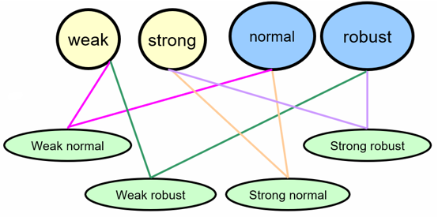

---
title: 软件测试用例
date: 2021-02-24 11:14:11
summary: 本文分享测试用例的相关内容。
tags:
- 软件测试
- 软件工程
categories:
- 软件工程
---

# 测试用例

以测试用例为核心的测试周期主要分为四个阶段：设计测试计划、进行测试、发现异常、修复故障并完成迭代，这是一个迭代过程。

可惜的是，很多人并不能理解处于核心地位的测试用例，本文将浅析**测试用例**这个概念。

 测试用例是指进行测试时使用的特定输入以及软件测试的步骤。

简单地说，测试用例就是设计一个情况，软件程序在这种情况下，必须能够正常运行并且达到程序所设计的执行结果。
在测试过程中，测试用例的状态是唯一的，通常情况下，良好的测试用例一般会有三种状态：通过、未通过和未进行测试。
如果测试用例能正常运行，则我们称通过了测试用例。
如果不能正常运行，并且这种问题会重复发生，那么就表明已经测出了软件的缺陷，这时就必须将这个问题标示出来，并且输入到问题跟踪系统内，通知开发人员。开发人员接收到这个问题后，进行修复，然后测试人员取得新的测试版本，必须利用同一个用例来测试这个问题，确保该问题已经修改，这也就是所说的回归测试。

通常，测试人员总是先基于对软件行为操作的认识程度来设计黑盒测试用例，然后利用白盒测试技术来进行检查使其更有效。一个接口大概可以写6\~12条用例。

测试用例设计的初衷就是尽可能使一个测试用例涵盖一组或多组情形。
必须注意的是通过单一测试用例甚至是所有的测试用例并不说明软件没有Bug！

测试用例应该尽可能避免复杂性。
测试用例避免复杂的目的就是为了保证测试用例的唯一性。当测试用例包含很多不同类型的输入或输出，或者测试过程的逻辑复杂而不连续，此时需要对测试用例进行分解。

一个好的测试用例必须符合以下特征：
1. 有效性：测试用例是测试人员测试过程中的重要参考依据。不同的测试人员根据相同的测试用例所得到的输出应该是一致的，对于准确的测试用例的计划、执行和跟踪是测试的有效性的有力证明。
2. 可复用性：良好的测试用例具有重复使用的功能，使得测试过程事半功倍，可以大大节约时间，提高测试效率。
3. 易组织性：即使很小的项目，也可能会有几千甚至更多的测试用例，测试用例可能在数月甚至几年的测试过程中被创建和使用，正确的测试计划会很好地组织这些测试用例并提供给测试人员或其他项目的人参考和有效使用。
4. 可评估性：从测试的项目管理角度来说，测试用例的通过率是检验代码质量的保证。测试用例的通过率和软件错误的数目就是检查代码质量好坏的量化标准。
5. 可管理性：测试用例可作为检验测试人员进度、工作量以及跟踪/管理测试人员的工作效率因素，尤其是比较适用于对新的测试人员的检验，从而做出测试安排和计划。

测试用例不是每个人都可以编写的，它需要撰写者对产品的设计、功能规格说明书、用户场景以及程序/模块的结构都有比较透彻的了解。通常来说，测试人员一开始只能执行别人写好的测试案例，随着项目的进度以及测试人员的成熟，测试人员很快能自己编写测试用例，并可以提供给别人使用。

测试用例需要很确切地反映功能设计，但同时最好不要完全地复制使用规格设计说明书。测试用例需要借助多个规格说明书的要求进行设计，将所有的可能情况结合起来考虑。

由于测试也是有成本和代价的，在有限的资源下，测试用例可以设计不同的优先级。

测试用例使用后不应该丢弃，保留测试用例是有意义的。

在本地化软件测试时，需要尊重用户的所在国家、区域的风俗、语言以及习惯用法。

# 测试用例的组成

测试用例应该有对应的ID、输入、预期输出。
比如对三角形类型判断的测试中，三边为a、b、c，其中一条测试用例可以设计为：

| ID | a | b | c | 预期输出 |
|:----:|:----:|:----:|:----:|:----:|
| 1 | 3 | 3 | 3 | 等边三角形 | 

更严格的测试用例存在8个要素：用例编号、标签、步骤、前置条件、预期结果、实际结果、优先级、所属模块。

测试用例的设计本质应该是在设计的过程中理解需求，检验需求，并把测试的过程记录下来。

测试用例不应当是一个固定的文档，需求时随时会变得，一次我们需要根据需求的改变而改变我们的测试文档。

# 测试用例的强弱和健壮性

测试可以分为强测试和弱测试，亦可分为一般性测试和健壮性测试，同时考虑二者正是离散数学上所提到的[划分加细](https://blankspace.blog.csdn.net/article/details/114016145)。

- 弱一般等价类：单缺陷+不考虑异常区域
- 强一般等价类：多缺陷+不考虑异常区域
- 弱健壮等价类：但缺陷+考虑异常区域
- 强健壮等价类：多缺陷+考虑异常区域

无效值会引起运行错误的时候（实现语言是强类型），则没有必要做健壮形式的测试。

错误条件很重要的时候，健壮测试很重要。
