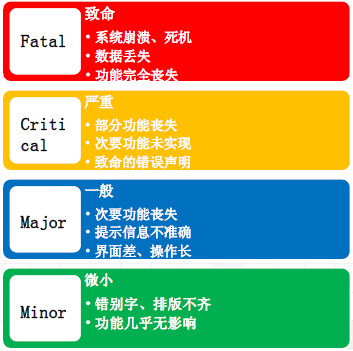
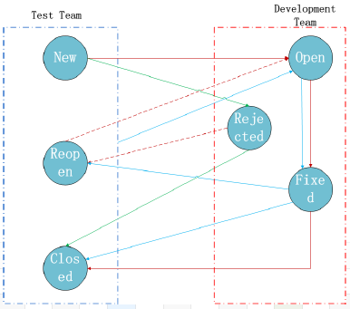

---
title: 软件缺陷
date: 2023-02-25 02:15:02
summary: 本文分享软件缺陷的相关内容。
tags:
- 软件测试
- 软件工程
categories:
- 软件工程
---

# 软件缺陷

最终产品同需求的期望不一致的情况，称为软件缺陷，统称为BUG。

软件缺陷的几种情况：
- 软件未实现产品说明书要求的功能。
- 软件出现了产品说明书指明不应该出现的错误。
- 软件实现了产品说明书未提及的功能。
- 软件未实现产品说明书虽未明确提及但应该实现的目标。
- 软件难以理解、不宜使用、运行缓慢、用户体验差。

严重的软件缺陷主要表现在以下几个方面：
- 系统的主要功能没有实现。
- 本地数据库数据量比较大的时候出现程序崩溃死机，需要其他人工修复系统才可复原。
- 系统主要功能逻辑混乱导致意外BUG。
- 后台进程在程序关闭后没有相应停止导致程序不能启动。
- Web API接口调用错误导致核心功能不可实现。

软件缺陷是一种人为过程，与软件本身而言是一种外部行为。

软件缺陷产生的原因：
- 软件本身
    - 需求不清晰。
    - 系统结构设计复杂。
    - 程序逻辑路径或数据范围边界考虑不周全。
    - 系统自我修复或安全设计考虑不周全。
    - 系统环境复杂。
    - 新技术的引进导致一些问题的产生。
- 团队工作
    - 与客户的沟通。
    - 开发团队内不同负责模块人员的沟通。
    - 团队人员能力参差不齐。
- 技术问题
    - 算法错误：在给定条件下没能给出正确或准确的结果。
    - 语法错误：对于编译性语言程序，编译器可以发现这类问题；对于解释性语言程序，只能在测试运行时发现此类问题。
    - 计算和精度问题：计算的结果没有满足所需要的精度。
    - 系统结构不合理、算法选择不科学，造成系统性能低下。
    - 接口参数传递不匹配，集成出现问题。
- 项目管理
    - 缺陷质量文化，不重视质量计划。
    - 开发周期短，各项工作不能按照流程来实施。
    - 开发流程不完善。
    - 文档不完善。

# 典型软件缺陷

测试过程中发现的缺陷主要有以下几个方面：
1. 需求定义不明确。需求文档中，存在功能定义错误，输入输出字段描述错误，输入输出字段限制定义错误，输入输出限制定义缺失这几种类型的缺陷。使得开发人员根据需求进行设计时，没有考虑相关功能的关联性，以及需求错误的地方，在测试过程中，需求相关的问题表现出来。需求做改正，设计必须跟着做改动，浪费时间和影响开发人员的积极性，降低开发人员对需求的信任，可能会导致开发人员不按照需求进行设计而根据自己的经验来进行设计。
2. 功能性错误。
    - 核心功能没有实现，导致无法进行需求规定的功能的测试。
    - 功能实现错误，实现了需求未定义的功能，执行需求定义的功能时系统出现错误。
3. 页面设计和需求不一致。页面设计没有根据需求进行，输入、输出字段文字错误，用户无法理解字段含义。页面设计没有完成需求规定的输入限制验证，导致用户可以输入错误的或者无效的数据，这些数据有可能会引起功能性错误。
4. 多语言数据问题。
    - 系统中很多输入字段是通过调用数据字典的方式输入，但是现有系统中，很多数据字典的多语言信息没有完成，导致使用多语言的时候，显示空白字段。
    - 系统中很多地方使用多语言，由于多语言编码不统一导致页面设计和数据设计使用语言编码不一致，由此引起的多语言数据无法显示的缺陷。
5. 页面设计易用性缺陷。
    - 页面设计不友好，系统中很多页面的输入字段无明确的输入提示，用户无法理解何种输入是正确的，但是用户输入错误后，系统提示出错，增加用户负担。
    - 提示信息错误，不同模块相同结果的提示信息不一致，用户操作后，相应的提示信息不明确，引起用户误解。
    - 提示信息一致性，用户在不同页面执行相同的操作，提示信息不同。
6. 开发人员疏忽引起的缺陷。因为开发人员的疏忽，导致系统需要验证的地方，调用了错误的验证，系统需要进行输入控制的地方没有进行相应的控制。

# 软件缺陷等级与优先级

软件缺陷的严重性表示软件缺陷的恶劣程度，当用户碰到该缺陷时影响的可能性和程度。软件缺陷的优先级表示修复该缺陷的重要程度和迫切程度。

并非产生最严重的BUG，就要最优先解决。严重等级不能代替软件缺陷解决的优先级。

# 软件测试挖掘软件缺陷

软件缺陷具有群集现象，即容易出现缺陷扎堆的现象。

尽管软件测试是改进软件质量的重要手段。遗憾的是，软件测试几乎不可能是完全的，也往往无法显示潜藏的软件缺陷。
尚未发现或者观察到的软件缺陷只能说是潜在缺陷。虽然潜藏的软件缺陷较多，但找到的软件缺陷越多，就说明软件缺陷越多。

软件缺陷发现的越晚，修复成本越高。
如果在需求阶段修正一个错误的代价是1，那么，在设计阶段就是它的3\~6倍，在编程阶段是它的10倍，在内部测试阶段是它的20\~40倍，在外部测试阶段是它的30\~70倍，而到了产品发布出去时，这个数字就是40\~1000倍，修正错误的代价不是随时间线性增长，而几乎是呈指数增长的。
因此，软件缺陷应该尽早发现，测试左移是一种思路。

# 软件缺陷处理过程及状态

软件缺陷的状态：
- 创建(New)：测试中新报告的软件缺陷。
- 打开(Open)：被确认并分配给相关开发人员处理。
- 修正(Fixed)：开发人员已完成修正，等待测试人员验证。
- 拒绝(Declined):拒绝修改缺陷。
- 延期(Deferred): 不在当前版本修复的错误，下一版修复。
- 关闭(Closed)：错误已被修复。

软件缺陷记录的“5C”准则：
- 准确(Correct)：每个组成部分的描述准确，不会引起误解。
- 清晰(Clear)：每个组成部分的描述清晰，易于理解。
- 简洁(Concise)：只包含必不可少的信息，不包括任何多余的内容。
- 完整(Complete)：包含复现该缺陷的完整步骤和其他本质信息。
- 一致(Consistent)：按照一致的格式书写全部缺陷报告。

并非所有的软件缺陷都需要修复。发现的缺陷可能并不算真正的缺陷，或是不值得修复。时间不足、修复风险大等因素也是重要原因。
