---
title: 集成测试
date: 2021-03-21 20:01:52
summary: 本文分享集成测试的相关内容。
tags:
- 软件测试
- 软件工程
categories:
- 软件工程
---

# 集成测试

**集成测试**又称**组装测试**，集成测试是在单元测试的基础上，将所有模块按照设计要求组装成子系统或系统进行的测试活动。

集成测试关注的方面：
- 多个模块或组件的接口。
- 集成的功能特征。
- 交互协议和消息。
- 系统架构。

集成测试重点关注以下内容：
- 穿越模块接口的数据是否正确
- 模块间会否产生不利的影响。
- 各个子系统组合起来，能否达到预期要求的父功能。
- 全局数据结构是否有问题。

集成测试可以分为：
- 非增量式集成
    - 非增量式测试是采用一步到位的方法来构造测试：对所有模块进行单元测试后，按照程序结构图将各模块连接起来，把连接后的程序当作一个整体进行测试。
    - 当一次集成的模块较多时，非增量式测试容易出现混乱，因为测试时可能发现了许多故障，为每一个故障定位和纠正非常困难，并且在修正一 个故障的同时，可能又引入了新的故障，新旧故障混杂，很难判定出错 的具体原因和位置。
- 增量式集成
    - 增量式集成测试是逐步实现的。逐次将未曾集成测试的模块和已经集成测试的模块(或子系统)结合成程序包，再将这些模块集成为较大系统，在集成的过程中边 连接边测试，以发现连接过程中产生的问题。

# Stub与Driver

推荐阅读：[Stub与Driver](https://blankspace.blog.csdn.net/article/details/115048131)

测试桩向处于测试的模块发送数据，充当接口模块(替换低级模块)，适用于自顶向下的测试。

测试驱动可以代替实际软件(高层软件)，对底层模块进行更有效的测试，适用于自底向上的测试。

# 集成测试策略

- Big bang Integration：大爆炸式的集成
- Top-down Integration：自顶向下的集成
- Bottom-up Integration：自底向上的集成
- Sandwich Integration：三明治式的集成
- Layers Integration：分层集成
- High-frequency Integration：高频集成
- Event-based Integration：基于事件的集成

## 大爆炸式集成

这是一种非增量集成方法，将所有系统组件一次性集成在一起，不考虑组件的依赖性和可能的风险。

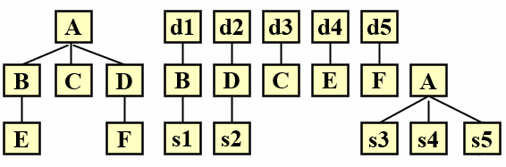

优点：集成测试可以快速完成，只需要很少的存根和驱动程序；多个测试人员可以并行工作，人力和物力资源利用率更高。

缺点：一旦出现问题，问题的定位相对困难；许多接口错误直到系统测试后才会被发现。

## 自顶向下集成

流程：
1. 首先集中在顶层组件，然后逐步测试组件的底部。
2. 可以使用深度优先和广度优先策略。
3. 进行回归测试，排除可能的错误造成的整合。
4. 所有模块集成到系统完成测试，否则转(2)。

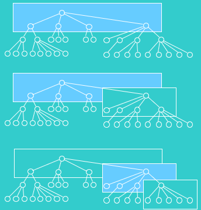

深度优先策略： 
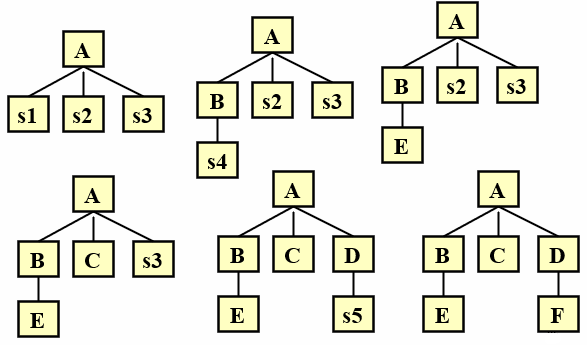

广度优先策略： 
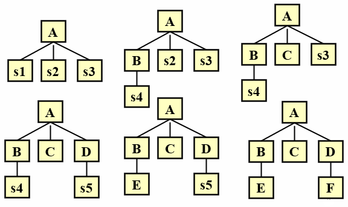

执行过程： 

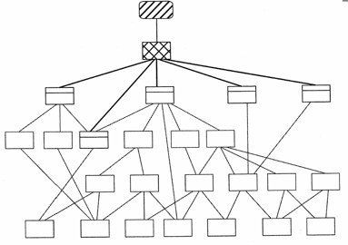

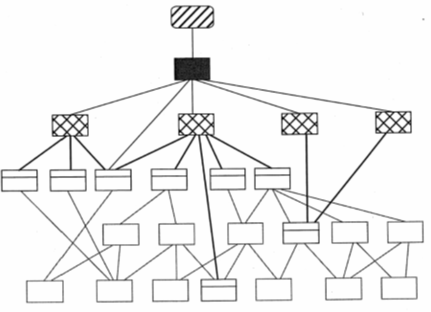

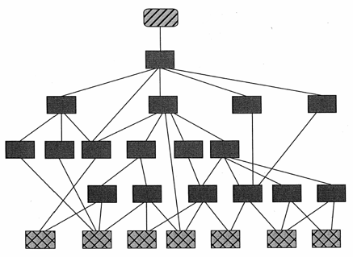

当Stub不能传递正确和有用的信息时，可以使用其他一些方法：
- 许多测试可以推迟到存根替换为真正的模块。
- 进一步开发的模块可以模拟存根的实际功能。
- 自底向上集成。

优点：
- 早期展示主要的控制点和判断。
- 采用深度优先装配，可以先实现和验证一个完整的软件功能。
- 最多只需要一个驱动模块。
- 支持故障隔离。

缺点：
- 开发和维护存根的成本都较高。
- 底层组件的需求无法预测，可能导致对顶层组件的许多修改。

使用范围：
- 产品控制结构比较清晰稳定。
- 高级产品界面变化相对较小。
- 产品底部接口未定义或可能经常更改。
- 产品控制模块技术风险较大，需要尽快进行验证。

## 自底向上集成

从底层用最少的依赖组件开始，根据依赖结构，分层向上集成来检测整个系统的稳定性。

流程：
1. 对于给定层次的模块，它的子模块（包括子模块的下属模块）已经组装并测试完成，所以不再需要桩。
2. 从底层模块开始，也可以把两个或多个叶子模块合并到一起进行测试。
3. 开发驱动模块对上面的模块进行测试，用实际模块代替驱动模块，与已测子模块一起组成大模块进行测试。
4. 重复这一过程直到顶层模块测试完成。

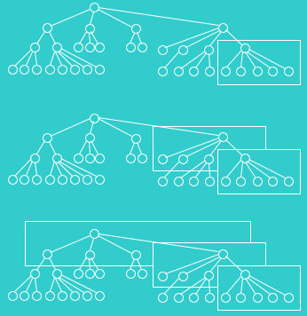

执行过程： 
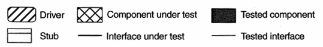

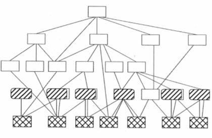

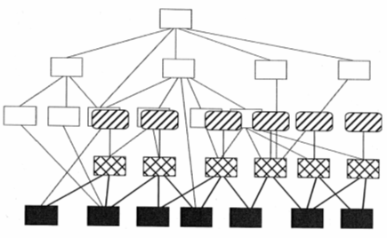

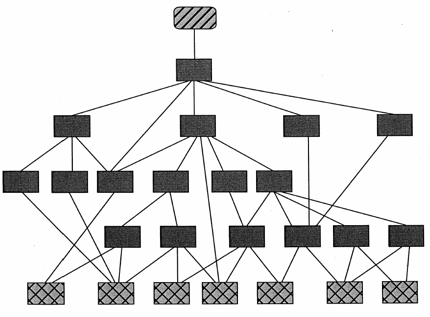

优点：
- 允许对底层模块进行早期认证，任何准备进行集成测试的叶子节点都可以进行测试。
- 减少存根开发的工作量。
- 支持故障隔离。

缺点：
- 驱动模块开发工作量比较大。
- 高级验证被推迟到最后，无法及时发现设计错误。
- 底部异常硬盖。

使用范围：
- 底层接口相对稳定、高层接口变化较多的产品。
- 底部模块已经提前完成的产品。

## 三明治式集成

1. 首先测试A，开发存根替代B、C、D。
2. 测试E、F，使用驱动程序替代B、D。
3. 测试(B,E)、(D,F)，使用驱动程序替代A。
4. 将模块整合在一起。

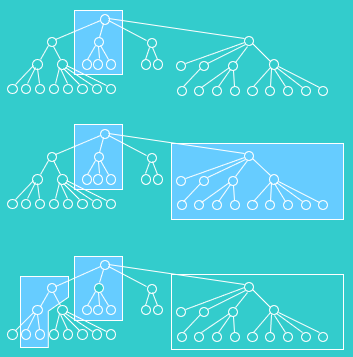

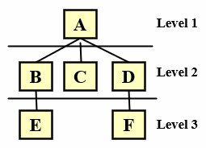

优点：结合自顶向下策略和自底向上策略的优点。

缺点：在集成测试之前，对中间层的测试是不够的。

使用范围：被大多数软件开发项目所使用。

## 分层集成

通过增量集成方法验证了某一特定层次体系结构应用系统的稳定性和互操作性。

策略：
- 系统的层分区。
- 确定集成策略的内部级别。
- 确定级别之间的集成策略。

使用范围：
- 通信软件。
- 一个清晰的层次产品系统。

## 高频集成

为了检测集成错误和控制可能的基线偏差，经常向稳定基线添加新代码。

条件：
- 获得一个稳定的增量，并且一个完整的子系统已经被证明没有问题。大多数有意义的递增函数可以在一个频繁的间隔内固定，例如每日构建daily build。
- 测试包和代码并行开发，并始终维护最新版本。
- 使用自动化。
- 使用配置管理工具，否则增量版本将失去控制

策略：
- 开发人员同时提供完整的增量代码和测试人员对相关测试包的完整开发。
- 测试人员一起修改或添加组件，形成一个新的集成体，并在其上运行集成测试套件。
- 评价结果。

优点：
- 有效地防止错误。
- 严重的错误、遗漏和错误的假设可以在更早的时候被发现。
- 误差定位相对容易。
- 减少存根代码和驱动程序代码的开发。
- 开发和集成可以同时进行。

缺点：
- 在最初的几个周期中可能很难顺利集成。
- 高频集成频率需要很好的把握。

使用范围：
- 由迭代过程模型开发的产品。

创建每日构建在许多组织中非常流行（特别是在迭代的系统中）
- 它有助于更快地交付系统。
- 它强调小的增量测试。
- 它稳定地增加了测试用例的数量。
- 系统使用自动化的、可重用的测试用例进行测试。
- 努力修复在24小时内发现的缺陷。
- 构建的前一个版本保留为引用和回滚。
- 一个典型的实践是保留过去的7-10构建。

## 基于事件集成

从消息的认证路径正确性出发，对系统进行增量集成，验证系统的稳定性。

策略：
- 从外部系统出发，分析了可能的系统输入集。
- 选择一条消息，分析所传递的模块。
- 集成这些模块并测试消息接口。
- 重复上述步骤，直到测试所有消息。

优点：
- 验证一条消息可能需要几个模块，并且进展会更快。
- 减少驱动模块的开发

缺点：
- 对于复杂系统，消息之间的相互关系可能是复杂的，难以分析。
- 对于接口测试，它是不够的。

使用范围：
- 面向对象的系统。
- 基于有限状态机的嵌入式系统。
