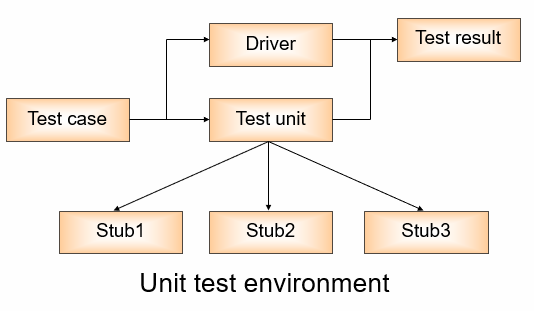

---
title: 集成测试的桩与驱动
date: 2021-03-21 13:33:38
summary: 本文分享集成测试中的测试桩Stub与测试驱动Driver两个概念。
tags:
- 软件测试
- 软件工程
categories:
- 软件工程
---

# Stub

Stub译为桩，Driver译为驱动，在我看来，可以不管翻译直接去使用这两个英文单词，只因为翻译过来实在差点意思。

> Stub is used to simulate the calling modules in tested module working process. Generally  they only process few data.

Stub位于被测模块的下层，用于模拟测试模块工作过程中的调用模块。通常它们只处理很少的数据。

> Driver module is used to simulate superior module of tested module. It receives testing data, transmits related to tested module, starts tested module and prints corresponding results.

测试桩向处于测试的模块发送数据，充当接口模块(替换低级模块)，适用于自顶向下的测试。

# Driver

Driver位于被测模块的上层，用于模拟被测模块的上级模块。接收测试数据，传送测试模块相关信息，启动测试模块，打印测试结果。

测试驱动可以代替实际软件(高层软件)，对底层模块进行更有效的测试，适用于自底向上的测试。

# Stub与Driver

单元测试的策略：
- **自顶向下的单元测试**：首先测试顶层模块，由顶层调用Stub，然后依次将已测试模块作为Driver来测试下层模块。
- **自底向上的单元测试**：首先测试底层模块，由底层调用Driver，然后依次将已测试模块作为Stub来测试上层模块。
- **隔离测试**：不考虑模块之间的关系，设计每个模块的子模块和Driver。此方法最方便，减少了对其他单元的依赖。

Stub和Driver都是模拟对象，好处是：
- 独立性需求，这意味着测试可以集中处理一个程序单元。在测试旧代码或者高度耦合组件的时候，使用模拟对象非常有用。
- 通过消除外部依赖来确保测试可以快速执行。
- 通过伪造一个确定性的组件，来获取对函数输入数据的控制权。
- 在所有组建依赖模块完成之前，就可以开始测试。

使用测试替身(test double)的四种可能原因：实际组件尚未完全实现、组件执行的是不可恢复的动作、与不可靠或不可预料的资源进行交互、测试用例运行缓慢。测试桩和测试驱动就算是测试替身的变种。
