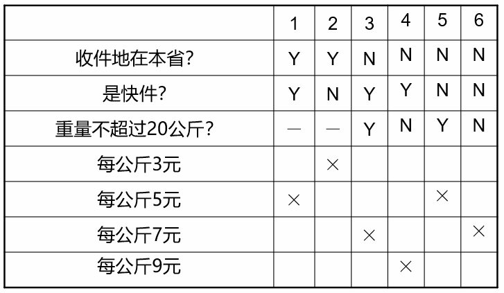

# 决策表法

在一些数据处理问题当中，某些操作的实施依赖于多个逻辑条件的组合，即：针对不同逻辑条件的组合值，分别执行不同的操作。

决策表就是分析和表达多逻辑条件下执行不同操作情况的工具。

决策表技术可以解决变量之间依赖的问题。

# 决策表

决策表通常由以下4部分组成：
- 条件桩：列出问题的所有条件。
- 条件项：针对条件桩给出的条件列出所有可能的取值。
- 动作桩：列出问题规定的可能采取的操作。
- 动作项：指出在条件项的各组取值情况下应采取的动作。

将任何一个条件组合的特定取值及相应要执行的动作称为一条规则。
在决策表中贯穿条件项和动作项的一列就是一条规则。

# 决策表的生成方法

1. 列出所有的条件桩和动作桩。
2. 根据条件桩确定规则的个数：有$n$个条件的决策表有$2^{n}$个规则（每个条件取真、假值）。
3. 填入条件项。
4. 填入动作项，得到初始决策表。

5. 简化决策表，合并相似规则。

    1. 若表中有两条以上规则具有相同的动作，并且在条件项之间存在极为相似的关系，便可以合并。
    2. 合并后的条件项用符号“-”表示，说明执行的动作与该条件的取值无关，称为“无关条件”。

# 决策表法的优点

- 决策表最突出的优点是，能够将复杂的问题按照各种可能的情况全部列举出来，简明并避免遗漏。
- 利用决策表能够设计出完整的测试用例集合。
- 决策表技术可以解决变量之间依赖的问题。

# 决策表法的适用场景

- 规格说明以决策表形式给出，或较容易转换为决策表。
- 输入与输出之间存在因果关系。
- 规则的排列顺序不会也不应影响执行的操作。
- 当某一规则的条件已经满足，并确定要执行的操作后，不必检验别的规则。

# 决策表法案例

某货运站收费标准如下：如果收件地点在本省，则快件每公斤5元，慢件每公斤3元；如果收件地点在省外，则在20公斤以内（含20公斤）快件每公斤7元，慢件每公斤5元，而超过20公斤时，快件每公斤9元，慢件每公斤7元。请用决策表方法解决此问题。

1. 确定规则的数目$2^{3}=8$：
    1. 收件地在本省？
    2. 是快件？
    3. 重量不超过20公斤？
2. 列出所有的条件桩和行动桩。
3. 填入条件条目。
4. 填入行动条目。

5. 化简决策表

