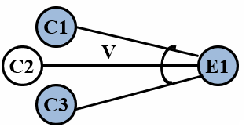

# 因果图法

等价类划分法和边界值分析方法都是着重考虑输入条件，但没有考虑输入条件的各种组合、输入条件之间的相互制约关系。
要检查输入条件的组合并非易事，因为即使可以将输入条件分成等价类，但它们的组合情况可能很多，如果没有一个系统的方法是难以设计测试用例的。
借助因果图列出输入数据的各种组合与程序对应动作效果之间的阶段联系，构造判定表，由此设计测试用例是生成测试用例的有效办法。

因果图法是一种利用图解法分析输入的各种组合情况，从而设计测试用例的方法，它适合于检查程序输入条件的各种组合情况。

因果图法考虑了输入情况的各种组合及输入情况之间的相互制约关系。

# 因果关系

- 等价：

- 非：

- 或：

- 与：

# 因果约束

# 因果图法的流程

1. 根据程序规格说明书描述的语义内容，分析并确定“原因”和“结果”，找出原因与原因之间、原因与结果之间的对应关系，将其表示成连接各个原因与各个结果的“因果图”。
2. 由于语法或环境限制，有些原因与原因之间、原因与结果之间的组合情况是不可能出现的，在因果图上用记号标明约束或限制条件。
3. 将因果图转换成判定表。
4. 根据判定表中每一列设计测试用例。

# 因果图法的优点

- 考虑到了输入情况的各种组合以及各个输入情况之间的相互制约关系。
- 能够帮助测试人员按照一定的步骤，高效率的开发测试用例。
- 因果图法是将自然语言规格说明转化成形式语言规格说明的一种严格的方法，可以指出规格说明存在的不完整性和二义性。

# 因果图法案例

某公司对客户有一定的折扣政策，公司软件的一个模块的需求说明书中描述“……当交易额小于等于5万元时折扣为0，当交易额大于5万元时才有折扣，如果交易的客户在三个月内无欠款，则折扣为15%；如果交易用户在三个月内有欠款，若该用户是三年以上的老客户，则折扣为10%；若该客户不是三年以上的老客户，则折扣为5%。”

原因：
C1：交易额大于5万元
C2：三个月无欠款
C3：三年以上老客户

结果：
E1：无折扣
E2：折扣=5%
E3：折扣=10%
E4：折扣=15%

因果图： 

决策表： 

