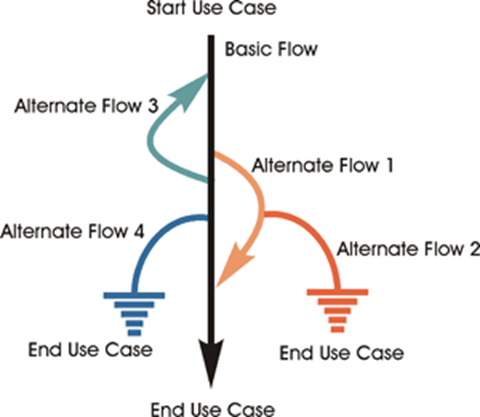
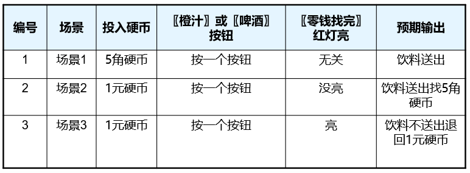

---
title: 黑盒测试の场景测试法
date: 2021-03-20 14:46:07
summary: 本文分享黑盒测试的场景测试法，并分享一些典型的测试场景。
mathjax: true
tags:
- 软件测试
- 软件工程
categories:
- 软件工程
---

# 场景测试法

场景测试：它是一个软件测试活动，它使用场景用例，或者简单的场景，这些场景基于一个假设的故事来帮助人们思考一个复杂的问题或者测试环境的系统。

理想的场景有五个关键特征：
- it is a story
- motivating
- credible
- complex
- easy to evaluate 

$$场景=基本流+备选流$$

场景：由一系列相关活动组成，且场景中的活动还能由一系列相关场景组成。

基本流：经过用例的最简单的路径，无任何差错，程序直接从开始执行到结束，涵盖用例执行时“通常”发生的事情。

备选流：涵盖与正常行为相关的可选或异常的行为，以及正常行为的变体。

# 场景测试法用例设计

1. 根据需求画出基本流和备选流图。
2. 根据基本流和备选流图写出所有场景。
3. 识别测试用例并创建一个场景矩阵。每个场景至少应该有一个测试用例，但是可能会有更多。
4. 审核用例，去掉冗余项，并在用例中填上测试数据。

# 识别场景和用例

场景1：基本流→结束用例
场景2：基本流→备选流1→结束用例
场景3：基本流→备选流1→备选流2→结束用例
场景4：基本流→备选流3→结束用例
场景5：基本流→备选流3→备选流1→结束用例
场景6：基本流→备选流3→备选流1→备选流2→结束用例
场景7：基本流→备选流3→备选流4→结束用例
场景8：基本流→备选流4→结束用例

# 场景测试法适用条件

场景法适用用于解决业务流程清晰的系统或功能。

# 场景测试法案例

有一个处理单价为5角钱的饮料的自动售货机软件测试用例的设计。其规格说明如下：
1. 若投入5角钱或1元钱的硬币，押下〖橙汁〗或〖啤酒〗的按钮，则相应的饮料就送出来。
2. 若售货机没有零钱找，则一个显示〖零钱找完〗的红灯亮，这时在投入1元硬币并押下按钮后，饮料不送出来而且1元硬币也退出来。
3. 若有零钱找，则显示〖零钱找完〗的红灯灭，在送出饮料的同时退还5角硬币。”

基本流：投入5角硬币，押下〖橙汁〗或〖啤酒〗的按钮，则相应的饮料就送出来。

备选流：
1. 〖零钱找完〗的红灯没亮，这时在投入1元硬币并押下按钮后，在送出饮料的同时退还5角硬币。
2. 〖零钱找完〗的红灯亮，这时在投入1元硬币并押下按钮后，饮料不送出来而且1元硬币也退出来。

场景：
- 场景1：基本流
- 场景2：备选流1
- 场景3：备选流2

测试用例：

# 典型测试场景

## 一般测试场景

1. 所有必填字段都应校验并用星号`*`标注。
2. 验证错误提示信息应在正确的位置合理显示。
3. 所有的错误信息都应用相同的CSS样式显示，例如红色。
4. 一般性的确认信息应该用错误消息意外的CSS样式显示，例如绿色。
5. 提示信息应是有意义的。
6. 下拉字段的第一个条目应是空白或“请选择”之类的文本。
7. 删除页面中的任何记录信息都应要求确认。
8. 如果页面支持记录的添加/删除/更新功能，那么页面中应提供“全选”和“全不选”所有记录的选择项。
9. 数量值应该显示正确的货币符号。
10. 应提供默认页面排序。
11. 重置按钮功能应将页面所有字段设置为默认值。
12. 所有的数值都应正确地格式化。
13. 输入字段应检查最大字段值，输入的字段值超过指定的最大值则不被接受或不被存储到数据库。
14. 检查所有输入字段中输入特殊字符的情况。
15. 使用标准的字段标签。例如，一个接受用户姓名的字段标签可以被定义为“姓名”。
16. 检查添加/编辑/删除操作后页面中信息记录的排序功能。
17. 检查超时功能，超时的值应是可配置的，操作超时后检查应用程序的行为是否合理。
18. 检查Cookies在应用程序中的使用。
19. 检查可下载文件是否指向了正确的文件路径。
20. 所有的资源键应该可以在配置文件或数据库中配置，而不是硬编码。
21. 资源键的命名应始终遵循标准惯例。
22. 验证所有的Web页面标记(验证HTML和CSS的语法错误)以确保它符合标准。
23. 应用程序崩溃或不可用页面应该重定向到错误页面。
24. 在所有页面中检查文本的拼写和语法错误。
25. 检查数字输入字段中输入字符的情况，应提示合适的校验信息。
26. 如果字段允许输入数值，应该检查输入负数的情况。
27. 检查数量字段值带有小数的情况。
28. 检查页面中所有按钮的功能。
29. 用户连续点击提交按钮时不能重复提交页面信息。
30. 在任何计算中都应处理除以0的情况。
31. 应正确处理输入数据前后的空格。

## 过滤条件测试场景

1.  用户应能够使用页面中的所有参数过滤结果。
2. 精确搜索功能应根据用户选择的所有搜索参数加载搜索页面。
3. 当页面中至少需要一个过滤条件才能执行搜索操作时，必须保证用户没有设置任何过滤条件提交查询时能显示合适的错误提示信息。
4. 当页面中至少有一个过滤条件是非强制的时，用户提交查询后那些非强制过滤条件使用默认搜索条件查询相关结果。
5. 过滤条件设置为无效值时应显示合适的校验信息。

## 结果表测试场景

1.  当结果页面加载时长超过默认时长时，应该显示“页面加载中”之类的提示信息。
2. 检查结果表中获取的数据是否满足所有的搜索条件。
3. 结果总数都应在结果表中显示。
4. 使用的搜索条件应该在结果表中显示。
5. 结果表中的值应该按照默认列排序。
6. 排序列应该显示排序的图标。
7. 结果表中的结果正确且包含所有指定的列。
8. 对支持排序的列，应能进行升序和降序排序操作。
9. 结果表中的行列间距合理。
10. 当结果多于每页默认显示的结果数时应正确分页。
11. 检查上一页、下一页、首页和末页分页功能。
12. 结果表中无重复的记录。
13. 检查所有的列是否都可见，必要时启用水平滚动条。
14. 检查数据动态列（列值由其他列计算得来的列）。
15. 对于报表结果表，应检查行汇总和列汇总的值。
16. 对于报表结果表，应检查有分页的情况下用户切换分页时的行汇总值。
17. 检查显示列是否使用了正确的符号。例如，`%`应该显示在百分数计算结果中。
18. 检查结果表中的数据是否启用了日期范围。

## 窗口测试场景

1.  检查默认窗口的大小是否正确。
2. 检查子窗口的大小是否正确。
3. 检查默认焦点是否放在了页面中的某个字段上。一般来说，焦点放在页面中第一个可输入的字段上。
4. 检查关闭父窗口或开着的窗口时是否会关闭子窗口。
5. 当子窗口开着时，用户不能使用或更新父窗口或子窗口后面窗口的字段值。
6. 检查窗口最小化、最大化和关闭功能。
7. 检查窗口是否能重设大小。
8. 检查父窗口和子窗口的滚动条的功能。
9. 检查子窗口中的“取消”按钮的功能。

## 数据库测试场景

1. 页面提交成功时检查数据是否正确地保存在数据库中。
2. 检查不接受空值的列值。
3. 数据应根据表设计被存储在单个或多个表中。
4. 索引名称应按照标准如IND_ <表名> _ < 列名>。
5. 表应该有主键。
6. 应对表中的列给出相应的描述信息，除了诸如创建时间、创建人等审计列。
7. 应该为每个数据库的添加/更新操作添加日志。
8. 应该为需要的表创建索引。
9. 检查是否只有操作完全成功后才将数据提交到数据库中。
10. 一旦事务失败数据应该回滚。
11. 数据库名称应按照应用程序类型命名。这并非标准，但对数据库维护是很有帮助的。
12. 数据库逻辑名称应根据数据库名称命名。这并非标准，但对数据库维护是很有帮助的。
13. 存储过程不应该以前缀`sp_`命名。
14. 检查表审计列的值(如创建日期、创建人、更新日期、更新者、已删除、删除日期、删除者等等)填充正确。
15. 检查输入数据保存时是否未被截断，在页面中显示的字段长度和数据库的字段长度应该是相同的。
16. 检查包含最小、最大和浮点的数值字段。
17. 检查数值字段含有负值(接受和拒绝两种情况)。
18. 检查单选按钮和下拉列表正确地保存在数据库中。
19. 检查数据库字段设计的数据类型和数据长度是否正确。
20. 检查所有的表约束条件如主键、外键等是否正确实现。
21. 测试存储过程和触发器的样本输入数据。
22. 输入数据的首尾空格应在数据保存到数据库之前被自动隐去。
23. 主键列不允许为NULL值。

## 上传功能测试场景

1. 检查图片上传路径。
2. 检查图像上传和修改功能。
3. 检查各种扩展图像文件的上传(例如JPEG、PNG、BMP等)。
4. 检查文件名中含有空格或其他可用特殊字符的图片的上传。
5. 检查重复名称图片上传。
6. 图片尺寸大于最大允许值，上传时应该显示适当的错误消息。
7. 检查上传的图片文件类型外的其它文件时(例如txt、doc、pdf、exe等等)，应该显示适当的错误消息。
8. 检查如果上传的图片满足指定的高度和宽度(如果有定义的话)则可以成功上传，否则不能上传。
9. 上传大尺寸图片时应显示上传进度条。
10. 检查上传过程中的取消按钮是否有效。
11. 检查文件选择对话框中的文件列表是否只显示支持文件类型。
12. 检查上传多个图像的功能。
13. 上传后检查图像质量，图像质量不应该改变。
14. 检查用户是否能够使用/查看上传的图像。

## 发送电子邮件测试场景

1. 所有电子邮件模板应该使用CSS标准。
2. 要验证电子邮件地址后再发送电子邮件。
3. 特殊字符在邮件正文模板应妥善处理。
4. 特定语言的字符(例如：俄文、中文或德文字符)应在电子邮件主体模板中妥善处理。
5. 电子邮件主题不能空。
6. 占位符字段中使用电子邮件模板应该替换为实际的值如{姓} {名}应该替换为所有收件人正确的名字和姓氏。
7. 如果报告有动态值包含在电子邮件的正文中，报告数据应正确计算。
8. 电子邮件发送者的名字不能为空。
9. 应该在不同的电子邮件客户端检查电子邮件。
10. 检查发送电子邮件功能使用TO、CC和BCC字段。
11. 检查纯文本邮件。
12. 检查HTML格式的电子邮件。
13. 查看邮件页眉和页脚相应的公司LOGO、隐私政策和其他链接。
14. 检查带附件的电子邮件发送。
15. 检查给一个联系人、多个联系人或者联系人组发送电子邮件。
16. 检查回复电子邮件地址是否正确。
17. 检查发送大量的电子邮件。

## Excel导出测试场景

1. 文件输出时应该有适当的文件扩展名。
2. 导出Excel文件的文件名应该按照标准，例如：如果文件名使用时间命名，它应该在导出文件的时候妥善换成实际时间。
3. 当Excel文件包含日期列时需要检查导出的日期格式。
4. 检查数字格式的数值或货币值，格式应该和页面显示的相同。
5. 导出的文件应该有适当的列名称。
6. 默认页面排序应体现在导出文件中。
7. Excel文件数据应正确格式化包括页眉和页脚文本、日期、页码等所有页面的值。
8. 检查数据在页面上显示的文件与导出Excel文件是是否一样。
9. 检查使用分页时的导出功能。
10. 检查导出按钮图标是否根据导出的文件类型正确显示，如：导出的是.xls文件，则显示Excel文件对应的图标。
11. 检查大文件的导出功能。
12. 检查页面包含特殊字符的导出功能，检查这些特殊字符是否正确地导出到Excel文件。
13. 上传后检查图像质量，图像质量不应该改变。
14. 检查用户是否能够使用/查看上传的图像。

## 性能测试场景

1. 检查页面加载时间是否在可接受范围内。
2. 检查页面加载缓慢的链接。
3. 检查在轻度、正常、中度和重度负载环境下所有操作的响应时间。
4. 检查数据库存储过程和触发器的性能。
5. 检查数据库查询执行时间。
6. 检查应用程序的负载测试。
7. 检查应用程序的压力测试。
8. 在峰值负载条件下检查CPU和内存的使用情况。

## 安全性测试场景

1. 检查SQL注入攻击。
2. 安全页面应该使用HTTPS协议。
3. 崩溃页面中不应泄漏应用程序或服务器信息，只有错误页面才显示这些。
4. 转义特殊字符的输入。
5. 错误消息不应该透露任何敏感信息。
6. 所有凭证都应该通过一个加密传输通道。
7. 测试密码安全性和密码强制策略。
8. 检查应用程序的注销功能。
9. 检查暴力攻击。
10. Cookie信息只能以加密的格式存储。
11. 检查会话Cookie持续时间和会话超时或注销后登录会话终止情况。
12. 会话标记应该通过安全通道传送。
13. 密码不应该存储在Cookie中。
14. 对阻断服务攻击进行测试。
15. 检测内存泄漏。
16. 通过在浏览器地址栏中手动更改变量值访问未经授权的应用程序。
17. 验证对文件扩展名的处理方式以使得.exe文件不能上传到服务器或在服务器上执行。
18. 如密码和信用卡信息等敏感领域不应该启用自动完成。
19. 对文件上传功能应使用文件类型限制和反病毒扫描上传的文件。
20. 检查目录是否可用。
21. 在输入密码和其他敏感字段时应该被伪装起来。
22. 检查忘记密码是否采用了密码保护功能。例如，临时密码在指定的时间段后过期，更改密码或获取新密码有安全问题提问等。
23. 检查验证码功能。
24. 检查重要事件是否被记录在日志文件中。
25. 检查是否正确实现访问权限。
