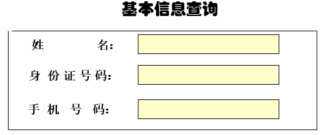
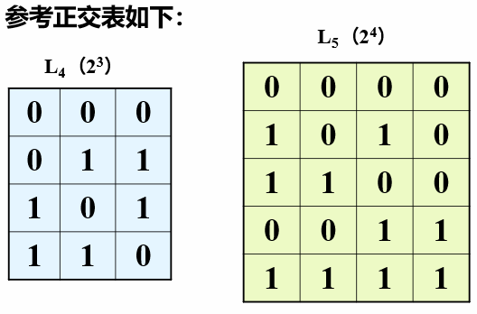
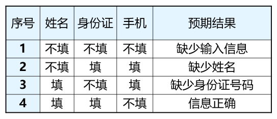

---
title: 黑盒测试の正交试验法
date: 2021-03-20 15:34:54
summary: 本文分享黑盒测试的正交试验法。
mathjax: true
tags:
- 软件测试
- 软件工程
categories:
- 软件工程
---

# 正交试验法

正交试验法：依据正交性从全面试验中挑选出部分有代表性的点进行试验，这些点具有“均匀分散、整齐可比”的特点，进而进行测试用例的设计。

正交试验法效率高、快速、经济，可以有效地减少测试的工时与费用。

正交试验法可用于用户界面测试、系统测试、回归测试、配置测试、性能测试。

正交表的Runs、Factors、Levels：
- Runs代表行数，即试验的次数，也是我们通过正交实验法设计的测试用例个数。
- Factors代表列数，即我们要测试的功能点。
- Levels代表任何单个因素能够取得的值的最大个数。

正交表表示为$L_{Runs}(Levels^{Factors})$：例如$L_{8}{2^{7}}$表示的是8行7列水平数为2的正交表。

正交表表头的设计就是一个设计方案。表头设计的步骤如下：
1. 确定列数，即我们需要测试的功能点数目
2. 确定各个Factor的水平数
3. 选定正交表（题目会给出选项）
4. 安排表头
5. 组织实施方案

选择正交表的考量：
- 因素的个数 如L(2*)、L(3*)、混合水平表
- 因素水平的个数 每个交互作用在正交表中应该占有1~2列
- 正交表的行数
- 取行数最少的一个

为了对实验结果进行方差分析或回归分析，最好留一个空白列以作为误差列，极差分析中要作为其他因素列处理。

精度要求高则应该选实验次数多的表，经费有限则应该选择实验次数较少的表。

如果没有合适的表，可以适当选择原定的水平数。

对$L_{8}(4^{1}2^{4})$的解读：可包含5个因子，其中1个因子4水平，4个因子2水平，最多容纳8次试验。

计算最少实验次数的公式：$n=[\sum(每列水平数-1)]+1$

# 正交表设计测试用例

正交表设计测试用例的步骤：
1. 有哪些因素（变量）
2. 每个因素有哪几个水平（取值）
3. 找一个合适的正交表
4. 把变量的值映射进表中
5. 把每一行的各个因素水平的组合作为一个测试用例
6. 加上可疑且没有在表中出现的组合

# 正交试验法案例

使用正交试验法，为下面的基本信息查询选取测试用例。

- 姓&emsp;名：1-不填&emsp;0-填写
- 身份证：1-不填&emsp;0-填写
- 手机号：1-不填&emsp;0-填写

步骤：
1. 计算出需要的测试用例个数：$n=[\sum(每列水平数-1)]+1=(2-1)+(2-1)+(2-1)+1=4$，所以只需要4次试验即可。
2. 根据实验的水平数和因子个数选择合适的正交表，即$L_{4}(2^{3})$。
3. 根据正交表写出测试用例。正交表的每一列对应一个因子（变量），每个取值对应的水平值，即变量的取值。

# 常用正交表



1. L4(23)

<TABLE width="50%" border=1>
  <TBODY>
  <TR>
    <TD width="30%">
      
列号
</TD>
    <TD width="23%" rowSpan=2>
      
1
</TD>
    <TD width="20%" rowSpan=2>
      
2
</TD>
    <TD width="27%" rowSpan=2>
      
3
</TD></TR>
  <TR>
    <TD width="30%">
      
试验号
</TD></TR>
  <TR>
    <TD width="30%">
      
1
</TD>
    <TD width="23%">
      
1
</TD>
    <TD width="20%">
      
1
</TD>
    <TD width="27%">
      
1
</TD></TR>
  <TR>
    <TD width="30%">
      
2
</TD>
    <TD width="23%">
      
1
</TD>
    <TD width="20%">
      
2
</TD>
    <TD width="27%">
      
2
</TD></TR>
  <TR>
    <TD width="30%">
      
3
</TD>
    <TD width="23%">
      
2
</TD>
    <TD width="20%">
      
1
</TD>
    <TD width="27%">
      
2
</TD></TR>
  <TR>
    <TD width="30%">
      
4
</TD>
    <TD width="23%">
      
2
</TD>
    <TD width="20%">
      
2
</TD>
    <TD width="27%">
      
1
</TD></TR></TBODY></TABLE>

2. L8(27)

<TABLE width="51%" border=1>
  <TBODY>
  <TR>
    <TD width="16%">
      
列号
</TD>
    <TD width="12%" rowSpan=2>
      
1
</TD>
    <TD width="11%" rowSpan=2>
      
2
</TD>
    <TD width="12%" rowSpan=2>
      
3
</TD>
    <TD width="12%" rowSpan=2>
      
4
</TD>
    <TD width="11%" rowSpan=2>
      
5
</TD>
    <TD width="13%" rowSpan=2>
      
6
</TD>
    <TD width="13%" rowSpan=2>
      
7
</TD></TR>
  <TR>
    <TD width="16%">
      
试验号
</TD></TR>
  <TR>
    <TD width="16%">
      
1
</TD>
    <TD width="12%">
      
1
</TD>
    <TD width="11%">
      
1
</TD>
    <TD width="12%">
      
1
</TD>
    <TD width="12%">
      
1
</TD>
    <TD width="11%">
      
1
</TD>
    <TD width="13%">
      
1
</TD>
    <TD width="13%">
      
1
</TD></TR>
  <TR>
    <TD width="16%">
      
2
</TD>
    <TD width="12%">
      
1
</TD>
    <TD width="11%">
      
1
</TD>
    <TD width="12%">
      
1
</TD>
    <TD width="12%">
      
2
</TD>
    <TD width="11%">
      
2
</TD>
    <TD width="13%">
      
2
</TD>
    <TD width="13%">
      
2
</TD></TR>
  <TR>
    <TD width="16%">
      
3
</TD>
    <TD width="12%">
      
1
</TD>
    <TD width="11%">
      
2
</TD>
    <TD width="12%">
      
2
</TD>
    <TD width="12%">
      
1
</TD>
    <TD width="11%">
      
1
</TD>
    <TD width="13%">
      
2
</TD>
    <TD width="13%">
      
2
</TD></TR>
  <TR>
    <TD width="16%">
      
4
</TD>
    <TD width="12%">
      
1
</TD>
    <TD width="11%">
      
2
</TD>
    <TD width="12%">
      
2
</TD>
    <TD width="12%">
      
2
</TD>
    <TD width="11%">
      
2
</TD>
    <TD width="13%">
      
1
</TD>
    <TD width="13%">
      
1
</TD></TR>
  <TR>
    <TD width="16%">
      
5
</TD>
    <TD width="12%">
      
2
</TD>
    <TD width="11%">
      
1
</TD>
    <TD width="12%">
      
2
</TD>
    <TD width="12%">
      
1
</TD>
    <TD width="11%">
      
2
</TD>
    <TD width="13%">
      
1
</TD>
    <TD width="13%">
      
2
</TD></TR>
  <TR>
    <TD width="16%">
      
6
</TD>
    <TD width="12%">
      
2
</TD>
    <TD width="11%">
      
1
</TD>
    <TD width="12%">
      
2
</TD>
    <TD width="12%">
      
2
</TD>
    <TD width="11%">
      
1
</TD>
    <TD width="13%">
      
2
</TD>
    <TD width="13%">
      
1
</TD></TR>
  <TR>
    <TD width="16%">
      
7
</TD>
    <TD width="12%">
      
2
</TD>
    <TD width="11%">
      
2
</TD>
    <TD width="12%">
      
1
</TD>
    <TD width="12%">
      
1
</TD>
    <TD width="11%">
      
2
</TD>
    <TD width="13%">
      
2
</TD>
    <TD width="13%">
      
1
</TD></TR>
  <TR>
    <TD width="16%">
      
8
</TD>
    <TD width="12%">
      
2
</TD>
    <TD width="11%">
      
2
</TD>
    <TD width="12%">
      
1
</TD>
    <TD width="12%">
      
2
</TD>
    <TD width="11%">
      
1
</TD>
    <TD width="13%">
      
1
</TD>
    <TD width="13%">
      
2
</TD></TR></TBODY></TABLE>

3. L12(211)

<TABLE width="87%" border=1>
  <TBODY>
  <TR>
    <TD width="12%">
      
列号
</TD>
    <TD width="9%" rowSpan=2>
      
1
</TD>
    <TD width="8%" rowSpan=2>
      
2
</TD>
    <TD width="8%" rowSpan=2>
      
3
</TD>
    <TD width="7%" rowSpan=2>
      
4
</TD>
    <TD width="7%" rowSpan=2>
      
5
</TD>
    <TD width="8%" rowSpan=2>
      
6
</TD>
    <TD width="8%" rowSpan=2>
      
7
</TD>
    <TD width="8%" rowSpan=2>
      
8
</TD>
    <TD width="8%" rowSpan=2>
      
9
</TD>
    <TD width="8%" rowSpan=2>
      
10
</TD>
    <TD width="9%" rowSpan=2>
      
11
</TD></TR>
  <TR>
    <TD width="12%">
      
试验号
</TD></TR>
  <TR>
    <TD width="12%">
      
1
</TD>
    <TD width="9%">
      
1
</TD>
    <TD width="8%">
      
1
</TD>
    <TD width="8%">
      
1
</TD>
    <TD width="7%">
      
1
</TD>
    <TD width="7%">
      
1
</TD>
    <TD width="8%">
      
1
</TD>
    <TD width="8%">
      
1
</TD>
    <TD width="8%">
      
1
</TD>
    <TD width="8%">
      
1
</TD>
    <TD width="8%">
      
1
</TD>
    <TD width="9%">
      
1
</TD></TR>
  <TR>
    <TD width="12%">
      
2
</TD>
    <TD width="9%">
      
1
</TD>
    <TD width="8%">
      
1
</TD>
    <TD width="8%">
      
1
</TD>
    <TD width="7%">
      
1
</TD>
    <TD width="7%">
      
1
</TD>
    <TD width="8%">
      
2
</TD>
    <TD width="8%">
      
2
</TD>
    <TD width="8%">
      
2
</TD>
    <TD width="8%">
      
2
</TD>
    <TD width="8%">
      
2
</TD>
    <TD width="9%">
      
2
</TD></TR>
  <TR>
    <TD width="12%">
      
3
</TD>
    <TD width="9%">
      
1
</TD>
    <TD width="8%">
      
1
</TD>
    <TD width="8%">
      
2
</TD>
    <TD width="7%">
      
2
</TD>
    <TD width="7%">
      
2
</TD>
    <TD width="8%">
      
1
</TD>
    <TD width="8%">
      
1
</TD>
    <TD width="8%">
      
1
</TD>
    <TD width="8%">
      
2
</TD>
    <TD width="8%">
      
2
</TD>
    <TD width="9%">
      
2
</TD></TR>
  <TR>
    <TD width="12%">
      
4
</TD>
    <TD width="9%">
      
1
</TD>
    <TD width="8%">
      
2
</TD>
    <TD width="8%">
      
1
</TD>
    <TD width="7%">
      
2
</TD>
    <TD width="7%">
      
2
</TD>
    <TD width="8%">
      
1
</TD>
    <TD width="8%">
      
2
</TD>
    <TD width="8%">
      
2
</TD>
    <TD width="8%">
      
1
</TD>
    <TD width="8%">
      
1
</TD>
    <TD width="9%">
      
2
</TD></TR>
  <TR>
    <TD width="12%">
      
5
</TD>
    <TD width="9%">
      
1
</TD>
    <TD width="8%">
      
2
</TD>
    <TD width="8%">
      
2
</TD>
    <TD width="7%">
      
1
</TD>
    <TD width="7%">
      
2
</TD>
    <TD width="8%">
      
2
</TD>
    <TD width="8%">
      
1
</TD>
    <TD width="8%">
      
2
</TD>
    <TD width="8%">
      
1
</TD>
    <TD width="8%">
      
2
</TD>
    <TD width="9%">
      
1
</TD></TR>
  <TR>
    <TD width="12%">
      
6
</TD>
    <TD width="9%">
      
1
</TD>
    <TD width="8%">
      
2
</TD>
    <TD width="8%">
      
2
</TD>
    <TD width="7%">
      
2
</TD>
    <TD width="7%">
      
1
</TD>
    <TD width="8%">
      
2
</TD>
    <TD width="8%">
      
2
</TD>
    <TD width="8%">
      
1
</TD>
    <TD width="8%">
      
2
</TD>
    <TD width="8%">
      
1
</TD>
    <TD width="9%">
      
1
</TD></TR>
  <TR>
    <TD width="12%">
      
7
</TD>
    <TD width="9%">
      
2
</TD>
    <TD width="8%">
      
1
</TD>
    <TD width="8%">
      
2
</TD>
    <TD width="7%">
      
2
</TD>
    <TD width="7%">
      
1
</TD>
    <TD width="8%">
      
1
</TD>
    <TD width="8%">
      
2
</TD>
    <TD width="8%">
      
2
</TD>
    <TD width="8%">
      
1
</TD>
    <TD width="8%">
      
2
</TD>
    <TD width="9%">
      
1
</TD></TR>
  <TR>
    <TD width="12%">
      
8
</TD>
    <TD width="9%">
      
2
</TD>
    <TD width="8%">
      
1
</TD>
    <TD width="8%">
      
2
</TD>
    <TD width="7%">
      
1
</TD>
    <TD width="7%">
      
2
</TD>
    <TD width="8%">
      
2
</TD>
    <TD width="8%">
      
2
</TD>
    <TD width="8%">
      
1
</TD>
    <TD width="8%">
      
1
</TD>
    <TD width="8%">
      
1
</TD>
    <TD width="9%">
      
2
</TD></TR>
  <TR>
    <TD width="12%">
      
9
</TD>
    <TD width="9%">
      
2
</TD>
    <TD width="8%">
      
1
</TD>
    <TD width="8%">
      
1
</TD>
    <TD width="7%">
      
2
</TD>
    <TD width="7%">
      
2
</TD>
    <TD width="8%">
      
2
</TD>
    <TD width="8%">
      
1
</TD>
    <TD width="8%">
      
2
</TD>
    <TD width="8%">
      
2
</TD>
    <TD width="8%">
      
1
</TD>
    <TD width="9%">
      
1
</TD></TR>
  <TR>
    <TD width="12%">
      
10
</TD>
    <TD width="9%">
      
2
</TD>
    <TD width="8%">
      
2
</TD>
    <TD width="8%">
      
2
</TD>
    <TD width="7%">
      
1
</TD>
    <TD width="7%">
      
1
</TD>
    <TD width="8%">
      
1
</TD>
    <TD width="8%">
      
1
</TD>
    <TD width="8%">
      
2
</TD>
    <TD width="8%">
      
2
</TD>
    <TD width="8%">
      
1
</TD>
    <TD width="9%">
      
2
</TD></TR>
  <TR>
    <TD width="12%">
      
11
</TD>
    <TD width="9%">
      
2
</TD>
    <TD width="8%">
      
2
</TD>
    <TD width="8%">
      
1
</TD>
    <TD width="7%">
      
2
</TD>
    <TD width="7%">
      
1
</TD>
    <TD width="8%">
      
2
</TD>
    <TD width="8%">
      
1
</TD>
    <TD width="8%">
      
1
</TD>
    <TD width="8%">
      
1
</TD>
    <TD width="8%">
      
2
</TD>
    <TD width="9%">
      
2
</TD></TR>
  <TR>
    <TD width="12%">
      
12
</TD>
    <TD width="9%">
      
2
</TD>
    <TD width="8%">
      
2
</TD>
    <TD width="8%">
      
1
</TD>
    <TD width="7%">
      
1
</TD>
    <TD width="7%">
      
2
</TD>
    <TD width="8%">
      
1
</TD>
    <TD width="8%">
      
2
</TD>
    <TD width="8%">
      
1
</TD>
    <TD width="8%">
      
2
</TD>
    <TD width="8%">
      
2
</TD>
    <TD width="9%">
      
1
</TD></TR></TBODY></TABLE>

4. L9(34)

<TABLE width="55%" border=1>
  <TBODY>
  <TR>
    <TD width="25%">
      
列号
</TD>
    <TD width="20%" rowSpan=2>
      
1
</TD>
    <TD width="18%" rowSpan=2>
      
2
</TD>
    <TD width="18%" rowSpan=2>
      
3
</TD>
    <TD width="19%" rowSpan=2>
      
4
</TD></TR>
  <TR>
    <TD width="25%">
      
试验号
</TD></TR>
  <TR>
    <TD width="25%">
      
1
</TD>
    <TD width="20%">
      
1
</TD>
    <TD width="18%">
      
1
</TD>
    <TD width="18%">
      
1
</TD>
    <TD width="19%">
      
1
</TD></TR>
  <TR>
    <TD width="25%">
      
2
</TD>
    <TD width="20%">
      
1
</TD>
    <TD width="18%">
      
2
</TD>
    <TD width="18%">
      
2
</TD>
    <TD width="19%">
      
2
</TD></TR>
  <TR>
    <TD width="25%">
      
3
</TD>
    <TD width="20%">
      
1
</TD>
    <TD width="18%">
      
3
</TD>
    <TD width="18%">
      
3
</TD>
    <TD width="19%">
      
3
</TD></TR>
  <TR>
    <TD width="25%">
      
4
</TD>
    <TD width="20%">
      
2
</TD>
    <TD width="18%">
      
1
</TD>
    <TD width="18%">
      
2
</TD>
    <TD width="19%">
      
3
</TD></TR>
  <TR>
    <TD width="25%">
      
5
</TD>
    <TD width="20%">
      
2
</TD>
    <TD width="18%">
      
2
</TD>
    <TD width="18%">
      
3
</TD>
    <TD width="19%">
      
1
</TD></TR>
  <TR>
    <TD width="25%">
      
6
</TD>
    <TD width="20%">
      
2
</TD>
    <TD width="18%">
      
3
</TD>
    <TD width="18%">
      
1
</TD>
    <TD width="19%">
      
2
</TD></TR>
  <TR>
    <TD width="25%">
      
7
</TD>
    <TD width="20%">
      
3
</TD>
    <TD width="18%">
      
1
</TD>
    <TD width="18%">
      
3
</TD>
    <TD width="19%">
      
2
</TD></TR>
  <TR>
    <TD width="25%">
      
8
</TD>
    <TD width="20%">
      
3
</TD>
    <TD width="18%">
      
2
</TD>
    <TD width="18%">
      
1
</TD>
    <TD width="19%">
      
3
</TD></TR>
  <TR>
    <TD width="25%">
      
9
</TD>
    <TD width="20%">
      
3
</TD>
    <TD width="18%">
      
3
</TD>
    <TD width="18%">
      
2
</TD>
    <TD width="19%">
      
1
</TD></TR></TBODY></TABLE>

5. L16(45)

<TABLE width="61%" border=1>
  <TBODY>
  <TR>
    <TD width="24%">
      
列号
</TD>
    <TD width="15%" rowSpan=2>
      
1
</TD>
    <TD width="15%" rowSpan=2>
      
2
</TD>
    <TD width="15%" rowSpan=2>
      
3
</TD>
    <TD width="15%" rowSpan=2>
      
4
</TD>
    <TD width="16%" rowSpan=2>
      
5
</TD></TR>
  <TR>
    <TD width="24%">
      
试验号
</TD></TR>
  <TR>
    <TD width="24%">
      
1
</TD>
    <TD width="15%">
      
1
</TD>
    <TD width="15%">
      
1
</TD>
    <TD width="15%">
      
1
</TD>
    <TD width="15%">
      
1
</TD>
    <TD width="16%">
      
1
</TD></TR>
  <TR>
    <TD width="24%">
      
2
</TD>
    <TD width="15%">
      
1
</TD>
    <TD width="15%">
      
2
</TD>
    <TD width="15%">
      
2
</TD>
    <TD width="15%">
      
2
</TD>
    <TD width="16%">
      
2
</TD></TR>
  <TR>
    <TD width="24%">
      
3
</TD>
    <TD width="15%">
      
1
</TD>
    <TD width="15%">
      
3
</TD>
    <TD width="15%">
      
3
</TD>
    <TD width="15%">
      
3
</TD>
    <TD width="16%">
      
3
</TD></TR>
  <TR>
    <TD width="24%">
      
4
</TD>
    <TD width="15%">
      
1
</TD>
    <TD width="15%">
      
4
</TD>
    <TD width="15%">
      
4
</TD>
    <TD width="15%">
      
4
</TD>
    <TD width="16%">
      
4
</TD></TR>
  <TR>
    <TD width="24%">
      
5
</TD>
    <TD width="15%">
      
2
</TD>
    <TD width="15%">
      
1
</TD>
    <TD width="15%">
      
2
</TD>
    <TD width="15%">
      
3
</TD>
    <TD width="16%">
      
4
</TD></TR>
  <TR>
    <TD width="24%">
      
6
</TD>
    <TD width="15%">
      
2
</TD>
    <TD width="15%">
      
2
</TD>
    <TD width="15%">
      
1
</TD>
    <TD width="15%">
      
4
</TD>
    <TD width="16%">
      
3
</TD></TR>
  <TR>
    <TD width="24%">
      
7
</TD>
    <TD width="15%">
      
2
</TD>
    <TD width="15%">
      
3
</TD>
    <TD width="15%">
      
4
</TD>
    <TD width="15%">
      
1
</TD>
    <TD width="16%">
      
2
</TD></TR>
  <TR>
    <TD width="24%">
      
8
</TD>
    <TD width="15%">
      
2
</TD>
    <TD width="15%">
      
4
</TD>
    <TD width="15%">
      
3
</TD>
    <TD width="15%">
      
2
</TD>
    <TD width="16%">
      
1
</TD></TR>
  <TR>
    <TD width="24%">
      
9
</TD>
    <TD width="15%">
      
3
</TD>
    <TD width="15%">
      
1
</TD>
    <TD width="15%">
      
3
</TD>
    <TD width="15%">
      
4
</TD>
    <TD width="16%">
      
2
</TD></TR>
  <TR>
    <TD width="24%">
      
10
</TD>
    <TD width="15%">
      
3
</TD>
    <TD width="15%">
      
2
</TD>
    <TD width="15%">
      
4
</TD>
    <TD width="15%">
      
3
</TD>
    <TD width="16%">
      
1
</TD></TR>
  <TR>
    <TD width="24%">
      
11
</TD>
    <TD width="15%">
      
3
</TD>
    <TD width="15%">
      
3
</TD>
    <TD width="15%">
      
1
</TD>
    <TD width="15%">
      
2
</TD>
    <TD width="16%">
      
4
</TD></TR>
  <TR>
    <TD width="24%">
      
12
</TD>
    <TD width="15%">
      
3
</TD>
    <TD width="15%">
      
4
</TD>
    <TD width="15%">
      
2
</TD>
    <TD width="15%">
      
1
</TD>
    <TD width="16%">
      
3
</TD></TR>
  <TR>
    <TD width="24%">
      
13
</TD>
    <TD width="15%">
      
4
</TD>
    <TD width="15%">
      
1
</TD>
    <TD width="15%">
      
4
</TD>
    <TD width="15%">
      
2
</TD>
    <TD width="16%">
      
3
</TD></TR>
  <TR>
    <TD width="24%">
      
14
</TD>
    <TD width="15%">
      
4
</TD>
    <TD width="15%">
      
2
</TD>
    <TD width="15%">
      
3
</TD>
    <TD width="15%">
      
1
</TD>
    <TD width="16%">
      
4
</TD></TR>
  <TR>
    <TD width="24%">
      
15
</TD>
    <TD width="15%">
      
4
</TD>
    <TD width="15%">
      
3
</TD>
    <TD width="15%">
      
2
</TD>
    <TD width="15%">
      
4
</TD>
    <TD width="16%">
      
1
</TD></TR>
  <TR>
    <TD width="24%">
      
16
</TD>
    <TD width="15%">
      
4
</TD>
    <TD width="15%">
      
4
</TD>
    <TD width="15%">
      
1
</TD>
    <TD width="15%">
      
3
</TD>
    <TD width="16%">
      
2
</TD></TR></TBODY></TABLE>

6. L25(56)

<TABLE width="67%" border=1>
  <TBODY>
  <TR>
    <TD width="17%">
      
列号
</TD>
    <TD width="12%" rowSpan=2>
      
1
</TD>
    <TD width="13%" rowSpan=2>
      
2
</TD>
    <TD width="14%" rowSpan=2>
      
3
</TD>
    <TD width="14%" rowSpan=2>
      
4
</TD>
    <TD width="14%" rowSpan=2>
      
5
</TD>
    <TD width="16%" rowSpan=2>
      
6
</TD></TR>
  <TR>
    <TD width="17%">
      
试验号
</TD></TR>
  <TR>
    <TD width="17%">
      
1
</TD>
    <TD width="12%">
      
1
</TD>
    <TD width="13%">
      
1
</TD>
    <TD width="14%">
      
1
</TD>
    <TD width="14%">
      
1
</TD>
    <TD width="14%">
      
1
</TD>
    <TD width="16%">
      
1
</TD></TR>
  <TR>
    <TD width="17%">
      
2
</TD>
    <TD width="12%">
      
1
</TD>
    <TD width="13%">
      
2
</TD>
    <TD width="14%">
      
2
</TD>
    <TD width="14%">
      
2
</TD>
    <TD width="14%">
      
2
</TD>
    <TD width="16%">
      
2
</TD></TR>
  <TR>
    <TD width="17%">
      
3
</TD>
    <TD width="12%">
      
1
</TD>
    <TD width="13%">
      
3
</TD>
    <TD width="14%">
      
3
</TD>
    <TD width="14%">
      
3
</TD>
    <TD width="14%">
      
3
</TD>
    <TD width="16%">
      
3
</TD></TR>
  <TR>
    <TD width="17%">
      
4
</TD>
    <TD width="12%">
      
1
</TD>
    <TD width="13%">
      
4
</TD>
    <TD width="14%">
      
4
</TD>
    <TD width="14%">
      
4
</TD>
    <TD width="14%">
      
4
</TD>
    <TD width="16%">
      
4
</TD></TR>
  <TR>
    <TD width="17%">
      
5
</TD>
    <TD width="12%">
      
1
</TD>
    <TD width="13%">
      
5
</TD>
    <TD width="14%">
      
5
</TD>
    <TD width="14%">
      
5
</TD>
    <TD width="14%">
      
5
</TD>
    <TD width="16%">
      
5
</TD></TR>
  <TR>
    <TD width="17%">
      
6
</TD>
    <TD width="12%">
      
2
</TD>
    <TD width="13%">
      
1
</TD>
    <TD width="14%">
      
2
</TD>
    <TD width="14%">
      
3
</TD>
    <TD width="14%">
      
4
</TD>
    <TD width="16%">
      
5
</TD></TR>
  <TR>
    <TD width="17%">
      
7
</TD>
    <TD width="12%">
      
2
</TD>
    <TD width="13%">
      
2
</TD>
    <TD width="14%">
      
3
</TD>
    <TD width="14%">
      
4
</TD>
    <TD width="14%">
      
5
</TD>
    <TD width="16%">
      
1
</TD></TR>
  <TR>
    <TD width="17%">
      
8
</TD>
    <TD width="12%">
      
2
</TD>
    <TD width="13%">
      
3
</TD>
    <TD width="14%">
      
4
</TD>
    <TD width="14%">
      
5
</TD>
    <TD width="14%">
      
1
</TD>
    <TD width="16%">
      
2
</TD></TR>
  <TR>
    <TD width="17%">
      
9
</TD>
    <TD width="12%">
      
2
</TD>
    <TD width="13%">
      
4
</TD>
    <TD width="14%">
      
5
</TD>
    <TD width="14%">
      
1
</TD>
    <TD width="14%">
      
2
</TD>
    <TD width="16%">
      
3
</TD></TR>
  <TR>
    <TD width="17%">
      
10
</TD>
    <TD width="12%">
      
2
</TD>
    <TD width="13%">
      
5
</TD>
    <TD width="14%">
      
1
</TD>
    <TD width="14%">
      
2
</TD>
    <TD width="14%">
      
3
</TD>
    <TD width="16%">
      
4
</TD></TR>
  <TR>
    <TD width="17%">
      
11
</TD>
    <TD width="12%">
      
3
</TD>
    <TD width="13%">
      
1
</TD>
    <TD width="14%">
      
3
</TD>
    <TD width="14%">
      
5
</TD>
    <TD width="14%">
      
2
</TD>
    <TD width="16%">
      
4
</TD></TR>
  <TR>
    <TD width="17%">
      
12
</TD>
    <TD width="12%">
      
3
</TD>
    <TD width="13%">
      
2
</TD>
    <TD width="14%">
      
4
</TD>
    <TD width="14%">
      
1
</TD>
    <TD width="14%">
      
3
</TD>
    <TD width="16%">
      
5
</TD></TR>
  <TR>
    <TD width="17%">
      
13
</TD>
    <TD width="12%">
      
3
</TD>
    <TD width="13%">
      
3
</TD>
    <TD width="14%">
      
5
</TD>
    <TD width="14%">
      
2
</TD>
    <TD width="14%">
      
4
</TD>
    <TD width="16%">
      
1
</TD></TR>
  <TR>
    <TD width="17%">
      
14
</TD>
    <TD width="12%">
      
3
</TD>
    <TD width="13%">
      
4
</TD>
    <TD width="14%">
      
1
</TD>
    <TD width="14%">
      
3
</TD>
    <TD width="14%">
      
5
</TD>
    <TD width="16%">
      
2
</TD></TR>
  <TR>
    <TD width="17%">
      
15
</TD>
    <TD width="12%">
      
3
</TD>
    <TD width="13%">
      
5
</TD>
    <TD width="14%">
      
2
</TD>
    <TD width="14%">
      
4
</TD>
    <TD width="14%">
      
1
</TD>
    <TD width="16%">
      
3
</TD></TR>
  <TR>
    <TD width="17%">
      
16
</TD>
    <TD width="12%">
      
4
</TD>
    <TD width="13%">
      
1
</TD>
    <TD width="14%">
      
4
</TD>
    <TD width="14%">
      
2
</TD>
    <TD width="14%">
      
5
</TD>
    <TD width="16%">
      
3
</TD></TR>
  <TR>
    <TD width="17%">
      
17
</TD>
    <TD width="12%">
      
4
</TD>
    <TD width="13%">
      
2
</TD>
    <TD width="14%">
      
5
</TD>
    <TD width="14%">
      
3
</TD>
    <TD width="14%">
      
1
</TD>
    <TD width="16%">
      
4
</TD></TR>
  <TR>
    <TD width="17%">
      
18
</TD>
    <TD width="12%">
      
4
</TD>
    <TD width="13%">
      
3
</TD>
    <TD width="14%">
      
1
</TD>
    <TD width="14%">
      
4
</TD>
    <TD width="14%">
      
2
</TD>
    <TD width="16%">
      
5
</TD></TR>
  <TR>
    <TD width="17%">
      
19
</TD>
    <TD width="12%">
      
4
</TD>
    <TD width="13%">
      
4
</TD>
    <TD width="14%">
      
2
</TD>
    <TD width="14%">
      
5
</TD>
    <TD width="14%">
      
3
</TD>
    <TD width="16%">
      
1
</TD></TR>
  <TR>
    <TD width="17%">
      
20
</TD>
    <TD width="12%">
      
4
</TD>
    <TD width="13%">
      
5
</TD>
    <TD width="14%">
      
3
</TD>
    <TD width="14%">
      
1
</TD>
    <TD width="14%">
      
4
</TD>
    <TD width="16%">
      
2
</TD></TR>
  <TR>
    <TD width="17%">
      
21
</TD>
    <TD width="12%">
      
5
</TD>
    <TD width="13%">
      
1
</TD>
    <TD width="14%">
      
5
</TD>
    <TD width="14%">
      
4
</TD>
    <TD width="14%">
      
3
</TD>
    <TD width="16%">
      
2
</TD></TR>
  <TR>
    <TD width="17%">
      
22
</TD>
    <TD width="12%">
      
5
</TD>
    <TD width="13%">
      
2
</TD>
    <TD width="14%">
      
1
</TD>
    <TD width="14%">
      
5
</TD>
    <TD width="14%">
      
4
</TD>
    <TD width="16%">
      
3
</TD></TR>
  <TR>
    <TD width="17%">
      
23
</TD>
    <TD width="12%">
      
5
</TD>
    <TD width="13%">
      
3
</TD>
    <TD width="14%">
      
2
</TD>
    <TD width="14%">
      
1
</TD>
    <TD width="14%">
      
5
</TD>
    <TD width="16%">
      
4
</TD></TR>
  <TR>
    <TD width="17%">
      
24
</TD>
    <TD width="12%">
      
5
</TD>
    <TD width="13%">
      
4
</TD>
    <TD width="14%">
      
3
</TD>
    <TD width="14%">
      
2
</TD>
    <TD width="14%">
      
1
</TD>
    <TD width="16%">
      
5
</TD></TR>
  <TR>
    <TD width="17%">
      
25
</TD>
    <TD width="12%">
      
5
</TD>
    <TD width="13%">
      
5
</TD>
    <TD width="14%">
      
4
</TD>
    <TD width="14%">
      
3
</TD>
    <TD width="14%">
      
2
</TD>
    <TD width="16%">
      
1
</TD></TR></TBODY></TABLE>

7. L8(4×24)

<TABLE width="56%" border=1>
  <TBODY>
  <TR>
    <TD width="21%">
      
列号
</TD>
    <TD width="15%" rowSpan=2>
      
1
</TD>
    <TD width="16%" rowSpan=2>
      
2
</TD>
    <TD width="15%" rowSpan=2>
      
3
</TD>
    <TD width="16%" rowSpan=2>
      
4
</TD>
    <TD width="17%" rowSpan=2>
      
5
</TD></TR>
  <TR>
    <TD width="21%">
      
实验号
</TD></TR>
  <TR>
    <TD width="21%">
      
1
</TD>
    <TD width="15%">
      
1
</TD>
    <TD width="16%">
      
1
</TD>
    <TD width="15%">
      
1
</TD>
    <TD width="16%">
      
1
</TD>
    <TD width="17%">
      
1
</TD></TR>
  <TR>
    <TD width="21%">
      
2
</TD>
    <TD width="15%">
      
1
</TD>
    <TD width="16%">
      
2
</TD>
    <TD width="15%">
      
2
</TD>
    <TD width="16%">
      
2
</TD>
    <TD width="17%">
      
2
</TD></TR>
  <TR>
    <TD width="21%">
      
3
</TD>
    <TD width="15%">
      
2
</TD>
    <TD width="16%">
      
1
</TD>
    <TD width="15%">
      
1
</TD>
    <TD width="16%">
      
2
</TD>
    <TD width="17%">
      
2
</TD></TR>
  <TR>
    <TD width="21%">
      
4
</TD>
    <TD width="15%">
      
2
</TD>
    <TD width="16%">
      
2
</TD>
    <TD width="15%">
      
2
</TD>
    <TD width="16%">
      
1
</TD>
    <TD width="17%">
      
1
</TD></TR>
  <TR>
    <TD width="21%">
      
5
</TD>
    <TD width="15%">
      
3
</TD>
    <TD width="16%">
      
1
</TD>
    <TD width="15%">
      
2
</TD>
    <TD width="16%">
      
1
</TD>
    <TD width="17%">
      
2
</TD></TR>
  <TR>
    <TD width="21%">
      
6
</TD>
    <TD width="15%">
      
3
</TD>
    <TD width="16%">
      
2
</TD>
    <TD width="15%">
      
1
</TD>
    <TD width="16%">
      
2
</TD>
    <TD width="17%">
      
1
</TD></TR>
  <TR>
    <TD width="21%">
      
7
</TD>
    <TD width="15%">
      
4
</TD>
    <TD width="16%">
      
1
</TD>
    <TD width="15%">
      
2
</TD>
    <TD width="16%">
      
2
</TD>
    <TD width="17%">
      
1
</TD></TR>
  <TR>
    <TD width="21%">
      
8
</TD>
    <TD width="15%">
      
4
</TD>
    <TD width="16%">
      
2
</TD>
    <TD width="15%">
      
1
</TD>
    <TD width="16%">
      
1
</TD>
    <TD width="17%">
      
2
</TD></TR></TBODY></TABLE>

8. L12(3×24)

<TABLE width="60%" border=1>
  <TBODY>
  <TR>
    <TD width="25%">
      
列号
</TD>
    <TD width="15%" rowSpan=2>
      
1
</TD>
    <TD width="15%" rowSpan=2>
      
2
</TD>
    <TD width="14%" rowSpan=2>
      
3
</TD>
    <TD width="16%" rowSpan=2>
      
4
</TD>
    <TD width="15%" rowSpan=2>
      
5
</TD></TR>
  <TR>
    <TD width="25%">
      
试验号
</TD></TR>
  <TR>
    <TD width="25%">
      
1
</TD>
    <TD width="15%">
      
1
</TD>
    <TD width="15%">
      
1
</TD>
    <TD width="14%">
      
1
</TD>
    <TD width="16%">
      
1
</TD>
    <TD width="15%">
      
1
</TD></TR>
  <TR>
    <TD width="25%">
      
2
</TD>
    <TD width="15%">
      
1
</TD>
    <TD width="15%">
      
1
</TD>
    <TD width="14%">
      
1
</TD>
    <TD width="16%">
      
2
</TD>
    <TD width="15%">
      
2
</TD></TR>
  <TR>
    <TD width="25%">
      
3
</TD>
    <TD width="15%">
      
1
</TD>
    <TD width="15%">
      
2
</TD>
    <TD width="14%">
      
2
</TD>
    <TD width="16%">
      
1
</TD>
    <TD width="15%">
      
2
</TD></TR>
  <TR>
    <TD width="25%">
      
4
</TD>
    <TD width="15%">
      
1
</TD>
    <TD width="15%">
      
2
</TD>
    <TD width="14%">
      
2
</TD>
    <TD width="16%">
      
2
</TD>
    <TD width="15%">
      
1
</TD></TR>
  <TR>
    <TD width="25%" height=21>
      
5
</TD>
    <TD width="15%" height=21>
      
2
</TD>
    <TD width="15%" height=21>
      
1
</TD>
    <TD width="14%" height=21>
      
2
</TD>
    <TD width="16%" height=21>
      
1
</TD>
    <TD width="15%" height=21>
      
1
</TD></TR>
  <TR>
    <TD width="25%">
      
6
</TD>
    <TD width="15%">
      
2
</TD>
    <TD width="15%">
      
1
</TD>
    <TD width="14%">
      
2
</TD>
    <TD width="16%">
      
2
</TD>
    <TD width="15%">
      
2
</TD></TR>
  <TR>
    <TD width="25%">
      
7
</TD>
    <TD width="15%">
      
2
</TD>
    <TD width="15%">
      
2
</TD>
    <TD width="14%">
      
1
</TD>
    <TD width="16%">
      
2
</TD>
    <TD width="15%">
      
2
</TD></TR>
  <TR>
    <TD width="25%">
      
8
</TD>
    <TD width="15%">
      
2
</TD>
    <TD width="15%">
      
2
</TD>
    <TD width="14%">
      
1
</TD>
    <TD width="16%">
      
2
</TD>
    <TD width="15%">
      
2
</TD></TR>
  <TR>
    <TD width="25%">
      
9
</TD>
    <TD width="15%">
      
3
</TD>
    <TD width="15%">
      
1
</TD>
    <TD width="14%">
      
2
</TD>
    <TD width="16%">
      
1
</TD>
    <TD width="15%">
      
2
</TD></TR>
  <TR>
    <TD width="25%">
      
10
</TD>
    <TD width="15%">
      
3
</TD>
    <TD width="15%">
      
1
</TD>
    <TD width="14%">
      
1
</TD>
    <TD width="16%">
      
2
</TD>
    <TD width="15%">
      
1
</TD></TR>
  <TR>
    <TD width="25%">
      
11
</TD>
    <TD width="15%">
      
3
</TD>
    <TD width="15%">
      
2
</TD>
    <TD width="14%">
      
1
</TD>
    <TD width="16%">
      
1
</TD>
    <TD width="15%">
      
2
</TD></TR>
  <TR>
    <TD width="25%">
      
12
</TD>
    <TD width="15%">
      
3
</TD>
    <TD width="15%">
      
2
</TD>
    <TD width="14%">
      
2
</TD>
    <TD width="16%">
      
2
</TD>
    <TD width="15%">
      
1
</TD></TR></TBODY></TABLE>

9. L16(44×23)

<TABLE width="66%" border=1>
  <TBODY>
  <TR>
    <TD width="15%">
      
列号
</TD>
    <TD width="12%" rowSpan=2>
      
1
</TD>
    <TD width="12%" rowSpan=2>
      
2
</TD>
    <TD width="11%" rowSpan=2>
      
3
</TD>
    <TD width="11%" rowSpan=2>
      
4
</TD>
    <TD width="11%" rowSpan=2>
      
5
</TD>
    <TD width="12%" rowSpan=2>
      
6
</TD>
    <TD width="16%" rowSpan=2>
      
7
</TD></TR>
  <TR>
    <TD width="15%">
      
试验号
</TD></TR>
  <TR>
    <TD width="15%">
      
1
</TD>
    <TD width="12%">
      
1
</TD>
    <TD width="12%">
      
1
</TD>
    <TD width="11%">
      
1
</TD>
    <TD width="11%">
      
1
</TD>
    <TD width="11%">
      
1
</TD>
    <TD width="12%">
      
1
</TD>
    <TD width="16%">
      
1
</TD></TR>
  <TR>
    <TD width="15%">
      
2
</TD>
    <TD width="12%">
      
1
</TD>
    <TD width="12%">
      
2
</TD>
    <TD width="11%">
      
2
</TD>
    <TD width="11%">
      
2
</TD>
    <TD width="11%">
      
1
</TD>
    <TD width="12%">
      
2
</TD>
    <TD width="16%">
      
2
</TD></TR>
  <TR>
    <TD width="15%">
      
3
</TD>
    <TD width="12%">
      
1
</TD>
    <TD width="12%">
      
3
</TD>
    <TD width="11%">
      
3
</TD>
    <TD width="11%">
      
3
</TD>
    <TD width="11%">
      
2
</TD>
    <TD width="12%">
      
1
</TD>
    <TD width="16%">
      
2
</TD></TR>
  <TR>
    <TD width="15%">
      
4
</TD>
    <TD width="12%">
      
1
</TD>
    <TD width="12%">
      
4
</TD>
    <TD width="11%">
      
4
</TD>
    <TD width="11%">
      
4
</TD>
    <TD width="11%">
      
2
</TD>
    <TD width="12%">
      
2
</TD>
    <TD width="16%">
      
1
</TD></TR>
  <TR>
    <TD width="15%">
      
5
</TD>
    <TD width="12%">
      
2
</TD>
    <TD width="12%">
      
1
</TD>
    <TD width="11%">
      
2
</TD>
    <TD width="11%">
      
3
</TD>
    <TD width="11%">
      
2
</TD>
    <TD width="12%">
      
2
</TD>
    <TD width="16%">
      
1
</TD></TR>
  <TR>
    <TD width="15%">
      
6
</TD>
    <TD width="12%">
      
2
</TD>
    <TD width="12%">
      
2
</TD>
    <TD width="11%">
      
1
</TD>
    <TD width="11%">
      
4
</TD>
    <TD width="11%">
      
2
</TD>
    <TD width="12%">
      
1
</TD>
    <TD width="16%">
      
2
</TD></TR>
  <TR>
    <TD width="15%">
      
7
</TD>
    <TD width="12%">
      
2
</TD>
    <TD width="12%">
      
3
</TD>
    <TD width="11%">
      
4
</TD>
    <TD width="11%">
      
1
</TD>
    <TD width="11%">
      
1
</TD>
    <TD width="12%">
      
2
</TD>
    <TD width="16%">
      
2
</TD></TR>
  <TR>
    <TD width="15%">
      
8
</TD>
    <TD width="12%">
      
2
</TD>
    <TD width="12%">
      
4
</TD>
    <TD width="11%">
      
3
</TD>
    <TD width="11%">
      
2
</TD>
    <TD width="11%">
      
1
</TD>
    <TD width="12%">
      
1
</TD>
    <TD width="16%">
      
1
</TD></TR>
  <TR>
    <TD width="15%">
      
9
</TD>
    <TD width="12%">
      
3
</TD>
    <TD width="12%">
      
1
</TD>
    <TD width="11%">
      
3
</TD>
    <TD width="11%">
      
4
</TD>
    <TD width="11%">
      
1
</TD>
    <TD width="12%">
      
2
</TD>
    <TD width="16%">
      
2
</TD></TR>
  <TR>
    <TD width="15%">
      
10
</TD>
    <TD width="12%">
      
3
</TD>
    <TD width="12%">
      
2
</TD>
    <TD width="11%">
      
4
</TD>
    <TD width="11%">
      
3
</TD>
    <TD width="11%">
      
1
</TD>
    <TD width="12%">
      
1
</TD>
    <TD width="16%">
      
1
</TD></TR>
  <TR>
    <TD width="15%">
      
11
</TD>
    <TD width="12%">
      
3
</TD>
    <TD width="12%">
      
3
</TD>
    <TD width="11%">
      
1
</TD>
    <TD width="11%">
      
2
</TD>
    <TD width="11%">
      
2
</TD>
    <TD width="12%">
      
2
</TD>
    <TD width="16%">
      
1
</TD></TR>
  <TR>
    <TD width="15%">
      
12
</TD>
    <TD width="12%">
      
3
</TD>
    <TD width="12%">
      
4
</TD>
    <TD width="11%">
      
2
</TD>
    <TD width="11%">
      
1
</TD>
    <TD width="11%">
      
2
</TD>
    <TD width="12%">
      
1
</TD>
    <TD width="16%">
      
2
</TD></TR>
  <TR>
    <TD width="15%">
      
13
</TD>
    <TD width="12%">
      
4
</TD>
    <TD width="12%">
      
1
</TD>
    <TD width="11%">
      
4
</TD>
    <TD width="11%">
      
2
</TD>
    <TD width="11%">
      
2
</TD>
    <TD width="12%">
      
1
</TD>
    <TD width="16%">
      
2
</TD></TR>
  <TR>
    <TD width="15%">
      
14
</TD>
    <TD width="12%">
      
4
</TD>
    <TD width="12%">
      
2
</TD>
    <TD width="11%">
      
3
</TD>
    <TD width="11%">
      
1
</TD>
    <TD width="11%">
      
2
</TD>
    <TD width="12%">
      
2
</TD>
    <TD width="16%">
      
1
</TD></TR>
  <TR>
    <TD width="15%">
      
15
</TD>
    <TD width="12%">
      
4
</TD>
    <TD width="12%">
      
3
</TD>
    <TD width="11%">
      
2
</TD>
    <TD width="11%">
      
4
</TD>
    <TD width="11%">
      
1
</TD>
    <TD width="12%">
      
1
</TD>
    <TD width="16%">
      
1
</TD></TR>
  <TR>
    <TD width="15%">
      
16
</TD>
    <TD width="12%">
      
4
</TD>
    <TD width="12%">
      
4
</TD>
    <TD width="11%">
      
1
</TD>
    <TD width="11%">
      
3
</TD>
    <TD width="11%">
      
1
</TD>
    <TD width="12%">
      
2
</TD>
    <TD width="16%">
      
2
</TD></TR></TBODY></TABLE>

