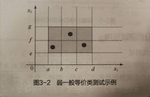
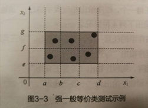
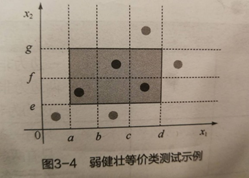
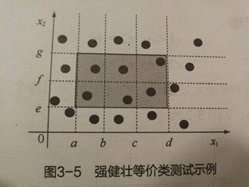
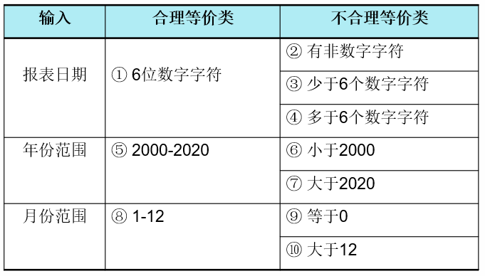
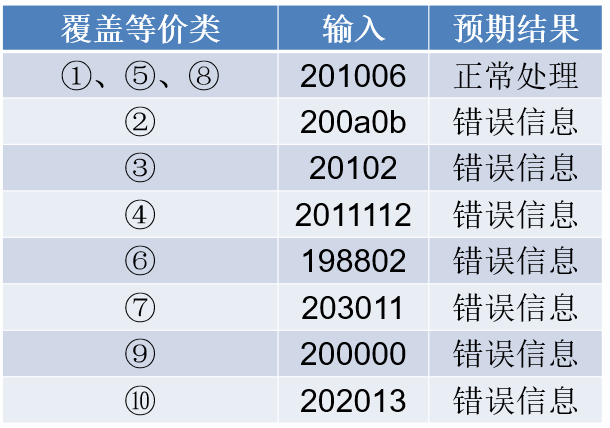

---
title: 黑盒测试の等价类划分法
date: 2021-03-20 12:41:58
summary: 本文分享黑盒测试的等价类划分法。
tags:
- 软件测试
- 软件工程
categories:
- 软件工程
---

# 等价类划分法

等价类划分法是一种重要的、常用的黑盒测试方法，它将不能穷举的测试过程进行合理分类，从而保证设计出来的测试用例具有完整性和代表性。

等价类划分法是把所有可能的输入数据，即程序的输入域划分成若干子集，然后从每一个子集中选取少量具有代表性的数据作为测试用例。

原因：不可能实现穷举测试，可以从大量的可能数据中选取一部分具有代表性的数据作为测试用例。

效果：经过类别划分后，每一类的代表性数据在测试中的作用都等价于这一类中的其他值。

手段：在设计测试用例时，在需求说明的基础上划分等价类，列出等价表，从而确定测试用例。

等价类划分法设计测试用例要经历两个步骤：
1. 划分等价类(列出等价类表)
2. 选取测试用例

等价类的划分有两种不同的情况：
- 有效等价类
- 无效等价类

# 等价类

- 有效等价类
    - 对需求规格说明而言，有意义、合理的输入数据所组成的集合。
    - 检验程序是否实现了需求规格说明预先规定的功能和性能。
- 无效等价类
    - 对需求规格说明而言，无意义的、不合理的输入数据所组成的集合。
    - 检查被测对象的功能和性能的实现是否有不符合需求规格说明要求的地方。

# 记忆口诀

> 规定范围和个数，有效一个无效俩。
> 必须条件布尔量，有效无效一没错。
> 不同输入不同待，有效多来无效单。
> 输入数据有限制，有效单一无效多。
> 等价划分综合断，类中有类细定度。

# 划分方法

一个测试等价类或等价类划分是指测试相同目标或暴露相同软件缺陷的一组测试用例。试图将具有相似输入、相似输出、相似操作的分在一组即可。

划分等价类时，先从程序的规格说明书中找出各个输入条件，再为每个输入条件划分等价类，形成若干互不相交的子集。

1. 按照区间划分：在输入条件规定了取值范围的情况下，可以确定有效等价类和无效等价类。
2. 按照数值划分：在规定了一组输入数据（假设包括n个输入值），并且程序要对每一个输入值分别进行处理的情况下，可确定n个有效等价类（每个值确定一个有效等价类）和一个无效等价类（所有不允许的输入值的集合）。
3. 按照限制条件或规则划分：在规定了输入数据必须遵守的规则或限制条件的情况下，可确定一个有效等价类（符合规则）和若干个无效等价类（从不同角度违反规则）。
4. 细分等价类：在确知已划分的等价类中各元素在程序中的处理方式不同的情况下，则应再将该等价类进一步划分为更小的等价类，并建立等价类表。

# 用例设计

针对是否对无效数据进行测试，可以将等价类测试分为标准等价类测试和健壮等价类测试。
- 标准等价类测试——不考虑无效数据值，测试用例使用每个等价类中的一个值。
- 健壮等价类测试——主要的出发点是考虑了无效等价类。对有效输入，测试用例从每个有效等价类中取一个值；对无效输入，一个测试用例有一个“无效值”，其他值均取“有效值”。

健壮等价类测试存在两个问题：
1. 需要花费精力定义无效测试用例的期望输出。
2. 对强类型的语言没有必要考虑无效的输入，程序可以自己检测。

# 步骤

1. 确定等价类。
2. 建立等价类表，列出所有划分出的等价类。
3. 从划分出的等价类中按以下原则设计测试用例：
    1. 为每一个等价类规定一个唯一的编号。
    2. 设计一个新的测试用例，使其尽可能多的覆盖尚未被覆盖的有效等价类，重复这一步。
    3. 设计一个新的测试用例，使其仅覆盖一个尚未被覆盖的无效等价类，重复这一步。

# 强弱与健壮性

# 说明

1. 强类型语言从语法形式上限制了某些缺陷的发生。
2. 输入数据检查很重要则需要使用健壮性测试。
3. 等价类划分适用于以离散区间或集合形式定义的数据集，变量值越界造成故障也适用。
4. 有效等价类数量等于独立变量数量，这里假设变量之间是独立的。

# 示例

有一个报表处理系统，要求用户输入处理报表的日期。假如日期限制在2000年1月至2020年12月，即系统只能对该段时期内的报表进行处理。如果用户输入的日期不在这个范围内，则显示“错误信息”。并且此系统规定日期由年月的6位数字组成，前四位代表年，后两位代表月。

要求：
- 写出日期的等价列划分。
- 生成测试用例。

