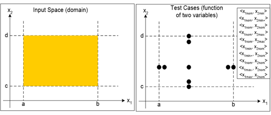
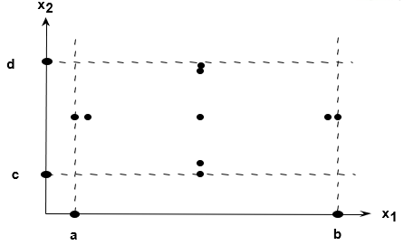
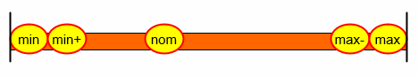
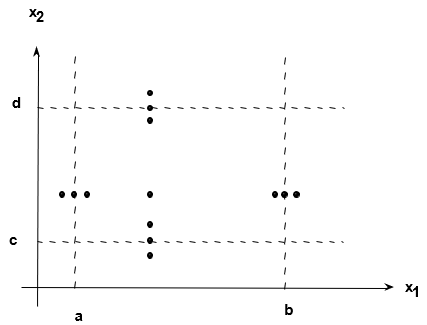
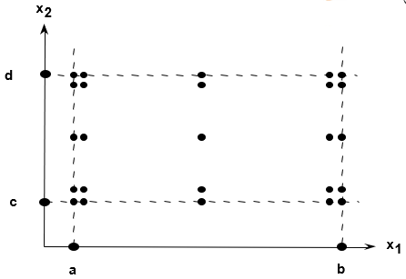
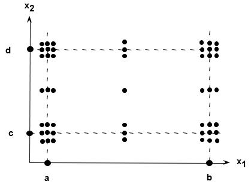
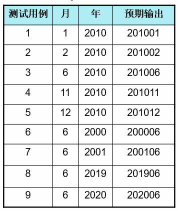

---
title: 黑盒测试の边界值划分法
date: 2021-03-19 21:46:47
summary: 本文分享黑盒测试的边界值划分法。
tags:
- 软件测试
- 软件工程
categories:
- 软件工程
---

# 边界

可能存在边界值的地方：
数字、字符、位置、质量、大小、速度、方位、尺寸、空间、……

对应的边界：
最大/最小、首位/末位、上/下、最快/最慢、最高/最低、最短/最长、空/满、……

# 边界值划分法

测试实践表明，大量的故障往往发生在输入定义域的边界上，而不是在其内部。因此，针对各种边界情况设计测试用例，通常会取得很好的测试效果。
例如，一个循环条件为“≤”时，却错写成“<”；计数器发生少计数一次。
对于有序集合，要关注左端0值index和右端length-1值index。

边界值分析方法是对等价类划分方法的补充。输入输出的等价类边界就是应当着重测试的边界情况。

# 弱一般的情况

边界值分析正常来讲是弱一般的（单缺陷假设+不考虑异常区域）。

下面考虑弱一般的情况：
- 1维边界值分析方法取5个用例：min、min+1、mid、max-1、max
- 2维边界值分析方法取9个用例：{min, mid}、{min+1, mid}、{mid, mid}、{max-1, mid}、{max, mid}、{mid, min}、{mid, min+1}、{mid, max-1}、{mid, max}
- 3维边界值分析方法取13个用例：{min, mid, mid}、{min+1, mid, mid}、{mid, mid, mid}、{max-1, mid, mid}、{max, mid, mid}、{mid, min, mid}、{mid, min+1, mid}、{mid, max-1, mid}、{mid, max, mid}、{mid, mid, min}、{mid, mid, min+1}、{mid, mid, max-1}、{mid, mid, max}
- ……
- N维边界值分析方法取$4N+1$个测试用例

# 弱健壮的情况

边界值分析法也可能是健壮的，那每一个维度就要多取两个值：min-1、max+1。

- 1维边界值分析方法取7个用例：min-1、min、min+1、mid、max-1、max、max+1
- 2维边界值分析方法取13个用例：{min-1, mid}、{min, mid}、{min+1, mid}、{mid, mid}、{max-1, mid}、{max, mid}、{max+1, mid}、{mid, min-1}、{mid, min}、{mid, min+1}、{mid, max-1}、{mid, max}、{mid, max+1}
- 3维边界值分析方法取19个用例：{min-1, mid, mid}、{min, mid, mid}、{min+1, mid, mid}、{mid, mid, mid}、{max-1, mid, mid}、{max, mid, mid}、{max+1, mid, mid}、{mid, min-1, mid}、{mid, min, mid}、{mid, min+1, mid}、{mid, max-1, mid}、{mid, max, mid}、{mid, max+1, mid}、{mid, mid, min-1}、{mid, mid, min}、{mid, mid, min+1}、{mid, mid, max-1}、{mid, mid, max}、{mid, mid, max+1}
- ……
- N维边界值分析方法取$6N+1$个测试用例

# 强一般的情况

强的情况，则是需要考虑多缺陷假设，比较复杂。

- 1维边界值分析方法取5个用例：min、min+1、mid、max-1、max
- 2维边界值分析方法取25个用例：{min, min}、{min+1, min}、{mid, min}、{max-1, min}、{max, min}、{min, min+1}、{min+1, min+1}、{mid, min+1}、{max-1, min+1}、{max, min+1}、{min, mid}、{min+1, mid}、{mid, mid}、{max-1, mid}、{max, mid}、{min, max-1}、{min+1, max-1}、{mid, max-1}、{max-1, max-1}、{max, max-1}、{min, max}、{min+1, max}、{mid, max}、{max-1, max}、{max, max}
- ……
- N维边界值分析方法取$5^{N}$个测试用例

这种情况其实就是[乘法定理](https://blankspace.blog.csdn.net/article/details/114627469)，每一维度可以取5种值且各个维度互不影响。

# 强健壮的情况

要综合考虑超出边界值的情况和多缺陷假设，比起强一般要在每一个维度多取两个值：min-1、max+1，比起弱健壮要考虑更多的边界值多缺陷假设。

- 1维边界值分析方法取7个用例：min-1、min、min+1、mid、max-1、max、max+1
- 2维边界值分析方法取49个用例：{min-1, min-1}、{min, min-1}、{min+1, min-1}、{mid, min-1}、{max-1, min-1}、{max, min-1}、{max+1, min-1}、{min-1, min}、{min, min}、{min+1, min}、{mid, min}、{max-1, min}、{max, min}、{max+1, min}、{min-1, min+1}、{min, min+1}、{min+1, min+1}、{mid, min+1}、{max-1, min+1}、{max, min+1}、{max+1, min+1}、{min-1, mid}、{min, mid}、{min+1, mid}、{mid, mid}、{max-1, mid}、{max, mid}、{max+1, mid}、{min-1, max-1}、{min, max-1}、{min+1, max-1}、{mid, max-1}、{max-1, max-1}、{max, max-1}、{max+1, max-1}、{min-1, max}、{min, max}、{min+1, max}、{mid, max}、{max-1, max}、{max, max}、{max+1, max}、{min-1, max+1}、{min, max+1}、{min+1, max+1}、{mid, max+1}、{max-1, max+1}、{max, max+1}、{max+1, max+1}
- ……
- N维边界值分析方法取$7^{N}$个测试用例

这种情况其实也是[乘法定理](https://blankspace.blog.csdn.net/article/details/114627469)，每一维度可以取7种值且各个维度互不影响。

# 边界划分法案例

有一个报表处理系统，要求用户输入处理报表的日期。假如日期限制在2000年1月至2020年12月，即系统只能对该段时期内的报表进行处理。如果用户输入的日期不在这个范围内，则显示“错误信息”。并且此系统规定日期由年月的6位数字组成，前四位代表年，后两为代表月。

要求：用边界值分析法进行测试并生成测试用例。

年 = { 2000, 2001, 2010, 2019, 2020 }
月 = { 1, 2, 6, 11, 12 }

